# Connettersi a origini dati per i flussi di dati di Power BI

Con i flussi di dati di Power BI è possibile connettersi a diverse origini dati per creare nuovi flussi di dati oppure aggiungere nuove entità a quelli già esistenti.

Questo articolo elenca le numerose origini dati disponibili per la creazione o l'aggiunta di flussi di dati e descrive come usarle.

Per una panoramica su come creare e usare i flussi di dati, vedere [Creazione e uso di flussi di dati in Power BI](service-dataflows-create-use.md).

## Creare un flusso di dati da un'origine dati

Per connettersi ai dati, dal **servizio Power BI** selezionare la voce di menu **+ Crea** e selezionare **flusso di dati** dal menu visualizzato. Una volta selezionato il menu, viene visualizzata l'immagine seguente nell'area di disegno del servizio Power BI. 

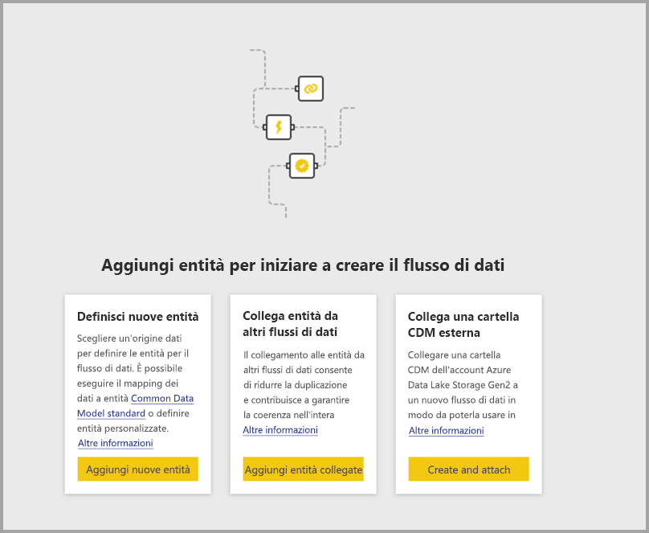

Se il flusso di dati esiste già, è possibile aggiungervi nuove entità selezionando **Aggiungi entità**, come illustrato di seguito, oppure selezionando **Recupera dati** nello strumento di creazione del flusso di dati.

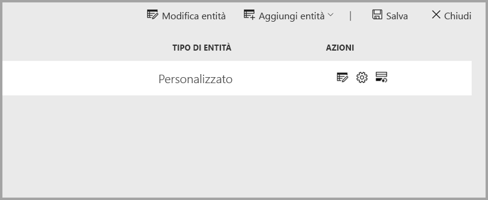

Nella figura seguente viene visualizzato il pulsante **Recupera dati** nello strumento di creazione del flusso di dati. 

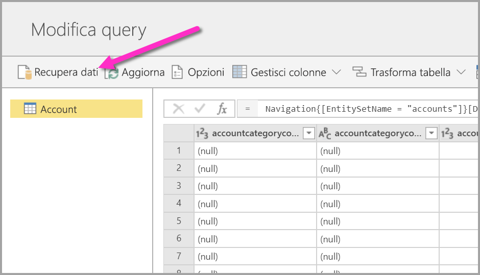

## Origini dati per i flussi di dati

È possibile visualizzare le origini dati disponibili selezionando **Recupera dati** dallo strumento per la creazione dei flussi di dati, dove in seguito viene visualizza una finestra di dialogo per selezionare le categorie e le varie origini dati, come illustrato nell'immagine seguente.

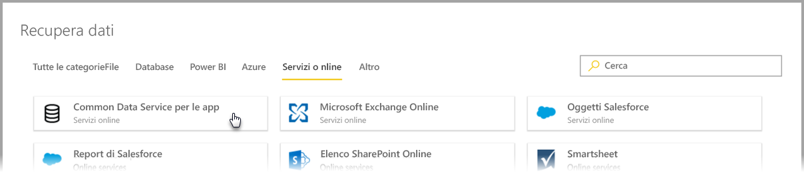

Le origini dati per i flussi di dati sono organizzate nelle categorie seguenti, che vengono visualizzate nella parte superiore della finestra di dialogo **Recupera dati**:

* Tutte le categorie
* File
* Database
* Power BI
* Azure
* Online Services
* Altro

**Tutte le categorie** contiene tutte le origini dati, di tutte le categorie. 

La categoria **File** include le seguenti connessioni dati disponibili per i flussi di dati:

* Accesso
* Excel
* JSON
* Testo/CSV
* XML

La categoria **Database** include le seguenti connessioni dati disponibili per i flussi di dati:

* Database IBM DB2
* Database MySQL
* Database Oracle
* Database PostgreSQL
* Database di SQL Server
* Database di Sybase
* Teradata
* Vertica

La categoria **Power BI** include le seguenti connessioni dati disponibili per i flussi di dati:

* Flussi di dati Power BI

La categoria **Azure** include le seguenti connessioni dati disponibili per i flussi di dati:

* BLOB di Azure
* Esplora dati di Azure
* Azure SQL Data Warehouse
* Database SQL di Azure
* Tabelle di Azure

La categoria **Servizi online** include le seguenti connessioni dati disponibili per i flussi di dati:

* Amazon Redshift
* Common Data Service per le app
* Microsoft Exchange Online
* Oggetti Salesforce
* Report di Salesforce
* Elenco SharePoint Online
* Smartsheet

La categoria **Altro** include le seguenti connessioni dati disponibili per i flussi di dati:

* Active Directory
* OData
* Elenco SharePoint
* API Web
* Pagina Web
* Tabella vuota
* Query vuota

## Connessione a un'origine dati

Per connettersi a un'origine dati, selezionarla. L'articolo contiene un esempio particolare per illustrare come funziona il processo ma le connessioni dati per i flussi di dati sono tutte simili. Alcuni connettori possono richiedere credenziali specifiche o altre informazioni, ma il flusso è simile per tutti. In questo esempio nell'immagine seguente viene selezionato **Common Data Service per le app** dalla categoria delle connessioni dati **Servizi online**.

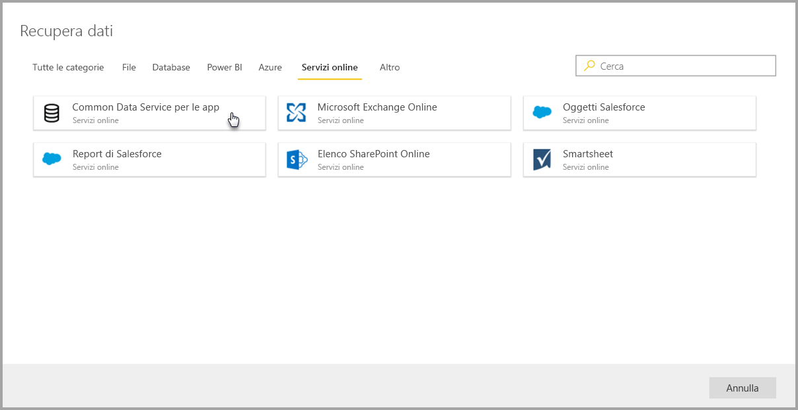

Viene visualizzata una finestra di connessione per la connessione dati selezionata. Se sono richieste credenziali, sarà necessario specificarle. Nell'immagine seguente viene immesso un URL del server per connettersi a un server Common Data Service per le app.

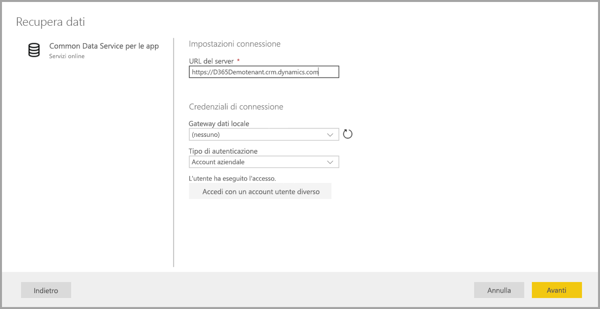

Dopo aver specificato l'URL del server o le informazioni di accesso per la connessione alle risorse, selezionare **Accesso** per immettere le credenziali da usare per l'accesso ai dati e quindi selezionare **Avanti**.

**Power Query Online** avvia e stabilisce la connessione all'origine dati e quindi presenta le tabelle disponibili nell'origine dati nella finestra **Strumento di navigazione**, illustrata nell'immagine seguente.

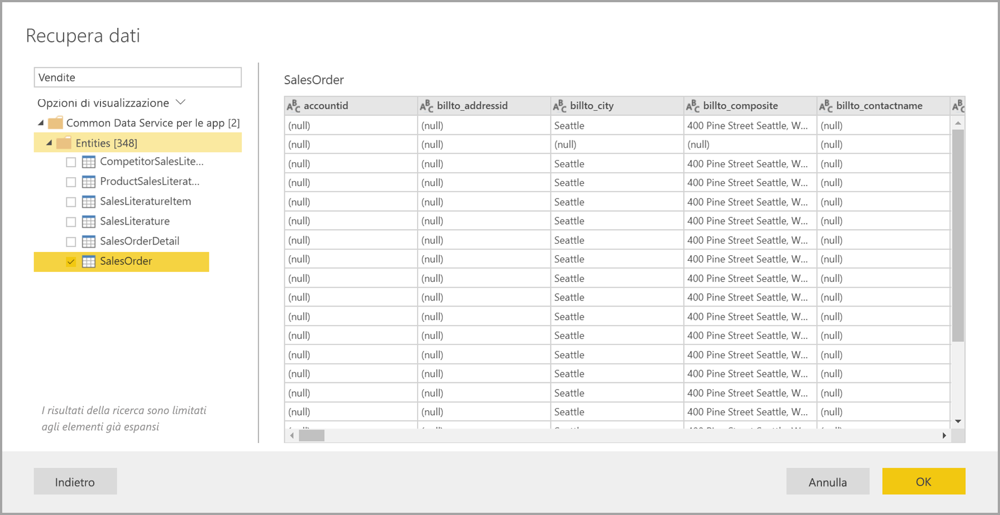

È possibile selezionare tabelle e dati da caricare selezionando la casella di controllo accanto a ogni elemento nel riquadro a sinistra. Per caricare i dati, selezionare **OK** in fondo al riquadro **Strumento di navigazione**. Viene visualizzata una finestra di dialogo di Power Query Online, in cui è possibile modificare le query ed eseguire eventuali altre trasformazioni sui dati selezionati.

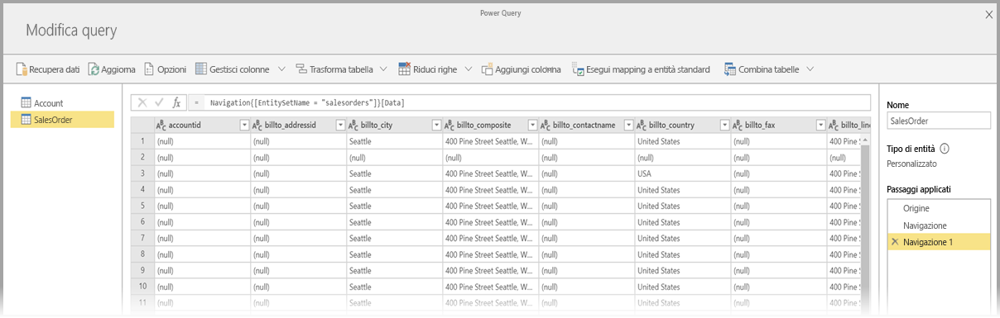

Tutto qui. Altre origini dati hanno flussi simili e usano Power Query Online per modificare e trasformare i dati del flusso di dati.

## Connessione a origini dati aggiuntive

Sono disponibili altri connettori di dati che non vengono visualizzati nell'interfaccia utente dei flussi di dati di Power BI, ma che sono supportati con alcuni passaggi aggiuntivi. 

È possibile eseguire la procedura seguente per creare una connessione a un connettore che non viene visualizzato nell'interfaccia utente:

1. Aprire **Power BI Desktop** e selezionare **Recupera dati**.
2. Aprire **Editor di Power Query** in Power BI Desktop, fare clic con il pulsante destro del mouse sulla query rilevante e aprire **Editor avanzato**, come illustrato nell'immagine seguente. Da qui, è possibile copiare lo script M che viene visualizzato nell'Editor avanzato.

    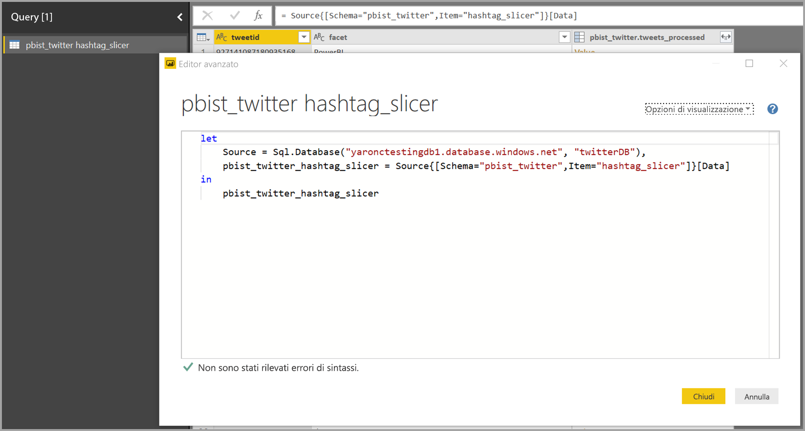 

3. Aprire il flusso di dati di Power BI e selezionare **Recupera dati** per una query vuota, come illustrato nell'immagine seguente.

    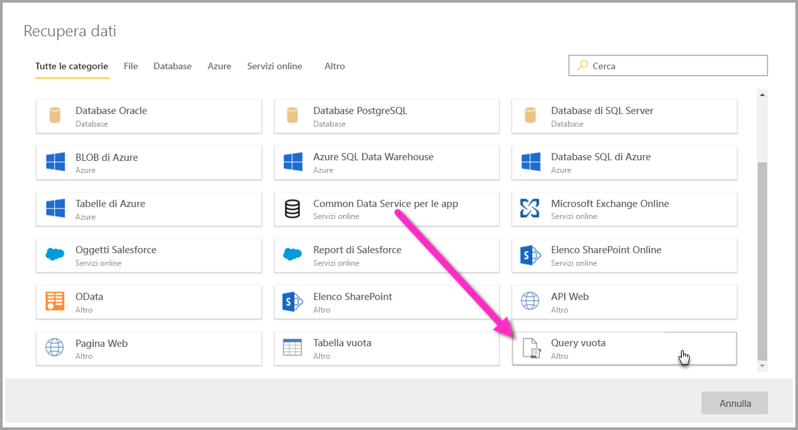 

4. Incollare la query copiata nella query vuota per il flusso di dati.

    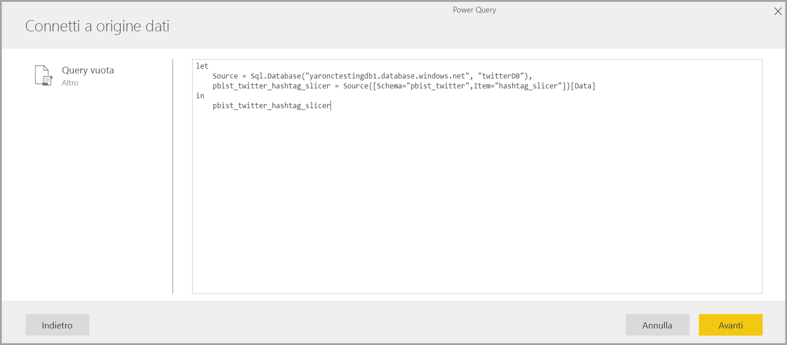 

A questo punto lo script si connette all'origine dati specificata. 

Nell'elenco seguente vengono illustrati i connettori che è possibile usare attualmente per copiare e incollare la query M in una query vuota:

* Azure Analysis Services
* Adobe Analytics
* ODBC
* OLE DB
* Cartella
* Cartella di SharePoint Online
* Cartella di SharePoint
* Hadoop Distributed File System
* Azure HDInsight (HDFS)
* File Hadoop Distributed File System
* Informix (beta)

Non sono necessarie altre operazioni per connettersi alle origini dati nei flussi di dati di Power BI.

## Passaggi successivi

Questo articolo ha illustrato le origini dati che è possibile usare per connettersi ai flussi di dati. Gli articoli seguenti descrivono più in dettaglio gli scenari di utilizzo comuni per i flussi di dati. 

* [Preparazione dei dati self-service in Power BI](service-dataflows-overview.md)
* [Creare e usare flussi di dati in Power BI](service-dataflows-create-use.md)
* [Uso delle entità calcolate in Power BI Premium](service-dataflows-computed-entities-premium.md)
* [Uso di flussi di dati con origini dati locali](service-dataflows-on-premises-gateways.md)
* [Risorse per sviluppatori per i flussi di dati Power BI](service-dataflows-developer-resources.md)
* [Integrazione di flussi di dati e Azure Data Lake (anteprima)](service-dataflows-azure-data-lake-integration.md)

Per altre informazioni su Power Query e sull'aggiornamento pianificato, è possibile leggere questi articoli:
* [Panoramica delle query in Power BI Desktop](desktop-query-overview.md)
* [Configurazione dell'aggiornamento pianificato](refresh-scheduled-refresh.md)

Per altre informazioni sul modello CDM (Common Data Model), è possibile leggere l'articolo di panoramica:
* [Panoramica del modello CDM (Common Data Model)](https://docs.microsoft.com/powerapps/common-data-model/overview)

