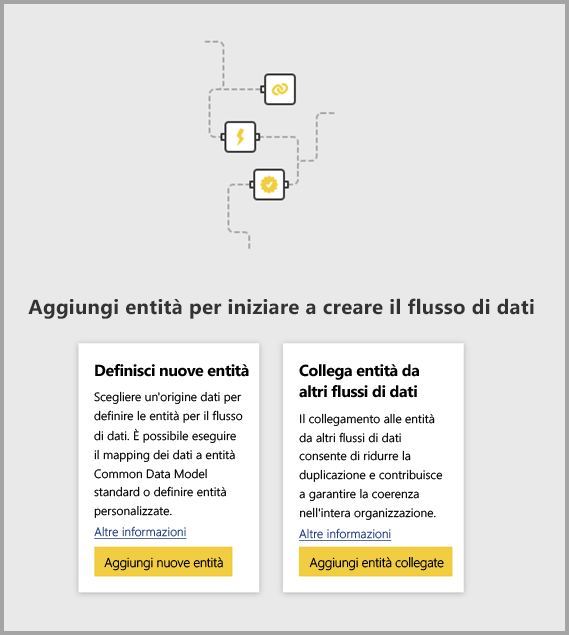
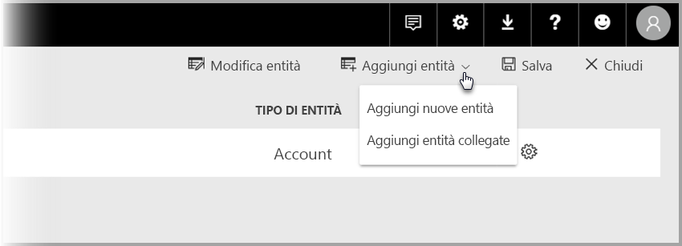

# Collegare entità tra flussi di dati in Power BI

Con i flussi di dati in Power BI, è possibile avere un'unica origine di archiviazione dati a livello di organizzazione in cui i business analyst possono preparare e gestire i dati una sola volta per riutilizzarli tra le diverse app di analisi all'interno dell'organizzazione. 

Quando si collegano entità tra i flussi di dati, è possibile riutilizzare le entità che sono già state inserite, pulite e trasformate da altri flussi di dati appartenenti ad altri utenti senza la necessità di gestire tali dati. Le entità collegate puntano semplicemente alle entità in altri flussi di dati e *non* copiano o duplicano i dati.

Le entità collegate sono **di sola lettura**. Se si vogliono creare trasformazioni per un'entità collegata, è necessario creare una nuova entità calcolata con un riferimento all'entità collegata.

## Disponibilità delle entità collegate

Le entità collegate richiedono una sottoscrizione [Power BI Premium](service-premium-what-is.md) per l'aggiornamento. Le entità collegate sono disponibili in qualsiasi flusso di dati in un'area di lavoro ospitata nella capacità Power BI Premium. Non sono previsti limiti per il flusso di dati di origine.

Le entità collegate funzionano correttamente solo nelle nuove aree di lavoro di Power BI. Sono disponibili altre informazioni sulle [nuove aree di lavoro di Power BI](service-create-the-new-workspaces.md). Tutti i flussi di dati collegati devono trovarsi nelle nuove aree di lavoro per funzionare correttamente.

> [!NOTE]
> Le entità variano a seconda che siano standard o calcolate. Le entità standard (spesso denominate semplicemente entità) eseguono query su un'origine dati esterna, ad esempio un database SQL. Le entità calcolate richiedono capacità Premium in Power BI ed eseguono le trasformazioni sui dati già presenti nell'archiviazione di Power BI. 
>
>Se il flusso di dati non è in un'area di lavoro di capacità Premium, è comunque possibile fare riferimento a una singola query o combinare due o più query fino a quando le trasformazioni non vengono definite come trasformazioni in archivio. Tali riferimenti vengono considerati entità standard. A tale scopo, disattivare l'opzione **Abilita caricamento** per le query a cui viene fatto riferimento per evitare che i dati vengano materializzati e inseriti nell'archivio. Da qui, è possibile fare riferimento a tali query **Abilita caricamento = false** e impostare **Abilita caricamento** su **Sì** solo per le query risultanti che si vuole materializzare.

## Come collegare entità tra flussi di dati

Esistono diversi modi per collegare le entità tra flussi di dati in Power BI. È possibile selezionare **Aggiungi entità collegate** dallo strumento di creazione Flussi di dati, come illustrato nell'immagine seguente. 

È anche possibile selezionare **Aggiungi entità collegate** dalla voce di menu **Aggiungi entità** nel servizio Power BI.

Per collegare le entità, è necessario accedere con le credenziali di Power BI.

Viene aperta una finestra **Strumento di navigazione** che consente di scegliere un set di entità a cui è possibile connettersi. Le entità visualizzate sono quelle per cui si dispone di autorizzazioni, tra tutte le aree di lavoro nel tenant di Power BI. 

Una volta selezionate, le entità collegate vengono visualizzate nell'elenco delle entità per il flusso di dati nello strumento di creazione, con un'icona speciale che le identifica come entità collegate.

È anche possibile visualizzare il flusso di dati di origine dalle impostazioni del flusso di dati dell'entità collegata.

## Logica di aggiornamento delle entità collegate
La logica di aggiornamento predefinita delle entità collegate varia a seconda del fatto che il flusso di dati di origine si trovi o meno nella stessa area di lavoro del flusso di dati di destinazione. Le sezioni seguenti descrivono il comportamento di entrambi gli scenari.

### Collegamenti tra aree di lavoro

L'aggiornamento dei collegamenti dalle entità in aree di lavoro diverse si comporta come con un'origine dati esterna. Quando si aggiorna il flusso di dati, vengono presi i dati più recenti per l'entità dal flusso di dati di origine. Se il flusso di dati di origine viene aggiornato, non influirà automaticamente sui dati nel flusso di dati di destinazione.

### Collegamenti nella stessa area di lavoro

Quando si verifica l'aggiornamento dei dati per un flusso di dati di origine, l'evento attiva automaticamente un processo di aggiornamento per le entità dipendenti in tutti i flussi di dati di destinazione nella stessa area di lavoro, incluse eventuali entità calcolate dipendenti. Tutte le altre entità nel flusso di dati di destinazione vengono aggiornate in base alla pianificazione del flusso di dati. Le entità che dipendono da più origini aggiornano i dati ogni volta che una delle relative origini viene aggiornata correttamente.

È utile notare che l'intero processo di aggiornamento esegue il commit contemporaneamente. Per questo motivo, se l'aggiornamento del flusso di dati di destinazione non riesce, avrà esito negativo anche l'aggiornamento del flusso di dati di origine.

## Autorizzazioni per la visualizzazione di report dai flussi di dati

Quando si crea un report di Power BI che include dati basati su un flusso di dati, gli utenti possono visualizzare tutte le entità collegate solo quando hanno accesso al flusso di dati di origine.

## Limitazioni e considerazioni

Esistono alcune limitazioni da tenere presenti quando si lavora con le entità collegate:

* È previsto un massimo di cinque hop di riferimento
* Le dipendenze cicliche delle entità collegate non sono consentite
* Il flusso di dati deve trovarsi in una [nuova area di lavoro di Power BI](service-create-the-new-workspaces.md)
* Un'entità collegata non può essere unita a un'entità normale che riceve i dati da un'origine dati locale
* Quando una query (ad esempio, la query A) viene usata nel calcolo di un'altra query (query B) nei flussi di dati, la query B diventa un'entità calcolata. Le entità calcolate non possono fare riferimento a origini locali.

## Passaggi successivi

Gli articoli seguenti possono essere utili quando si crea o si lavora con un flusso di dati. 

* [Preparazione dei dati self-service in Power BI](service-dataflows-overview.md)
* [Creare e usare flussi di dati in Power BI](service-dataflows-create-use.md)
* [Uso delle entità calcolate in Power BI Premium](service-dataflows-computed-entities-premium.md)
* [Uso di flussi di dati con origini dati locali](service-dataflows-on-premises-gateways.md)
* [Risorse per sviluppatori per i flussi di dati Power BI](service-dataflows-developer-resources.md)

Per altre informazioni su Power Query e sull'aggiornamento pianificato, è possibile leggere questi articoli:
* [Panoramica delle query in Power BI Desktop](desktop-query-overview.md)
* [Configurazione dell'aggiornamento pianificato](refresh-scheduled-refresh.md)

Per altre informazioni sul modello CDM (Common Data Model), è possibile leggere l'articolo di panoramica:
* [Panoramica del modello CDM (Common Data Model)](https://docs.microsoft.com/powerapps/common-data-model/overview)

