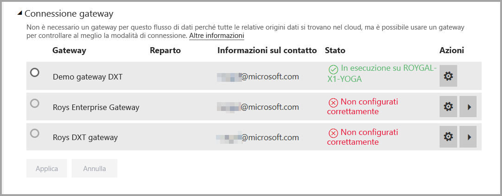
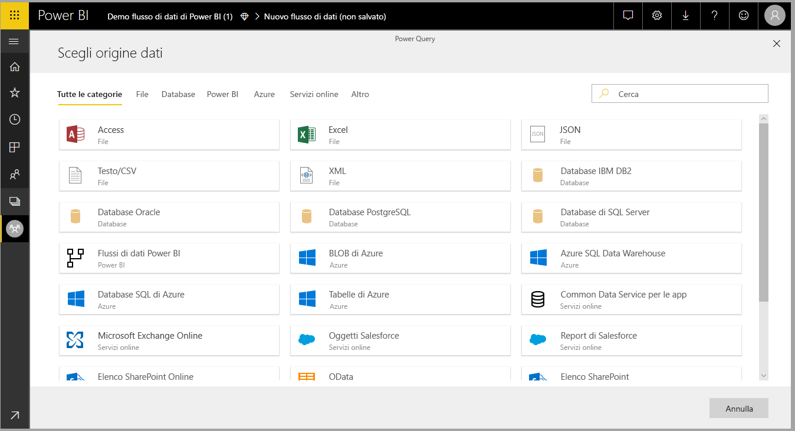
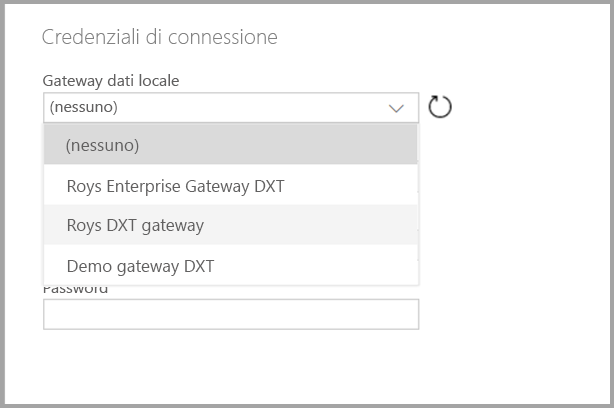

# Uso di flussi di dati con origini dati locali

Con i **flussi di dati**, è possibile creare una raccolta di dati da svariate origini, pulire i dati, trasformarli e quindi caricarli nello spazio di archiviazione di Power BI. Durante la creazione di flussi di dati è possibile usare origini dati locali. Questo articolo illustra i requisiti associati alla creazione dei flussi di dati e come si deve configurare il **gateway aziendale** per abilitare tali connessioni.

## Configurazione di un gateway aziendale per l'uso con i flussi di dati

Per usare un'origine dati locale in un flusso di dati, l'utente che crea il flusso di dati deve avere un **gateway aziendale** installato e configurato. L'utente che crea il flusso di dati deve anche essere l'amministratore del gateway aziendale per poter usare tale gateway per un flusso di dati.

> [!NOTE]
> I flussi di dati sono supportati solo con i gateway aziendali.

## Uso di un'origine dati locale in un flusso di dati

Quando si crea un flusso di dati, selezionare un'origine dati locale dall'elenco di origini dati, come illustrato nell'immagine seguente.

Dopo aver effettuato la selezione, viene chiesto di fornire i dettagli della connessione per il gateway aziendale che verrà usato per accedere ai dati locali. È necessario selezionare il gateway stesso e fornire le credenziali per il gateway selezionato. Nell'elenco a discesa vengono visualizzati solo i gateway di cui l'utente è amministratore.

## Monitoraggio del gateway

È possibile monitorare il gateway aziendale per un flusso di dati nello stesso modo in cui si monitorano i gateway per un set di dati.

Nella schermata delle impostazioni del flusso di dati in Power BI è possibile monitorare lo stato del gateway di un flusso di dati e assegnare un gateway al flusso di dati, come illustrato nell'immagine seguente.

## Modifica di un gateway

È possibile cambiare il gateway aziendale usato per un determinato flusso di dati in due modi:

1. **Dallo strumento di creazione**: è possibile cambiare il gateway assegnato a tutte le query usando lo strumento di creazione del flusso di dati.

    > [!NOTE]
    > Il flusso di dati proverà a trovare o creare le origini dati necessarie usando il nuovo gateway. Se non riesce, sarà possibile cambiare il gateway solo quando tutti i flussi di dati necessari saranno disponibili dal gateway selezionato.

2. **Dalla schermata delle impostazioni**: è possibile cambiare il gateway assegnato usando la schermata delle impostazioni per il flusso di dati nel servizio Power BI.

Per altre informazioni sui gateway aziendali, vedere [Gateway dati locale](service-gateway-onprem.md).

## Considerazioni e limitazioni

Esistono alcune limitazioni all'uso dei gateway aziendali e dei flussi di dati:

* Ogni flusso di dati può usare un solo gateway. Di conseguenza, tutte le query devono essere configurate usando lo stesso gateway.
* La modifica del gateway ha effetto sull'intero flusso di dati.
* Se sono necessari più gateway, la procedura consigliata consiste nel compilare più flussi di dati (uno per ogni gateway) e usare le funzionalità di riferimento a entità o di calcolo per unificare i dati.
* I flussi di dati sono supportati solo con i gateway aziendali. I gateway personali non saranno disponibili per la selezione negli elenchi a discesa e nelle schermate delle impostazioni.

## Passaggi successivi

Questo articolo ha fornito informazioni sull'uso di origini dati locali per i flussi di dati e su come usare e configurare i gateway per accedere a tali dati. Anche gli articoli seguenti possono risultare utili

* [Preparazione dei dati self-service con flussi di dati](service-dataflows-overview.md)
* [Creare e usare flussi di dati in Power BI](service-dataflows-create-use.md)
* [Uso delle entità calcolate in Power BI Premium](service-dataflows-computed-entities-premium.md)
* [Risorse per sviluppatori per i flussi di dati Power BI](service-dataflows-developer-resources.md)

Per altre informazioni su Power Query e sull'aggiornamento pianificato, è possibile leggere questi articoli:
* [Panoramica delle query in Power BI Desktop](desktop-query-overview.md)
* [Configurazione dell'aggiornamento pianificato](refresh-scheduled-refresh.md)

Per altre informazioni sul modello CDM (Common Data Model), è possibile leggere l'articolo di panoramica:
* [Panoramica del modello CDM (Common Data Model)](https://docs.microsoft.com/powerapps/common-data-model/overview)

