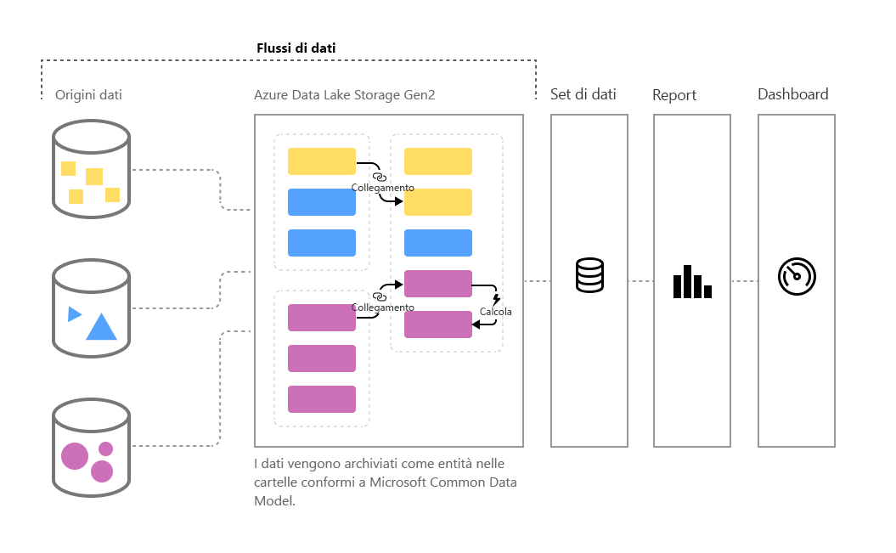

# Preparazione dei dati self-service in Power BI (anteprima)

Di pari passo con il costante aumento del volume dei dati, anche la sfida di organizzare tali dati in informazioni strutturate e di utilità pratica si fa sempre più intensa. I dati devono essere pronti per l'analisi, per poter popolare oggetti visivi, report e dashboard, in modo da trasformare rapidamente i volumi di dati in informazioni dettagliate di uso immediato. Con la **preparazione dei dati self-service** per i Big Data in Power BI, è possibile passare dai dati a informazioni dettagliate di Power BI con un paio di clic.

Power BI introduce i **flussi di dati** per aiutare le organizzazioni a unificare i dati provenienti da origini diverse e prepararli per la modellazione. Gli analisti possono creare facilmente i flussi di dati, usando strumenti familiari e self-service. I flussi di dati vengono usati per inserire, trasformare, integrare e arricchire i Big Data con la definizione di connessioni a origini dati, logica ETL, pianificazioni degli aggiornamenti e altro ancora. Inoltre, il nuovo motore di calcolo basato su modelli integrato nei flussi di dati rende il processo di preparazione dei dati più gestibile, maggiormente deterministico e meno complesso per analisti dei dati e autori di report. In modo analogo a quello in cui i fogli di calcolo gestiscono le operazioni di ricalcolo per tutte le formule interessate, i flussi di dati gestiscono le modifiche per un'entità o un elemento dati per conto dell'utente, automatizzando gli aggiornamenti e mitigando la ripetitività e il dispendio di tempo dei controlli logici richiesti anche per un aggiornamento dei dati di base. Con i flussi di dati, le attività che in precedenza richiedevano la supervisione dei data scientist (e molte ore o giorni per il completamento) possono essere ora gestite con pochi clic dagli analisti e dagli autori di report. 

I dati vengono archiviati come entità nel [**modello CDM (Common Data Model)**](https://docs.microsoft.com/powerapps/common-data-model/overview) in Azure Data Lake Storage Gen2. I flussi di dati vengono creati e gestiti in aree di lavoro per le app usando il servizio Power BI.  

> [!NOTE]
> La funzionalità dei flussi di dati è disponibile in anteprima ed è soggetta a modifiche e aggiornamenti prima della disponibilità generale.

 
I **flussi di dati** sono progettati per usare il **modello CDM**, una raccolta standardizzata, modulare ed estendibile di schemi di dati pubblicata da Microsoft allo scopo di semplificare la compilazione, l'uso e l'analisi dei dati. Con questo modello, è possibile passare dalle origini dati ai dashboard di Power BI senza alcun problema.

È possibile usare i flussi di dati per inserire dati da un set di grandi dimensioni e in continua crescita di origini dati supportate in locale e basate su cloud, tra cui Dynamics 365, Salesforce, il database SQL di Azure, Excel, SharePoint e molto altro.

È quindi possibile eseguire il mapping dei dati a entità standard nel modello CDM, modificare ed estendere le entità esistenti e creare entità personalizzate. Gli utenti avanzati possono creare flussi di dati interamente personalizzati con un'esperienza integrata self-service di creazione di Power Query senza uso, o con un uso minimo, di codice, simile all'esperienza di Power Query che milioni di utenti di Excel e Power BI Desktop conoscono già.  

Dopo aver creato un flusso di dati, è possibile usare Power BI Desktop e il servizio Power BI per creare set di dati, report, dashboard e app che sfruttano tutta la potenza del modello CDM per ottenere informazioni dettagliate sulle attività aziendali. 

La pianificazione dell'aggiornamento del flusso di dati viene gestita direttamente dall'area di lavoro in cui è stato creato il flusso di dati, esattamente come per i set di dati. 

## Funzionamento dei flussi di dati

Di seguito sono riportati alcuni esempi del funzionamento dei flussi di dati:

* Le organizzazioni possono eseguire il mapping dei dati a entità standard nel modello CDM o creare le proprie entità personalizzate. Queste entità possono quindi essere usate come componenti essenziali per creare report, dashboard e app immediatamente disponibili e distribuirli agli utenti all'interno dell'organizzazione. 

* Grazie all'ampia raccolta di connettori dati Microsoft, le organizzazioni possono connettere le proprie origini dati ai flussi di dati, usando Power Query per eseguire il mapping dei dati dall'origine e trasferirli in Power BI. Dopo che i dati sono stati importati da un flusso di dati (e aggiornati in base alla frequenza specificata), le entità del flusso di dati possono essere usate nell'applicazione Power BI Desktop per creare report e dashboard accattivanti. 

## Come usare i flussi di dati

Nella sezione precedente sono stati illustrati alcuni esempi di come usare i flussi di dati per creare rapidamente analisi avanzate in Power BI. In questa sezione viene descritto come creare rapidamente informazioni dettagliate usando i flussi di dati in un'organizzazione, ottenere una panoramica immediata del modo in cui i professionisti di business intelligence possono creare flussi di dati su misura e personalizzare le informazioni dettagliate per la propria organizzazione.

### Estendere il modello CDM per le esigenze aziendali
Per le organizzazioni che vogliono estendere il modello CDM, i flussi di dati consentono ai professionisti di business intelligence di personalizzare le entità standard o crearne di nuove. Questo approccio self-service alla personalizzazione del modello di dati può essere quindi usato con i flussi di dati per creare app e dashboard di Power BI su misura per un'organizzazione.

### Definire i flussi di dati a livello di codice
È anche possibile sviluppare soluzioni personalizzate a livello di codice per creare flussi di dati. Con le API pubbliche e la possibilità di creare file di definizione del flusso di dati personalizzati (model.json) a livello di codice, è possibile creare una soluzione personalizzata in grado di adattarsi alle esigenze specifiche di analisi e dati dell'organizzazione. 

Le API pubbliche assicurano agli sviluppatori un modo semplice e rapido per interagire con Power BI e i flussi di dati.

### Estendere le funzionalità con Azure
Azure Data Lake Storage Gen2 è incluso in ogni sottoscrizione di Power BI a pagamento (10 GB per utente, 100 TB per nodo P1). Pertanto, è possibile acquisire facilmente familiarità con la preparazione dei dati self-service in Azure Data Lake. 

Power BI può essere configurato per archiviare i dati del flusso di dati nell'account Azure Data Lake Storage Gen2 dell'organizzazione. Quando Power BI è connesso alla sottoscrizione di Azure, gli sviluppatori di dati e i data scientist possono sfruttare prodotti Azure avanzati come Azure Machine Learning, Azure Databricks, Azure Data Factory e altro ancora.

Power BI può anche connettersi a cartelle con dati schematizzati nel formato CDM, archiviati l'account Azure Data Lake Storage dell'organizzazione. Queste cartelle possono essere create da servizi come i servizi dati di Azure. Connettendosi a queste cartelle, gli analisti possono lavorare senza problemi con questi dati in Power BI. 

Per altre informazioni sull'integrazione di Azure Data Lake Storage Gen2 e i flussi di dati, incluse istruzioni per la creazione di flussi di dati che risiedono in Azure Data Lake della propria organizzazione, vedere [Integrazione di flussi di dati e Azure Data Lake (anteprima)](service-dataflows-azure-data-lake-integration.md).

## Funzionalità del flusso di dati in Power BI Premium

Per poter usare le funzionalità e i carichi di lavoro del flusso di dati in una sottoscrizione di Power BI Premium, il carico di lavoro del flusso di dati per tale capacità Premium deve essere attivato. Altre informazioni su Power BI Premium sono disponibili nell'articolo [Che cos'è Power BI Premium](service-premium.md). 

La tabella seguente descrive le funzionalità del flusso di dati e le relative capacità quando si usa un account Power BI Pro e presenta un confronto con l'uso di Power BI Premium.

|Funzionalità del flusso di dati | Power BI Pro |   Power BI Premium |
|---------|---------|---------|
|Aggiornamento pianificato| 8 al giorno|  48|
|Spazio di archiviazione totale| 10 GB/utente  |100 TB/nodo|
|Creazione del flusso di dati con Power Query online|    +   |+|
|Gestione del flusso di dati all'interno di Power BI|   +|  +|
|Connettore dati per il flusso di dati in Power BI Desktop|  +|  +|
|Integrazione con Azure|    +|  +|
|Entità calcolate (trasformazioni in archivio tramite M) | |   +|
|Nuovi connettori|    +|  +|
|Aggiornamento incrementale del flusso di dati|  |   +|
|Esecuzione nella capacità Power BI Premium/esecuzione parallela delle trasformazioni|   |   +|
|Entità collegate del flusso di dati| |        +|
|Schema standardizzato/supporto integrato per il modello CDM|  +|  +|

## Riepilogo della preparazione dei dati self-service per i Big Data in Power BI
Come accennato in precedenza in questo articolo, esistono più scenari ed esempi in cui i **flussi di dati** possono assicurare un migliore controllo e analisi più rapide dei dati aziendali. Usando un modello di dati standard (schema) definito dal modello CDM, i flussi di dati possono importare i dati aziendali più importanti e prepararli per la modellazione e la creazione di informazioni dettagliate di business intelligence in tempi molto brevi, rispetto ai mesi richiesti in precedenza. 

Archiviando i dati aziendali nel formato standardizzato del **modello CDM**, i professionisti di business intelligence (o gli sviluppatori) possono creare app che generano report e oggetti visivi rapidi, semplici e automatici, tra cui, a titolo di esempio:

* Mapping dei dati a entità standard nel modello CDM per unificare i dati e sfruttare lo schema noto in modo da produrre informazioni dettagliate pronte per l'uso
* Creazione di entità personalizzate per unificare i dati all'interno dell'organizzazione 
* Uso e aggiornamento dei **dati esterni** come parte di un flusso di dati e abilitazione dell'importazione di tali dati per produrre informazioni dettagliate
* Introduzione ai flussi di dati per gli sviluppatori

## Passaggi successivi

Questo articolo ha fornito una panoramica della preparazione dei dati self-service per i Big Data in Power BI e dei tanti modi in cui è possibile usarli. Gli articoli seguenti descrivono più in dettaglio gli scenari di utilizzo comuni per i flussi di dati. 

* [Creare e usare flussi di dati in Power BI](service-dataflows-create-use.md)
* [Uso delle entità calcolate in Power BI Premium (anteprima)](service-dataflows-computed-entities-premium.md)
* [Uso di flussi di dati con origini dati locali (anteprima)](service-dataflows-on-premises-gateways.md)
* [Risorse per sviluppatori per i flussi di dati Power BI (anteprima)](service-dataflows-developer-resources.md)
* [Integrazione di flussi di dati e Azure Data Lake (anteprima)](service-dataflows-azure-data-lake-integration.md)

Per altre informazioni su Power Query e sull'aggiornamento pianificato, è possibile leggere questi articoli:
* [Panoramica delle query in Power BI Desktop](desktop-query-overview.md)
* [Configurazione dell'aggiornamento pianificato](refresh-scheduled-refresh.md)

Per altre informazioni sul modello CDM (Common Data Model), è possibile leggere l'articolo di panoramica:
* [Panoramica del modello CDM (Common Data Model)](https://docs.microsoft.com/powerapps/common-data-model/overview)

