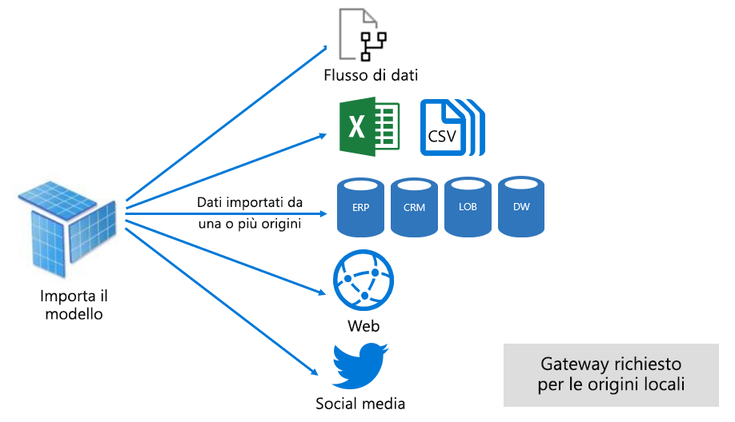
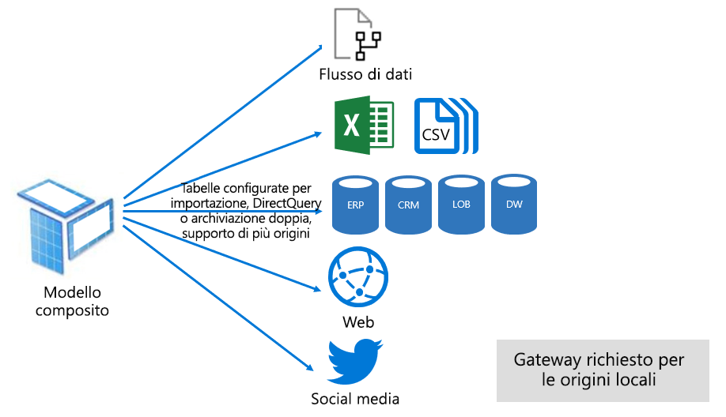

# Modalità del set di dati nel servizio Power BI

Questo articolo offre una spiegazione tecnica delle modalità dei set di dati di Power BI. Si applica ai set di dati che rappresentano una connessione dinamica a un modello di Analysis Services con hosting esterno e anche ai modelli sviluppati in Power BI Desktop. L'articolo evidenzia la logica che sta alla base di ogni modalità e il possibile impatto sulle risorse di capacità di Power BI.

Le tre modalità del set di dati sono:

- [Importazione](#import-mode)
- [DirectQuery](#directquery-mode)
- [Composito](#composite-mode)

## Modalità importazione

La modalità _importazione_ è quella più usata per lo sviluppo di modelli. Questa modalità offre velocità di esecuzione elevate grazie all'esecuzione di query in memoria. Offre anche flessibilità di progettazione ai modellatori e supporto di funzionalità specifiche del servizio Power BI (Q&A, Informazioni rapide e così via). A causa di questi punti di forza, è la modalità predefinita per la creazione di una nuova soluzione Power BI Desktop.

È importante comprendere che i dati importati vengono sempre archiviati su disco. Quando vengono sottoposti a query o aggiornati, i dati devono essere completamente caricati nella memoria della capacità di Power BI. Una volta caricati in memoria, i modelli Importazione possono restituire risultati della query in tempi molto rapidi. È anche importante sottolineare che non esiste il concetto di modello Importazione caricato parzialmente in memoria.

Quando vengono aggiornati, i dati vengono compressi e ottimizzati e quindi archiviati su disco tramite il motore di archiviazione VertiPaq. Quando i dati vengono caricati dal disco in memoria, è possibile vedere la compressione 10x. Quindi è ragionevole aspettarsi che 10 GB di dati di origine siano comprimibili in circa 1 GB. La compressione può determinare una riduzione del 20% delle dimensioni di archiviazione su disco. È possibile determinare la differenza di dimensioni confrontando le dimensioni del file di Power BI Desktop con l'utilizzo della memoria del file in Gestione attività.

La flessibilità di progettazione può essere ottenuta in tre modi. I creatori di modelli di dati possono:

- Integrare i dati memorizzando nella cache dati da flussi e origini dati esterne, indipendentemente dal tipo o dal formato dell'origine dati
- Usare l'intero set di funzioni nel [linguaggio della formula di Power Query](/powerquery-m/) (comunemente chiamato M) per la creazione di query di preparazione dei dati
- Usare l'intero set di funzioni [DAX (Data Analysis Expressions)](/dax/) per ottimizzare il modello con la logica di business. È disponibile il supporto per le colonne calcolate, le tabelle calcolate e le misure.

Come illustrato nell'immagine seguente, un modello Importazione può integrare i dati da un numero qualsiasi di tipi di origini dati supportate.

I modelli Importazione presentano vantaggi importanti ma anche alcuni svantaggi:

- Prima che Power BI possa eseguire la query nel modello, l'intero modello deve essere caricato in memoria. Questo può influire sulle risorse di capacità disponibili, specie quando aumentano il numero e le dimensioni dei modelli Importazione
- I dati del modello sono aggiornati all'ultimo aggiornamento eseguito, pertanto i modelli Importazione devono essere aggiornati periodicamente, in genere sulla base di una pianificazione
- Un aggiornamento completo rimuove tutti i dati da tutte le tabelle e li ricarica dall'origine dati. Questa operazione può essere dispendiosa in termini di tempo e risorse, sia per il servizio Power BI sia per le origini dati.

    > [!NOTE]
    > Power BI può implementare un aggiornamento incrementale, per evitare la troncatura e il ricaricamento di intere tabelle. Questa funzionalità, tuttavia, è supportata solo quando il set di dati è ospitato in aree di lavoro con capacità Premium. Per altre informazioni, vedere l'articolo [Aggiornamento incrementale in Power BI Premium](service-premium-incremental-refresh.md).

Dal punto di vista delle risorse del servizio Power BI, i modelli Importazione richiedono:

- Una quantità di memoria sufficiente per caricare il modello quando viene sottoposto a query o aggiornato
- Risorse per l'elaborazione e risorse di memoria aggiuntive per l'aggiornamento dei dati

## Modalità DirectQuery

La modalità _DirectQuery_ rappresenta un'alternativa alla modalità Importazione. I modelli sviluppati in modalità DirectQuery non importano dati. Sono invece costituiti solo da metadati, che definiscono la struttura del modello. Quando viene eseguita una query sul modello, vengono usate query native per recuperare i dati dall'origine dati sottostante.

Esistono due situazioni principali per le quali vale la pena considerare lo sviluppo di un modello DirectQuery:

- Il caso in cui i volumi di dati sono troppo grandi (anche dopo l'applicazione di [metodi di riduzione dei dati](guidance/import-modeling-data-reduction.md)) per il caricamento in un modello o l'aggiornamento in condizioni soddisfacenti
- Il caso in cui i report e i dashboard devono restituire dati quasi in tempo reale, condizione non ottenibile con gli aggiornamenti pianificati. I limiti previsti per l'aggiornamento pianificato sono otto volte al giorno per una capacità condivisa e 48 volte al giorno per una capacità Premium.

I modelli DirectQuery presentano diversi vantaggi:

- I limiti di dimensioni per l'importazione del modello non sono applicabili
- I modelli non richiedono l'aggiornamento
- Gli utenti dei report visualizzano i dati più recenti quando interagiscono con i filtri e le sezioni dei report. Gli utenti dei report possono anche aggiornare l'intero report per recuperare i dati correnti.
- È possibile sviluppare report in tempo reale usando la funzionalità [Aggiornamento pagina automatico](desktop-automatic-page-refresh.md)
- I riquadri del dashboard, se basati su modelli DirectQuery, possono essere aggiornati automaticamente anche ogni 15 minuti

I modelli DirectQuery presentano tuttavia alcune limitazioni:

- Le formule DAX potranno usare solo espressioni e funzioni M che possono essere trasposte in query native interpretabili dall'origine dati. Le tabelle calcolate non sono supportate.
- Le funzionalità Domande e risposte e Informazioni rapide non sono supportate

Dal punto di vista delle risorse del servizio Power BI, i modelli DirectQuery richiedono:

- Una quantità di memoria minima per caricare il modello (solo metadati) quando viene eseguita una query
- In alcuni casi il servizio Power BI deve usare una quantità elevata di risorse del processore per generare ed elaborare le query inviate all'origine dati. Quando si verifica, questa situazione può influire sulla velocità effettiva del sistema, specie quando più utenti eseguono simultaneamente query sul modello.

Per altre informazioni, vedere [Usare DirectQuery in Power BI Desktop](desktop-use-directquery.md).

## Modalità Composito

La modalità _Composito_ consente di combinare le modalità Importazione e DirectQuery oppure di integrare più origini dati DirectQuery. I modelli sviluppati in modalità Composito supportano la configurazione della modalità di archiviazione per ogni tabella del modello. Questa modalità supporta anche le tabelle calcolate (definite con DAX).

La modalità di archiviazione delle tabelle può essere configurata come Importazione, DirectQuery o Doppia. Una tabella configurata con la modalità di archiviazione Doppia supporta le modalità Importazione e DirectQuery e consente al servizio Power BI di determinare la modalità più efficiente da usare a seconda della query.

I modelli di tipo Composito hanno lo scopo di offrire le migliori caratteristiche delle modalità Importazione e DirectQuery. Se configurati in modo appropriato, possono combinare le prestazioni elevate delle query dei modelli in memoria con la capacità di recuperare dati dalle origini dati quasi in tempo reale.

In genere gli esperti di modellazione dati che sviluppano modelli di tipo Composito configurano le tabelle delle dimensioni in modalità Importazione o Doppia e le tabelle dei fatti in modalità DirectQuery. Per altre informazioni sui ruoli delle tabelle del modello, vedere [Informazioni su uno schema star e sull'importanza di questo schema per Power BI](guidance/star-schema.md).

Considerare ad esempio un modello con una tabella di tipo dimensioni **Product** in modalità Doppia e una tabella di tipo fatti **Sales** in modalità DirectQuery. La tabella **Product** supporta l'esecuzione rapida ed efficiente di query in memoria per il rendering di un filtro dei dati del report. Allo stesso tempo è possibile eseguire query in modalità DirectQuery sulla tabella **Sales** con la tabella **Product** correlata. La seconda query può abilitare la generazione di un'unica ed efficace query SQL nativa, che integra le tabelle **Product** e **Sales** ed applica un filtro in base ai valori del filtro dei dati.

In genere i modelli di tipo Composito possono presentare i vantaggi e gli svantaggi associati ai modelli di tipo Importazione e DirectQuery, a seconda della modalità di configurazione delle singole tabelle.

Per altre informazioni, vedere [Usare modelli compositi in Power BI Desktop](desktop-composite-models.md).

## Passaggi successivi

- [Set di dati nel servizio Power BI](service-dataset-modes-understand.md)
- [Modalità di archiviazione in Power BI Desktop](desktop-storage-mode.md)
- [Uso di DirectQuery in Power BI](desktop-directquery-about.md)
- [Usare modelli compositi in Power BI Desktop](desktop-composite-models.md)
- Altre domande? [Provare a rivolgersi alla community di Power BI](https://community.powerbi.com/)
