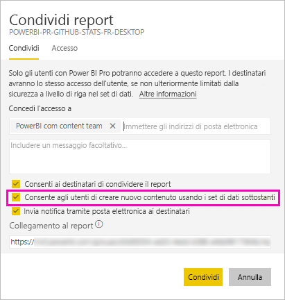

# Condividere un set di dati (anteprima)

I *modelli di dati* creati in Power BI Desktop possono essere condivisi come *set di dati* nel servizio Power BI. I set di dati condivisi possono poi essere facilmente individuati e riusati per creare report. Di seguito viene descritto come condividere set di dati e controllare chi può accedere ai dati usando l'autorizzazione di compilazione.

## Passaggi per la condivisione del set di dati

1. Iniziare creando un file con estensione pbix con un modello di dati in Power BI Desktop. Se si prevede di offrire questo set di dati a utenti che dovranno compilare report, si può persino non progettare un report nel file con estensione pbix.

    È consigliabile salvare un file con estensione pbix in un gruppo di Office 365.

1. Pubblicare il file con estensione pbix in un'[area di lavoro della nuova esperienza](service-create-the-new-workspaces.md) nel servizio Power BI.
    
    Altri membri di quest'area di lavoro possono già creare report in altre aree di lavoro basati su questo set di dati.

1. È anche possibile [pubblicare un'app](service-create-distribute-apps.md) da quest'area di lavoro. Se si crea un'app, selezionare nella pagina **Autorizzazioni** gli utenti autorizzati e le operazioni a loro consentite.

    > [!NOTE]
    > Se si seleziona **Intera organizzazione**, a nessun membro dell'organizzazione saranno concesse autorizzazioni di compilazione. Si tratta di un problema noto. Specificare quindi gli indirizzi di posta elettronica in **Gruppi o utenti specifici**.  Se si vuole concedere autorizzazioni di compilazione all'intera organizzazione, specificare un alias di posta elettronica per l'intera organizzazione.

    

1. Selezionare **Pubblica app** o **Aggiorna app** se è già pubblicata.

## Autorizzazioni di compilazione per set di dati condivisi

Il tipo di autorizzazione di compilazione è rilevante solo per i set di dati. Con questo tipo di autorizzazione, gli utenti possono compilare nuovo contenuto in un set di dati, ad esempio report, dashboard, riquadri aggiunti da Domande e risposte e Insights Discovery. Possono anche compilare nuovo contenuto nel set di dati esterno a Power BI, ad esempio in fogli di Excel, usando Analizza in Excel, XMLA ed Esporta.

Gli utenti ottengono l'autorizzazione di compilazione in modi diversi:

- Se si è membri di un'area di lavoro con almeno un ruolo Collaboratore, sono automaticamente disponibili l'autorizzazione di compilazione per un set di dati e l'autorizzazione per copiare un report.
 
- Un membro dell'area di lavoro in cui si trova il set di dati può assegnare l'autorizzazione a utenti o gruppi di sicurezza specifici nel centro delle autorizzazioni. Selezionare i puntini di sospensione (…) accanto al set di dati > **Gestisci autorizzazioni**.

    

    Si aprirà il centro delle autorizzazioni per il set di dati, in cui è possibile impostare e modificare le autorizzazioni.

    

- Gli amministratori o i membri dell'area di lavoro in cui si trova il set di dati possono decidere durante la pubblicazione dell'app che gli utenti con autorizzazione per l'app ottengano anche l'autorizzazione di compilazione per i set di dati sottostanti. Vedere [Passaggi per la condivisione del set di dati](#steps-to-sharing-your-dataset) in questo articolo per informazioni dettagliate.

- Si supponga di avere le autorizzazioni di ricondivisione e compilazione per un set di dati. Quando si condivide un report o un dashboard basato su questo set di dati è possibile specificare che i destinatari ottengano anche l'autorizzazione di compilazione per il set di dati sottostante.

    

È possibile rimuovere le autorizzazioni di compilazione di una persona per un set di dati. In questo caso, tali utenti potranno comunque visualizzare il report compilato nel set di dati condiviso, ma non potranno più condividerlo.

## Autorizzazioni più granulari

A giugno 2019 Power BI ha introdotto l'autorizzazione di compilazione a complemento delle autorizzazioni esistenti di lettura e ricondivisione. Tutti gli utenti che in quel momento già avevano l'autorizzazione di lettura per set di dati tramite autorizzazioni delle app, condivisione o accesso all'area di lavoro hanno ottenuto anche autorizzazioni di compilazione per gli stessi set di dati. Hanno ottenuto automaticamente l'autorizzazione di compilazione perché l'autorizzazione di lettura già concedeva loro il diritto di compilare nuovo contenuto basato sul set di dati tramite Analizza in Excel o Esporta.

Con questa autorizzazione di compilazione più granulare, è possibile scegliere chi può soltanto visualizzare il contenuto del report o del dashboard esistenti e chi può creare contenuto collegato ai set di dati sottostanti.

Se il set di dati viene usato da un report all'esterno dell'area di lavoro del set di dati, non è possibile eliminare tale set di dati. Sarà visualizzato un messaggio di errore.

Le autorizzazioni di compilazione possono essere rimosse. In questo caso, gli utenti ai quali vengono revocate le autorizzazioni possono comunque visualizzare il report, ma non lo possono più modificare.

## Tenere traccia dell'utilizzo di set di dati

Quando un set di dati viene condiviso nell'area di lavoro, può essere necessario sapere quali report in altre aree si basano su questo set.

1. Nella visualizzazione elenco Set di dati selezionare **Visualizza elementi correlati**.

    

1. Nella finestra di dialogo **Contenuto correlato** vengono visualizzati tutti gli elementi correlati. In questo elenco vengono visualizzati gli elementi correlati in questa area di lavoro e in **Altre aree di lavoro**.
 
    

## Passaggi successivi

- [Usare set di dati in aree di lavoro diverse (anteprima)](service-datasets-across-workspaces.md)
- Domande? [Provare a rivolgersi alla community di Power BI](http://community.powerbi.com/)
