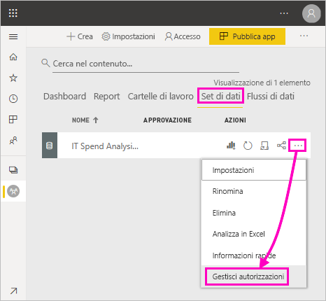
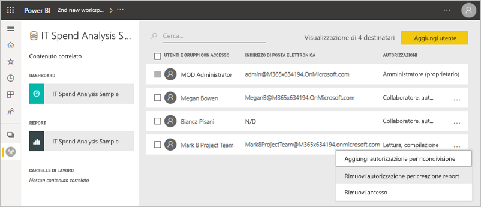
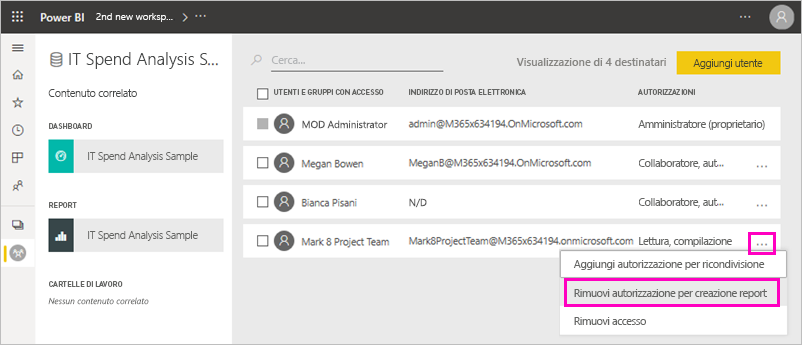
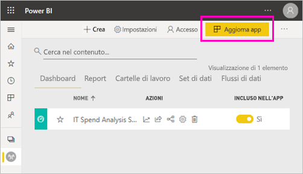
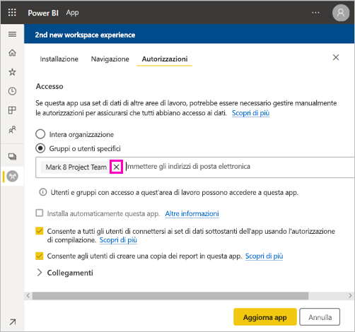
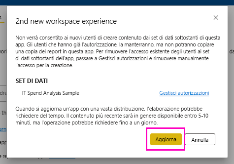

# Autorizzazione per creazione report per set di dati condivisi (anteprima)

I *modelli di dati* creati in Power BI Desktop possono essere condivisi come *set di dati* nel servizio Power BI. I set di dati condivisi possono poi essere facilmente individuati e riusati per creare report. Informazioni su come controllare chi può accedere ai dati usando l'autorizzazione per creazione report.

L'autorizzazione per creazione report è pertinente solo per i set di dati. Gli utenti a cui si concede l'autorizzazione per creazione report possono creare nuovo contenuto in set di dati quali report, dashboard, riquadri aggiunti da Domande e risposte e Insights Discovery. Possono anche compilare nuovo contenuto nel set di dati esterno a Power BI, ad esempio in fogli di Excel, usando Analizza in Excel, XMLA e l'esportazione dei dati sottostanti.

## Come concedere l'autorizzazione per creazione report

Per concedere l'autorizzazione per creazione report per un set di dati sono disponibili diversi modi:

- I membri di un'area di lavoro che hanno almeno il ruolo Collaboratore hanno automaticamente l'autorizzazione per creazione report per i set di dati di tale area di lavoro, nonché l'autorizzazione di copia di un report.
 
- I membri dell'area di lavoro in cui si trova il set di dati possono assegnare l'autorizzazione a utenti o gruppi di sicurezza specifici tramite il centro autorizzazioni. I membri dell'area di lavoro possono selezionare i puntini di sospensione (…) accanto a un set di dati > **Gestisci autorizzazioni**.

    

    Si aprirà il centro delle autorizzazioni per il set di dati, in cui è possibile impostare e modificare le autorizzazioni.

    

- Gli amministratori o i membri dell'area di lavoro in cui si trova il set di dati possono decidere durante la pubblicazione dell'app che gli utenti con autorizzazione per l'app ottengano anche l'autorizzazione di compilazione per i set di dati sottostanti. Per informazioni dettagliate, vedere [Condividere un set di dati](service-datasets-share.md).

- Si supponga di avere le autorizzazioni per ricondivisione e creazione report per un set di dati. Quando si condivide un report o un dashboard basato su questo set di dati, è possibile indicare che i destinatari ottengano anche l'autorizzazione per creazione report per il set di dati sottostante.

    

È possibile rimuovere l'autorizzazione per creazione report di una persona per un set di dati. In questo caso, tali utenti potranno comunque visualizzare il report compilato nel set di dati condiviso, ma non potranno più condividerlo. Per informazioni dettagliate, vedere la prossima sezione.

## Rimuovere l'autorizzazione per creazione report per un set di dati

A un certo punto potrebbe essere necessario rimuovere l'autorizzazione per creazione report per alcuni utenti di un set di dati condiviso. 

1. In un'area di lavoro passare alla pagina di elenco **Set di dati**. 
1. Selezionare i puntini di sospensione (...) accanto al set di dati > **Gestisci autorizzazioni**.

    

1. Selezionare i puntini di sospensione (...) accanto a un nome > **Rimuovi autorizzazione per creazione report**.

    

    Tali utenti possono comunque visualizzare il report compilato nel set di dati condiviso, ma non possono più modificarlo.

### Rimuovere l'autorizzazione per creazione report per un set di dati in un'app

Si supponga di aver distribuito un'app da un'area di lavoro a un gruppo di persone. In seguito si decide di rimuovere l'accesso all'app per alcune persone del gruppo. La rimozione dell'accesso all'app non implica automaticamente la rimozione delle autorizzazioni di creazione report e ricondivisione. È necessario un passaggio aggiuntivo. 

1. In una pagina di elenco dell'area di lavoro selezionare **Aggiorna app**. 

    

1. Nella scheda **Autorizzazioni** selezionare la **X** per eliminare la persona o il gruppo. 

    
1. Selezionare **Aggiorna app**.

    Verrà visualizzato un messaggio che informa che per rimuovere l'autorizzazione per creazione report per gli utenti dotati di accesso è necessario passare a **Gestisci autorizzazioni**. 

    

1. Selezionare **Aggiorna**.

1. Nell'area di lavoro passare alla pagina di elenco **Set di dati**. 
1. Selezionare i puntini di sospensione (...) accanto al set di dati > **Gestisci autorizzazioni**.

    

1. Selezionare i puntini di sospensione (...) accanto ai nomi > **Rimuovi autorizzazione per creazione report**.

    

    Tali utenti possono comunque visualizzare il report compilato nel set di dati condiviso, ma non possono più modificarlo.

## Autorizzazioni più granulari

Nel mese di giugno 2019 Power BI ha introdotto l'autorizzazione per creazione report a complemento delle autorizzazioni esistenti di lettura e ricondivisione. Tutti gli utenti che in quel momento avevano già l'autorizzazione di lettura per set di dati specifici attraverso autorizzazioni di app, condivisione o accesso all'area di lavoro avevano anche l'autorizzazione per creazione report per tali set di dati. Hanno ottenuto automaticamente l'autorizzazione di compilazione perché l'autorizzazione di lettura già concedeva loro il diritto di compilare nuovo contenuto basato sul set di dati tramite Analizza in Excel o Esporta.

Con questa autorizzazione di compilazione più granulare, è possibile scegliere chi può soltanto visualizzare il contenuto del report o del dashboard esistenti e chi può creare contenuto collegato ai set di dati sottostanti.

Se il set di dati viene usato da un report all'esterno dell'area di lavoro del set di dati, non è possibile eliminare tale set di dati. Sarà visualizzato un messaggio di errore.

Le autorizzazioni per creazione report possono essere rimosse. In questo caso, gli utenti ai quali vengono revocate le autorizzazioni possono comunque visualizzare il report, ma non lo possono più modificare oppure non possono esportare i dati sottostanti. Gli utenti con solo autorizzazioni di lettura possono comunque esportare i dati riepilogati. 

## Passaggi successivi

- [Usare set di dati in aree di lavoro diverse (anteprima)](service-datasets-across-workspaces.md)
- Domande? [Provare a rivolgersi alla community di Power BI](http://community.powerbi.com/)
