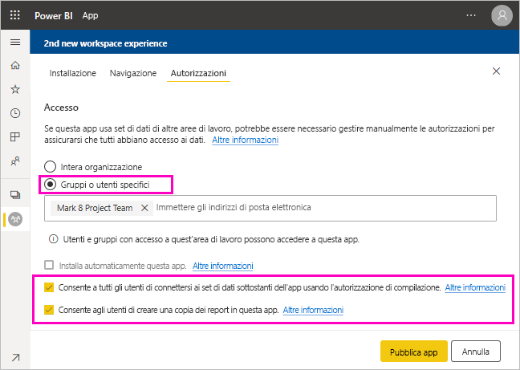

# Condividere un set di dati (anteprima)

Gli utenti che creano *modelli di dati* in Power BI Desktop creano *set di dati* che possono essere distribuiti nel servizio Power BI. Altri autori di report possono quindi usare questi set di dati come base per i propri report. In questo articolo si apprenderà come condividere i propri set di dati. Per informazioni su come concedere e rimuovere l'accesso ai set di dati condivisi, vedere le informazioni sull'[autorizzazione per creazione report](service-datasets-build-permissions.md).

## Passaggi per la condivisione del set di dati

1. Iniziare creando un file con estensione pbix con un modello di dati in Power BI Desktop. Se si prevede di offrire questo set di dati a utenti che dovranno compilare report, si può persino non progettare un report nel file con estensione pbix.

    È consigliabile salvare un file con estensione pbix in un gruppo di Office 365.

1. Pubblicare il file con estensione pbix in un'[area di lavoro della nuova esperienza](service-create-the-new-workspaces.md) nel servizio Power BI.
    
    Altri membri di quest'area di lavoro possono già creare report in altre aree di lavoro basati su questo set di dati.

1. È anche possibile [pubblicare un'app](service-create-distribute-apps.md) da quest'area di lavoro. Se si crea un'app, selezionare nella pagina **Autorizzazioni** gli utenti autorizzati e le operazioni a loro consentite.

    > [!NOTE]
    > Se si seleziona **Intera organizzazione**, a nessun utente dell'organizzazione verrà concessa l'autorizzazione per creazione report. Si tratta di un problema noto. Specificare quindi gli indirizzi di posta elettronica in **Gruppi o utenti specifici**.  Se si vuole concedere l'autorizzazione per creazione report all'intera organizzazione, specificare un alias di posta elettronica per l'intera organizzazione.

    

1. Selezionare **Pubblica app** o **Aggiorna app** se è già pubblicata.

## Tenere traccia dell'utilizzo di set di dati

Quando un set di dati viene condiviso nell'area di lavoro, può essere necessario sapere quali report in altre aree si basano su questo set.

1. Nella visualizzazione elenco Set di dati selezionare **Visualizza elementi correlati**.

    

1. Nella finestra di dialogo **Contenuto correlato** vengono visualizzati tutti gli elementi correlati. In questo elenco vengono visualizzati gli elementi correlati in questa area di lavoro e in **Altre aree di lavoro**.
 
    

## Passaggi successivi

- [Usare set di dati in aree di lavoro diverse (anteprima)](service-datasets-across-workspaces.md)
- Domande? [Provare a rivolgersi alla community di Power BI](https://community.powerbi.com/)
