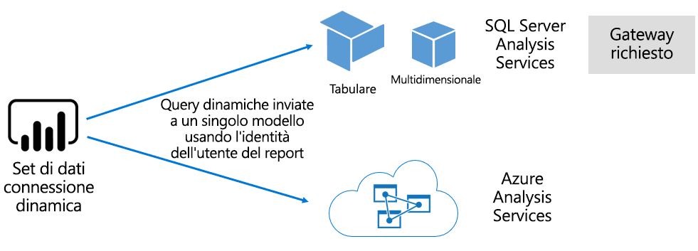

# Set di dati nel servizio Power BI

Questo articolo include una spiegazione tecnica dei set di dati di Power BI.

## Tipi di set di dati

I set di dati del servizio Power BI rappresentano un'origine di dati pronti per la creazione di report e la visualizzazione. Esistono cinque tipi di set di dati diversi, creati con le modalità seguenti:

- Connessione a un modello di dati esistente non ospitato in una capacità di Power BI
- Caricamento di un file di Power BI Desktop contenente un modello
- Caricamento di una cartella di lavoro di Excel (contenente una o più tabelle di Excel e/o un modello di dati della cartella di lavoro) o caricamento di un file con estensione csv (valori delimitati da virgole)
- Uso del servizio Power BI per creare un [set di dati push](developer/walkthrough-push-data.md)
- Uso del servizio Power BI per creare un [set di dati di streaming o di streaming ibrido](service-real-time-streaming.md)

Salvo nel caso dei set di dati di streaming, il set di dati rappresenta un modello di dati che sfrutta le tecnologie di modellazione consolidate di [Analysis Services](/analysis-services/analysis-services-overview).

> [!NOTE]
> Nella presente documentazione i termini _set di dati_ e _modelli_ vengono spesso usati in modo intercambiabile. In genere, dal punto di vista del servizio Power BI si parla di **set di dati**, mentre dal punto di vista dello sviluppo si parla di **modelli**. Nel contesto della presente documentazione il significato è lo stesso.

### Modelli con hosting esterno

Esistono due tipi di modelli con hosting esterno: SQL Server Analysis Services e [Azure Analysis Services](/azure/analysis-services/analysis-services-overview).

La connessione a un modello SQL Server Analysis Services comporta l'installazione del [gateway dati locale](service-gateway-onprem.md), localmente oppure come infrastruttura distribuita come servizio (IaaS) locale ospitata in una macchina virtuale (VM). Azure Analysis Services non richiede un gateway.

Spesso la connessione ad Analysis Services risulta utile quando sono presenti investimenti in modelli esistenti, che in genere appartengono a un data warehouse aziendale (EDW, Enterprise Data Warehouse). Power BI supporta una _connessione dinamica_ ad Analysis Services e applica le autorizzazioni per i dati tramite l'identità dell'utente dei report di Power BI. Per SQL Server Analysis Services sono supportati sia i modelli multidimensionali (cubi) sia i modelli tabulari. Come illustrato nell'immagine seguente, un set di dati con connessione dinamica passa le query ai modelli con hosting esterno.

### Modelli sviluppati con Power BI Desktop

Power BI Desktop, un'applicazione client destinata allo sviluppo di Power BI, può essere usata per sviluppare un modello. Il modello è di fatto un modello tabulare di Analysis Services. È possibile sviluppare modelli importando dati dai flussi di dati e quindi integrandoli con origini dati esterne. I dettagli della creazione di modelli esulano dall'ambito di questo articolo, ma è importante comprendere che con Power BI Desktop è possibile sviluppare tre tipi o _modalità_ diverse di modelli. Queste modalità determinano se i dati vengono importati nel modello o se restano nell'origine dati. Le tre modalità sono: Importazione, DirectQuery e Composito. Per altre informazioni sulle singole modalità, vedere l'articolo [Modalità del set di dati nel servizio Power BI](service-dataset-modes-understand.md).

I modelli con hosting esterno e i modelli di Power BI Desktop possono applicare la sicurezza a livello di riga (RLS) per limitare i dati recuperati per un determinato utente. Ad esempio gli utenti assegnati al gruppo di sicurezza **Venditori** possono visualizzare solo i dati dei report relativi alle aree di vendita alle quali sono assegnati. I ruoli di Sicurezza a livello di riga sono _dinamici_ o _statici_. I ruoli dinamici applicano filtri in base all'utente del report, mentre i ruoli statici applicano gli stessi filtri a tutti gli utenti assegnati al ruolo. Per altre informazioni, vedere [Sicurezza a livello di riga con Power BI](service-admin-rls.md).

### Modelli cartella di lavoro di Excel

La creazione di set di dati basati su [cartelle di lavoro di Excel](service-excel-workbook-files.md) o [file con estensione csv](service-comma-separated-value-files.md) determina la creazione automatica di un modello. Le tabelle di Excel e i dati dei file con estensione csv vengono importati per creare tabelle del modello, mentre un modello di dati cartella di lavoro di Excel viene convertito per creare un modello di Power BI. In tutti i casi i dati dei file vengono importati in un modello.

## Riepilogo

È possibile fare distinzioni tra i set di dati di Power BI che rappresentano i modelli:

- Possono essere ospitati nel servizio Power BI oppure esternamente tramite Analysis Services.
- Possono archiviare dati importati oppure inoltrare richieste di tipo query pass-through alle origini dati sottostanti o ancora usare una combinazione di queste due modalità.

Di seguito è riportato un riepilogo di fatti importanti relativi ai set di dati di Power BI che rappresentano i modelli:

- I modelli ospitati di SQL Server Analysis Services richiedono un gateway per l'esecuzione di query di connessione dinamica.
- I modelli ospitati da Power BI che importano i dati:
  - Devono essere caricati completamente in memoria per poter essere sottoposti a query.
  - Richiedono aggiornamenti per mantenere aggiornati i dati e devono coinvolgere i gateway quando i dati di origine non sono accessibili direttamente su Internet.
- I modelli ospitati da Power BI che usano la modalità di archiviazione [DirectQuery](desktop-directquery-about.md) richiedono la connettività ai dati di origine. Quando viene eseguita una query sul modello, Power BI invia query ai dati di origine per recuperare i dati correnti. Questa modalità deve coinvolgere i gateway quando i dati di origine non sono accessibili direttamente su Internet.
- I modelli possono applicare regole di Sicurezza a livello di riga, applicando filtri in modo da limitare l'accesso ai dati per determinati utenti.

## Considerazioni

Per distribuire e gestire correttamente Power BI è importante comprendere dove sono ospitati i modelli, la modalità di archiviazione, le dipendenze dai gateway, le dimensioni dei dati importati e il tipo e la frequenza degli aggiornamenti. Tutte queste configurazioni possono avere un impatto significativo sulle risorse di capacità di Power BI. Va tenuta in considerazione anche la progettazione del modello, incluse le query di preparazione dei dati, le relazioni e i calcoli.

È poi importante ricordare che i modelli Importazione ospitati da Power BI possono essere aggiornati in base a una pianificazione o essere attivati su richiesta da un utente nel servizio Power BI.

## Passaggi successivi

- [Modalità del set di dati nel servizio Power BI](service-dataset-modes-understand.md)
- Altre domande? [Provare a rivolgersi alla community di Power BI](https://community.powerbi.com/)
