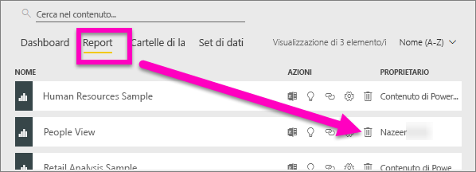
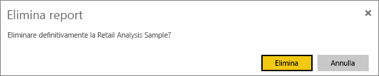
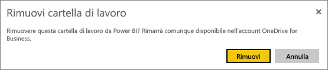
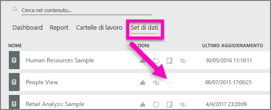
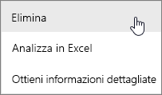
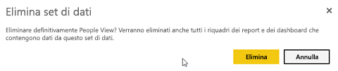
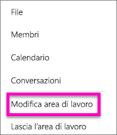
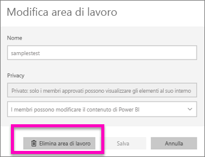
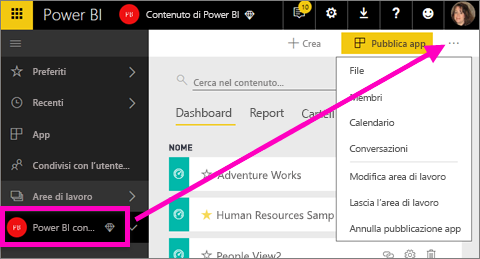
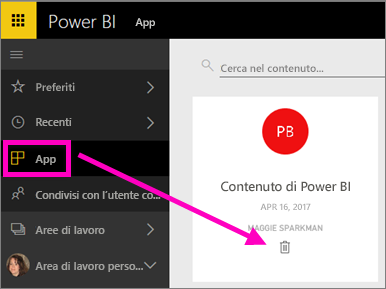

# Eliminare qualsiasi elemento nel servizio Power BI
Questo articolo illustra come eliminare un dashboard, un report, una cartella di lavoro, un set di dati, un'app, una visualizzazione e un'area di lavoro nel servizio Power BI.

## Eliminare un dashboard
I dashboard possono essere rimossi. La rimozione del dashboard non comporta l'eliminazione del set di dati sottostante o dei report associati al dashboard.

* Solo il proprietario del dashboard può rimuoverlo. Se un dashboard condiviso con i colleghi viene rimosso dalla propria area di lavoro di Power BI, verrà rimosso anche dalle aree di lavoro di Power BI degli altri utenti.
* Se si condivide un dashboard che non si vuole più visualizzare, è possibile rimuoverlo.  La rimozione del dashboard non lo rimuove dall'area di lavoro di Power BI degli altri utenti.
* Se un dashboard fa parte di un [pacchetto di contenuto aziendale](service-organizational-content-pack-disconnect.md), l'unico modo per rimuoverlo è rimuovere il set di dati associato.

### Per eliminare un dashboard
1. Nell'area di lavoro selezionare la scheda **Dashboard**.
2. Trovare il dashboard da eliminare e selezionare l'icona Elimina .

    

## Eliminare un report
L'eliminazione di un report non elimina anche il set di dati su cui è basato.  Anche le visualizzazioni aggiunte dal report non vengono toccate, ma restano nel dashboard finché non vengono eliminate singolarmente.

### Per eliminare un report
1. Nell'area di lavoro selezionare la scheda **Report**.
2. Trovare il report da eliminare e selezionare l'icona Elimina   .   

    
3. Confermare l'eliminazione.

   

   > [!NOTE]
   > Se il report fa parte di un [pacchetto di contenuto](service-organizational-content-pack-introduction.md), non sarà possibile eliminarlo con questo metodo.  Vedere [Rimuovere la connessione a un pacchetto di contenuto aziendale](service-organizational-content-pack-disconnect.md).
   >
   >

## Eliminare una cartella di lavoro
Le cartelle di lavoro possono essere rimosse. Tuttavia, la rimozione di una cartella di lavoro rimuove anche tutti i riquadri dei report e dei dashboard che contengono dati dalla cartella di lavoro.

Se la cartella di lavoro viene archiviata in OneDrive for Business, l'eliminazione da Power BI non comporta l'eliminazione da OneDrive.

### Per eliminare una cartella di lavoro
1. Nell'area di lavoro selezionare la scheda **Cartelle di lavoro**.
2. Trovare la cartella di lavoro da eliminare e selezionare l'icona Elimina  .

    
3. Confermare l'eliminazione.

   

## Eliminare un set di dati
I set di dati possono essere eliminati. Tuttavia, l'eliminazione di un set di dati elimina anche tutti i riquadri dei report e dei dashboard che contengono dati dal set di dati.

Se un set di dati fa parte di uno o più [pacchetti di contenuto aziendali](service-organizational-content-pack-disconnect.md), l'unico modo per eliminarlo è di rimuoverlo dai pacchetti di contenuto in cui è usato, attendere che venga elaborato e quindi provare nuovamente a eliminarlo.

### Per eliminare un set di dati
1. Nell'area di lavoro selezionare la scheda **Set di dati**.
2. Trovare il set di dati da eliminare e scegliere i puntini di sospensione (...).  

    
3. Nel menu a discesa, selezionare **Elimina**.

   
4. Confermare l'eliminazione.

   

## Eliminare un'area di lavoro per le app
> [!WARNING]
> Quando si crea un'area di lavoro per le app, si crea un gruppo di Office 365. E quando si elimina un'area di lavoro per le app, si elimina tale gruppo di Office 365. Ciò significa che il gruppo verrà eliminato anche da altri prodotti di Office 365, quali SharePoint e Microsoft Teams.
>
>

L'autore dell'area di lavoro per le app ha la possibilità di eliminarla. In questo caso, l'app associata verrà anche eliminata per tutti i membri del gruppo e rimossa da AppSource se era stata pubblicata nell'intera organizzazione. Eliminare un'area di lavoro per le app non è la stessa cosa che uscirne.

### Per eliminare un'area di lavoro per le app se si è amministratori
1. Nel riquadro di spostamento a sinistra, selezionare **Aree di lavoro**

    
2. Selezionare i puntini di sospensione (...) a destra dell'area di lavoro da eliminare e scegliere **Modifica area di lavoro**.

   
3. Nella finestra **Modifica area di lavoro**, selezionare **Elimina area di lavoro** > **Elimina**.

    

### Per rimuovere un'area di lavoro per le app dall'elenco
Se non si vuole più far parte di un'area di lavoro per le app, è possibile ***uscirne*** per rimuoverla dall'elenco. L'uscita da un'area di lavoro non ne comporta l'eliminazione per gli altri membri.  

> [!IMPORTANT]
> Se si è l'unico amministratore dell'area di lavoro per le app, non sarà possibile uscirne.
>
>

1. Iniziare nell'area di lavoro per le app che si vuole rimuovere.
2. Nell'angolo in alto a destra selezionare i puntini di sospensione (...) e scegliere **Lascia l'area di lavoro** > **Esci**.

      

   > [!NOTE]
   > Le opzioni disponibili nel menu a discesa variano a seconda che si sia un amministratore o un membro dell'area di lavoro per le app.
   >
   >

## Eliminare o rimuovere un'app
Le app possono essere facilmente rimosse dalla pagina di elenco delle app. Tuttavia, solo un amministratore di app può eliminare definitivamente un'applicazione.

### Rimuovere un'app dalla pagina di elenco delle app
L'eliminazione di un'applicazione dalla pagina di elenco delle app non elimina l'app per gli altri membri.

1. Nel riquadro di spostamento a sinistra, selezionare **App** per aprire la pagina di elenco delle app.
2. Passare il puntatore sopra l'app da eliminare e selezionare l'icona Elimina .

   

   Se si rimuove un'app accidentalmente, sono disponibili diverse opzioni per recuperarla.  È possibile chiedere all'autore dell'app di inviarla nuovamente, trovare il messaggio originale con il collegamento all'app, controllare il [Centro notifiche](service-notification-center.md) per verificare se la notifica relativa a tale app è ancora elencata oppure controllare l'[AppSource](consumer/end-user-apps.md) dell'organizzazione.

## Considerazioni e risoluzione dei problemi
Questo articolo ha descritto come eliminare i principali blocchi predefiniti del servizio Power BI, ma ci sono altri elementi che è possibile eliminare in Power BI.  

* [Rimuovere il dashboard in primo piano](service-dashboard-featured.md)
* [Rimuovere un dashboard dai Preferiti](service-dashboard-favorite.md)
* [Eliminare una pagina del report](service-delete.md)
* [Eliminare un riquadro del dashboard](service-dashboard-edit-tile.md)
* [Eliminare una visualizzazione del report](service-delete.md)

Altre domande? [Provare la community di Power BI](http://community.powerbi.com/)
