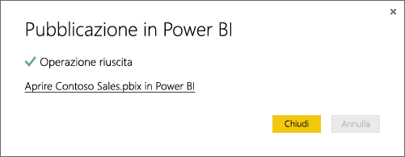

# Ottenere dati da file di Power BI Desktop

**Power BI Desktop** facilita la business intelligence e il reporting. Che l'obiettivo sia connettersi a più origini dati diverse, eseguire query e trasformare i dati, modellare i dati e creare report potenti e dinamici è più facile che mai, **Power BI Desktop** rende le attività di business intelligence intuitive e veloci. Se non si ha familiarità con **Power BI Desktop**, vedere l'articolo [Introduzione a Power BI Desktop](desktop-getting-started.md).

Dopo avere raccolto alcuni dati in **Power BI Desktop** e avere creato alcuni report, è possibile salvare il file nel **servizio Power BI**.

## La posizione di salvataggio del file fa la differenza
**Locale**: se si salva il file in un'unità locale del computer o in un'altra posizione all'interno dell'organizzazione, è possibile *importare* il file oppure *pubblicarlo* da Power BI Desktop per ottenere i relativi dati e report in Power BI. Il file in realtà rimane memorizzato nel disco locale, per cui non viene effettivamente spostato in Power BI. Viene invece creato un nuovo set di dati in Power BI, in cui vengono caricati i dati e il modello di dati dal file di Power BI Desktop. Se il file contiene report, verranno visualizzati nel sito Power BI in Report.

**OneDrive for Business**: se si ha OneDrive for Business e si esegue l'accesso con lo stesso account con cui si accede a Power BI, questo è decisamente il modo più efficace per sincronizzare il lavoro in Power BI Desktop con i set di dati, i report e i dashboard in Power BI. Dato che sia Power BI che OneDrive sono nel cloud, Power BI *si connette* al file in OneDrive all'incirca ogni ora. Se vengono rilevate modifiche, il set di dati, i report e i dashboard vengono aggiornati automaticamente in Power BI.

**OneDrive - Personale**: se si salvano i file nel proprio account OneDrive personale, si ottengono molti dei vantaggi offerti da OneDrive for Business. La differenza principale consiste nel fatto che quando ci si connette al file per la prima volta (scegliendo Recupera dati > File > OneDrive - Personale) è necessario accedere a OneDrive con il proprio account Microsoft, che in genere è diverso da quello usato per accedere a Power BI. Quando si accede a OneDrive con l'account Microsoft, assicurarsi di selezionare l'opzione Mantieni l'accesso. In questo modo, Power BI potrà connettersi al file circa ogni ora e verificare che il set di dati in Power BI sia sincronizzato.

**SharePoint - Siti del team**: il salvataggio dei file di Power BI Desktop in SharePoint - Siti del team corrisponde a grandi linee al salvataggio in OneDrive for Business. La differenza principale è rappresentata dalla modalità di connessione al file da Power BI. Si può specificare un URL o connettersi alla cartella radice.

## Importare o connettersi a un file di Power BI Desktop da Power BI
>[!IMPORTANT]
>Le dimensioni dei file importati in Power BI non possono superare 1 gigabyte.

1. Nello strumento di navigazione di Power BI fare clic su ** Recupera dati**.
   
   
2. In **File** fare clic su **Recupera**.
   
   
3. Trovare il file. I file di Power BI Desktop hanno estensione pbix.
   
   

## Pubblicare un file da Power BI Desktop nel sito di Power BI
La pubblicazione da Power BI Desktop equivale all'uso di Recupera dati in Power BI per importare il file da un'unità locale o connettersi a esso in OneDrive.  Di seguito è descritta una procedura rapida. Per altre informazioni, vedere [Pubblicare da Power BI Desktop](desktop-upload-desktop-files.md).

1. In Power BI Desktop fare clic su **File** > **Pubblica** > **Pubblica in Power BI** oppure fare clic su **Pubblica** sulla barra multifunzione.
   
   
2. Accedere a Power BI. Questo passaggio è necessario solo la prima volta.
   
   Al termine viene visualizzato un collegamento per aprire il report nel sito di Power BI.
   
   

## Passaggi successivi
**Esplorare i dati**: una volta importati i dati e i report dal file in Power BI, è possibile iniziare a esplorarli. Se il file conteneva già report, questi verranno visualizzati nello strumento di navigazione in **Report**. Se il file conteneva solo dati, è possibile creare nuovi report. Fare clic con il pulsante destro del mouse sul nuovo set di dati e scegliere **Esplora**.

**Aggiornare origini dati esterne**: se il file di Power BI Desktop si connette a origini dati esterne, è possibile configurare l'aggiornamento pianificato per assicurarsi che il set di dati sia sempre aggiornato. Nella maggior parte dei casi, la configurazione dell'aggiornamento pianificato è piuttosto semplice, ma la procedura dettagliata da eseguire esula dall'ambito di questo articolo. Per altre informazioni, vedere [Aggiornamento dei dati in Power BI](refresh-data.md).

