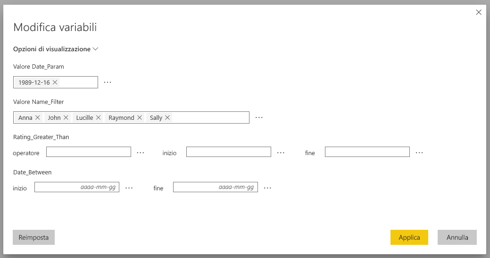
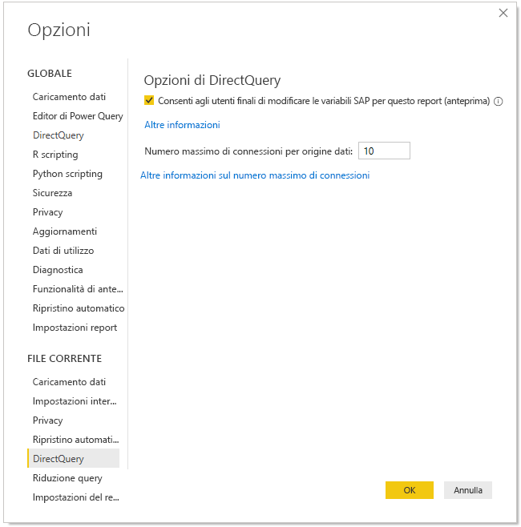
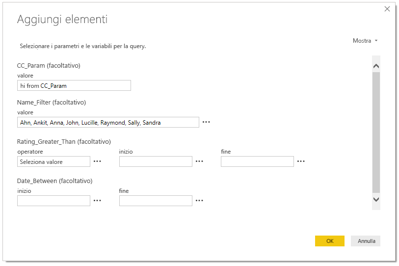
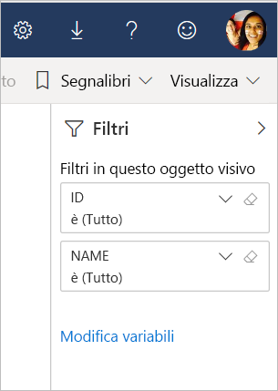

# Modificare le variabili SAP nel servizio Power BI

Quando si usa SAP Business Warehouse o SAP HANA con DirectQuery, gli autori di report ora possono consentire agli utenti finali di modificare le variabili SAP nel **servizio Power BI** per le aree di lavoro Premium e condivise. Si noti che questa funzionalità NON funziona per i report nella scheda Condivisi con l'utente corrente dell'area di lavoro personale. 

Questo documento descrive i requisiti per modificare le variabili in Power BI, come abilitare questa funzionalità e dove modificare le variabili nel servizio Power BI.

## Requisiti per la modifica di variabili SAP

Esistono alcuni requisiti usare la funzionalità di modifica delle variabili SAP. L'elenco seguente descrive questi requisiti.

**Nuova esperienza di filtro obbligatoria**: la [nuova esperienza di filtro](power-bi-report-filter.md) deve essere abilitata per il report. Ecco come è possibile abilitarla per il report in Power BI Desktop:
- In Power BI Desktop selezionare **File** > **Opzioni e impostazioni** > **Opzioni**
- Nel riquadro di spostamento selezionare **Impostazioni report** in **File corrente**.
- In **Esperienza di filtro** selezionare **Abilita il riquadro del filtro aggiornato**.

**Connessioni DirectQuery obbligatorie**: è necessario connettersi all'origine dati SAP usando DirectQuery. Le connessioni di importazione non sono supportate.

**Configurazione SSO obbligatoria**: per questa funzionalità, l'accesso Single Sign-On (SSO) deve essere configurato. Per altre informazioni, vedere [Panoramica dell'accesso Single Sign-On (SSO)](service-gateway-sso-overview.md).

**Componenti del nuovo gateway obbligatori**: scaricare il gateway più recente e aggiornare il gateway esistente. Per altre informazioni, vedere [Gateway del servizio](service-gateway-onprem.md).

**Solo modelli multidimensionali per SAP HANA**: per SAP HANA, la funzionalità di modifica delle variabili SAP funziona solo con i modelli multidimensionali e non nelle origini relazionali.

**Non supportata nei cloud sovrani**: Power Query online non è attualmente disponibile nei cloud sovrani, quindi neppure questa funzionalità è supportata nei cloud sovrani.

## Come abilitare la funzionalità

Per abilitare la funzionalità di **modifica delle variabili SAP**, in Power BI Desktop connettersi a un'origine dati SAP HANA o SAP BW. Passare quindi a **File > Opzioni e impostazioni > Opzioni** e nella sezione File corrente del riquadro sinistro selezionare **DirectQuery**. Quando si seleziona questa opzione, nel riquadro destro vengono visualizzate le opzioni di DirectQuery e la casella di controllo **Consenti agli utenti finali di modificare le variabili SAP per questo report**, come illustrato nell'immagine seguente.

## Usare la modifica di variabili SAP in Power BI Desktop

Quando si usa la modifica di variabili SAP in Power BI Desktop, è possibile modificare le variabili selezionando il collegamento Modifica variabili dal menu **Modifica query** sulla barra multifunzione. Verrà visualizzata la finestra di dialogo seguente. Questa funzionalità è stata disponibile in Power BI Desktop per un certo periodo. Gli autori di report possono selezionare le variabili per il report usando la finestra di dialogo seguente.

## Usare la modifica di variabili SAP nel servizio

Dopo la pubblicazione del report nel servizio Power BI, gli utenti possono visualizzare il collegamento **Modifica variabili** nel nuovo riquadro Filtro. Se si pubblica il report per la prima volta, potrebbero trascorrere fino a 5 minuti prima che il collegamento Modifica variabili venga visualizzato. Se il collegamento non viene visualizzato, sarà necessario aggiornare manualmente il set di dati.
A tale scopo, è possibile:

1. Nel servizio Power BI selezionare la scheda **Set di dati** nell'elenco del contenuto per un'area di lavoro.

2. Trovare il set di dati da aggiornare e selezionare l'icona **Aggiorna**.

    

3. Selezionando il collegamento Modifica variabili, si viene reindirizzati alla finestra di dialogo **Modifica variabili**, in cui gli utenti possono eseguire l'override delle variabili. Selezionando il pulsante **Reimposta**, vengono ripristinati i valori originali delle variabili visualizzati quando questa finestra di dialogo è stata aperta.

    

4. Le modifiche apportate nella finestra di dialogo **Modifica variabili** vengono salvate in modo permanente solo per questo utente (analogamente ad altri comportamenti di salvataggio permanente in Power BI). Selezionando **Ripristina impostazioni predefinite**, come illustrato nell'immagine seguente, viene ripristinato lo stato originale dell'autore del report, incluse le variabili.

    

Quando lavora a un report pubblicato nel servizio Power BI che usa SAP HANA o SAP BW con la funzionalità **Modifica variabili** abilitata, il proprietario del report può modificare tali impostazioni predefinite. Il proprietario del report può modificare le variabili in modalità di modifica e salvare il report in modo che tali impostazioni diventino le *nuove impostazioni predefinite* per il report. Tutti gli altri utenti che accedono al report dopo che il proprietario del report ha apportato tali modifiche vedranno che queste nuove impostazioni sono quelle predefinite.

## Passaggi successivi

Per altre informazioni su SAP HANA, SAP BW o DirectQuery, vedere gli articoli seguenti:

- [Usare SAP HANA in Power BI Desktop](desktop-sap-hana.md)
- [DirectQuery e SAP Business Warehouse (BW)](desktop-directquery-sap-bw.md)
- [DirectQuery and SAP HANA](desktop-directquery-sap-hana.md) (DirectQuery e SAP HANA)
- [Uso di DirectQuery in Power BI](desktop-directquery-about.md)
