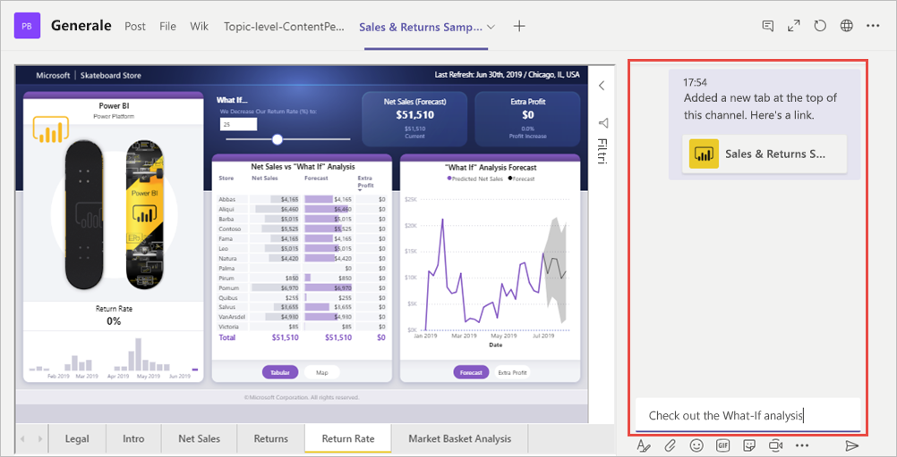

# Incorporare report in Microsoft Teams con la scheda Power BI

Con la scheda Power BI per Microsoft Teams aggiornata, è possibile incorporare facilmente report interattivi in canali e chat di Microsoft Teams. Usare la scheda Power BI per Microsoft Teams per aiutare i colleghi a trovare i dati usati dal team e discutere sui dati nei canali del team.  Quando si incolla un collegamento a report, dashboard e app nella finestra di messaggio di Microsoft Teams, nell'anteprima del collegamento vengono visualizzate le relative informazioni. In questo modo gli utenti possono capire più facilmente a quale elemento conduce il collegamento.

## Requisiti

Per il funzionamento della **scheda Power BI per Microsoft Teams**, verificare che:

- Gli utenti abbiano una licenza di Power BI Pro o il report sia contenuto in una risorsa con [capacità Power BI Premium (SKU EM o P)](service-premium-what-is.md) con una licenza di Power BI.
- Microsoft Teams abbia la scheda Power BI.
- Gli utenti abbiano eseguito l'accesso al servizio Power BI per attivare la licenza di Power BI e poter utilizzare il report.
- Gli utenti abbiano l'autorizzazione per visualizzare il report.

Inoltre, per il funzionamento delle **anteprime dei collegamenti**, verificare che:
- Gli utenti soddisfino i requisiti per usare la scheda Power BI per Microsoft Teams.
- Gli utenti abbiano eseguito l'accesso al servizio Power BI Bot. 

## Incorporare il report

Per incorporare il report in un canale o una chat di Microsoft Teams, seguire questa procedura.

1. Aprire un canale o una chat in Microsoft Teams e selezionare l'icona **+** .

    

2. Selezionare la scheda Power BI.

    

3. Usare le opzioni disponibili per selezionare un report da un'area di lavoro, da Condivisi con l'utente corrente o da un'app Power BI.

    

4. Il nome della scheda viene aggiornato automaticamente in base al nome del report, ma è possibile modificarlo. 

5. Premere **Salva**.

## Report supportati per l'incorporamento della scheda Power BI
Nella scheda Power BI possono essere incorporati i tipi di report seguenti:

- Report interattivi e impaginati.
- Report in Area di lavoro personale, nella nuova esperienza delle aree di lavoro e in aree di lavoro classiche.
- Report nelle app Power BI.

## Visualizzare un'anteprima dei collegamenti

Seguire questa procedura per visualizzare un'anteprima dei collegamenti per il contenuto nel servizio Power BI.

1. Copiare un collegamento a un report, un dashboard o un'app nel servizio Power BI. Ad esempio, copiare il collegamento dalla barra degli indirizzi del browser.

2. Incollare il collegamento nella finestra di messaggio di Microsoft Teams. Se richiesto, accedere al servizio di anteprima dei collegamenti. Il caricamento dell'anteprima del collegamento potrebbe impiegare alcuni secondi.

    

3. Dopo l'accesso, viene visualizzata l'anteprima del collegamento di base.

    

4. Selezionare l'icona di espansione per visualizzare la scheda di anteprima avanzata.

    

5. La scheda di anteprima dei collegamenti avanzata mostra il collegamento e i pulsanti di azione pertinenti

    

6. Inviare il messaggio.

## Concedere l'accesso ai report

L'incorporamento di un report in Microsoft Teams o l'invio di un collegamento a un elemento non autorizza automaticamente gli utenti a visualizzare il report: è necessario [consentire agli utenti di visualizzare il report in Power BI](service-share-dashboards.md). Per semplificare, è possibile usare un gruppo di Office 365 per il proprio team. 

> [!IMPORTANT]
> Assicurarsi di controllare chi può visualizzare il report all'interno del servizio Power BI e concedere l'accesso a chi non è elencato.

Un modo per assicurarsi che tutti gli utenti del team possano accedere ai report è quello di inserire i report stessi in un'unica area di lavoro in Power BI e concedere al gruppo di Office 365 del team l'accesso all'area di lavoro.

## Anteprime dei collegamenti 

Sono disponibili anteprime dei collegamenti per gli elementi seguenti in Power BI:
- Report
- Dashboard
- App

Il servizio di anteprima dei collegamenti richiede agli utenti di effettuare l'accesso. Per disconnettersi, selezionare l'icona di Power BI nella parte inferiore della finestra di messaggio, quindi selezionare Disconnetti.

## Avviare una conversazione

Quando si aggiunge una scheda per un report di Power BI a Teams, Teams crea automaticamente una conversazione nella scheda per il report. 

- Selezionare **Mostra scheda conversazione** nell'angolo in alto a destra.

    

    Il primo commento è un collegamento al report. Tutti gli utenti in tale canale di Teams possono visualizzare il report e discuterne nella conversazione.

    

## Problemi noti e limitazioni

- Power BI non supporta le stesse lingue localizzate supportate da Microsoft Teams. Di conseguenza, la localizzazione all'interno del report incorporato potrebbe non essere corretta.
- Non è possibile incorporare i dashboard di Power BI nella scheda Power BI per Microsoft Teams.
- Gli utenti che non hanno una licenza di Power BI o un'autorizzazione di accesso al report visualizzano un messaggio che indica che il contenuto non è disponibile.
- Se si usa Internet Explorer 10, si potrebbero riscontrare problemi. <!--You can look at the [browsers support for Power BI](consumer/end-user-browsers.md) and for [Office 365](https://products.office.com/office-system-requirements#Browsers-section). -->
- I [filtri di URL](service-url-filters.md) non sono supportati con la scheda Power BI per Microsoft Teams.
- La nuova scheda Power BI non è disponibile nei cloud nazionali. Potrebbe essere disponibile una versione precedente che non supporta i report o le aree di lavoro della nuova esperienza nelle app Power BI. 
- Dopo aver salvato la scheda, non è possibile cambiarne il nome nelle impostazioni della scheda. Usare l'opzione Rinomina per modificarlo.
- Il Single Sign-On non è supportato per il servizio di anteprima dei collegamenti.
- Le anteprime dei collegamenti non funzionano in chat delle riunioni o canali privati.

## Passaggi successivi
- [Condividere un dashboard con i colleghi e altri utenti](service-share-dashboards.md)  
- [Creare e distribuire un'app in Power BI](service-create-distribute-apps.md)  
- [Che cos'è Power BI Premium?](service-premium-what-is.md)

Altre domande? [Provare a rivolgersi alla community di Power BI](https://community.powerbi.com/)
