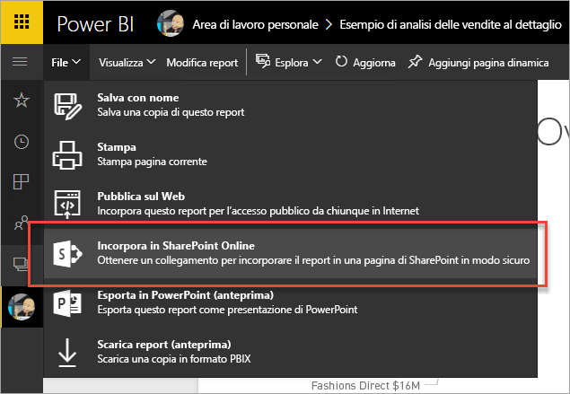
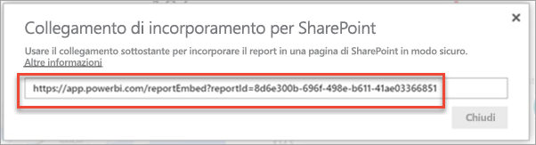
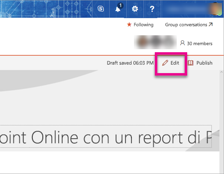
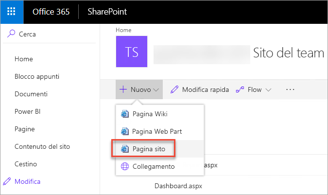
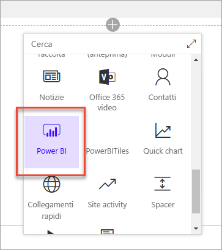
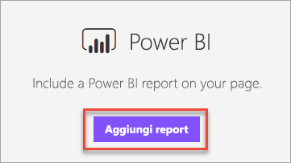
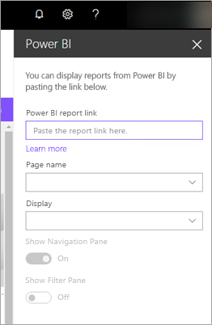
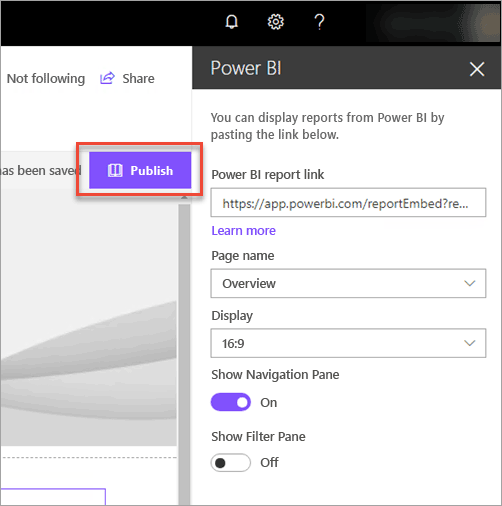
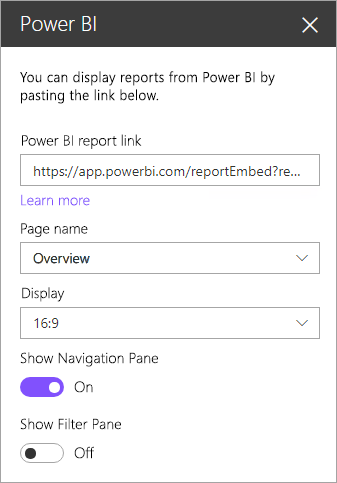
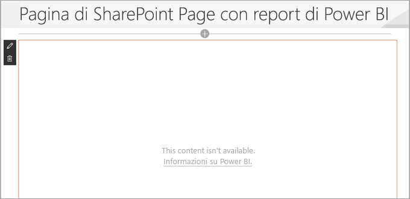

# Incorporare con web part report in SharePoint Online

Con la nuova web part report di Power BI per SharePoint Online è possibile incorporare facilmente report interattivi di Power BI nelle pagine di SharePoint Online.

Quando si usa la nuova opzione **Incorpora in SharePoint Online**, i report incorporati sono completamente protetti in modo che sia possibile creare facilmente portali interni protetti.

## Requisiti

Per il corretto funzionamento dell'opzione **Incorpora in SharePoint Online** relativa ai report esistono alcuni requisiti.

* La web part Power BI per SharePoint Online richiede le [pagine moderne](https://support.office.com/article/Allow-or-prevent-creation-of-modern-site-pages-by-end-users-c41d9cc8-c5c0-46b4-8b87-ea66abc6e63b).

## Incorporare il report

Per incorporare il report in SharePoint Online, è prima di tutto necessario ottenere l'URL per il report e quindi usarlo con la nuova web part Power BI all'interno di SharePoint Online.

### Ottenere un URL al report

1. Visualizzare il report all'interno del servizio Power BI.

2. Selezionare la voce di menu **File**.

3. Selezionare **Incorpora in SharePoint Online**.
   
    

4. Copiare l'URL dalla finestra di dialogo.

    

   > [!NOTE]
   > È anche possibile usare l'URL che viene visualizzato nella barra degli indirizzi del web browser quando si visualizza un report. L'URL conterrà la pagina del report che si sta visualizzando. Sarà necessario rimuovere la sezione del report dall'URL se si vuole usare una pagina diversa.

### Aggiungere il report di Power BI a una pagina di SharePoint Online

1. Aprire la pagina desiderata in SharePoint Online e selezionare **Modifica**.

    

    In alternativa, creare una nuova pagina moderna selezionando **+ Nuovo** all'interno di SharePoint Online.

    

2. Selezionare **+** e selezionare la web part **Power BI**.

    

3. Selezionare **Aggiungi report**.

    

4. Incollare l'URL del report nel riquadro proprietà. Questo è l'URL copiato dai passaggi precedenti. Il report verrà caricato automaticamente.

    

5. Selezionare **Pubblica** per rendere visibile la modifica agli utenti di SharePoint Online.

    

## Concessione dell'accesso ai report

Incorporare un report in SharePoint Online non autorizza automaticamente gli utenti a visualizzare il report. Le autorizzazioni per visualizzare il report vengono impostate all'interno del servizio Power BI.

> [!IMPORTANT]
> Assicurarsi di controllare chi può visualizzare il report all'interno del servizio Power BI e concedere l'accesso a chi non è elencato.

Esistono due modi per fornire l'accesso al report all'interno del servizio Power BI. Se si usa un gruppo di Office 365 per creare il sito del team di SharePoint Online, l'utente viene elencato come un membro dell'area di lavoro per le app all'interno del servizio Power BI. Questo garantirà che gli utenti possano visualizzare il contenuto di tale gruppo. Per altre informazioni, vedere [Creare e distribuire un'app in Power BI](service-create-distribute-apps.md).

In alternativa, è possibile concedere agli utenti l'accesso al report effettuando le operazioni seguenti.

1. Aggiungere un riquadro dal report a un dashboard.

2. Condividere il dashboard con gli utenti che richiedono l'accesso al report. Per altre informazioni, vedere [Condividere un dashboard con i colleghi e altri utenti](service-share-dashboards.md).

## Concessione dell'accesso ai report agli utenti con licenza gratuita

Gli utenti con licenza gratuita possono visualizzare i report incorporati con la web part Power BI per SharePoint Online. Per concedere l'accesso agli utenti con licenza gratuita usare la stessa procedura per gli utenti Pro illustrata sopra in [Concessione dell'accesso ai report](#granting-access-to-reports). All'area di lavoro in cui si trova il report è necessario assegnare una capacità Power BI Premium. 

Ad esempio, se è presente un report in un'area di lavoro per le app, è necessario assegnare l'area di lavoro per le app a una capacità Power BI Premium. Sarà anche necessario aggiungere l'utente con licenza gratuita all'elenco dei membri dell'area di lavoro per le app corrispondente.

## Impostazioni della web part

Di seguito è riportata una descrizione delle impostazioni che possono essere modificate per la web part Power BI per SharePoint Online.

| Proprietà | Descrizione |
| --- | --- |
| Nome pagina |Imposta la pagina predefinita che viene visualizzata per la web part. Selezionare un valore dall'elenco a discesa. Se non viene visualizzata alcuna pagina, il report contiene una sola pagina o l'URL incollato contiene un nome di pagina. Rimuovere la sezione del report dall'URL per selezionare una pagina specifica. |
| Visualizza |Opzione per adattare il report all'interno della pagina di SharePoint Online. |
| Mostra il riquadro di spostamento |Mostra o nasconde il riquadro di spostamento. |
| Mostra riquadro Filtri |Mostra o nasconde il riquadro filtri. |

## Multi-Factor Authentication

Se l'ambiente di Power BI richiede di effettuare l'accesso con Multi-Factor Authentication, potrà essere richiesto di accedere con un dispositivo di sicurezza per verificare la propria identità. Ciò si verifica se non si è eseguito l'accesso a SharePoint Online usando Multi-Factor Authentication, ma l'ambiente di Power BI richiede un account convalidato da un dispositivo di sicurezza.

> [!NOTE]
> Multi-Factor Authentication non è ancora supportato con Azure Active Directory 2.0. Gli utenti riceveranno un messaggio di *errore*. Se l'utente accede nuovamente a SharePoint Online con il dispositivo di sicurezza, potrebbe riuscire a visualizzare il report.

## Report che non vengono caricati

Il report potrebbe non essere caricato all'interno della web part Power BI e visualizzare il messaggio seguente.

*Questo contenuto non è disponibile.*

Esistono due motivi comuni per questo messaggio.

1. Non si è autorizzati ad accedere al report.
2. Il report è stato eliminato.

È necessario contattare il proprietario della pagina SharePoint Online per risolvere il problema.

## Limitazioni e problemi noti

* **Errore: "Si è verificato un errore. Provare a disconnettersi e riconnettersi, quindi visitare di nuovo questa pagina. ID di correlazione: non definito, Stato risposta HTTP: 400, Codice errore server 10001, messaggio: Non è presente alcun token di aggiornamento"**
  
  Se si riceve questo errore, provare una delle soluzioni seguenti.
  
  1. Disconnettersi da SharePoint e accedere nuovamente. Assicurarsi di chiudere tutte le finestre del browser prima di accedere nuovamente.

  2. Se l'account utente richiede la Multi-Factor Authentication, assicurarsi di accedere a SharePoint con il dispositivo di Multi-Factor Authentication (app per telefono, smart card e così via).

* Power BI non supporta le stesse lingue localizzate supportate da SharePoint Online. Di conseguenza, la localizzazione all'interno del report incorporato potrebbe non essere corretta.

* Se si usa Internet Explorer 10, potrebbero verificarsi problemi. Per informazioni, vedere il [supporto dei browser per Power BI](service-browser-support.md) e per [Office 365](https://products.office.com/office-system-requirements#Browsers-section).

## Passaggi successivi

[Consentire o impedire la creazione di pagine del sito moderne dagli utenti finali](https://support.office.com/article/Allow-or-prevent-creation-of-modern-site-pages-by-end-users-c41d9cc8-c5c0-46b4-8b87-ea66abc6e63b)  
[Creare e distribuire un'app in Power BI](service-create-distribute-apps.md)  
[Condividere un dashboard con i colleghi e altri utenti](service-share-dashboards.md)  
[Power BI Premium: di cosa si tratta?](service-premium.md)  

Altre domande? [Provare a rivolgersi alla community di Power BI](http://community.powerbi.com/)

