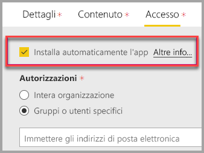

# Incorporare con web part report in SharePoint Online

Con la nuova web part report di Power BI per SharePoint Online è possibile incorporare facilmente report interattivi di Power BI nelle pagine di SharePoint Online.

Quando si usa la nuova opzione **Incorpora in SharePoint Online**, i report incorporati sono completamente protetti in modo che sia possibile creare facilmente portali interni protetti.

## Requisiti

Per il corretto funzionamento dell'opzione **Incorpora in SharePoint Online** relativa ai report esistono alcuni requisiti.

* È necessaria una licenza di Power BI Pro o una [capacità Power BI Premium (SKU EM o P)](service-premium.md#premium-capacity-nodes) con una licenza di Power BI.
* La web part Power BI per SharePoint Online richiede le [pagine moderne](https://support.office.com/article/Allow-or-prevent-creation-of-modern-site-pages-by-end-users-c41d9cc8-c5c0-46b4-8b87-ea66abc6e63b).

## Incorporare il report

Per incorporare il report in SharePoint Online, è prima di tutto necessario ottenere l'URL per il report e quindi usarlo con la nuova web part Power BI all'interno di SharePoint Online.

### Ottenere un URL al report

1. Visualizzare il report all'interno del servizio Power BI.

2. Selezionare la voce di menu **File**.

3. Selezionare **Incorpora in SharePoint Online**.

    

4. Copiare l'URL dalla finestra di dialogo.

    

### Aggiungere il report di Power BI a una pagina di SharePoint Online

1. Aprire la pagina desiderata in SharePoint Online e selezionare **Modifica**.

    

    In alternativa, creare una nuova pagina moderna selezionando **+ Nuovo** all'interno di SharePoint Online.

    

2. Selezionare **+** e selezionare la web part **Power BI**.

    

3. Selezionare **Aggiungi report**.

    

4. Incollare l'URL del report nel riquadro proprietà. Questo è l'URL copiato dai passaggi precedenti. Il report viene caricato automaticamente.

    

5. Selezionare **Pubblica** per rendere visibile la modifica agli utenti di SharePoint Online.

    

## Concedere l'accesso ai report

Incorporare un report in SharePoint Online non autorizza automaticamente gli utenti a visualizzare il report. Le autorizzazioni per visualizzare il report vengono impostate all'interno del servizio Power BI.

> [!IMPORTANT]
> Assicurarsi di controllare chi può visualizzare il report all'interno del servizio Power BI e concedere l'accesso a chi non è elencato.

Esistono due modi per fornire l'accesso al report all'interno del servizio Power BI. Se si usa un gruppo di Office 365 per creare il sito del team di SharePoint Online è possibile aggiungere l'utente come membro dell'**area di lavoro per le app all'interno del servizio Power BI** e della **pagina SharePoint**. Per altre informazioni, vedere come [gestire un'area di lavoro per le app](service-manage-app-workspace-in-power-bi-and-office-365.md).

In alternativa, è possibile condividere un report direttamente con gli utenti, incorporando il report all'interno di un'app. Esistono alcuni passaggi da seguire per incorporare un report all'interno di un'app.  

1. L'autore dell'app è un utente Pro.

2. L'autore crea un report in un'area di lavoro per le app. *Per la condivisione con **utenti della versione gratuita di Power BI**, l'area di lavoro per l'app deve essere impostata come **area di lavoro Premium**.*

3. L'autore pubblica l'app e quindi la installa. *L'autore deve assicurarsi di installare l'app per avere accesso all'URL del report usato per l'incorporamento in SharePoint Online.*

4. A questo punto anche tutti gli utenti finali devono installare l'app. Tuttavia, è possibile impostare l'app per la preinstallazione per gli utenti finali tramite la funzionalità **Installa automaticamente l'app**, che può essere abilitata nel [portale di amministrazione di Power BI](service-admin-portal.md).

   

5. L'autore apre l'app e passa al report.

6. L'autore copia l'URL del report per l'incorporamento dal report installato dall'app. *Non usare l'URL del report originale dall'area di lavoro per l'app.*

7. Creare un nuovo sito del team in SharePoint Online.

8. Aggiungere l'URL del report copiato nel passaggio 6 nella web part Power BI.

9. Aggiungere tutti gli utenti finali e/o i gruppi che utilizzeranno i dati nella pagina di SharePoint Online e nell'app Power BI creata.

    > [!NOTE]
    > **Gli utenti o i gruppi devono avere accesso sia alla pagina di SharePoint Online che al report nell'app Power BI per visualizzare il report nella pagina di SharePoint.**

10. A questo punto l'utente finale può passare al sito del team in SharePoint Online e visualizzare i report nella pagina.

## Multi-Factor Authentication

Se l'ambiente di Power BI richiede di eseguire l'accesso con l'autenticazione a più fattori, potrà essere richiesto di accedere con un dispositivo di sicurezza per verificare la propria identità. Ciò si verifica se non si è eseguito l'accesso a SharePoint Online usando Multi-Factor Authentication, ma l'ambiente di Power BI richiede un account convalidato da un dispositivo di sicurezza.

> [!NOTE]
> Multi-Factor Authentication non è ancora supportato con Azure Active Directory 2.0. Gli utenti ricevono un messaggio di *errore*. Se l'utente accede nuovamente a SharePoint Online con il dispositivo di sicurezza, potrebbe riuscire a visualizzare il report.

## Impostazioni della web part

Di seguito è riportata una descrizione delle impostazioni che possono essere modificate per la web part Power BI per SharePoint Online.

| Property | Descrizione |
| --- | --- |
| Nome pagina |Imposta la pagina predefinita che viene visualizzata per la web part. Selezionare un valore nell'elenco a discesa. Se non viene visualizzata alcuna pagina, il report contiene una sola pagina o l'URL incollato contiene un nome di pagina. Rimuovere la sezione del report dall'URL per selezionare una pagina specifica. |
| Visualizza |Opzione per adattare il report all'interno della pagina di SharePoint Online. |
| Mostra il riquadro di spostamento |Mostra o nasconde il riquadro di spostamento. |
| Mostra riquadro Filtri |Mostra o nasconde il riquadro filtri. |

## Report che non vengono caricati

Il report potrebbe non essere caricato all'interno della web part Power BI e visualizzare il messaggio seguente.

*Questo contenuto non è disponibile.*

Esistono due motivi comuni per questo messaggio.

1. Non si è autorizzati ad accedere al report.
2. Il report è stato eliminato.

Contattare il proprietario della pagina SharePoint Online per risolvere il problema.

## Gestione delle licenze

Gli utenti che visualizzano un report in SharePoint devono avere una **licenza di Power BI Pro** oppure il contenuto deve essere in un'area di lavoro che si trova in una **[capacità Premium di Power BI (SKU EM o P)](service-admin-premium-purchase.md)**.

## Limitazioni e problemi noti

* Errore: "Si è verificato un errore. Provare a disconnettersi e riconnettersi, quindi visitare di nuovo questa pagina. ID di correlazione: non definito, stato risposta http: 400, codice errore server 10001, messaggio: Token di aggiornamento mancante"
  
  Se si riceve questo errore, provare una delle procedure di risoluzione dei problemi seguenti.
  
  1. Disconnettersi da SharePoint e accedere nuovamente. Assicurarsi di chiudere tutte le finestre del browser prima di accedere nuovamente.

  2. Se l'account utente richiede Multi-Factor Authentication, assicurarsi di accedere a SharePoint con il dispositivo Multi-Factor Authentication (app per telefono, smart card e così via).
  
  3. Gli account degli utenti Guest di Azure B2B non sono supportati. Per gli utenti viene visualizzato il logo Power BI che indica che è in corso il caricamento del componente ma non viene visualizzato il report.

* Power BI non supporta le stesse lingue localizzate supportate da SharePoint Online. Di conseguenza, la localizzazione all'interno del report incorporato potrebbe non essere corretta.

* Se si usa Internet Explorer 10, potrebbero verificarsi problemi. Per informazioni, vedere il [supporto dei browser per Power BI](consumer/end-user-browsers.md) e per [Office 365](https://products.office.com/office-system-requirements#Browsers-section).

* La web part Power BI non è disponibile per i [cloud nazionali](https://powerbi.microsoft.com/clouds/).

* SharePoint Server classico non è supportato con questa web part.

* I [filtri URL](service-url-filters.md) non sono supportati con la web part SPO.

## Passaggi successivi

* [Consentire o impedire la creazione di pagine del sito moderne dagli utenti finali](https://support.office.com/article/Allow-or-prevent-creation-of-modern-site-pages-by-end-users-c41d9cc8-c5c0-46b4-8b87-ea66abc6e63b)  
* [Creare e distribuire un'app in Power BI](service-create-distribute-apps.md)  
* [Condividere un dashboard con i colleghi e altri utenti](service-share-dashboards.md)  
* [Che cos'è Power BI Premium?](service-premium.md)
* [Incorporare un report in un portale o un sito Web sicuro](service-embed-secure.md)

Altre domande? [Provare a rivolgersi alla community di Power BI](http://community.powerbi.com/)