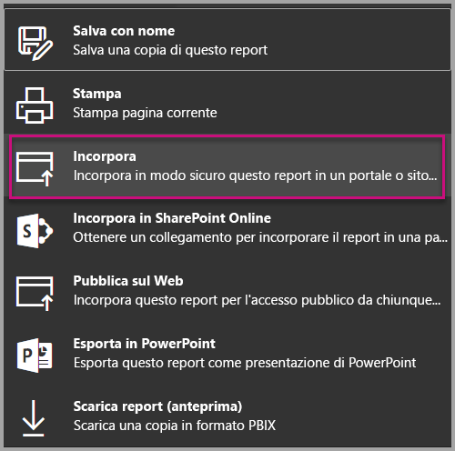
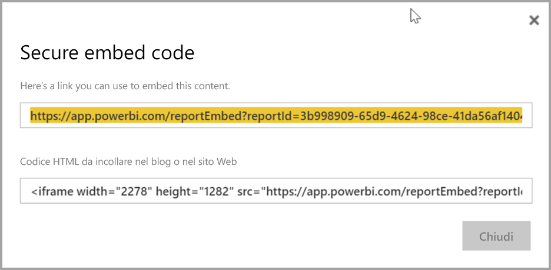
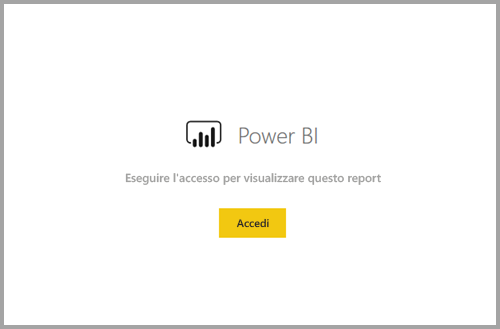
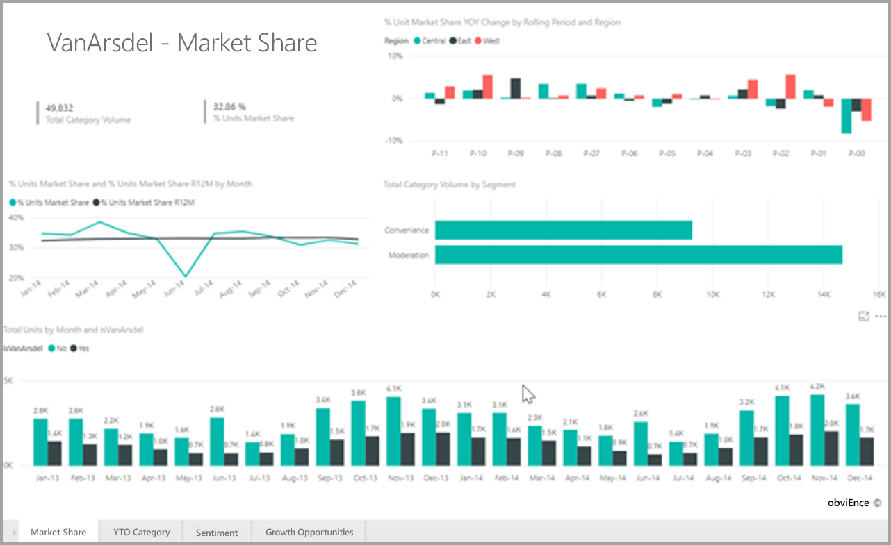

# <a name="embed-a-report-in-a-secure-portal-or-website"></a>Incorporare un report in un portale o un sito Web sicuro

La nuova opzione **Incorpora** sicura per i report in Power BI consente agli utenti di incorporare i report in modo facile e sicuro nei portali Web interni, sia **basati sul cloud** che **ospitati in locale**, come SharePoint 2019. I report incorporati in questo modo rispettano tutte le autorizzazioni per gli elementi e i criteri di sicurezza dei dati tramite Sicurezza a livello di riga. La funzionalità è progettata per consentire l'incorporamento senza codice in qualsiasi portale che accetta un URL o un iFrame da incorporare.

L'opzione **Incorpora** supporta anche i [filtri URL](service-url-filters.md) e impostazioni per gli URL. L'opzione **Incorpora** consente l'integrazione con i portali con un approccio che richiede poco codice e conoscenze di base di HTML e JavaScript.

## <a name="how-to-embed-power-bi-reports-into-portals"></a>Come **incorporare** report di Power BI nei portali

1. La nuova opzione **Incorpora** è disponibile nel menu **File** per i report nel servizio Power BI.

    

2. Selezionare l'opzione Incorpora per aprire una finestra di dialogo che offre un collegamento e un iFrame usato per incorporare il report in modo sicuro.

    

3. Dopo avere incorporato l'URL nel portale Web o se si apre direttamente l'URL, l'utente viene autenticato prima di ottenere l'accesso al report. Di seguito, l'utente non ha eseguito l'accesso a Power BI nella sessione del browser. Quando preme **Accedi**, potrebbe essere necessario aprire una nuova finestra o scheda del browser. Controllare il blocco popup se non viene richiesto di accedere.

    

4. Dopo che l'utente ha eseguito l'accesso, si apre il report, che mostra i dati e consente agli utenti di spostarsi tra le pagine e impostare filtri. Il report viene visualizzato solo per gli utenti con l'autorizzazione per visualizzare il report in Power BI. Vengono applicate anche tutte le regole di Sicurezza a livello di riga. Infine, l'utente deve disporre di una licenza corretta, ovvero avere una licenza di Power BI Pro oppure il report deve essere in un'area di lavoro inclusa in una capacità di Power BI Premium. L'utente deve eseguire l'accesso ogni volta che apre una nuova finestra del browser, ma dopo aver effettuato l'accesso gli altri report vengono caricati automaticamente.

    

5. Quando si usa l'opzione iFrame, è consigliabile modificare il codice HTML fornito per specificare l'altezza e la larghezza desiderate ottimali per la pagina Web del portale.

    

## <a name="granting-access-to-reports"></a>Concessione dell'accesso ai report

L'opzione Incorpora non consente automaticamente agli utenti di visualizzare il report. Le autorizzazioni per visualizzare il report vengono impostate all'interno del servizio Power BI.

Per fornire l'accesso al report nel servizio Power BI, è possibile condividere il report con gli utenti che richiedono l'accesso al report incorporato. Se si usa un gruppo di Office 365, è possibile elencare l'utente come un membro dell'area di lavoro per le app all'interno del servizio Power BI. Per altre informazioni, vedere come [gestire un'area di lavoro per le app](service-manage-app-workspace-in-power-bi-and-office-365.md).

## <a name="licensing"></a>Gestione delle licenze

Gli utenti che visualizzano il report incorporato devono avere una licenza di Power BI Pro oppure il contenuto deve essere in un'area di lavoro inclusa in una [capacità Premium di Power BI (SKU EM o P)](service-admin-premium-purchase.md).

## <a name="customize-your-embed-experience-using-url-settings"></a>Personalizzare l'esperienza di incorporamento usando le impostazioni per l'URL

L'URL di incorporamento supporta diverse impostazioni di input che consentono di personalizzare l'esperienza utente. Se si usa l'iFrame fornito, assicurarsi di aggiornare l'URL nelle impostazioni src dell'iFrame.

| Property  | Descrizione  |  |  |  |
|--------------|-----------------------------------------------------------------------------------------------------------------------------------------------------------------------------------------------------------------------|---|---|---|
| pageName  | È possibile usare il parametro della stringa di query **pageName** per impostare la pagina del report da aprire. Il valore **pageName** corrisponde alla fine dell'URL del report quando si visualizza un report nel servizio Power BI, come illustrato di seguito. |  |  |  |
| Filtri URL  | È possibile usare [filtri URL](service-url-filters.md) nell'URL di incorporamento ricevuto dall'interfaccia utente di Power BI per filtrare il contenuto dell'incorporamento. In questo modo è possibile realizzare integrazioni con poco codice e conoscenze di base di HTML e JavaScript.  |  |  |  |

## <a name="set-which-page-opens-when-the-report-is-embedded"></a>Impostare la pagina che viene aperta quando il report viene incorporato

Il valore specificato nell'impostazione *pageName* corrisponde alla fine dell'URL del report quando si visualizza un report nel servizio Power BI.

1. Aprire il report dal servizio Power BI nel Web browser e quindi copiare l'URL dalla barra degli indirizzi.

    

2. Aggiungere l'impostazione *pageName* all'URL.

    

## <a name="filter-report-content-using-url-filters"></a>Filtrare il contenuto del report con i filtri URL

Per alcune funzionalità avanzate, è possibile usare i [filtri URL](service-url-filters.md) per creare altre esperienze con il report. Ad esempio, l'URL seguente filtra il report in modo da visualizzare i dati per il settore energetico.

L'uso combinato di **pageName** e [filtri URL](service-url-filters.md) offre grandi potenzialità. È possibile creare esperienze con codice HTML e JavaScript molto semplice.

Ad esempio, ecco come è possibile aggiungere un pulsante in una pagina HTML:

```html
<button class="textLarge" onclick='show("ReportSection", "Energy");' style="display: inline-block;">Show Energy</button>
```

Una volta premuto, il pulsante chiama una funzione per aggiornare l'iFrame con un URL aggiornato, che include il filtro per il settore energetico.

```javascript
function show(pageName, filterValue)

{

var newUrl = baseUrl + "&pageName=" + pageName;

if(null != filterValue && "" != filterValue)

{

newUrl += "&$filter=Industries/Industry eq '" + filterValue + "'";

}

//Assumes there’s an iFrame on the page with id=”iFrame”

var report = document.getElementById("iFrame")

report.src = newUrl;

}
```


È possibile aggiungere tutti i pulsanti desiderati per creare un'esperienza personalizzata con poco codice. 

## <a name="considerations-and-limitations"></a>Considerazioni e limitazioni

* Non supporta utenti guest esterni con Azure Business To Business (B2B).

* L'incorporamento sicuro è disponibile per i report pubblicati nel servizio Power BI.

* L'utente deve effettuare l'accesso per visualizzare il report ogni volta che apre una nuova finestra del browser.

* Alcuni browser richiedono di aggiornare la pagina dopo aver effettuato l'accesso, soprattutto quando si usa la modalità InPrivate o in incognito.

* Per ottenere un'esperienza Single Sign-On, usare l'opzione Incorpora in SharePoint Online o creare un'integrazione personalizzata con l'approccio [dati di proprietà dell'utente](developer/embed-sample-for-your-organization.md). Altre informazioni sull'approccio [dati di proprietà dell'utente](developer/embed-sample-for-your-organization.md).

* La funzionalità di autenticazione automatica fornita con l'opzione **Incorpora** non funziona con l'API JavaScript di Power BI. Per l'API JavaScript di Power BI, usare l'approccio all'incorporamento [dati di proprietà dell'utente](developer/embed-sample-for-your-organization.md). Altre informazioni sull'approccio [dati di proprietà dell'utente](developer/embed-sample-for-your-organization.md).

## <a name="next-steps"></a>Passaggi successivi

* [Modalità per la condivisione del lavoro](service-how-to-collaborate-distribute-dashboards-reports.md)

* [Filtri URL](service-url-filters.md)

* [Web part report di SharePoint Online](service-embed-report-spo.md)

* [Pubblicazione sul Web](service-publish-to-web.md)