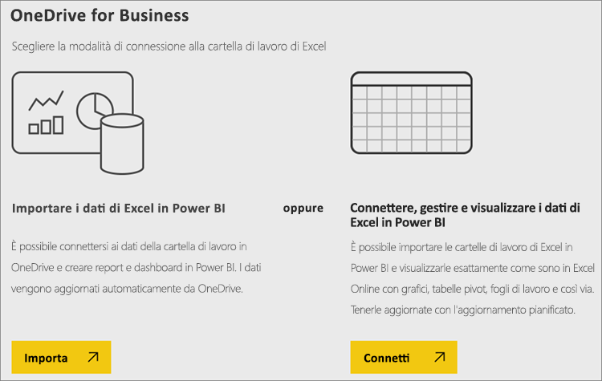
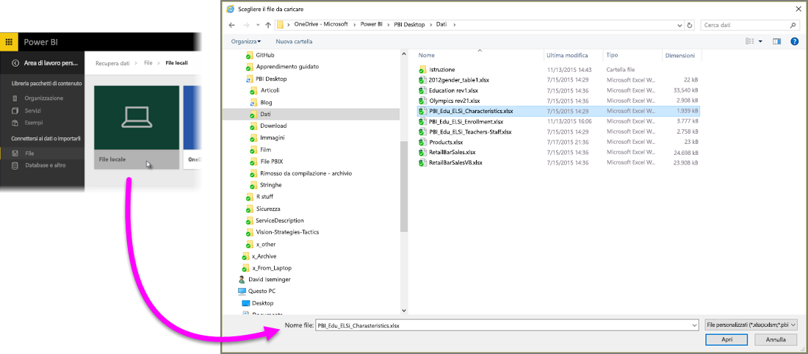
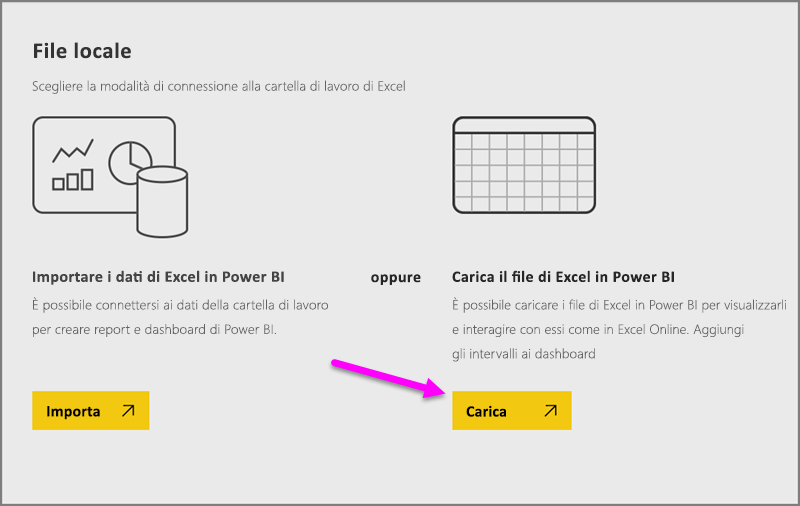
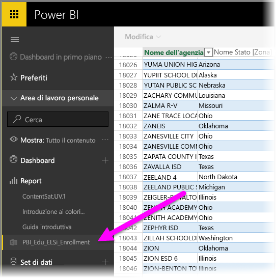

# Ottenere dati dai file delle cartelle di lavoro di Excel

Microsoft Excel è una delle applicazioni aziendali più diffuse, ma è anche uno dei modi più comuni per ottenere i dati in Power BI.

## Quali tipi di cartelle di lavoro sono supportate da Power BI?
Power BI supporta l'importazione o la connessione alle cartelle di lavoro create in Excel 2007 e versioni successive. Le cartelle di lavoro deve essere salvate come tipo di file con estensione xlsx o xlsm e avere dimensioni inferiori a 1 GB. Alcune funzionalità descritte in questo articolo sono disponibili solo nelle versioni più recenti di Excel.

### Cartelle di lavoro con intervalli o tabelle di dati
Se la cartella di lavoro contiene semplici fogli di lavoro con intervalli di dati, per sfruttare al meglio i dati in Power BI assicurarsi di formattare tali intervalli come tabelle. In questo modo, quando si creano report in Power BI, saranno visualizzate tabelle e colonne denominate nel riquadro Campi, rendendo molto più semplice visualizzare i dati.

### Cartelle di lavoro con modelli di dati
Le cartelle di lavoro possono contenere un modello di dati con una o più tabelle di dati caricate in esso usando le tabelle collegate, Power Query (Recupera e trasforma in Excel 2016) o Power Pivot. Power BI supporta tutte le proprietà del modello di dati, ad esempio relazioni, misure, gerarchie e indicatori KPI.

> [!NOTE]
> Le cartelle di lavoro con i modelli di dati non possono essere condivise tra tenant di Power BI. Ad esempio, un utente che accede a Power BI usando un account *contoso.com* non può condividere una cartella di lavoro di Excel con un utente che esegue l'accesso usando un account di Power BI da *woodgrovebank.com*.
> 
> 

### Cartelle di lavoro con connessioni a origini dati esterne
Se si usa Excel per connettersi a un'origine dati esterna, quando la cartella di lavoro si trova in Power BI, è possibile creare rapporti e dashboard in base ai dati dall'origine dati connessa. È anche possibile configurare Aggiornamento pianificato in modo da connettersi automaticamente all'origine dati e ottenere gli aggiornamenti. Non è più necessario aggiornare manualmente dalla scheda Dati della barra multifunzione di Excel. Le visualizzazioni nei report e nei riquadri dei dashboard basate sui dati provenienti da tale origine dati vengono aggiornate automaticamente. Per altre informazioni, vedere [Aggiornamento dei dati in Power BI](refresh-data.md).

### Cartelle di lavoro con fogli di Power View, tabelle pivot e grafici
L'aspetto dei fogli di Power View, delle tabelle pivot e dei grafici in Power BI dipende dalla posizione di salvataggio del file della cartella di lavoro e dal modo in cui si sceglie di ottenerlo in Power BI. Questo argomento verrà approfondito in seguito.

## Tipi di dati
Power BI supporta i tipi di dati seguenti: Numero intero, Numero decimale, Valuta, Data, Vero/Falso, Testo. Di conseguenza, contrassegnando i dati come tipi di dati specifici in Excel, si potrà migliorare l'esperienza di Power BI.

## Preparare la cartella di lavoro per Power BI
Guardare questo utile video per altre informazioni su come assicurarsi che le cartelle di lavoro di Excel siano pronte per Power BI.

<iframe width="500" height="281" src="https://www.youtube.com/embed/l2wy4XgQIu0" frameborder="0" allowfullscreen></iframe>

## La posizione di salvataggio del file della cartella di lavoro fa la differenza
**Locale**: se si salva il file della cartella di lavoro in un'unità locale del computer o in un'altra posizione all'interno dell'organizzazione, da Power BI è possibile caricare il file in Power BI. Il file in realtà rimane memorizzato nel disco locale, per cui non viene effettivamente importato in Power BI. Viene invece creato un nuovo set di dati in Power BI, in cui vengono caricati i dati e l'eventuale modello di dati dalla cartella di lavoro. Se la cartella di lavoro contiene fogli di Power View, verranno visualizzati nel sito Power BI in Report. Excel 2016 offre anche la funzionalità **Pubblica** (nel menu **File**). L'uso di **Pubblica** equivale in effetti a usare **Recupera dati > File > File locale** da Power BI, ma spesso è più facile aggiornare il set di dati in Power BI se si apportano modifiche periodiche alla cartella di lavoro.

**OneDrive for Business**: se si ha OneDrive for Business e si esegue l'accesso con lo stesso account con cui si accede a Power BI, questo è decisamente il modo più efficace per sincronizzare il lavoro in Excel con i set di dati, i report e i dashboard in Power BI. Dato che sia Power BI che OneDrive sono nel cloud, Power BI *si connette* al file della cartella di lavoro in OneDrive all'incirca ogni ora. Se vengono rilevate modifiche, il set di dati, i report e i dashboard vengono aggiornati automaticamente in Power BI. Proprio come se la cartella di lavoro fosse stata salvata in un'unità locale, è anche possibile usare Pubblica per aggiornare immediatamente il set di dati e i report in Power BI. In caso contrario, Power BI esegue la sincronizzazione automatica, in genere entro un'ora.

**OneDrive - Personale**: se si salvano i file della cartella di lavoro nel proprio account OneDrive personale, si ottengono molti dei vantaggi disponibili con OneDrive for Business. La differenza principale consiste nel fatto che quando ci si connette al file per la prima volta (scegliendo Recupera dati > File > OneDrive - Personale) è necessario accedere a OneDrive con il proprio account Microsoft, che in genere è diverso da quello usato per accedere a Power BI. Quando si accede a OneDrive con l'account Microsoft, assicurarsi di selezionare l'opzione Mantieni l'accesso. In questo modo, Power BI potrà connettersi al file della cartella di lavoro circa ogni ora e verificare che il set di dati e i report in Power BI siano sincronizzati.

**SharePoint - Siti del team**: il salvataggio dei file di Power BI Desktop in SharePoint - Siti del team corrisponde a grandi linee al salvataggio in OneDrive for Business. La differenza principale è rappresentata dalla modalità di connessione al file da Power BI. Si può specificare un URL o connettersi alla cartella radice.

## Un'unica cartella di lavoro Excel, due modi per usarla
Se i file della cartella di lavoro vengono salvati in **OneDrive**, i dati in Power BI possono essere esplorati in due modi diversi

### Importa i dati di Excel in Power BI
Quando si sceglie **Importa**, tutti i dati supportati nelle tabelle e/o in un modello di dati vengono importati in un nuovo set di dati in Power BI. Gli eventuali fogli di Power View verranno creati nuovamente in Power BI come report.

È possibile continuare a modificare la cartella di lavoro. Quando le modifiche vengono salvate, verranno sincronizzate con il set di dati in Power BI, in genere entro circa un'ora. Se è richiesto un riscontro immediato, è sufficiente fare di nuovo clic su Pubblica per esportare subito le modifiche apportate. Anche le visualizzazioni in report e dashboard verranno aggiornate.

Scegliere questa opzione se si usa Recupera e trasforma o Power Pivot per caricare i dati in un modello di dati oppure se la cartella di lavoro contiene fogli di Power View con visualizzazioni da visualizzare in Power BI.

In Excel 2016, è anche possibile usare Pubblica > Esporta. È praticamente la stessa cosa. Per altre informazioni, vedere [Pubblicare in Power BI da Excel 2016](service-publish-from-excel.md).

### Connetti, gestisci e visualizza i dati di Excel in Power BI
Quando si sceglie **Connetti**, la cartella di lavoro viene visualizzata in Power BI esattamente come in Excel Online. A differenza di Excel Online, però, sono disponibili alcune utilissime funzionalità per aggiungere elementi dai fogli di lavoro direttamente ai dashboard.

Non è possibile modificare la cartella di lavoro in Power BI. Se è necessario apportare modifiche, fare clic su Modifica e quindi scegliere se modificare la cartella di lavoro in Excel Online oppure aprirla in Excel nel computer. Le modifiche apportate vengono salvate nella cartella di lavoro in OneDrive.

Scegliere questa opzione se i fogli di lavoro contengono solo dati o se sono presenti intervalli, tabelle pivot e grafici che si vuole aggiungere ai dashboard.

In Excel 2016, è anche possibile usare Pubblica > Carica. È praticamente la stessa cosa. Per altre informazioni, vedere [Pubblicare in Power BI da Excel 2016](service-publish-from-excel.md).

## Importare o connettersi a una cartella di lavoro di Excel da Power BI
1. Nel riquadro di spostamento di Power BI fare clic su **Recupera dati**.
   
   
2. In File fare clic su **Recupera**.
   
   
3. Trovare il file.
   
   
4. Se il file della cartella di lavoro è su OneDrive o SharePoint - Siti del team, scegliere **Importa** o **Connetti**.

## Cartelle di lavoro di Excel locali
È anche possibile utilizzare un file di Excel locale e caricarlo in Power BI. È sufficiente selezionare **File locale** dal menu precedente, quindi passare alla posizione in cui sono state salvate le cartelle di lavoro di Excel.

Dopo aver selezionato il file, scegliere l’opzione per caricarlo in Power BI.

Dopo aver caricato la cartella di lavoro, verrà visualizzata una notifica che comunica che la cartella di lavoro è pronta.

Quando la cartella di lavoro è pronta, è disponibile nella sezione **Report** di Power BI.

## Pubblicare da Excel 2016 nel sito di Power BI
La funzionalità **Pubblica in Power BI** in Excel 2016 equivale all'uso di **Recupera dati** in Power BI per importare il file o connettersi a esso. Questo argomento non verrà esaminato in questa sede, ma per altre informazioni è possibile vedere [Pubblicare in Power BI da Excel 2016](service-publish-from-excel.md).

## Risoluzione dei problemi
Il file della cartella di lavoro è troppo grande? Consultare [Ridurre le dimensioni di una cartella di lavoro di Excel per visualizzarla in Power BI](reduce-the-size-of-an-excel-workbook.md).

Attualmente, quando si sceglie Importa, Power BI importa solo i dati appartenenti a una tabella o a un modello di dati. Pertanto, se la cartella di lavoro non contiene tabelle denominate, fogli di Power View o modelli di dati di Excel, potrebbe essere visualizzato l'errore seguente: **"Non sono stati trovati dati nella cartella di lavoro di Excel"** . [Questo articolo](service-admin-troubleshoot-excel-workbook-data.md) illustra come correggere la cartella di lavoro e reimportarla.

## Passaggi successivi
**Esplorare i dati**: una volta importati i dati e i report dal file in Power BI, è possibile iniziare a esplorarli. Fare semplicemente clic con il pulsante destro del mouse sul nuovo set di dati e quindi scegliere Esplora. Se si sceglie di connettersi a un file della cartella di lavoro in OneDrive nel passaggio 4, la cartella di lavoro verrà visualizzata in Report. Quando si fa clic su di essa, si aprirà in Power BI, esattamente come se fosse in Excel Online.

**Pianifica aggiornamenti**: se il file della cartella di lavoro di Excel si connette a origini dati esterne o è stata eseguita l'importazione da un'unità locale, è possibile configurare l'aggiornamento pianificato per assicurarsi che il set di dati o il report sia sempre aggiornato. Nella maggior parte dei casi, la configurazione dell'aggiornamento pianificato è piuttosto semplice, ma la procedura dettagliata da eseguire esula dall'ambito di questo articolo. Per altre informazioni, vedere [Aggiornamento dei dati in Power BI](refresh-data.md).

[Pubblicare in Power BI da Excel 2016](service-publish-from-excel.md)

[Aggiornamento dei dati in Power BI](refresh-data.md)

