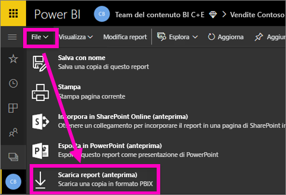
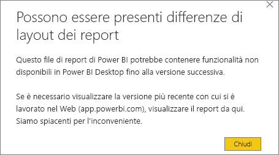
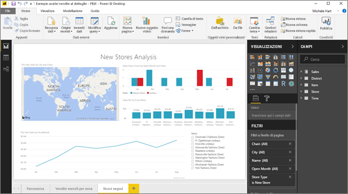

# Esportare un report dal servizio Power BI in Desktop (anteprima)
In Power BI Desktop è possibile esportare un report nel servizio Power BI (operazione talvolta definita *download*) salvando il report e selezionando **Pubblica**. È possibile esportare anche nell'altra direzione e scaricare un report dal servizio Power BI a Desktop. L'estensione per i file di esportazione, in entrambe le direzioni, è *PBIX*.

Occorre tenere presenti alcune limitazioni e considerazioni, che verranno discusse più avanti in questo articolo.

## Scaricare il report come file con estensione pbix
Per scaricare il file con estensione pbix, seguire questi passaggi:

1. Nel **servizio Power BI** aprire il report che si vuole scaricare in [Visualizzazione di modifica](consumer/end-user-reading-view.md).
2. Nella barra dei menu selezionare **File > Scarica report**.
   
   > [!NOTE]
   > Per poterlo scaricare, il report deve essere stato [creato con Power BI Desktop](guided-learning/publishingandsharing.yml?tutorial-step=2) dopo il 23 novembre 2016 (e aggiornato dopo tale data). In caso contrario, la voce di menu *Scarica report* nel servizio Power BI è inattiva.
   > 
   > 
3. Durante la creazione del file con estensione pbix, un messaggio di stato indica lo stato di avanzamento. Quando il file è pronto, verrà chiesto di aprire o salvare il file con estensione pbix. Il nome del file corrisponde al titolo del report.
   
    
   
    È ora possibile aprire il file con estensione pbix nel servizio Power BI (app.powerbi.com) o in Power BI Desktop.     
4. Per aprire immediatamente il report in Desktop, selezionare **Apri**. Per salvare il file in un percorso specifico, selezionare **Salva > Salva con nome**. Se non è stato ancora fatto, [installare Power BI Desktop](desktop-get-the-desktop.md).
   
    Quando si apre il report in Desktop, può essere visualizzato un messaggio di avviso che informa che alcune funzionalità disponibili nel report del servizio Power BI potrebbero non essere disponibili in Desktop.
   
    

5. L'editor di report in Power BI Desktop è molto simile a quello del servizio Power BI.  
   
    

## Considerazioni e risoluzione dei problemi
Per il download (esportazione) di un file con estensione *pbix* dal servizio Power BI esistono alcune importanti considerazioni e limitazioni.

* Per scaricare il file, è necessario avere l'accesso in modifica al report
* Il report deve essere stato creato con **Power BI Desktop** ed essere stato *pubblicato* nel **servizio Power BI** oppure il file con estensione pbix deve essere stato *caricato* nel servizio.
* I report devono essere stati pubblicati o aggiornati dopo il 23 novembre 2016. I report pubblicati prima di tale data non sono scaricabili.
* Questa funzionalità non funzionerà con i report creati in origine nel **servizio Power BI**, inclusi i pacchetti di contenuto.
* Per aprire i file scaricati è consigliabile usare sempre la versione più recente di **Power BI Desktop**. Potrebbe non essere possibile aprire i file *PBIX* scaricati nelle versioni non correnti di **Power BI Desktop**.
* Se l'amministratore ha disattivato la possibilità di esportare i dati, questa funzionalità non sarà visibile nel **servizio Power BI**.
* I set di dati con aggiornamento incrementale non possono essere scaricati in un file con estensione *pbix*.

## Passaggi successivi
Visualizzare il video di **Guy in a Cube** (durata: 1 minuto) che illustra questa funzionalità:

<iframe width="560" height="315" src="https://www.youtube.com/embed/ymWqU5jiUl0" frameborder="0" allowfullscreen></iframe>

Ecco alcuni articoli supplementari che possono essere d'aiuto per imparare a usare il **servizio Power BI**:

* [Report in Power BI](consumer/end-user-reports.md)
* [Concetti di base sulle finestre di progettazione del servizio Power BI](service-basic-concepts.md)

Dopo aver installato **Power BI Desktop**, il contenuto seguente consente di svolgere rapidamente le attività iniziali:

* [Introduzione a Power BI Desktop](desktop-getting-started.md)

Altre domande? [Provare la community di Power BI](http://community.powerbi.com/)   

