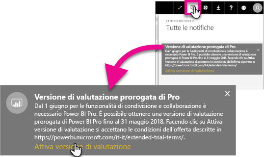
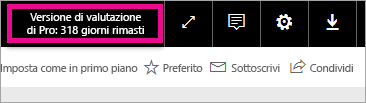

# Attivazione versione di valutazione Pro estesa
A partire dal 1 giugno 2017, tutti gli utenti idonei potranno dare il proprio consenso per la versione di valutazione Pro estesa del servizio Power BI.

<iframe width="640" height="360" src="https://www.youtube.com/embed/tPsNoPyY9aA?showinfo=0" frameborder="0" allowfullscreen></iframe>

Nell'[annuncio su Power BI Premium del 3 maggio 2017](https://powerbi.microsoft.com/blog/microsoft-accelerates-modern-bi-adoption-with-power-bi-premium/) Microsoft ha comunicato le modifiche al servizio gratuito di Power BI applicate entro il 1 giugno 2017. Tali modifiche includono l'estensione dell'accesso a tutte le origini dati, limiti maggiori per l'archiviazione nell'area di lavoro e una maggiore frequenza di aggiornamento e flusso per il servizio gratuito: le stesse caratteristiche di Power BI Pro.

È stato anche annunciato che le funzioni di condivisione e collaborazione saranno riservate agli utenti di Power BI Pro, che include la condivisione del dashboard peer-to-peer, le aree di lavoro del gruppo, ora denominate aree di lavoro per le app, l'esportazione in PowerPoint e l'analisi in Excel con le app di Power BI. Nella comunicazione del 3 maggio l'esportazione in CSV o Excel e PowerPoint era stata identificata come una funzionalità limitata a Power BI Pro, ma in seguito alla ricezione di commenti e suggerimenti della grande community di utenti, la strategia ha proteso per rendere disponibile la funzionalità anche per gli utenti del servizio gratuito.

A partire dal 1 giugno 2017 gli utenti esistenti del servizio gratuito che sono stati attivi nell'ultimo anno, fino al 2 maggio 2017, avranno diritto a una versione di valutazione gratuita estesa di 12 mesi di Power BI Pro. L'offerta consentirà agli utenti di sfruttare tutte le funzionalità di Power BI Pro per l'anno successivo, come segno di ringraziamento nei confronti della community, e darà loro il tempo di adattare il proprio sistema alle modifiche.

Il 1 giugno 2017, gli utenti idonei riceveranno una notifica al momento dell'accesso al servizio che comunica l'applicazione delle modifiche e richiede loro di registrarsi all'offerta della versione di valutazione estesa di Power BI Pro. L'amministratore IT dell'utente non controlla le notifiche del prodotto, né può effettuare la registrazione alla versione di valutazione estesa di Power BI Pro per conto dell'utente. Ogni utente idoneo deve compiere l'azione da sé per completare il processo.

Gli utenti possono scegliere di registrarsi all'offerta in qualsiasi momento nei 12 mesi, ma la versione di valutazione estesa Pro terminerà per tutti gli utenti il 31 maggio 2018, indipendentemente da quando è stata accettata l'offerta. A questo punto gli utenti potranno scegliere di acquistare Power BI Pro o, se si sceglie di non acquistare, potranno passare alla versione gratuita di Power BI, senza le funzionalità di collaborazione e condivisione.

Non verranno apportate modifiche a Power BI Pro. Questa estensione non interessa tali utenti che non riceveranno notifiche quando effettueranno l'accesso al servizio il 1 giugno 2017 o successivamente. Gli utenti che rifiutare l'offerta della versione di valutazione estesa di Power BI Pro o non sono idonei continueranno a usare la versione gratuita di Power BI senza le funzionalità di condivisione e collaborazione. Possono registrarsi in qualsiasi momento alla versione di valutazione di Power BI Pro standard di 60 giorni, visitando il [sito Web](https://powerbi.microsoft.com/get-started/) di Power BI.

## Idoneità alla versione di valutazione Pro estesa
L'account deve soddisfare i requisiti seguenti per essere idoneo all'offerta della versione di valutazione Pro estesa.

* Gli utenti della versione gratuita di Power BI gratuito attivi tra il 3 maggio 2016 e il 2 maggio 2017 sono idonei alla versione di valutazione Pro estesa.
* Gli utenti che hanno usato in precedenza o attualmente la *versione di valutazione di 60 giorni del prodotto Pro* sono comunque idonei alla versione di valutazione Pro estesa.

> [!NOTE]
> Gli utenti che hanno licenze di Power BI Pro o sottoscrizioni alla versione di valutazione di Power BI Pro, all'interno di Office 365, sono esclusi da questa offerta.
> 
> 

## Come attivare
Esistono due modi per attivare la versione di valutazione Pro estesa. Il primo è all'accesso a Power BI. Se si rifiuta, verrà visualizzata un'opzione all'interno dell'area di notifica.

> [!NOTE]
> Le comunicazioni all'interno del prodotto non sono controllate dall'amministratore e saranno inviate agli utenti idonei.
> 
> 

### Esperienza all'accesso
Quando si accede al servizio Power BI e si è idonei, si riceve un avviso popup. Per avviare la versione di valutazione Pro estesa, selezionare **Attiva versione di valutazione**. Non saranno necessarie altre azioni.

Sarà quindi possibile accedere a tutti i dashboard condivisi esistenti e ai report per la durata del periodo di valutazione.

Se si seleziona **Not Now** (Non ora), la versione di valutazione Pro estesa può essere attivata in qualsiasi momento fino alla fine del periodo di valutazione, il 31 maggio 2018.

### Attivazione in un secondo momento
Se si rifiuta la finestra popup selezionando **Not Now** (Non ora), la versione di valutazione Pro estesa può essere attivata in qualsiasi momento fino alla fine del periodo di valutazione, il 31 maggio 2018. Questa operazione può essere eseguita nel **Centro notifiche**.

All'interno del Centro notifiche verrà visualizzata una notifica riguardante la versione di valutazione Pro estesa. La notifica sarà disponibile fino a quando l'utente non la rifiuta.

All'interno della notifica, è possibile selezionare **Attiva versione di valutazione** per avviare la versione di valutazione. Non saranno necessarie altre azioni.

Sarà quindi possibile accedere a tutti i dashboard condivisi esistenti e ai report per la durata del periodo di valutazione.

## Dopo l'attivazione
Dopo l'attivazione, in alto a destra viene visualizzato il numero di giorni rimanenti per la versione di valutazione.

Per informazioni sulle condizioni, vedere [Condizioni per l'utilizzo della versione di valutazione prorogata di Power BI Pro](https://aka.ms/power-bi-trial). La versione di valutazione Pro estesa viene eseguita fino al 31 maggio 2018 per tutti gli utenti idonei.

## Domande frequenti
**Cosa accade ai nuovi utenti che si registrano dopo il 3 maggio 2017?**

Gli utenti iscritti a Power BI gratuito a decorrere dal 3 maggio 2017 incluso non sono idonei per la versione di valutazione Pro estesa, ma sono idonei per la versione di valutazione Pro standard di 60 giorni.

**Come è possibile individuare chi è idoneo per la versione di valutazione Pro estesa all'interno dell'organizzazione?**

Anche se non esiste un modo diretto per scoprirlo, è possibile visualizzare il report sulle applicazioni integrate di Azure Active Directory per Power BI per vedere gli utenti attivi all'interno dell'organizzazione negli ultimi 30 giorni. Questo può dare un'idea degli utenti idonei. Per altre informazioni, vedere [Find Power BI users that have signed in](service-admin-access-usage.md) (Ricerca di utenti Power BI che hanno eseguito l'accesso).

Tali utenti attivi nel periodo di idoneità che dispongono di licenze gratuite riceveranno la notifica popup. 

> [!NOTE]
> Il report di Azure AD non indica se un utente è gratuito o Pro all'interno di Power BI, ma indica solo quali utenti hanno effettuato l'accesso a Power BI e quando. Se un utente è elencato nel report, non significa necessariamente che sia idoneo per la versione di valutazione Pro estesa.
> 
> 

**Gli amministratori possono impedire a un utente di attivare la versione di valutazione Pro estesa?**

No. Gli amministratori non sono in grado di impedire agli utenti di attivare la versione di valutazione Pro estesa o la versione di valutazione di 60 giorni all'interno del servizio di Power BI Pro.

## Passaggi successivi
[Condizioni per l’utilizzo della versione di valutazione prorogata di Power BI Pro](https://aka.ms/power-bi-trial)  
[Contratto di assistenza di Power BI per utenti singoli](https://powerbi.microsoft.com/terms-of-service/)  
[Annuncio di Power BI Premium](https://aka.ms/pbipremium-announcement)  
[Find Power BI users that have signed in](service-admin-access-usage.md) (Ricerca di utenti Power BI che hanno eseguito l'accesso)

Altre domande? [Provare a rivolgersi alla community di Power BI](https://community.powerbi.com/)

