# Microsoft Flow e Power BI

[Microsoft Flow](https://flow.microsoft.com/en-us/documentation/getting-started) è un'applicazione SaaS che automatizza i flussi di lavoro nel crescente numero di applicazioni e servizi SaaS su cui si basano gli utenti aziendali. Con Flow è possibile automatizzare le attività grazie all'integrazione delle app preferite e dei servizi (incluso Power BI) per ricevere le notifiche, sincronizzare i file, raccogliere dati e altro ancora. Le attività ripetitive saranno facilitate con l'automazione del flusso di lavoro.

[Introduzione all'uso di Flow.](https://flow.microsoft.com/documentation/getting-started)

Guardare il video per scoprire come creare un flusso che invia posta dettagliata ai colleghi quando viene attivato un avviso di Power BI. Seguire quindi le istruzioni successive per sotto il video per fare una prova in prima persona.

<iframe width="560" height="315" src="https://www.youtube.com/embed/YhmNstC39Mw" frameborder="0" allowfullscreen></iframe>

## Creare un flusso che sia attivato da un avviso per i dati di Power BI

### Prerequisiti
Questa esercitazione illustrerà come creare due diversi flussi, uno da un modello e l'altro da zero. Per iniziare, [creare un avviso per i dati in Power BI](service-set-data-alerts.md), creare un account Slack gratuito e [iscriversi a Microsoft Flow](https://flow.microsoft.com/en-us/#home-signup) gratuitamente.

## Creare un flusso che usa Power BI in base a un modello
In questa attività si userà un modello per creare un semplice flusso che viene attivato da un avviso (notifica) per i dati di Power BI.

1. Accedere a Microsoft Flow (flow.microsoft.com).
2. Selezionare **Flussi personali**.
   
   
3. Selezionare **Crea da modello**.
   
    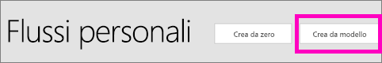
4. Usare la casella di ricerca per trovare i modelli di Power BI e selezionare **Invia un messaggio di posta elettronica a tutti i destinatari quando viene attivato un avviso di Power BI basato sui dati > Continua**.
   
    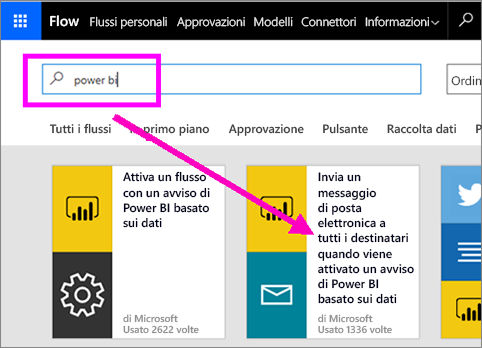

### Creare il flusso
Questo modello prevede un trigger (avviso per i dati di Power BI per le nuove medaglie olimpiche all'Irlanda) e un'azione (inviare un messaggio di posta elettronica). Quando si seleziona un campo, Flow mostra il contenuto dinamico che è possibile includere.  In questo esempio sono inclusi il valore e l'URL del riquadro nel corpo del messaggio.

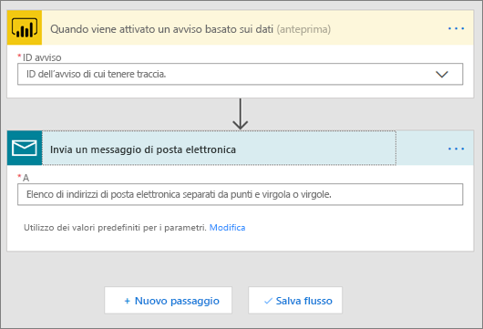

1. Nell'elenco a discesa del trigger, selezionare un avviso per i dati di Power BI. Selezionare **New medal for Ireland**. Per informazioni su come creare un avviso, vedere [Avvisi per i dati nel servizio Power BI](service-set-data-alerts.md).
   
   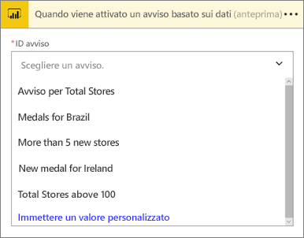
2. Immettere uno o più indirizzi di posta elettronica validi, quindi selezionare **Modifica** (mostrato sotto) o **Aggiungi contenuto dinamico**. 
   
   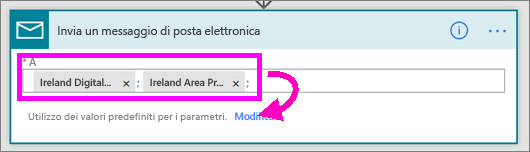

3. Flow crea automaticamente un titolo e un messaggio che è possibile mantenere o modificare. Tutti i valori impostati al momento della creazione dell'avviso in Power BI sono disponibili per l'uso. È sufficiente posizionare il cursore ed effettuare una selezione nell'area grigia evidenziata. 

   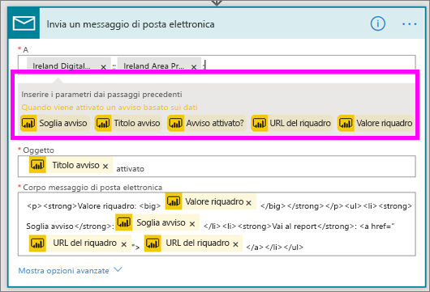

1.  Ad esempio, se si crea il titolo di avviso **Abbiamo vinto un'altra medaglia** in Power BI, è possibile selezionare **Titolo avviso** per aggiungere tale testo nel campo Oggetto del messaggio di posta elettronica.

    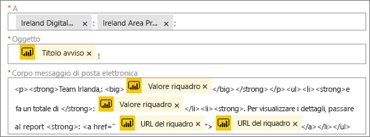

    È anche possibile accettare il corpo del messaggio di posta elettronica predefinito o crearne uno personalizzato. L'esempio precedente contiene alcune modifiche al messaggio.

1. Al termine, selezionare **Crea flusso** o **Salva flusso**.  Il flusso viene creato e valutato.  Flow informa l'utente se vengono rilevati errori.
2. In tale evenienza, selezionare **Modifica flusso** per correggere gli errori, altrimenti selezionare **Fatto** per eseguire il nuovo flusso.
   
   
5. Quando viene attivato l'avviso dati, verrà inviato un messaggio di posta elettronica agli indirizzi indicati.  
   
   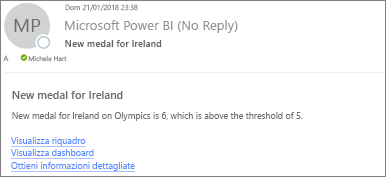

## Creare un flusso che usa Power BI da zero (vuoto)
In questa attività si creerà da zero un semplice flusso che viene attivato da un avviso (notifica) per i dati di Power BI.

1. Eseguire l'accesso a Microsoft Flow.
2. Selezionare **Flussi personali** > **Crea da zero**.
   
   
3. Usare la casella di ricerca per trovare un trigger di Power BI e selezionare **Quando viene attivato un avviso di Power BI basato sui dati**.

### Creare il flusso
1. Nell'elenco a discesa, selezionare il nome dell'avviso.  Per informazioni su come creare un avviso, vedere [Avvisi per i dati nel servizio Power BI](service-set-data-alerts.md).
   
    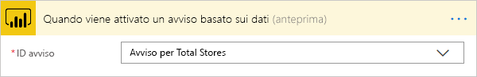
2. Selezionare **Nuovo passaggio** > **Aggiungi un'azione**.
   
   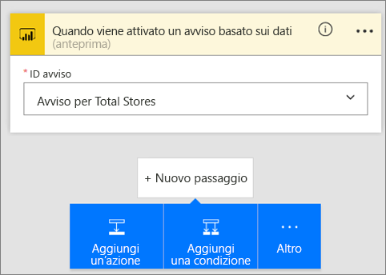
3. Cercare **Outlook** e selezionare **Crea evento**.
   
   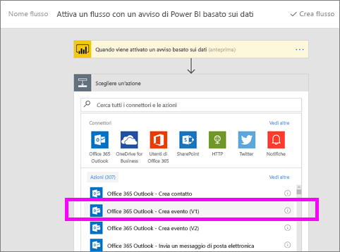
4. Compilare i campi dell'evento. Quando si seleziona un campo, Flow mostra il contenuto dinamico che è possibile includere.
   
   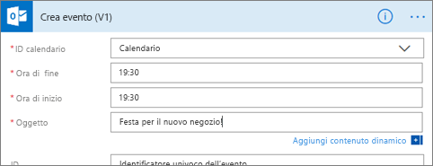
5. Selezionare **Crea flusso** al termine.  Flow salva e valuta il flusso. Se non sono presenti errori, selezionare **Fatto** per eseguire questo flusso.  Il nuovo flusso viene aggiunto alla pagina **Flussi personali**.
   
   
6. Quando il flusso viene attivato dall'avviso per i dati di Power BI, si riceverà una notifica degli eventi Outlook simile alla seguente.
   
    

## Passaggi successivi
* [Introduzione a Microsoft Flow](https://flow.microsoft.com/en-us/documentation/getting-started/)
* [Impostare gli avvisi per i dati nel servizio Power BI](service-set-data-alerts.md)
* [Impostare gli avvisi per i dati nell'iPhone](mobile-set-data-alerts-in-the-mobile-apps.md)
* [Impostare gli avvisi per i dati nell'app Power BI per dispositivi mobili per Windows 10](mobile-set-data-alerts-in-the-mobile-apps.md)
* Altre domande? [Provare la community di Power BI](http://community.powerbi.com/)

