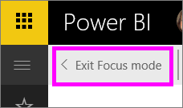

# Visualizzare un riquadro del dashboard o un oggetto visivo di un report in modalità messa a fuoco
<iframe width="560" height="315" src="https://www.youtube.com/embed/dtdLul6otYE" frameborder="0" allowfullscreen></iframe>

## Che cos'è la modalità messa a fuoco?
La modalità ***messa a fuoco*** consente di espandere (aprire in una nuova finestra) un riquadro del dashboard o un oggetto visivo di un report per visualizzare più dettagli.  In modalità messa a fuoco è possibile visualizzare e modificare i filtri applicati durante la creazione dell'oggetto visivo.  

> [!NOTE]
> La modalità messa a fuoco è diversa dalla [modalità schermo intero](service-tile-fullscreen-mode.md).
> 
> 

1. Passare il puntatore del mouse sul riquadro o sull'oggetto visivo e selezionare l'icona **Modalità messa a fuoco** .  
   
   
2. Il riquadro o l'oggetto visivo si apre e riempie l'intera area di disegno. La modalità messa a fuoco per i riquadri del dashboard e le visualizzazioni dei report è quasi identica, con alcune differenze. Per uscire dalla modalità messa a fuoco in un report, ad esempio, selezionare **Torna al report**. Per uscire dalla modalità messa a fuoco in un dashboard, selezionare **Esci dalla modalità messa a fuoco**. Per altre differenze, vedere **Considerazioni e risoluzione dei problemi** più avanti.
   
   
3. Espandere il riquadro Filtri per visualizzare tutti i filtri applicati a questo oggetto visivo.
   
   
4. Esplorare ulteriormente modificando i filtri e, se si individua qualcosa di interessante, aggiungere l'oggetto visivo a un dashboard.   
5. Chiudere la modalità messa a fuoco e tornare al dashboard selezionando **< Esci dalla modalità messa a fuoco** (nell'angolo in alto a sinistra dell'oggetto visivo).
   
        
   
    Chiudere la modalità messa a fuoco e tornare alla pagina del report selezionando **Torna al report**.    
   
    

## Passare dalla modalità messa a fuoco alla modalità schermo intero
In modalità messa a fuoco il riquadro o l'oggetto visivo può essere quindi [visualizzato a schermo intero (modalità TV)](service-tile-fullscreen-mode.md). La modalità Schermo intero consente la visualizzazione senza la distrazione di menu e icone di navigazione.

## Considerazioni e risoluzione dei problemi
* Quando si usa la modalità messa a fuoco con una visualizzazione in un report, sarà possibile visualizzare e modificare tutti i filtri, ovvero a livello di oggetto visivo, a livello di pagina e a livello di report.    
* Quando si usa la modalità messa a fuoco con una visualizzazione o un dashboard, sarà possibile visualizzare e modificare solo il filtro a livello di oggetto visivo.

Altre domande? [Provare la community di Power BI](http://community.powerbi.com/)

