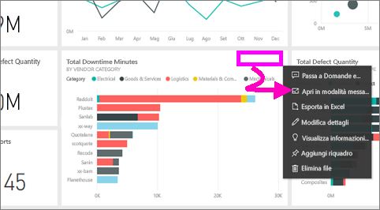
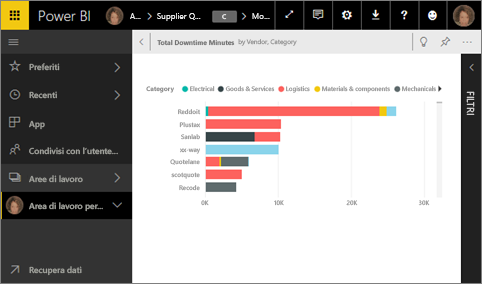
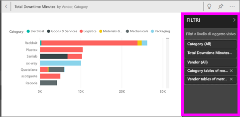
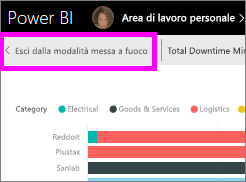
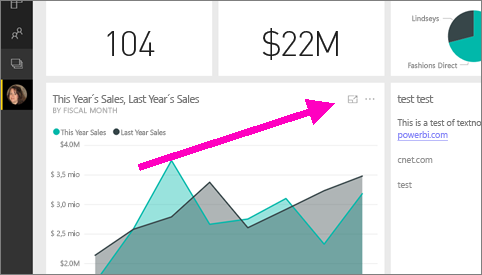
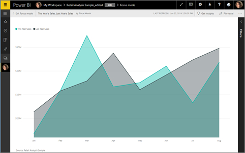
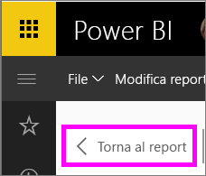

# Visualizzare un riquadro del dashboard o un oggetto visivo di un report in modalità messa a fuoco
<iframe width="560" height="315" src="https://www.youtube.com/embed/dtdLul6otYE" frameborder="0" allowfullscreen></iframe>

## Che cos'è la modalità messa a fuoco?
La modalità ***messa a fuoco*** consente di espandere (aprire in una nuova finestra) un riquadro del dashboard o un oggetto visivo di un report per visualizzare più dettagli.  In modalità messa a fuoco è possibile visualizzare e modificare i filtri applicati al momento della creazione dell'oggetto visivo.  

> [!NOTE]
> La modalità messa a fuoco è diversa dalla [modalità schermo intero](service-fullscreen-mode.md).
> 
## Modalità messa a fuoco per riquadri del dashboard
1. Passare il puntatore del mouse sulla visualizzazione del riquadro, selezionare i puntini di sospensione (...) e scegliere **Apri in modalità messa a fuoco** 

    .
   
2. Il riquadro si apre e riempie l'intera area di disegno report. 

   

3. Espandere il riquadro Filtri per visualizzare tutti i filtri applicati a questo oggetto visivo.
   
   

4. Esplorare ulteriormente modificando i filtri e, se si individua qualcosa di interessante, aggiungere l'oggetto visivo a un dashboard.

5. Chiudere la modalità messa a fuoco e tornare al dashboard selezionando **< Esci dalla modalità messa a fuoco** (nell'angolo in alto a sinistra dell'oggetto visivo).
   
        

## Modalità messa a fuoco per le visualizzazioni dei report

1. Passare il puntatore del mouse sulla visualizzazione del report e selezionare l'icona della **modalità messa a fuoco** .  
   
   
2. La visualizzazione si apre e riempie l'intera area di disegno. 

   
   
3. Espandere il riquadro Filtri per visualizzare tutti i filtri applicati a questo oggetto visivo.
   
   
4. Esplorare ulteriormente modificando i filtri e, se si individua qualcosa di interessante, aggiungere l'oggetto visivo a un dashboard.   
5. Chiudere la modalità messa a fuoco e tornare al report selezionando **Torna al report** (nell'angolo in alto a sinistra dell'oggetto visivo). 
   
      

## Passare dalla modalità messa a fuoco alla modalità schermo intero
In modalità messa a fuoco il riquadro o l'oggetto visivo può essere quindi [visualizzato a schermo intero (modalità TV)](service-fullscreen-mode.md). La modalità schermo intero consente la visualizzazione senza la distrazione di menu e i pulsanti di spostamento.

## Considerazioni e risoluzione dei problemi
* Quando si usa la modalità messa a fuoco con una visualizzazione in un report, sarà possibile visualizzare e modificare tutti i filtri, a livello di oggetto visivo, a livello di pagina e a livello di report.    
* Quando si usa la modalità messa a fuoco con una visualizzazione o un dashboard, sarà possibile visualizzare e modificare solo il filtro a livello di oggetto visivo.

Altre domande? [Provare la community di Power BI](http://community.powerbi.com/)

