# Da cartella di lavoro di Excel a straordinari report nel servizio Power BI
Il manager desidera visualizzare un report sulle ultime cifre di vendita combinate con le ultime impressioni sulla campagna entro la fine del giorno. Mentre i dati più recenti si trovano su vari sistemi di terze parti e sui file nel computer portatile. In passato sarebbero state necessarie ore per creare elementi visivi e formattare un report e l'ansia sarebbe salita.

Niente panico. Con Power BI, è possibile creare un report straordinario in poco tempo.

In questo esempio, si caricherà un file di Excel da un sistema locale, si creerà un nuovo report e lo si condividerà con i colleghi, tutto da Power BI.

## Preparare i dati
Si prenderà un semplice file di Excel come esempio. 

1. Prima di caricare il file di Excel in Power BI, è necessario organizzare i dati in una tabella flat. In una tabella flat ogni colonna contiene lo stesso tipo di dati, ad esempio testo, data, numero o valuta. La tabella deve contenere una riga di intestazione, ma non tutte le colonne o le righe che visualizzano i totali.

   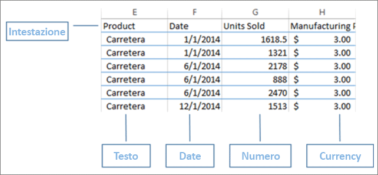

2. Successivamente, formattare i dati come una tabella. Nella scheda **Home** di Excel selezionare **Formatta come tabella** nel gruppo **Stili**. 

3. Selezionare uno stile di tabella da applicare al foglio di lavoro. 

   Il foglio di lavoro di Excel è ora pronto per essere caricato in Power BI.

   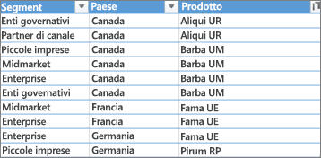

## Caricare il file di Excel nel servizio Power BI
Il servizio Power BI si connette a molte origini dati, inclusi i file di Excel che risiedono nel computer in uso. 

 > [!NOTE] 
 > Per proseguire questa esercitazione, usare la [cartella di lavoro di esempio Financial](sample-financial-download.md).

1. Per iniziare, accedere al servizio Power BI. Se non si è ancora iscritti, [è possibile farlo gratuitamente](https://powerbi.com).

2. Si desidera creare un nuovo dashboard. Aprire **Area di lavoro personale** e selezionare l'icona **Crea**.

   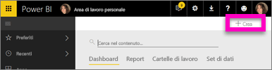

3. Selezionare **Dashboard**, immettere un nome e quindi scegliere **Crea**. 

   Verrà visualizzato il nuovo dashboard senza dati.

   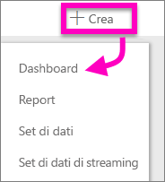

4. Selezionare **Recupera dati** nella parte inferiore del riquadro di spostamento sinistro. 

5. Nella pagina **Recupera dati** selezionare **Recupera** nella casella **File** sotto **Creare nuovo contenuto**.

   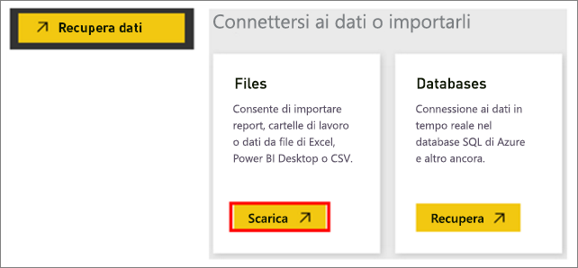

6. Nella pagina **File** selezionare **File locale**. Passare al file della cartella di lavoro di Excel nel computer in uso e selezionare **Apri** per caricarlo nel servizio Power BI. 

   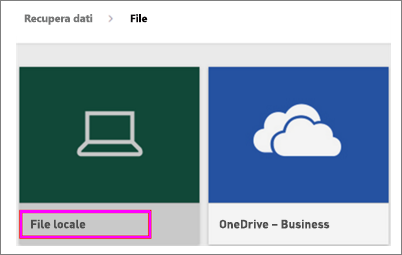

7. Nella pagina **File locale** selezionare **Importa**.

## Creare il report
Dopo l'importazione del file di Excel nel servizio Power BI, si inizia a creare il report. 

1. Quando viene visualizzato il messaggio **Il set di dati è pronto**, selezionare **Visualizza set di dati**.  

   Power BI viene aperto nella Visualizzazione di modifica e visualizza l'area di disegno report. Sul lato destro sono presenti i riquadri **Visualizzazioni**, **Filtri** e **Campi**. Si noti che i dati della tabella della cartella di lavoro di Excel vengono visualizzati nel riquadro **Campi**. Sotto il nome della tabella, Power BI elenca le intestazioni di colonna come campi individuali.

   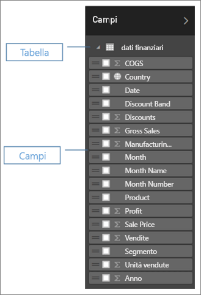

2. È ora possibile iniziare a creare le visualizzazioni. Supponiamo che il responsabile voglia vedere i profitti nel tempo. Nel riquadro **Campi** trascinare **Profit** nel canvas del report. 

   Per impostazione predefinita, Power BI visualizza un grafico a barre. 

3. Trascinare **Date** nel canvas del report. 

   Power BI aggiorna il grafico a barre per visualizzare i profitti per data.

   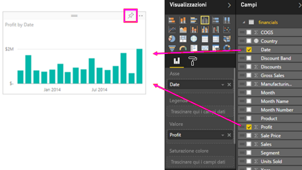

   > [!TIP]
   > Se il grafico non soddisfa le aspettative, controllare le aggregazioni. Ad esempio, nell'area **Valore** fare clic con il pulsante destro del mouse sul campo appena aggiunto e assicurarsi che i dati vengano aggregati nel modo appropriato. In questo esempio verrà usato **Somma**.
   > 

La manager desidera sapere quali sono i paesi più produttivi. Sarà stupita nel vedere una visualizzazione mappa. 

1. Selezionare un'area vuota nel canvas del report. 

2. Dal riquadro **Campi** trascinare i campi **Country** e **Profit** nel canvas del report.

   Power BI crea una mappa di visualizzazione con bolle che rappresenta il profitto relativo di ogni località.

   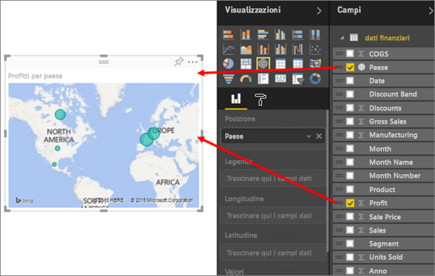

Visualizzazione delle vendite per prodotti e segmenti di mercato Facile. 

1. Nel riquadro **Campi** selezionare i campi **Sales**, **Product** e **Segment**. 
   
   Power BI crea immediatamente un grafico a barre. 

2. Modificare il tipo di grafico scegliendo una delle icone nel menu **Visualizzazioni**. Ad esempio, modificarlo in un **istogramma in pila**. 

3. Per ordinare il grafico, selezionare **Altre opzioni** (...) > **Ordina per**.

   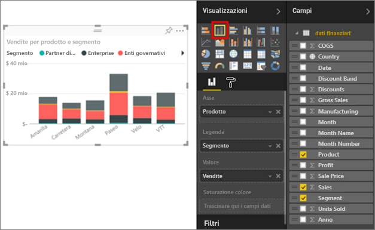

Aggiungere tutte le visualizzazioni al dashboard. Ora si è pronti per condividerle con i colleghi.

   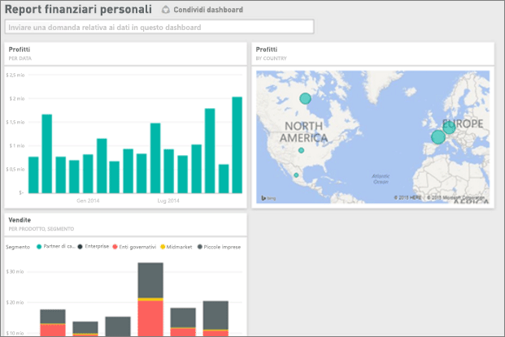

## Condividere il dashboard
Supponiamo di voler condividere il dashboard con il responsabile. Con i colleghi che dispongono di un account Power BI, è possibile condividere il dashboard e il report sottostante. Possono modificare i report, ma non salvare le modifiche.

1. Per condividere il report, nella parte superiore del dashboard, selezionare **Condividi**.

   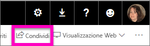

   Power BI visualizza la pagina **Condividi dashboard**. 

2. Immettere gli indirizzi di posta elettronica dei destinatari nella casella **Immettere gli indirizzi di posta elettronica** e aggiungere un messaggio nella casella sottostante. 

3. Per consentire ai destinatari di condividere il dashboard con altri utenti, selezionare **Consenti ai destinatari di condividere il dashboard**. Seleziona **Condividi**.

   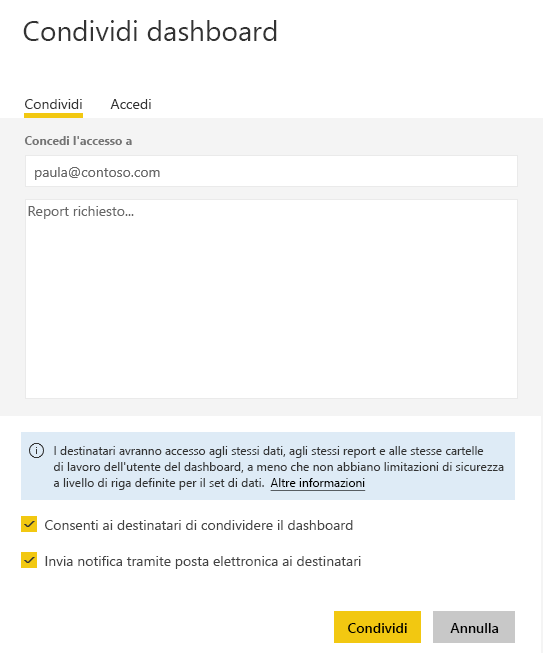

## Passaggi successivi

* [Introduzione al servizio Power BI](service-get-started.md)
* [Introduzione a Power BI Desktop](desktop-getting-started.md)
* [Concetti di base sulle finestre di progettazione del servizio Power BI](service-basic-concepts.md)

Altre domande? [Provare la community di Power BI](http://community.powerbi.com/).

