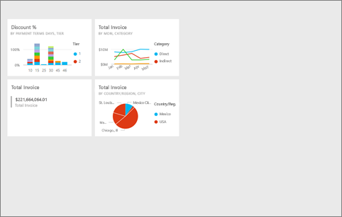
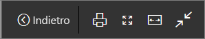
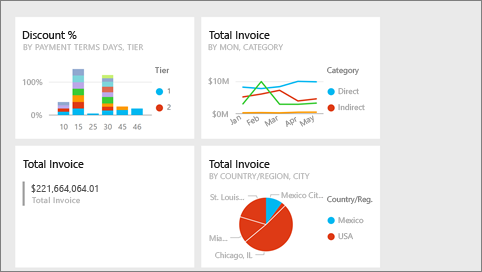
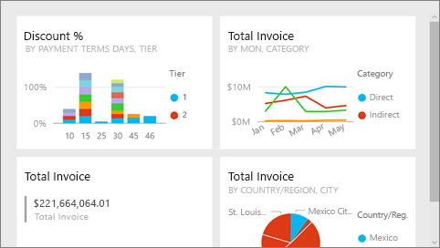
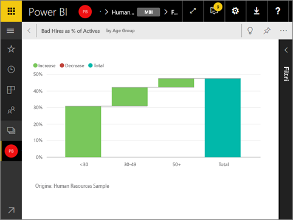

# Modalità schermo intero nel servizio Power BI
## Che cos'è la modalità schermo intero?

È possibile visualizzare i contenuti di Power BI (dashboard, pagine di report, riquadri e visualizzazioni) senza la distrazione di menu e barre di spostamento.  Si ottiene una visualizzazione completa e immediata dei contenuti, in qualsiasi momento. È anche detta modalità TV. Le funzionalità disponibili in modalità schermo intero dipendono dal contenuto. 

Se si usa Power BI per dispositivi mobili, la modalità [schermo intero è disponibile per le app per dispositivi mobili Windows 10](mobile-windows-10-app-presentation-mode.md). Power BI Desktop non prevede una modalità schermo intero per i report o le visualizzazioni, ma include la funzionalità Adatta alla pagina per la [visualizzazione delle relazioni](desktop-report-view.md) e la [modalità messa a fuoco per gli oggetti visivi dei report](service-focus-mode.md).

 

Alcuni usi della modalità schermo intero sono:

* presentazione del dashboard, riquadro, oggetto visivo o report in una riunione o conferenza
* visualizzazione in un ufficio su schermi di grandi dimensioni o proiettori dedicati
* visualizzazione su schermi di piccole dimensioni
* revisione in modalità di blocco - possibilità di toccare la schermata o passare il mouse sui riquadri senza aprire il dashboard o il report sottostante

> **NOTA**: la modalità schermo intero è diversa rispetto alla [modalità messa a fuoco (POP-out)](service-focus-mode.md).
> 
> 

Il video seguente illustra come aprire ed esplorare il dashboard in modalità schermo intero, quindi come applicare alcuni parametri URL per controllare la visualizzazione predefinita. Seguire quindi tutte le istruzioni riportate sotto il video per provare a farlo da soli.

<iframe width="560" height="315" src="https://www.youtube.com/embed/c31gZkyvC54" frameborder="0" allowfullscreen></iframe>

## Visualizzare dashboard e pagine di report in modalità schermo intero
1. Dalla barra dei menu di Power BI nella parte superiore del dashboard o del report selezionare l'icona **Schermo intero** . L'area di disegno del dashboard o la pagina del report si espande fino a riempire l'intera schermata. L'esempio seguente è relativo a un dashboard.
   
      
2. Nella modalità Schermo intero sono disponibili diverse opzioni di menu.  Per visualizzare il menu, è sufficiente spostare il mouse o il cursore. 
   
     Menu per i dashboard    
         
   
     Menu per le pagine di report    
        
   
        
    Usare il pulsante **Indietro** per passare alla pagina precedente nel browser. Se la pagina precedente è una pagina di Power BI, anche tale pagina verrà visualizzata in modalità schermo intero.  La modalità schermo intero viene disattivata solo alla chiusura dell'applicazione.
   
        
    Usare questo pulsante per stampare il dashboard o la pagina del report in modalità schermo intero. 
   
        
    Usare il pulsante **Adatta allo schermo** per visualizzare il dashboard con le dimensioni maggiori possibili senza che siano necessarie le barre di scorrimento.     
   
    
   
           
    Talvolta le barre di scorrimento non interessano, ma si vuole che il dashboard riempia l'intera larghezza dello spazio disponibile. Selezionare il pulsante **Adatta in larghezza**.    
   
    
   
           
    Nei report a schermo intero usare queste frecce per spostarsi tra le pagine del report.    
3. Per uscire dalla modalità schermo intero, selezionare l'icona **Esci dalla modalità schermo intero**.
   
      

## Visualizzazioni e riquadri dei dashboard in modalità schermo intero
1. Per visualizzare i riquadri dei dashboard e le visualizzazioni dei report in modalità schermo intero, è necessario che il riquadro o la visualizzazione sia già in [modalità messa a fuoco](service-focus-mode.md). 
   
    
2. Selezionare quindi l'icona Schermo intero   per il riquadro o l'oggetto visivo. Il riquadro o l'oggetto visivo verrà visualizzato a schermo senza menu o barre di spostamento.
   
    

## Passaggi successivi
[Dashboard in Power BI](service-dashboards.md)  
[Modalità messa a fuoco](service-focus-mode.md)    

Altre domande? [Provare la community di Power BI](http://community.powerbi.com/)

