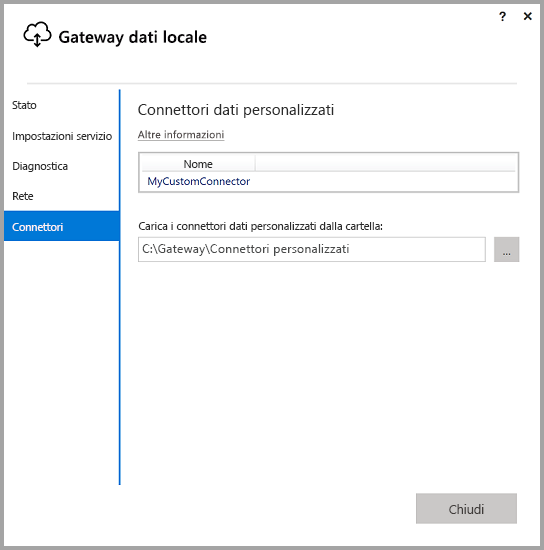
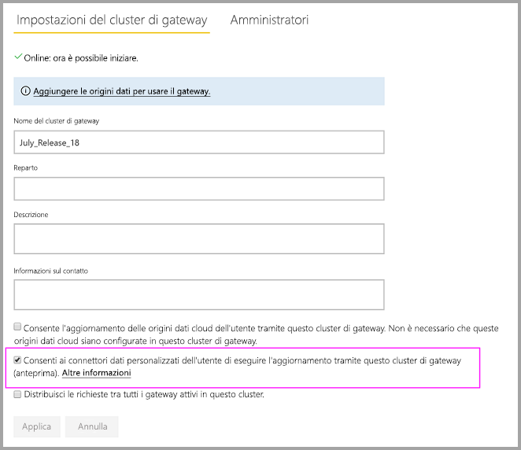
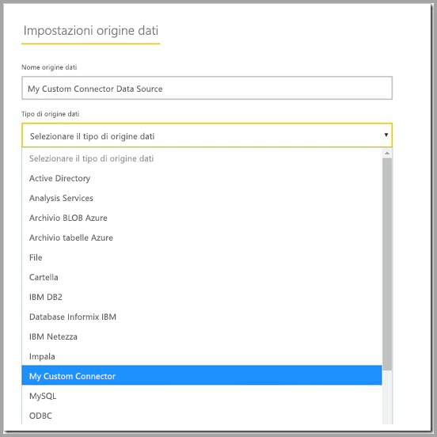

# Usare i connettori dati personalizzati con il gateway dati locale

[!INCLUDE [gateway-rewrite](includes/gateway-rewrite.md)]

I connettori dati per Power BI consentono di connettersi ai dati e di accedervi da un'applicazione, un servizio o un'origine dati. È possibile sviluppare connettori dati personalizzati e usarli in Power BI Desktop.

Per altre informazioni su come sviluppare connettori dati personalizzati per Power BI, vedere la [pagina di GitHub relativa all'SDK per i connettori dati](https://aka.ms/dataconnectors). Questo sito include informazioni introduttive ed esempi per Power BI e Power Query.

Quando si creano report in Power BI Desktop che usano connettori dati personalizzati, è possibile usare il gateway dati locale per aggiornare i report dal servizio Power BI.

## Abilitare e usare questa funzionalità

Quando si installa la versione di luglio 2018 del gateway dati locale o una versione successiva, è possibile visualizzare una scheda **Connettori** nell'app del gateway dati locale. Nella casella **Carica i connettori dati personalizzati dalla cartella** selezionare una cartella a cui l'utente che esegue il servizio gateway possa accedere. L'utente predefinito è *NT SERVICE\PBIEgwService*. Il gateway carica automaticamente i file dei connettori personalizzati che si trovano in tale cartella. I connettori dati vengono visualizzati nel relativo elenco.

Se si usa il gateway dati locale (modalità personale), è possibile caricare il report di Power BI nel servizio Power BI e usare il gateway per aggiornarlo.

Per il gateway dati locale, è necessario creare un'origine dati per il connettore personalizzato. Nella pagina delle impostazioni del gateway nel servizio Power BI viene visualizzata un'opzione quando si seleziona il cluster di gateway per consentire l'uso di connettori personalizzati con questo cluster. Assicurarsi che in tutti i gateway del cluster sia installata la versione di aggiornamento di luglio 2018 o un versione successiva, affinché questa opzione sia disponibile. Selezionare l'opzione per consentire l'uso dei connettori personalizzati con il cluster.

Quando questa opzione è abilitata, i connettori personalizzati vengono visualizzati come origini dati disponibili che è possibile creare in questo cluster di gateway. Dopo aver creato un'origine dati che usa il nuovo connettore personalizzato, è possibile aggiornare i report di Power BI usando tale connettore personalizzato nel servizio Power BI.

## Considerazioni e limitazioni

* Assicurarsi che la cartella creata sia accessibile per il servizio gateway in background. In genere, le cartelle nella cartella di Windows o le cartelle di sistema dell'utente non saranno accessibili. L'app del gateway dati locale visualizza un messaggio se la cartella non è accessibile. Ciò non si applica al gateway dati locale (modalità personale).
* Affinché i connettori personalizzati possano interagire con il gateway dati locale, è necessario implementare una sezione "TestConnection" nel codice del connettore personalizzato. Questa sezione non è necessaria quando si usano connettori personalizzati con Power BI Desktop. Per questo motivo, è possibile avere un connettore che funziona con Power BI Desktop ma non con il gateway. Per altre informazioni su come implementare una sezione TestConnection, vedere [questa documentazione](https://github.com/Microsoft/DataConnectors/blob/master/docs/m-extensions.md#implementing-testconnection-for-gateway-support).
* OAuth per i connettori personalizzati tramite gateway è attualmente supportato solo per gli amministratori del gateway ma non per altri utenti dell'origine dati.

## Passaggi successivi

* [Gestire l'origine dati - Analysis Services](service-gateway-enterprise-manage-ssas.md)  
* [Gestire l'origine dati - SAP HANA](service-gateway-enterprise-manage-sap.md)  
* [Gestire l'origine dati - SQL Server](service-gateway-enterprise-manage-sql.md)  
* [Gestire l'origine dati - Oracle](service-gateway-onprem-manage-oracle.md)  
* [Gestire l'origine dati - Importazione/aggiornamento pianificato](service-gateway-enterprise-manage-scheduled-refresh.md)
* [Configurare le impostazioni del proxy per il gateway dati locale](/data-integration/gateway/service-gateway-proxy)
* [Usare Kerberos per l'accesso Single Sign-On (SSO) da Power BI alle origini dati locali](service-gateway-sso-kerberos.md)  

Altre domande? Provare a chiedere alla [community di Power BI](https://community.powerbi.com/).
