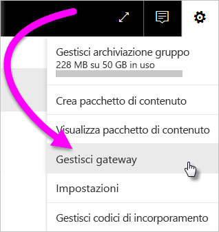
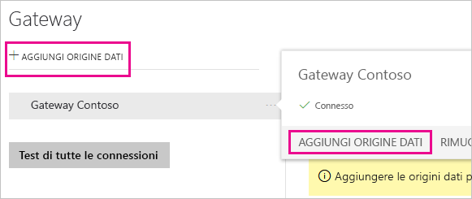
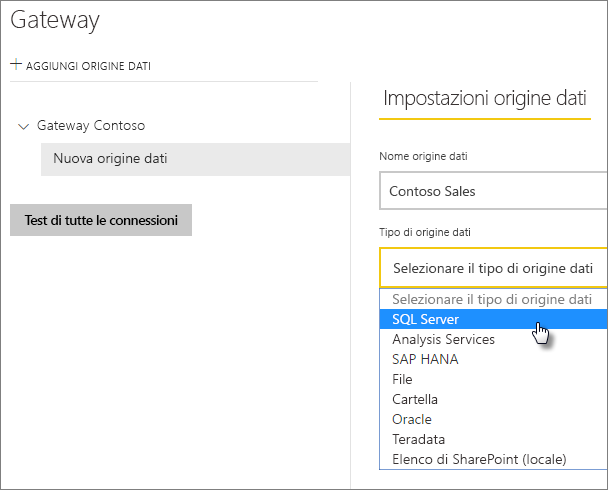
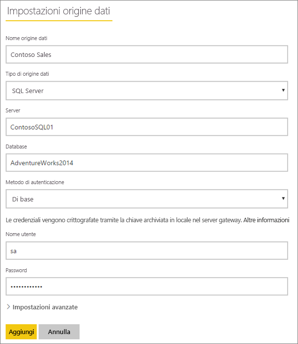
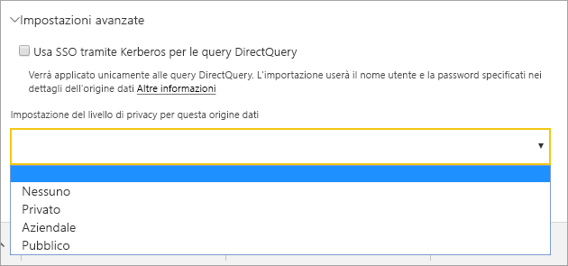
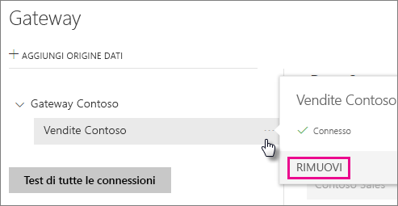
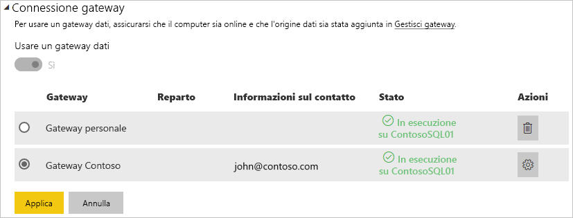
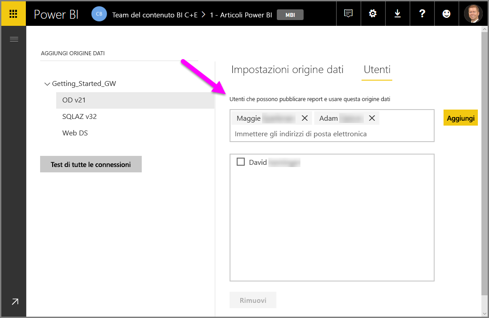
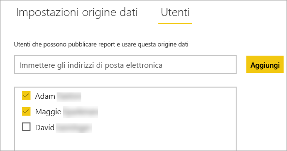

# Gestire le origini dati

[!INCLUDE [gateway-rewrite](includes/gateway-rewrite.md)]

Power BI supporta molte [origini dati locali](power-bi-data-sources.md), ognuna delle quali ha requisiti specifici. Un gateway può essere usato per una singola origine dati o più origini dati. Per questo esempio viene illustrato come aggiungere SQL Server come origine dati. La procedura si ripete in modo simile per eventuali altre origini dati.

La maggior parte delle operazioni di gestione delle origini dati può essere eseguita anche usando le API. Per altre informazioni, vedere [API REST (gateway).](/rest/api/power-bi/gateways)

## Aggiungere un'origine dati

1. Nell'angolo in alto a destra del servizio Power BI selezionare l'icona dell'ingranaggio  > **Gestisci gateway**.

    

2. Selezionare un gateway e quindi selezionare **Aggiungi origine dati**. In alternativa, passare a **Gateway** > **Aggiungi origine dati**.

    

3. Selezionare il **Tipo di origine dati**.

    

4. Immettere le informazioni per l'origine dati. In questo esempio si tratta di **Server**, **Database** e altri dettagli. 

    

5. Per SQL Server, scegliere un **metodo di autenticazione** di **Windows** o **Di base** (Autenticazione SQL). Se si sceglie **Di base**, immettere le credenziali per l'origine dati.

6. In **Impostazioni avanzate** è possibile configurare [Single Sign-On (SSO)](service-gateway-sso-overview.md) per l'origine dati. 

    

È possibile configurare **Usa SSO tramite Kerberos per le query DirectQuery** o **Usa SSO tramite Kerberos per le query DirectQuery e di importazione** per i report basati su DirectQuery e **Usa SSO tramite Kerberos per le query DirectQuery e di importazione** per i report basati sull'aggiornamento.

Se si attiva l'opzione **Usa SSO tramite Kerberos per le query DirectQuery** e si usa questa origine dati per un report basato su DirectQuery, verrà usato l'utente mappato all'utente di (Azure) Active Directory che accede al servizio Power BI. Per un report basato sull'aggiornamento, verranno usate le credenziali immesse nei campi **Nome utente** e **Password**.

Se si attiva l'opzione **Usa SSO tramite Kerberos per le query DirectQuery e di importazione**, non è necessario specificare le credenziali. Se si usa questa origine dati per un report basato su DirectQuery, verrà usato l'utente mappato all'utente di (Azure) Active Directory che accede al servizio Power BI.  Per un report basato sull'aggiornamento, verrà usato il contesto di sicurezza del proprietario del set di dati.

> [!NOTE]
>SSO per le query di importazione è disponibile solo per l'elenco di origini dati SSO che usano la [delega vincolata Kerberos](service-gateway-sso-kerberos.md).

7. Facoltativamente, in **Impostazioni avanzate** configurare il [livello di privacy](https://support.office.com/article/Privacy-levels-Power-Query-CC3EDE4D-359E-4B28-BC72-9BEE7900B540) per l'origine dati (non si applica a [DirectQuery](desktop-directquery-about.md)).

    

8. Selezionare **Aggiungi**. Se il processo ha esito positivo viene visualizzato il messaggio *Connessione riuscita*.

    

Ora è possibile usare questa origine dati per includere dati da SQL Server nei dashboard e nei report di Power BI.

## Rimuovere un'origine dati

Se non si usa più un'origine dati, è possibile rimuoverla. La rimozione di un'origine dati presuppone l'interruzione di tutti i dashboard e i report che si basano sull'origine dati rimossa.

Per rimuovere un'origine dati, passare all'origine dati e quindi selezionare **Rimuovi**.

## Usare l'origine dati per l'aggiornamento pianificato o la connessione DirectQuery

Dopo aver creato l'origine dati, è possibile usarla con le connessioni DirectQuery o l'aggiornamento pianificato.

> [!NOTE]
>I nomi del server e del database devono corrispondere tra Power BI Desktop e l'origine dati all'interno del gateway dati locale.

Il collegamento tra il set di dati e l'origine dati nel gateway si basa sul nome del server e sul nome del database. Questi nomi devono corrispondere. Ad esempio, se si indica un indirizzo IP per il nome del server, in Power BI Desktop è necessario usare l'indirizzo IP per l'origine dati nella configurazione del gateway. Se si usa *SERVER\ISTANZA*, in Power BI Desktop è necessario usarlo lo stesso nell'origine dati configurata per il gateway.

Se si è presenti nella scheda **Utenti** dell'origine dati configurata nel gateway e i nomi del server e del database corrispondono, il gateway viene visualizzato come opzione da usare con l'aggiornamento pianificato.

> [!WARNING]
> Se il set di dati contiene più origini dati, è necessario aggiungere ogni origine dati nel gateway. Se al gateway non vengono aggiunte origini dati, il gateway non è disponibile per l'aggiornamento pianificato.

### Limitazioni

OAuth è uno schema di autenticazione supportato solo per connettori personalizzati con il gateway dati locale. Non è possibile aggiungere altre origini dati che richiedono OAuth. Se il set di dati ha un'origine dati che richiede OAuth e tale origine dati non è un connettore personalizzato, non è possibile usare il gateway per l'aggiornamento pianificato.

## Gestire gli utenti

Dopo avere aggiunto un'origine dati a un gateway, si concede l'accesso all'origine dati specifica (non all'intero gateway) a utenti e gruppi di sicurezza abilitati per la posta elettronica. L'elenco di utenti di un'origine dati controlla soltanto chi è autorizzato a pubblicare report che includono dati provenienti da tale origine. I proprietari di report possono creare dashboard, pacchetti di contenuto e app e condividerli con altri utenti.

È anche possibile concedere a utenti e gruppi di sicurezza l'accesso amministrativo al gateway.

### Aggiungere utenti a un'origine dati

1. Nell'angolo in alto a destra del servizio Power BI selezionare l'icona dell'ingranaggio  > **Gestisci gateway**.

2. Selezionare l'origine dati a cui si vuole aggiungere utenti.

3. Selezionare **Utenti** e immettere un utente dell'organizzazione al quale si intende concedere accesso all'origine dati selezionata. Nella schermata seguente ad esempio si aggiungono Maggie e Adam.

    

4. Selezionare **Aggiungi**. Il nome del membro aggiunto verrà visualizzato nella casella.

    

Non dimenticare che è necessario aggiungere utenti a ogni origine dati a cui si vuole concedere l'accesso. Ogni origine dati dispone di un elenco separato di utenti. Aggiungere gli utenti a ciascuna origine dati separatamente.

### Rimuovere utenti da un'origine dati

Nella scheda **Utenti** dell'origine dati è possibile rimuovere gli utenti o i gruppi di sicurezza che possono usare l'origine dati.

## Archiviare le credenziali crittografate nel cloud

Quando si aggiunge un'origine dati al gateway, è necessario specificare le credenziali per l'origine dati. Tutte le query all'origine dati verranno eseguite usando queste credenziali. Le credenziali vengono crittografate in modo sicuro usando la crittografia asimmetrica in modo che non possano essere decrittografate nel cloud prima di essere archiviate nel cloud. Le credenziali vengono inviate al computer che esegue il gateway, in locale, dove vengono decrittografate durante l'accesso alle origini dati.

## Elenco di tipi di origini dati disponibili

Per informazioni sulle origini dati supportate dal gateway dati locale, vedere [Origini dati di Power BI](power-bi-data-sources.md).

## Passaggi successivi

* [Gestire l'origine dati - Analysis Services](service-gateway-enterprise-manage-ssas.md)
* [Gestire l'origine dati - SAP HANA](service-gateway-enterprise-manage-sap.md)
* [Gestire l'origine dati - SQL Server](service-gateway-enterprise-manage-sql.md)
* [Gestire l'origine dati - Oracle](service-gateway-onprem-manage-oracle.md)
* [Gestire l'origine dati - Importazione/aggiornamento pianificato](service-gateway-enterprise-manage-scheduled-refresh.md)
* [Indicazioni per la distribuzione di un gateway dati](service-gateway-deployment-guidance.md)

Altre domande? Provare la [Community di Power BI](https://community.powerbi.com/).
