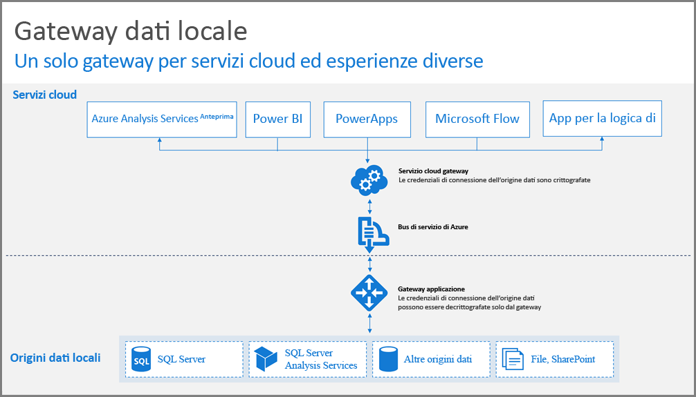
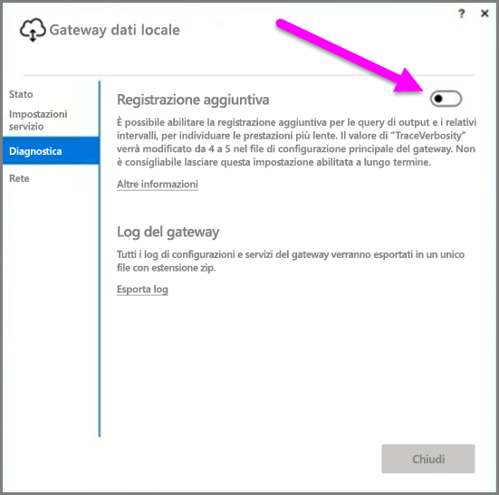
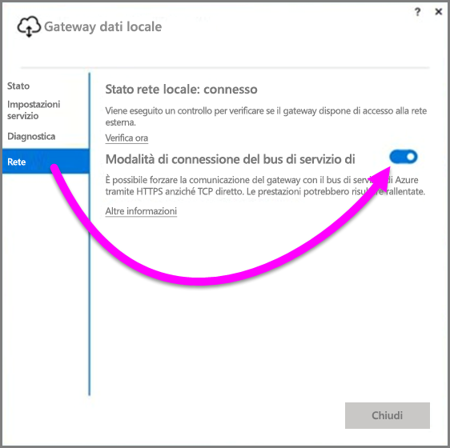

# Indicazioni per la distribuzione di un gateway dati per Power BI

Questo articolo fornisce indicazioni e considerazioni per la distribuzione di un gateway dati nell'ambiente di rete. Il termine **gateway** indica il software usato per agevolare l'accesso a dati che risiedono in una rete privata locale allo scopo di usarli in un servizio cloud, come Power BI. Questo articolo illustra la distribuzione e le indicazioni per la configurazione del **gateway dati locale**.

Per altre informazioni sul **Gateway dati locale**, incluso un collegamento per installarlo, leggere questo [post di blog](https://powerbi.microsoft.com/blog/power-bi-gateways-march-update/).

## Considerazioni sull'installazione per il gateway dati locale
Prima di approfondire ulteriormente i dettagli relativi a installazione e distribuzione, ci sono alcune considerazioni da tenere in mente. Le sezioni seguenti descrivono informazioni importanti da tenere sempre ben presenti.

### Numero di utenti
Il numero di utenti che utilizzano un report che usa il gateway è un parametro importante per decidere dove installare il gateway. Di seguito sono riportate alcune domande da considerare:

* Gli utenti useranno questi report in momenti diversi del giorno?
* Quali tipi di connessioni sono in uso (DirectQuery o importazione)?
* Tutti gli utenti usano lo stesso report?

Se gli utenti hanno tutti accesso a un determinato report alla stessa ora di ogni giorno, è consigliabile assicurarsi di installare il gateway in un computer che possa gestire tutte le richieste (vedere le sezioni seguenti per i contatori delle prestazioni e i requisiti minimi che consentono di determinarlo).

In **Power BI** esiste un vincolo che consente *un solo* gateway per *report*, pertanto anche se un report si basa su più origini dati, tutte queste origini dati devono transitare attraverso un singolo gateway. Tuttavia, se un dashboard è basato su *più* report, è possibile usare un gateway dedicato per ogni report partecipante e quindi distribuire il carico di gateway tra quei report che contribuiscono a tale dashboard singolo.

### Tipo di connessione
**Power BI** offre due tipi di connessioni: **DirectQuery** e **importazione**. Non tutte le origini dati supportano entrambi i tipi di connessione e diversi motivi possono contribuire alla scelta di uno di essi, ad esempio requisiti di sicurezza, prestazioni, limiti di dati e le dimensioni dei modelli di dati. Per altre informazioni sul tipo di connessione e sulle origini dati supportate vedere la sezione dell'*elenco dei tipi di origini dati disponibili* dell'[articolo sul gateway dati locale](service-gateway-onprem.md).

A seconda del tipo di connessione in uso, l'utilizzo del gateway può essere diverso. Ad esempio, è consigliabile separare le origini dati **DirectQuery** dalle origini dati di **Aggiornamento pianificato** laddove possibile (presupponendo che si trovino in report diversi e possano essere separate). Ciò impedisce al gateway di accumulare migliaia di richieste DirectQuery in coda, contemporaneamente all'aggiornamento pianificato del mattino di un modello di dati di grandi dimensioni che viene usato per il dashboard principale della società. Ecco i fattori da considerare per ciascuno di essi:

* Per **Aggiornamento pianificato**: a seconda delle dimensioni della query e del numero di aggiornamenti che si verificano ogni giorno, è possibile scegliere di restare nei requisiti hardware minimi consigliati oppure eseguire l'aggiornamento a un computer con prestazioni superiori. Se una determinata query non è stata ridotta, si verificano trasformazioni nel computer del gateway e, di conseguenza, il computer del gateway trae vantaggio dalla maggiore quantità di RAM disponibile.
* Per **DirectQuery**: viene inviata una query ogni volta che un utente apre il report o esamina i dati. Dunque, se si prevede l'accesso simultaneo di più di 1.000 utenti, è consigliabile assicurarsi che il computer abbia componenti hardware soli di affidabili. Un numero maggiore di memorie centrali CPU garantisce una migliore velocità effettiva per una connessione **DirectQuery**.

I requisiti per un computer in cui si installa un **gateway dati locale** sono i seguenti:

**Minimo:**

* .NET Framework 4.5
* Versione a 64 bit di Windows 7/Windows Server 2008 R2 (o versione successiva)

**Consigliato:**

* CPU 8 core
* 8 GB di memoria
* Versione a 64 bit di Windows 2012 R2 (o versione successiva)

### Posizione
La posizione di installazione del gateway può avere un impatto significativo sulle prestazioni delle query, quindi assicurarsi che il gateway, i percorsi di origine dati e il tenant di Power BI siano più vicino possibile tra loro per ridurre al minimo la latenza di rete. Per determinare la posizione del tenant di Power BI, nel servizio Power BI selezionare l'icona **?** nell'angolo in alto a destra e quindi scegliere **Informazioni su Power BI**.

### Monitoraggio dei gateway
Esistono alcuni strumenti che è possibile usare per monitorare l'uso e le prestazioni dei gateway installati.

#### Contatori delle prestazioni
Esistono molti contatori delle prestazioni che possono essere usati per valutare e stimare l'attività che si verificano nel gateway. I contatori consentono di comprendere se è disponibile un volume elevato di attività per tipo specifico, che può richiedere la distribuzione di un nuovo gateway.

> [!NOTE]
> Questi contatori non acquisiscono la durata dell'attività specifica.
> 
> 

Il *contatore del gateway*, oltre ai contatori del computer, offre un'idea della quantità di carico gestita dal computer e può indicare se la capacità di risorse del server viene estesa o superata.

È possibile accedere a questi contatori da **Windows Performance Monitor** e utilizzarli da qualsiasi strumento di creazione report utile a questo scopo. Per una panoramica dettagliata dell'uso del monitor delle prestazioni del gateway con Power BI, leggere il seguente post di blog creato dalla community.

* [Monitorare i gateway dati locali](https://insightsquest.com/2016/08/08/monitor-on-premises-data-gateways/)

#### Log
I log di configurazione e servizio offrono un'altra dimensione su quanto avviene nel gateway. Verificare sempre i log del gateway quando la connessione non funziona come previsto, perché non tutti i messaggi di errore emergono nel servizio Power BI.

Un modo semplice per visualizzare tutti i file di log nel computer locale è usare il pulsante *Esporta log* nel **gateway dati locale** quando si apre nuovamente il gateway dopo che l'installazione iniziale è stata completata, quindi selezionare **Diagnostica > Esporta log**.

#### Registrazione aggiuntiva
Per impostazione predefinita il gateway esegue la registrazione di base. Se si sta ricercando la causa di problemi del gateway e servono altre informazioni sui dettagli di connessione di query, è possibile abilitare temporaneamente la *registrazione dettagliata* per raccogliere informazioni di log aggiuntive. A tale scopo, nel gateway installato selezionare **Diagnostica > Registrazione aggiuntiva**.

A seconda dell'utilizzo di gateway, l'abilitazione di questa impostazione può aumentare notevolmente le dimensioni del log. Una volta completata l'analisi dei registri, è consigliabile disabilitare la **Registrazione aggiuntiva**. Non è consigliabile lasciare questa impostazione abilitata durante il normale utilizzo del gateway.

#### Configurazione di rete
Il gateway crea una connessione in uscita al **Bus di servizio di Azure**. Il gateway comunica sulle seguenti porte in uscita:

* TCP 443 (predefinita)
* 5671
* 5672
* Da 9350 a 9354

Il gateway *non* richiede porte in entrata. Tutte le porte richieste sono elencate nell'elenco precedente.

È consigliabile aggiungere all'elenco elementi consentiti nel firewall gli indirizzi IP per l'area dati. È possibile scaricare l'elenco di indirizzi, IP, disponibile nell'[elenco di IP del data center di Microsoft Azure](https://www.microsoft.com/download/details.aspx?id=41653). Questo elenco viene aggiornato ogni settimana. Il gateway comunicherà con un **Bus di servizio di Azure** usando l'indirizzo IP specificato insieme al nome di dominio completo (FQDN). Se si impone al gateway di comunicare tramite HTTPS, verrà usato esclusivamente il nome di dominio completo e non avrà luogo alcuna comunicazione usando gli indirizzi IP.

#### Forzare la comunicazione HTTPS con il bus di servizio di Azure
È possibile imporre al gateway di comunicare con il **bus di servizio di Azure** usando HTTPS anziché TCP diretto. Questo però determina una lieve riduzione delle prestazioni. È anche possibile forzare il gateway a comunicare con il **bus di servizio di Azure** usando HTTPS con l'interfaccia utente del gateway (a partire dalla versione di marzo 2017 del gateway).

A tale scopo, nel gateway selezionare **Rete**, quindi impostare **Modalità di connettività del bus di servizio di Azure** su **Attiva**.

### Informazioni aggiuntive
Questa sezione contiene indicazioni aggiuntive per la distribuzione e la gestione dei gateway.

* Evitare di avere un singolo punto di errore. Se possibile, distribuire le origini dati locali in gateway diversi; in questo caso, se un computer non è più disponibile, sarà ancora possibile aggiornare parti dei dati e non perdere completamente tale funzionalità.
* Il gateway non può essere installato in un controller di dominio, quindi evitare di pianificare o provare questa operazione.
* Non installare un gateway in un computer che può essere disattivato, sospeso o non connesso a Internet (ad esempio un portatile), perché il gateway non può essere eseguito in tali circostanze.
* Evitare di installare un gateway in una rete wireless, perché le prestazioni del gateway potrebbero peggiorare.

#### Ripristino del gateway
È possibile ripristinare il gateway esistente o spostarlo in un nuovo computer usando la **chiave di ripristino**, fornita all'utente che installa il gateway, che *non può* essere cambiata successivamente. La chiave di ripristino viene usata per la crittografia dei dati e il ripristino del gateway.

Per ripristinare il gateway, assicurarsi di essere un amministratore del gateway, verificare che si conosca il nome del gateway, verificare di avere la chiave di ripristino corretta e di avere un nuovo computer disponibile con caratteristiche di prestazioni simili.

Dopo l'accesso, selezionare l'opzione **Migrate an existing gateway** (Eseguire la migrazione di un gateway esistente). Successivamente, è necessario scegliere il gateway che si vuole ripristinare o di cui eseguire la migrazione e infine specificare la chiave di ripristino, quindi premere Configura. Al termine di questo passaggio, il gateway precedente verrà sostituito dal nuovo gateway, che erediterà il nome e tutte le origini dati configurate in precedenza. Tutte le origini dati passeranno dal nuovo computer, senza la necessità di pubblicarle nuovamente. Il failover automatico non è ancora supportato, ma è una funzionalità di cui si sta attivamente occupando il team del gateway.

#### Amministratori
È possibile trovare un elenco di amministratori di gateway nel **servizio Power BI**. Dopo aver eseguito l'accesso al **servizio Power BI**, selezionare **Impostazioni** (icona a forma di ingranaggio) **> Gestisci gateway > interfaccia utente del gateway**.  

Da qui, è possibile selezionare un gateway e visualizzare l'elenco degli amministratori di gateway. Gli amministratori elencati possono accedere, ripristinare ed eliminare il gateway, ma possono anche aggiungere ed eliminare origini dati nel gateway. Per assicurarsi che tutti gli amministratori dell'organizzazione abbiano accesso a tutti i gateway nel proprio gruppo, si consiglia quanto segue:

* Creare un gruppo di sicurezza **AAD** e aggiungervi altri utenti, quindi aggiungere questo gruppo di sicurezza all'elenco dei rispettivi amministratori di gateway. In questo modo si garantisce che solo una persona possa accedere al gateway in caso di errore o quando è necessario ripristinarlo o eseguirne la migrazione. In più, altri amministratori potranno osservare quali gateway vengono usati nei propri gruppi e quali origini dati esistono in ciascun gateway.

## Passaggi successivi
[Configurazione delle impostazioni proxy](service-gateway-proxy.md)  
[Risoluzione dei problemi del gateway dati locale](service-gateway-onprem-tshoot.md)  
[Domande frequenti sul gateway dati locale](service-gateway-onprem-faq.md)  

Altre domande? [Provare la community di Power BI](http://community.powerbi.com/)

