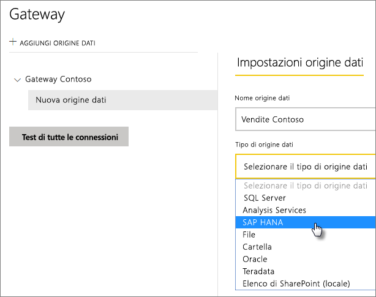
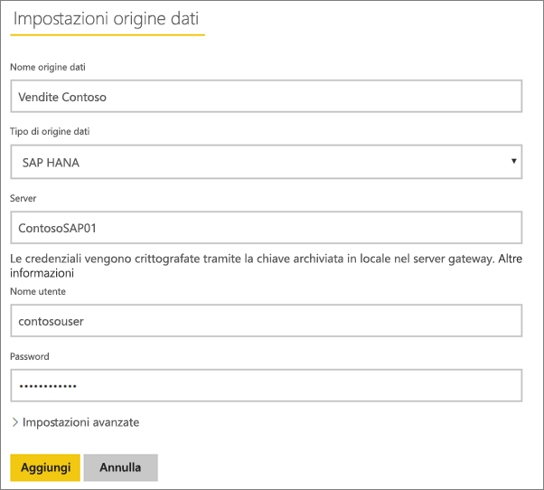
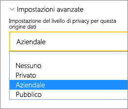
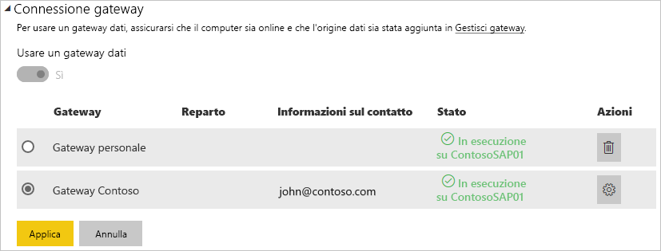

# Gestire l'origine dati - SAP HANA

[!INCLUDE [gateway-rewrite](includes/gateway-rewrite.md)]

Dopo aver [installato il gateway dati locale](/data-integration/gateway/service-gateway-install), è necessario [aggiungere le origini dati](service-gateway-data-sources.md#add-a-data-source) che possono essere usate con il gateway. Questo articolo descrive l'uso di gateway e origini dati SAP HANA per l'aggiornamento pianificato o per DirectQuery.

## Aggiungere un'origine dati

Per altre informazioni sull'aggiunta di un'origine dati, vedere [Aggiungere un'origine dati](service-gateway-data-sources.md#add-a-data-source). In **Tipo di origine dati** selezionare **SAP HANA**.

Dopo aver selezionato il tipo di origine dati SAP HANA, inserire le informazioni per l'origine dati, tra cui **Server**, **Nome utente** e **Password**.

> [!NOTE]
> Tutte le query all'origine dati verranno eseguite utilizzando queste credenziali. Per altre informazioni sulla modalità di archiviazione delle credenziali, vedere [Archiviazione di credenziali crittografate nel cloud](service-gateway-data-sources.md#store-encrypted-credentials-in-the-cloud).

Dopo aver compilato tutti i campi, selezionare **Aggiungi**. È ora possibile usare questa origine dati per l'aggiornamento pianificato o per DirectQuery in un server SAP HANA locale. Se la connessione ha esito positivo, viene visualizzato il messaggio *Connessione riuscita*.

### Impostazioni avanzate

È possibile configurare il livello di privacy per l'origine dati, se necessario. Questa impostazione controlla il modo in cui possono essere combinati i dati. e viene usata solo per l'aggiornamento pianificato, ma non si applica a DirectQuery. Per altre informazioni sui livelli di privacy per l'origine dati, vedere [Livelli di privacy (Power Query)](https://support.office.com/article/Privacy-levels-Power-Query-CC3EDE4D-359E-4B28-BC72-9BEE7900B540).

## Usare l'origine dati

Dopo aver creato l'origine dati, è possibile usarla con le connessioni DirectQuery o l'aggiornamento pianificato.

> [!NOTE]
> I nomi del server e del database devono corrispondere tra Power BI Desktop e l'origine dati all'interno del gateway dati locale.

Il collegamento tra il set di dati e l'origine dati all'interno del gateway si basa sul nome del server e sul nome del database. Questi nomi devono corrispondere. Se ad esempio si specifica un indirizzo IP per il nome del server all'interno di Power BI Desktop, è necessario usare l'indirizzo IP per l'origine dati all'interno della configurazione del gateway. Se si usa in Power BI Desktop si usa l'opzione *SERVER\INSTANCE* (SERVER\ISTANZA), è necessario usarla anche nell'origine dati configurata per il gateway.

Questo vale sia per DirectQuery che per l'aggiornamento pianificato.

### Usare l'origine dati con le connessioni DirectQuery

Verificare che i nomi del server e del database corrispondano tra Power BI Desktop e l'origine dati configurata per il gateway. È anche necessario assicurarsi che l'utente sia elencato nella scheda **Utenti** dell'origine dati per pubblicare i set di dati DirectQuery. La selezione per DirectQuery avviene all'interno di Power BI Desktop alla prima importazione dei dati. Per altre informazioni su come usare DirectQuery, vedere [Usare DirectQuery in Power BI Desktop](desktop-use-directquery.md).

Dopo la pubblicazione, da Power BI Desktop o **Recupera dati**, i report devono iniziare a funzionare. Dopo la creazione dell'origine dati nel gateway, potrebbero essere necessari alcuni minuti prima di usare la connessione.

### Uso dell’origine dati con l'aggiornamento pianificato

Se si è presenti nella scheda **Utenti** dell'origine dati configurata all'interno del gateway e i nomi del server e del database corrispondono, il gateway viene visualizzato come opzione da usare con l'aggiornamento pianificato.

## Passaggi successivi

* [Risoluzione dei problemi del gateway dati locale](/data-integration/gateway/service-gateway-tshoot)
* [Risolvere i problemi relativi ai gateway - Power BI](service-gateway-onprem-tshoot.md) 

Altre domande? Provare a chiedere alla [community di Power BI](http://community.powerbi.com/).

