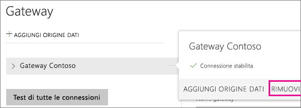
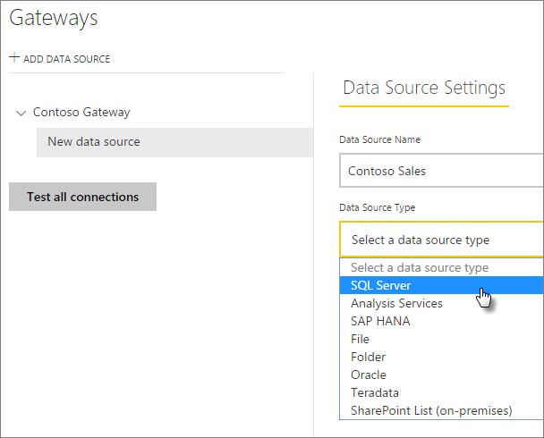
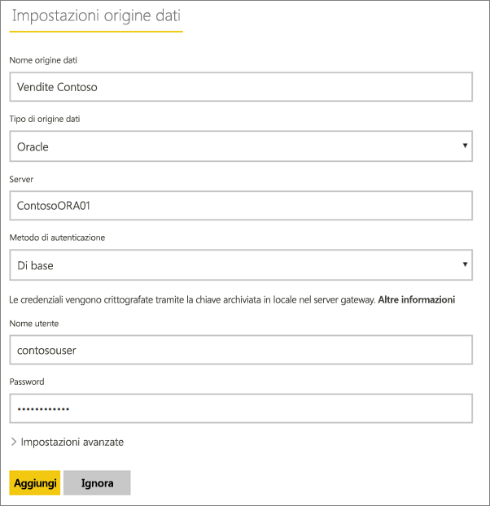
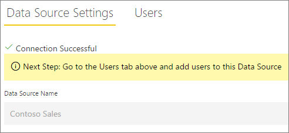
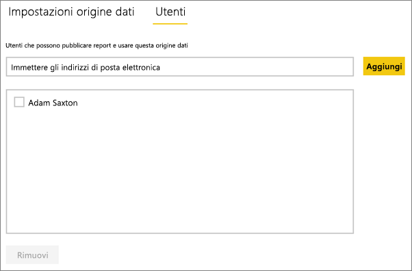
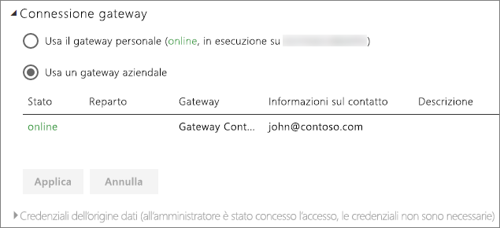

# Gestire l'origine dati - Importazione/aggiornamento pianificato
Dopo aver installato il gateway dati locale, sarà necessario aggiungere le origini dati che possono essere usate con il gateway. Questo articolo descrive l'uso di gateway e origini dati per l'aggiornamento pianificato rispetto all'uso di DirectQuery o di connessioni in tempo reale.

## Download e installazione del gateway
È possibile scaricare il gateway dal servizio Power BI. Selezionare **Download** > **Gateway dati** oppure passare alla [pagina di download del gateway](https://go.microsoft.com/fwlink/?LinkId=698861).

## Aggiungere un gateway
Per aggiungere un gateway, [scaricare](https://go.microsoft.com/fwlink/?LinkId=698863) e installare semplicemente il gateway aziendale in un server nel proprio ambiente. Dopo aver installato il gateway, verrà visualizzato negli elenchi dei gateway in **Gestisci gateway**.

> [!NOTE]
> **Gestisci gateway** non compare fino a quando non si è l'amministratore di almeno un gateway. Questa situazione può verificarsi sia se si viene aggiunti come amministratore sia se si installa e configura un gateway.
> 
> 

## Rimuovere un gateway
Rimuovendo un gateway si eliminano anche tutte le origini dati in tale gateway.  Questo inoltre interrompe tutti i dashboard e i report che si basano su tali origini dati.

1. Selezionare l'icona dell'ingranaggio  nell'angolo in alto a destra e scegliere **Gestisci gateway**.
2. Gateway > **Rimuovi**.
   
   

## Aggiungere un'origine dati
È possibile aggiungere un'origine dati, selezionando un gateway e facendo clic su **Aggiungi origine dati** o passando al Gateway > **Aggiungi origine dati**.

È quindi possibile selezionare il **tipo di origine dati** dall'elenco. Tutte le origini dati elencate possono essere usate per l'aggiornamento pianificato con il gateway aziendale. È possibile usare Analysis Services, SQL Server e SAP HANA per l'aggiornamento pianificato o per DirectQuery/connessioni in tempo reale.

Inserire quindi le informazioni per l'origine dati, che includono informazioni sull'origine e credenziali usate per accedere all'origine dati.

> [!NOTE]
> Tutte le query all'origine dati verranno eseguite utilizzando queste credenziali. Per altre informazioni su come vengono archiviate le [credenziali](service-gateway-onprem.md#credentials) vedere l'articolo principale sul gateway dati locale.
> 
> 

È possibile fare clic su **Aggiungi** dopo aver compilato tutti i campi.  È ora possibile usare questa origine dati per l'aggiornamento pianificato con i dati locali. Verrà visualizzato *Connessione riuscita* se la connessione ha avuto esito positivo.

<!-- Shared Install steps Include -->
[!INCLUDE [gateway-onprem-datasources-include](./includes/gateway-onprem-datasources-include.md)]

### Impostazioni avanzate
È possibile configurare il livello di privacy per l'origine dati. Questa impostazione controlla la modalità di mashup dei dati. L'impostazione viene usata solo per l'aggiornamento pianificato [Altre informazioni](https://support.office.com/article/Privacy-levels-Power-Query-CC3EDE4D-359E-4B28-BC72-9BEE7900B540)

## Rimuovere un'origine dati
Rimuovendo un'origine dati si interrompono tutti i dashboard o i report che si basano sull'origine dati specificata.  

Per rimuovere un'origine dati, passare all'Origine dati > **Rimuovi**.

## Gestire gli amministratori
Nella scheda amministratori, per il gateway, è possibile aggiungere e rimuovere gli utenti che possono amministrare il gateway. Al momento è possibile solo aggiungere utenti. Impossibile aggiungere i gruppi di sicurezza.

## Gestire gli utenti
Sulla scheda utenti, per l'origine dati, è possibile aggiungere e rimuovere gli utenti o i gruppi di sicurezza che possono utilizzare l’origine dati.

> [!NOTE]
> L'elenco degli utenti controlla solo gli utenti autorizzati a pubblicare report. I proprietari di report possono creare dashboard o pacchetti di contenuto e condividerli con altri utenti.
> 
> 

## Uso dell’origine dati per l'aggiornamento pianificato
Dopo aver creato l'origine dati, sarà possibile usarla con le connessioni DirectQuery o tramite l'aggiornamento pianificato.

> [!NOTE]
> I nomi del server e del database devono corrispondere tra Power BI Desktop e l'origine dati all'interno del gateway dati locale.
> 
> 

Il collegamento tra il set di dati e l'origine dati all'interno del gateway si basa sul nome del server e sul nome del database. Questi nomi devono corrispondere. Ad esempio, se si indica un indirizzo IP per il nome del server, all'interno di Power BI Desktop è necessario usare l'indirizzo IP per l'origine dati all'interno della configurazione del gateway. Se si usa *SERVER\ISTANZA*, in Power BI Desktop è necessario usarlo lo stesso all'interno dell'origine dati configurata per il gateway.

Se si è presenti nella scheda **Utenti** dell'origine dati configurata all'interno del gateway e i nomi del server e del database corrispondono, il gateway verrà visualizzato come un'opzione per l’uso con l'aggiornamento pianificato.

> [!WARNING]
> Se il set di dati contiene più origini dati, è necessario aggiungere ogni origine dati all'interno del gateway. Se al gateway non vengono aggiunte una o più origini dati, il gateway non verrà visualizzato come disponibile per l'aggiornamento pianificato.
> 
> 

## Limitazioni
* OAuth non è uno schema di autenticazione supportato con il gateway dati locale. Non è possibile aggiungere origini dati che richiedono OAuth. Se il set di dati dispone di un'origine dati che richiede OAuth, non sarà possibile usare il gateway per l'aggiornamento pianificato.

## Passaggi successivi
[Gateway dati locale](service-gateway-onprem.md)  
[Analisi approfondita del gateway dati locale](service-gateway-onprem-indepth.md)  
[Risoluzione dei problemi del gateway dati locale](service-gateway-onprem-tshoot.md)  
Altre domande? [Provare la community di Power BI](http://community.powerbi.com/)

