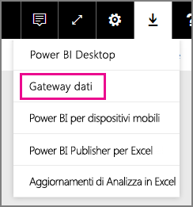
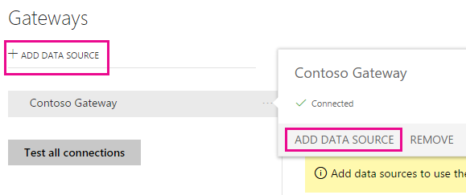
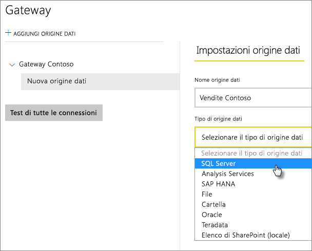
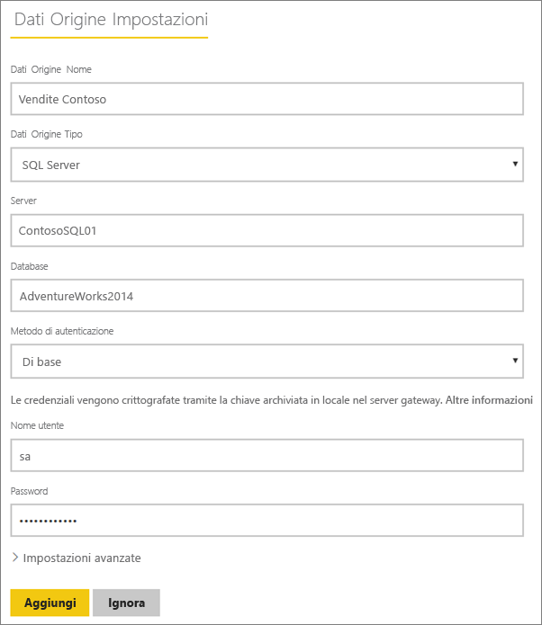
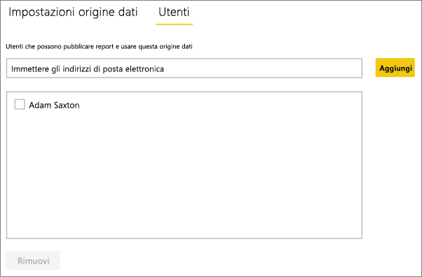
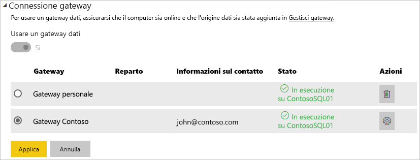

# Gestire l'origine dati - SQL Server
Dopo aver installato il gateway dati locale, è possibile aggiungere origini dati che possono essere usate con il gateway. In questo articolo viene descritto come lavorare con i gateway e le origini dati. È possibile usare l'origine dati SQL Server per l'aggiornamento pianificato o per DirectQuery.

## Download e installazione del gateway
È possibile scaricare il gateway dal servizio Power BI. Selezionare **Download** > **Gateway dati** oppure passare alla [pagina di download del gateway](https://go.microsoft.com/fwlink/?LinkId=698861).

## Aggiungere un gateway
Per aggiungere un gateway, [scaricare](https://go.microsoft.com/fwlink/?LinkId=698861) e installare semplicemente il gateway in un server nel proprio ambiente. Dopo aver installato il gateway, verrà visualizzato negli elenchi dei gateway in **Gestisci gateway**.

> [!NOTE]
> **Gestisci gateway** non compare fino a quando non si è l'amministratore di almeno un gateway. Ciò avviene quando si viene aggiunti come amministratore a un gateway o si installa e configura un gateway manualmente.
> 
> 

## Rimuovere un gateway
Rimuovendo un gateway si eliminano anche tutte le origini dati in tale gateway.  Questo inoltre interrompe tutti i dashboard e i report che si basano su tali origini dati.

1. Selezionare l'icona dell'ingranaggio  nell'angolo in alto a destra e scegliere **Gestisci gateway**.
2. Gateway > **Rimuovi**.
   
   

## Aggiungere un'origine dati
È possibile aggiungere un'origine dati, selezionando un gateway e facendo clic su **Aggiungi origine dati** o passando al Gateway > **Aggiungi origine dati**.

È quindi possibile selezionare il **tipo di origine dati** dall'elenco.

> [!NOTE]
> Quando si usa DirectQuery, il gateway supporta solo **SQL Server 2012 SP1** e versioni successive.
> 
> 

Inserire le informazioni per l'origine dati tra cui il **Server** e il **Database**.  

È inoltre necessario scegliere un **Metodo di autenticazione**,  **Windows** o **Basic**.  È preferibile scegliere **Basic** se si intende utilizzare l'autenticazione SQL anziché l'autenticazione di Windows. Immettere le credenziali che verranno utilizzate per questa origine dati.

> [!NOTE]
> Tutte le query all'origine dati verranno eseguite usando queste credenziali, a meno che Kerberos Single Sign On (SSO) sia configurato e attivato per l'origine dati. Con SSO, i set di dati di importazione usano le credenziali archiviate, ma i set di dati di DirectQuery usano l'utente di Power BI corrente per eseguire le query che usano SSO. Per altre informazioni su come vengono archiviate le [credenziali](service-gateway-onprem.md#credentials) vedere l'articolo principale sul gateway dati locale oppure l'articolo che descrive come [usare Kerberos per SSO (Single Sign-On) da Power BI alle origini dati locali](service-gateway-kerberos-for-sso-pbi-to-on-premises-data.md).
> 
> 

È possibile fare clic su **Aggiungi** dopo aver compilato tutti i campi.  È ora possibile usare questa origine dati per l'aggiornamento pianificato, o per DirectQuery, su un'istanza di SQL Server locale. Verrà visualizzato *Connessione riuscita* se la connessione ha avuto esito positivo.

### Impostazioni avanzate
È possibile configurare il livello di privacy per l'origine dati. Questa impostazione controlla la modalità di mashup dei dati. L'impostazione viene usata solo per l'aggiornamento pianificato e non per DirectQuery. [Altre informazioni](https://support.office.com/article/Privacy-levels-Power-Query-CC3EDE4D-359E-4B28-BC72-9BEE7900B540)

## Rimuovere un'origine dati
Rimuovendo un'origine dati si interrompono tutti i dashboard o i report che si basano sull'origine dati specificata.  

Per rimuovere un'origine dati, passare all'Origine dati > **Rimuovi**.

## Gestire gli amministratori
Nella scheda Amministratori del gateway è possibile aggiungere e rimuovere gli utenti o i gruppi di sicurezza che possono gestire il gateway.

## Gestire gli utenti
Sulla scheda utenti, per l'origine dati, è possibile aggiungere e rimuovere gli utenti o i gruppi di sicurezza che possono utilizzare l’origine dati.

> [!NOTE]
> L'elenco degli utenti controlla solo gli utenti autorizzati a pubblicare report. I proprietari di report possono creare dashboard o pacchetti di contenuto e condividerli con altri utenti.
> 
> 

## Uso dell'origine dati
Dopo aver creato l'origine dati, sarà possibile usarla con le connessioni DirectQuery o tramite l'aggiornamento pianificato.

> [!NOTE]
> I nomi del server e del database devono corrispondere tra Power BI Desktop e l'origine dati all'interno del gateway dati locale.
> 
> 

Il collegamento tra il set di dati e l'origine dati all'interno del gateway si basa sul nome del server e sul nome del database. Questi nomi devono corrispondere. Ad esempio, se si indica un indirizzo IP per il nome del server, all'interno di **Power BI Desktop** è necessario usare l'indirizzo IP per l'origine dati all'interno della configurazione del gateway. Se si usa *SERVER\ISTANZA*, in Power BI Desktop è necessario usarlo lo stesso all'interno dell'origine dati configurata per il gateway.

Questo vale sia per DirectQuery che per l'aggiornamento pianificato.

### Uso dell'origine dati con le connessioni DirectQuery
È necessario assicurarsi che i nomi del server e del database corrispondano tra **Power BI Desktop** e l'origine dati configurata per il gateway. È inoltre necessario assicurarsi che l'utente sia elencato nella scheda **Utenti** dell'origine dati per pubblicare i set di dati DirectQuery. Per DirectQuery, la selezione avviene all'interno di Power BI Desktop alla prima importazione dei dati. [Altre informazioni](desktop-use-directquery.md)

Dopo la pubblicazione, da Power BI Desktop o **Recupera dati**, i report dovrebbero iniziare a funzionare. Dopo la creazione dell'origine dati all'interno del gateway potrebbero essere necessari alcuni minuti prima di poter usare la connessione.

### Uso dell’origine dati con l'aggiornamento pianificato
Se si è presenti nella scheda **Utenti** dell'origine dati configurata all'interno del gateway e i nomi del server e del database corrispondono, il gateway verrà visualizzato come un'opzione per l’uso con l'aggiornamento pianificato.

## Passaggi successivi
* [Gateway dati locale](service-gateway-onprem.md)  
* [Analisi approfondita del gateway dati locale](service-gateway-onprem-indepth.md)  
* [Risoluzione dei problemi del gateway dati locale](service-gateway-onprem-tshoot.md)
* [Usare Kerberos per l'accesso Single Sign-On (SSO) da Power BI alle origini dati locali](service-gateway-kerberos-for-sso-pbi-to-on-premises-data.md). 
* Altre domande? [Provare la community di Power BI](http://community.powerbi.com/)

