# Gestire l'origine dati - Analysis Services
Dopo aver installato il gateway dati locale, sarà necessario aggiungere le origini dati che possono essere usate con il gateway. In questo articolo viene descritto come lavorare con i gateway e le origini dati. È possibile usare l'origine dati Analysis Services per l'aggiornamento pianificato o per le connessioni in tempo reale.

<iframe width="560" height="315" src="https://www.youtube.com/embed/ownIGbcRAAU" frameborder="0" allowfullscreen></iframe>

## Download e installazione del gateway
È possibile scaricare il gateway dal servizio Power BI. Selezionare **Download** > **Gateway dati** oppure passare alla [pagina di download del gateway](https://go.microsoft.com/fwlink/?LinkId=698861).

## Limitazioni di connessioni dinamiche ad Analysis Services
È possibile usare una connessione dinamica su istanze tabulari o multidimensionali.

| **Versione del server** | **SKU necessario** |
| --- | --- |
| 2012 SP1 CU4 o versione successiva |Business Intelligence e SKU Enterprise |
| 2014 |Business Intelligence e SKU Enterprise |
| 2016 |SKU standard o versione successiva |

* La formattazione a livello di cella e le funzionalità di conversione non sono supportate.
* Azioni e set denominati non sono esposti in Power BI. È comunque possibile connettersi a cubi multidimensionali che contengono anche azioni o set denominati e creare oggetti visivi e report.

## Aggiungere un gateway
Per aggiungere un gateway, [scaricare](https://go.microsoft.com/fwlink/?LinkId=698861) e installare semplicemente il gateway in un server nel proprio ambiente. Dopo aver installato il gateway, verrà visualizzato negli elenchi dei gateway in **Gestisci gateway**.

> [!NOTE]
> **Gestisci gateway** non compare fino a quando non si è l'amministratore di almeno un gateway. Questa situazione può verificarsi sia se si viene aggiunti come amministratore sia se si installa e configura un gateway.
> 
> 

## Rimuovere un gateway
Rimuovendo un gateway si eliminano anche tutte le origini dati in tale gateway.  Questo inoltre interrompe tutti i dashboard e i report che si basano su tali origini dati.

1. Selezionare l'icona dell'ingranaggio  nell'angolo in alto a destra e scegliere **Gestisci gateway**.
2. Gateway > **Rimuovi**.
   
   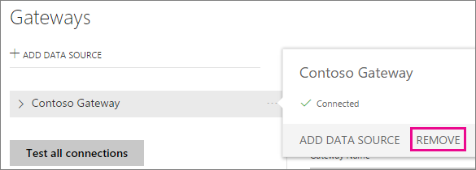

## Aggiungere un'origine dati
È possibile aggiungere un'origine dati, selezionando un gateway e facendo clic su **Aggiungi origine dati** o passando al Gateway > **Aggiungi origine dati**.

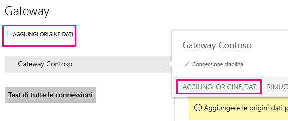

È quindi possibile selezionare il **tipo di origine dati** dall'elenco. Selezionare Analysis Services se ci si connette a un server tabulare o multidimensionale.

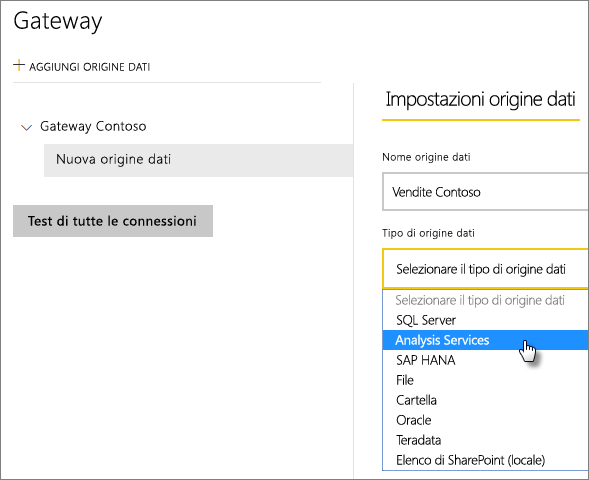

Inserire le informazioni per l'origine dati tra cui il **Server** e il **Database**.  

Il **Nome utente** e la **Password** immessi verranno usati dal gateway per connettersi all'istanza di Analysis Services.

> [!NOTE]
> L'account di Windows immesso deve avere le autorizzazioni di amministratore del server per l'istanza a cui ci si connette. Se la password dell'account è impostata in modo da scadere, gli utenti potrebbero visualizzare un errore di connessione se la password non viene aggiornata per l'origine dati. Per altre informazioni su come vengono archiviate le [credenziali](service-gateway-onprem.md#credentials) vedere l'articolo principale sul gateway dati locale.
> 
> 

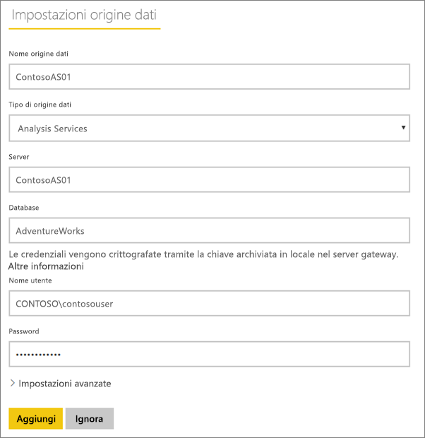

È possibile fare clic su **Aggiungi** dopo aver compilato tutti i campi.  È ora possibile usare questa origine dati per l'aggiornamento pianificato, o per le connessioni in tempo reale, su un'istanza di Analysis Services locale.  Verrà visualizzato *Connessione riuscita* se la connessione ha avuto esito positivo.

### Impostazioni avanzate
È possibile configurare il livello di privacy per l'origine dati. Questa impostazione controlla la modalità di mashup dei dati. L'impostazione viene usata solo per l'aggiornamento pianificato e non per le connessioni in tempo reale. [Altre informazioni](https://support.office.com/article/Privacy-levels-Power-Query-CC3EDE4D-359E-4B28-BC72-9BEE7900B540)

## Nomi utente con Analysis Services
Ogni volta che un utente interagisce con un report connesso ad Analysis Services, il nome utente effettivo viene passato al gateway e quindi al server Analysis Services locale. L’indirizzo di posta elettronica, con cui si accede a Power BI, è l’informazione che viene passata ad Analysis Services come utente effettivo. Tale informazione viene passata nella proprietà di connessione [EffectiveUserName](https://msdn.microsoft.com/library/dn140245.aspx#bkmk_auth). Questo indirizzo di posta elettronica deve corrispondere a un UPN definito all'interno del dominio di Active Directory locale. L'UPN è una proprietà di un account di Active Directory. Questo account di Windows deve quindi essere presente in un ruolo di Analysis Services. Se non viene rilevata alcuna corrispondenza in Active Directory, l'accesso non riesce. [Altre informazioni](https://msdn.microsoft.com/library/ms677605.aspx)

È anche possibile eseguire il mapping del nome di accesso a Power BI con un UPN della directory locale. [Altre informazioni](service-gateway-enterprise-manage-ssas.md#map-user-names)

<iframe width="560" height="315" src="https://www.youtube.com/embed/Qb5EEjkHoLg" frameborder="0" allowfullscreen></iframe>

### Come si identifica l'UPN?
È possibile che l'utente non conosca l'UPN e non sia un amministratore di dominio. È possibile usare il comando seguente dalla workstation per identificare l'UPN dell'account.

    whoami /upn

Il risultato sarà simile a un indirizzo di posta elettronica, ma si tratta dell'UPN dell'account di dominio. Se si usa un'origine dati Analysis Services per le connessioni dinamiche e il valore non corrisponde all'indirizzo di posta elettronica con cui si accede a Power BI, è consigliabile vedere [Eseguire il mapping dei nomi utente](#map-user-names).

## Eseguire il mapping dei nomi utente
<iframe width="560" height="315" src="https://www.youtube.com/embed/eATPS-c7YRU" frameborder="0" allowfullscreen></iframe>

È possibile eseguire il mapping dei nomi utente per Analysis Services in due modi diversi:

1. Nuovo mapping manuale dell'utente 
2. Ricerca proprietà in Active Directory locale per ripetere il mapping gli UPN di AAD agli utenti di Active Directory (mapping con ricerca tramite AD)

Nonostante sia possibile eseguire operazioni di mapping manuale usando il secondo approccio, richiederebbe molto tempo e sarebbe difficile da gestire; è particolarmente difficile quando i criteri di ricerca non sono sufficienti, ad esempio quando i nomi di dominio sono diversi tra AAD e Active Directory locale o quando i nomi di account utente sono diversi tra AAD e Active Directory. Di conseguenza, il mapping manuale con il secondo approccio è sconsigliato.

Questi due approcci vengono descritti nelle due sezioni seguenti

### Nuovo mapping manuale dei nomi utente
Per le origini dati di Analysis Services, è possibile configurare regole personalizzate del nome dell'entità utente (UPN). Ciò sarà utile se i nomi di accesso al servizio Power BI non corrispondono all’UPN della directory locale. Ad esempio, se si accede a Power BI con john@contoso.com, ma l'UPN della directory locale è john@contoso.local, è possibile configurare una regola di mapping in modo che john@contoso.local sia passato ad Analysis Services.

Per visualizzare la schermata di mapping dell’UPN, eseguire le operazioni seguenti.

1. Passare all’**icona dell’ingranaggio** e selezionare **Gestisci gateway**.
2. Espandere il gateway che contiene l'origine dati di Analysis Services. In alternativa, se non è stata creata l'origine dati di Analysis Services, è possibile farlo ora.
3. Selezionare l'origine dati, quindi la scheda **Utenti**.
4. Selezionare **Mapping nome utente**.
   
    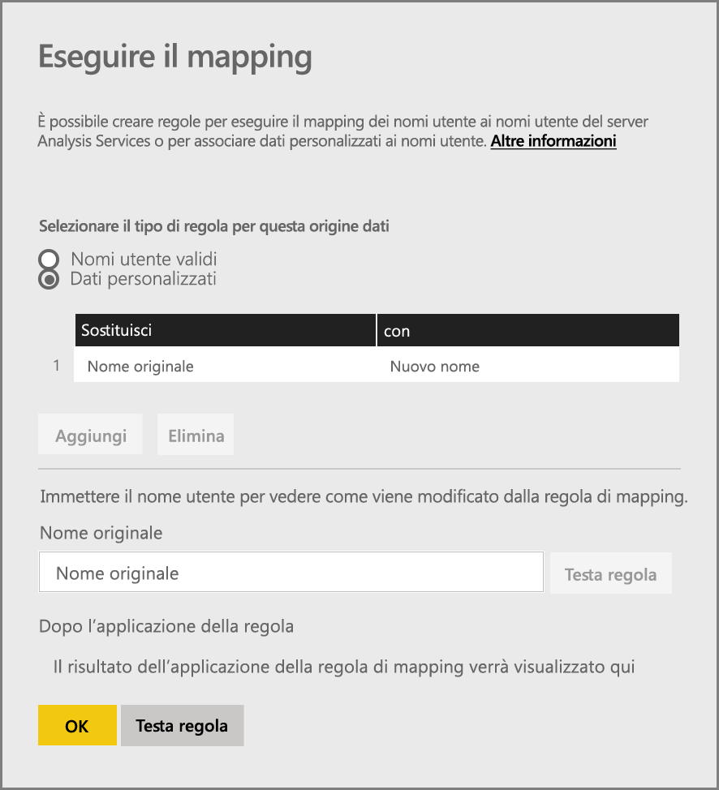

Verranno quindi visualizzate le opzioni per aggiungere regole, nonché testarle per un determinato utente.

> [!NOTE]
> Si potrebbe modificare inavvertitamente un utente che non si intendeva modificare. Ad esempio, se il **Sostituisci (valore originale)** è *@contoso.com* e **Con (nuovo nome)** è *@contoso.local*, tutti gli utenti con un nome di accesso contenente *@contoso.com* verranno sostituiti con *@contoso.local*. Inoltre, se il **Sostituisci (nome originale)** è *dave@contoso.com* e **Con (nuovo nome)** è *dave@contoso.local*, un utente con il nome di accesso v-dave@contoso.com sarà inviato come v-dave*@contoso.local*.
> 
> 

### Mapping con ricerca tramite AD
Per eseguire la ricerca proprietà in Active Directory locale in modo da ripetere il mapping degli UPN di AAD agli utenti di Active Directory, seguire i passaggi descritti in questa sezione. Per iniziare, esaminarne il funzionamento.

Nel **servizio Power BI** si verifica quanto segue:

- Per ogni query da un utente di AAD di Power BI a un server SSAS locale, viene passata una stringa UPN, ad esempio:      firstName.lastName@contoso.com

> [!NOTE]
> Tutti i mapping utente UPN manuali definiti nella configurazione di origine dati di Power BI vengono comunque applicati *prima* di inviare la stringa del nome utente al gateway dati locale.
> 
> 

Nel gateway dati locale con mapping personalizzato configurabile dall'utente, eseguire questa procedura:

1. Trovare Active Directory per la ricerca (automatica o configurabile)
2. Cercare l'attributo dell'utente di Active Directory (ad esempio *Email*) basato sulla stringa UPN in ingresso ("firstName.lastName@contoso.com") dal **servizio Power BI**.
3. Se la ricerca tramite AD non riesce, proverà a usare l'UPN passato come EffectiveUser a SSAS.
4. Se la ricerca tramite AD riesce, viene recuperato il *UserPrincipalName* di tale utente di Active Directory. 
5. Viene anche passata l'email *UserPrincipalName* come *EffectiveUser* a SSAS, ad esempio: *Alias@corp.on-prem.contoso*

Come configurare il gateway per eseguire la ricerca tramite AD:

1. Scaricare e installare il gateway più recente
2. Nel gateway, è necessario modificare il **servizio Gateway dati locale** in modo che venga eseguito con un account di dominio (anziché un account del servizio locale, in caso contrario la ricerca tramite AD non funzionerà correttamente in fase di esecuzione). Sarà necessario riavviare il servizio gateway per rendere effettiva la modifica.  Passare all'app Gateway nel computer (cercare "gateway dati locale"). A tale scopo, passare a **Impostazioni servizio > Modifica account di servizio**. Assicurarsi di avere la chiave di ripristino per il gateway, poiché sarà necessario ripristinarlo nello stesso computer, a meno che non si voglia creare invece un nuovo gateway. 
3. Passare alla cartella di installazione del gateway, *C:\Programmi\Gateway dati locale* come amministratore, per assicurarsi di avere le autorizzazioni di scrittura e modificare il file seguente:
   
       Microsoft.PowerBI.DataMovement.Pipeline.GatewayCore.dll.config 
4. Modificare i due valori di configurazione seguenti in base alle *proprie* configurazioni di attributi di Active Directory degli utenti Active Directory. I valori di configurazione illustrati di seguito sono riportati esempi soli: è necessario specificarli in base alla configurazione di Active Directory. 
   
   
5. Riavviare il **gateway dati locale** per rendere effettiva la modifica della configurazione.

### Uso delle regole di mapping
Per creare una regola di mapping, immettere un valore per il **nome originale** e il **nuovo nome** e quindi selezionare **Aggiungi**.

| Campo | Descrizione |
| --- | --- |
| Sostituisci (nome originale) |Indirizzo di posta elettronica con cui è stato effettuato l'accesso a Power BI. |
| Con (nuovo nome) |Valore con cui si vuole sostituirlo. Il risultato della sostituzione è ciò che verrà passato alla proprietà *EffectiveUserName* proprietà per la connessione di Analysis Services. |

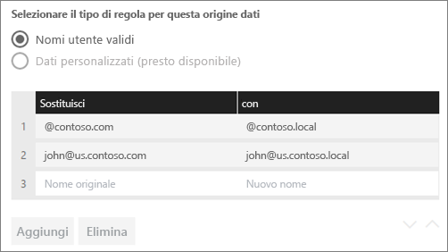

Quando si seleziona un elemento nell'elenco, è possibile modificarne l'ordine tramite le **icone delle frecce** o **eliminare** la voce.

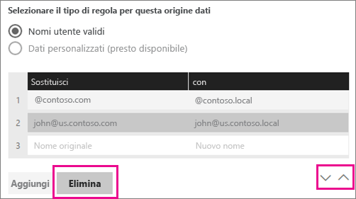

### Uso del carattere jolly (\*)
È possibile usare un carattere jolly per la stringa **Sostituisci (nome originale)**. Il carattere jolly può essere usato da solo, ma non con nessun'altra parte della stringa. In questo modo sarà possibile accettare tutti gli utenti e passare un singolo valore all'origine dati. Ciò è utile quando si vuole che tutti gli utenti nell'organizzazione usino lo stesso nome utente nell'ambiente locale.

### Testare una regola di mapping
È possibile convalidare come verrà sostituito un nome originale immettendo un valore per il **nome originale** e selezionando **Testa regola**.

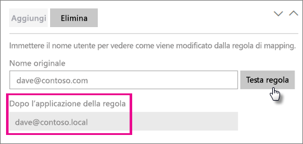

> [!NOTE]
> Dopo che le regole saranno state salvate, saranno necessari alcuni minuti perché il servizio inizi a usarle. All'interno del browser, la regola funzionerà immediatamente.
> 
> 

### Limitazioni per le regole di mapping
* Il mapping è destinato all’origine dati specifica che si sta configurando. Non si tratta di impostazioni globali. Se si dispone di più origini dati di Analysis Services, è necessario eseguire il mapping degli utenti per ogni origine dati.

## Rimuovere un'origine dati
Rimuovendo un'origine dati si interrompono tutti i dashboard o i report che si basano sull'origine dati specificata.  

Per rimuovere un'origine dati, passare a Origine dati > **Rimuovi**.

## Gestire gli amministratori
Nella scheda Amministratori del gateway è possibile aggiungere e rimuovere gli utenti o i gruppi di sicurezza che possono gestire il gateway.

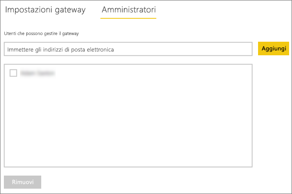

## Gestire gli utenti
Sulla scheda utenti per l'origine dati, è possibile aggiungere e rimuovere gli utenti o i gruppi di sicurezza che possono usare l'origine dati.

> [!NOTE]
> L'elenco degli utenti controlla solo gli utenti autorizzati a pubblicare report. I proprietari di report possono creare dashboard o pacchetti di contenuto e condividerli con altri utenti.
> 
> 

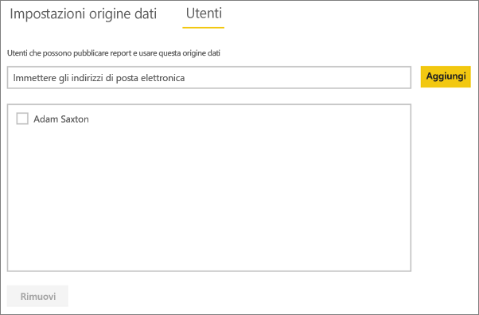

## Uso dell'origine dati
Dopo aver creato l'origine dati, sarà possibile usarla con le connessioni dinamiche o tramite l'aggiornamento pianificato.

> [!NOTE]
> I nomi del server e del database devono corrispondere tra Power BI Desktop e l'origine dati all'interno del gateway dati locale.
> 
> 

Il collegamento tra il set di dati e l'origine dati all'interno del gateway si basa sul nome del server e sul nome del database. Questi nomi devono corrispondere. Ad esempio, se si indica un indirizzo IP per il nome del server, all'interno di Power BI Desktop è necessario usare l'indirizzo IP per l'origine dati all'interno della configurazione del gateway. Se si usa *SERVER\ISTANZA*, in Power BI Desktop è necessario usarlo lo stesso all'interno dell'origine dati configurata per il gateway.

Questo vale sia per le connessioni dinamiche che per l'aggiornamento pianificato.

### Uso dell'origine dati con le connessioni dinamiche
È necessario assicurarsi che i nomi del server e del database corrispondano tra Power BI Desktop e l'origine dati configurata per il gateway. È inoltre necessario assicurarsi che l'utente sia elencato nella scheda **Utenti** dell'origine dati per pubblicare i set di dati delle connessioni dinamiche. Per le connessioni diamiche, la selezione avviene all'interno di Power BI Desktop alla prima importazione dei dati.

Dopo la pubblicazione, da Power BI Desktop o **Recupera dati**, i report dovrebbero iniziare a funzionare. Dopo la creazione dell'origine dati all'interno del gateway potrebbero essere necessari alcuni minuti prima di poter usare la connessione.

### Uso dell’origine dati con l'aggiornamento pianificato
Se si è presenti nella scheda **Utenti** dell'origine dati configurata all'interno del gateway e i nomi del server e del database corrispondono, il gateway verrà visualizzato come un'opzione per l’uso con l'aggiornamento pianificato.

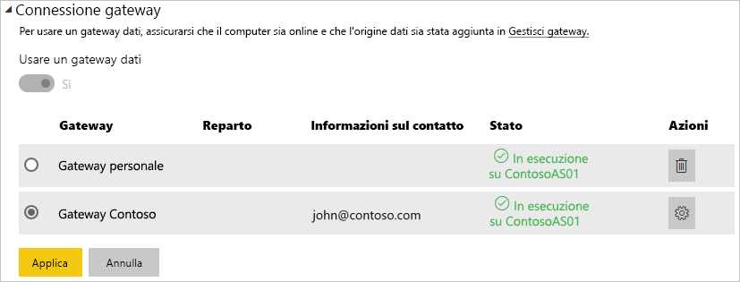

## Passaggi successivi
[Gateway dati locale](service-gateway-onprem.md)  
[Analisi approfondita del gateway dati locale](service-gateway-onprem-indepth.md)  
[Risoluzione dei problemi del gateway dati locale](service-gateway-onprem-tshoot.md)  
Altre domande? [Provare la community di Power BI](http://community.powerbi.com/)

