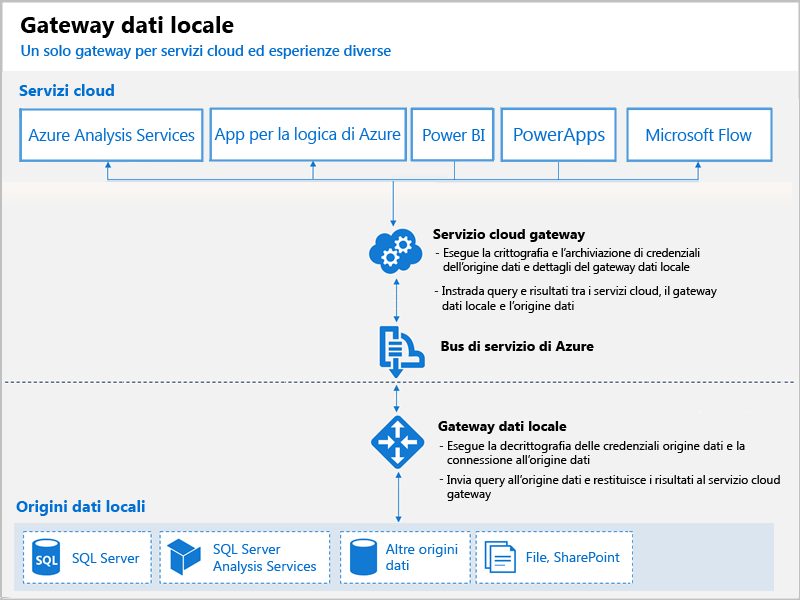

# Cosa sono i gateway di Power BI?

Un gateway di Power BI è un prodotto software che si installa all'interno di una rete locale e semplifica l'accesso ai dati nella rete. È in pratica simile a un guardiano che ascolta le richieste di connessione e concede l'accesso solo quando le richieste degli utenti soddisfano determinati criteri. Questo consente alle organizzazioni di mantenere i database e altre origini dati all'interno delle reti locali e allo stesso tempo di usare in sicurezza tali dati locali nei report e nei dashboard di Power BI.

Un gateway può essere usato per una singola origine dati o più origini dati. Il diagramma seguente mostra una visualizzazione di base, con il gateway che gestisce le richieste dal cloud per tre computer locali. L'argomento sarà illustrato in dettaglio più avanti.

## Tipi di gateway

Power BI offre due gateway, ognuno adatto a uno scenario diverso:

* **Gateway dati locale (modalità personale)** – Consente a un utente di connettersi alle origini e non può essere condiviso con altri utenti. e può essere usato solo con Power BI. Questo gateway è ideale per gli scenari in cui si è l'unica persona che crea report e non è necessario condividere le origini dati con altri utenti.

* **Gateway dati locale** - Consente a più utenti di connettersi a più origini dati locali. Può essere usato da Power BI, PowerApps, Microsoft Flow, Azure Analysis Services e App per la logica di Azure, tutto con un'unica installazione del gateway. Questo gateway è ideale per scenari più complessi, in cui più utenti accedono a più origini dati. 

## Uso di un gateway

I passaggi principali per usare un gateway sono quattro:

1. **Installare il gateway** in un computer locale, usando la modalità appropriata
2. **Aggiungere utenti al gateway**, in modo che possano accedere alle origini dati locali
3. **Connettersi alle origini dati**, in modo che sia possibile usarle in report e dashboard
4. **Aggiornare i dati locali**, in modo che i report di Power BI siano aggiornati

È possibile installare un gateway autonomo o aggiungere un gateway a un *cluster*, la configurazione consigliata per la disponibilità elevata.

## Funzionamento dei gateway

Il gateway installato viene eseguito come servizio di Windows, **Gateway dati locale**. Questo servizio locale è registrato con il servizio cloud gateway tramite il bus di servizio di Azure. Il diagramma seguente illustra il flusso tra i dati locali e i servizi cloud che usano il gateway.

Flusso di query e dati:

1. Il servizio cloud crea una query con le credenziali crittografate per l'origine dati locale. La query viene quindi inviata a una coda di elaborazione nel gateway.
2. Il servizio cloud gateway analizza la query e invia la richiesta al bus di servizio di Azure.
3. Il gateway dati locale esegue il polling delle richieste in sospeso sul bus di servizio di Azure.
4. Il gateway riceve la query, decrittografa le credenziali e si connette alle origini dati con tali credenziali.
5. Il gateway invia la query all'origine dati per l'esecuzione.
6. I risultati vengono inviati dall'origine dati al gateway, quindi al servizio cloud, quindi al servizio cloud e al server.

## Passaggi successivi
[Installare il gateway dati locale](service-gateway-install.md)

Altre domande? [Provare la community di Power BI](http://community.powerbi.com/)

