# Introduzione ai gateway di Power BI
**Introduzione ai gateway di Power BI**. verrà spiegato cosa è un gateway, come funziona e come installarne, configurarne ed eseguirne uno.  

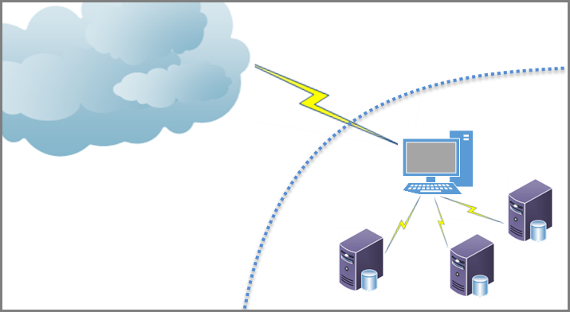

I gateway sono elementi tecnici complessi e, dal momento che ogni rete e ogni azienda sono diverse, la complessità dei gateway può essere notevole. Tralasciando per il momento gli aspetti complessi, inizieremo dalle nozioni di base.

## Funzionamento dei gateway di Power BI
Il termine **gateway** indica il software usato per agevolare l'accesso a dati che risiedono in una rete privata locale allo scopo di usarli in un servizio cloud, come Power BI. È in pratica simile a un guardiano che ascolta le richieste di connessione e concede l'accesso solo quando le richieste degli utenti soddisfano determinati criteri, ad esempio se sono autorizzati a usare il gateway. In questo modo le organizzazioni possono lasciare database e warehouse nelle proprie reti locali, ma usare in modo sicuro subset di dati per creare report e dashboard d'impatto in Power BI.

Un gateway consente inoltre di proteggere l'accesso e i dati mediante la crittografia e la compressione di tutti i dati trasmessi, nonché di tutte le password usate per la connessione alle origini dati. Tutti questi aspetti sembrano chiari, ma ci sono molti dettagli da considerare.

In alcuni casi si sceglie un gateway solo per uso personale, magari perché si dispone di una cartella di lavoro di Excel di grandi dimensioni e di tre database SQL contenenti anni di dati su vendite e marketing e si vuole creare un dashboard di Power BI che mostri tali dati da ogni angolazione. In questo caso, i report vengono creati da una sola persona, la cartella di lavoro di Excel è personale ed è la stessa persona a usare i database per creare i report di Power BI. Basta quindi un gateway per uso personale, dal momento che non si intende condividere tali origini dati con altri utenti.

In altri casi invece si lavora in un'organizzazione che usa database di fornitori diversi, tra cui Analysis Services, SAP, Oracle, IBM, nonché altre origini dati, ed è necessario consentire a molte persone di accedervi in modo che possano creare numerosi report. In questo caso, è necessario predisporre un gateway che consenta di configurare l'accesso a tutte queste origini dati e quindi condividerlo con molti altri utenti dell'organizzazione. Si tratta di un tipo di gateway totalmente diverso.

Fortunatamente, in Power BI sono disponibili due gateway, adattabili a ognuno degli scenari descritti in precedenza, ovvero:

* **Gateway dati locale (modalità personale)** – Consente a un utente di connettersi alle origini e non può essere condiviso con altri utenti. e può essere usato solo con Power BI.
* **Gateway dati locale**: consente a più utenti di connettersi a più origini dati locali e può essere usato da Power BI, PowerApps, Microsoft Flow e App per la logica di Azure, tutto con un'unica installazione del gateway.

La funzione di tali gateway è simile: entrambi agevolano l'accesso a dati che risiedono in una rete locale privata allo scopo di consentire l'uso dei dati in servizi basati sul cloud, come Power BI. Il gateway personale può essere usato da una sola persona e solo da Power BI, mentre il **gateway dati locale** può essere usato da più utenti e servizi.

La preparazione di un gateway per l'uso è un processo in tre fasi:

* Installazione del gateway
* Aggiunta degli utenti al gateway (per consentirne l'uso)
* Connessione alle origini dati

L'uso di un gateway consente inoltre di eseguire un'altra importante operazione:

* Aggiornamento dei dati locali, in modo che i report di Power BI possano sempre contenere dati aggiornati

Grazie all'aggiornamento dei dati, i dashboard e i report di Power BI sono sempre attuali e contengono i dati più recenti. In tal modo, quando un utente visualizza un report creato con dati locali, le informazioni visualizzate sono sempre quelle più recenti anche se il report è stato creato in precedenza.

La prima fase, ovvero l'installazione di un gateway, è un'operazione semplice, così come quella in cui si consente agli utenti di accedere al gateway, dal momento che è sufficiente aggiungerli in una finestra di dialogo di Power BI. La connessione alle origini dati può invece essere un'operazione più complessa per la presenza di numerose origini dati, ognuna delle quali presenta requisiti di connessioni e particolarità specifiche. Per rimanere concentrati sul gateway, tratteremo la procedura di aggiornamento dei dati in un'altra guida.

Partiamo quindi dall'operazione più semplice, esaminando in dettaglio la procedura di l'installazione di un gateway.

## Installazione del gateway
Per installare un gateway, aprire il servizio Power BI (è possibile usare questo collegamento per avviare il servizio Power BI nel browser e accedere) e quindi eseguire l'accesso con l'account Power BI. Nel servizio Power BI selezionare l'**icona di download** nell'angolo in alto a destra, come illustrato nell'immagine seguente e selezionare **Data Gateway**.

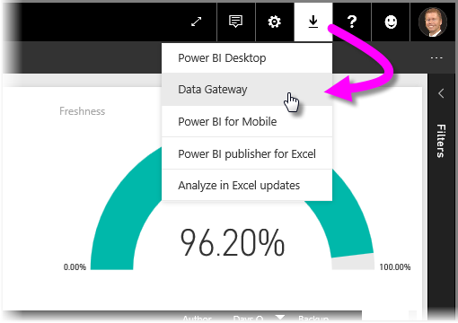

Verrà visualizzata una pagina di download in cui fare clic sul pulsante **Scarica il gateway** per avviare il download.

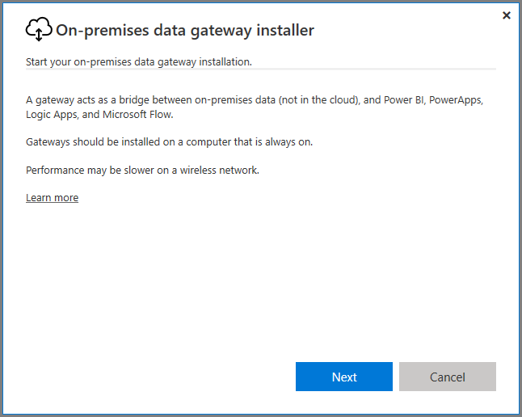

Questa schermata illustra brevemente le funzionalità di un gateway. Include inoltre due importanti **avvisi**: un gateway installato viene eseguito nel computer in cui si esegue l'installazione e allo spegnimento del computer viene spento anche il gateway, che di conseguenza non funziona quando non è in esecuzione. Viene inoltre sconsigliata l'installazione in un computer tramite una rete wireless ed è preferibile usare un computer connesso a una rete cablata.

Quando si è pronti, selezionare **Avanti** per continuare con il programma di installazione.

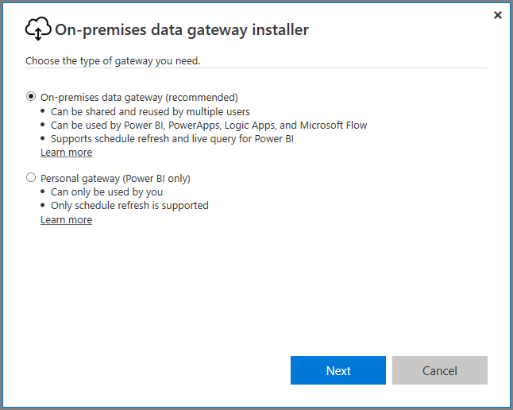

Questa schermata consente di scegliere quale gateway installare, tra quello locale e quello personale. In questa guida, verrà installato il **gateway dati locale**.

A questo punto della procedura è opportuno considerare alcuni aspetti:

* Con entrambi i gateway sono richiesti sistemi operativi Windows a 64 bit.
* I gateway non possono essere installati in un controller di dominio.
* È possibile installare fino a due gateway dati locali nello stesso computer, uno per ogni modalità di esecuzione (Personale e Standard). 
* Non è possibile avere più di un gateway in esecuzione con la stessa modalità nello stesso computer.
* È possibile installare più gateway dati locali in computer diversi e gestirli tutti dalla stessa interfaccia di gestione del gateway di Power BI, ad eccezione della modalità Personale, come indicato al punto seguente.
* È possibile eseguire un solo gateway in modalità personale per ogni utente di Power BI. Se si installa un altro gateway in modalità personale per lo stesso utente, anche in un computer diverso, l'installazione più recente sostituisce l'installazione esistente precedente.

Selezionare **Avanti** per avviare l'installazione del gateway. Quando viene chiesto di specificare il percorso di installazione, è consigliabile usare quello predefinito.

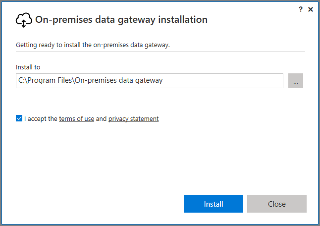

Il processo di installazione procede rapidamente e viene visualizzata una barra di stato.

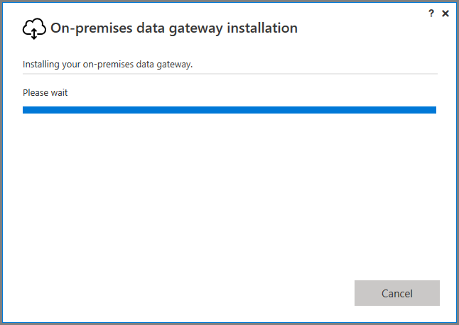

Verso la fine del processo è necessario identificare l'account da usare con il gateway. Deve trattarsi dell'account (nome utente e password) usato per accedere a Power BI. Il gateway è infatti associato all'account Power BI e i gateway vengono configurati all'interno del servizio Power BI.

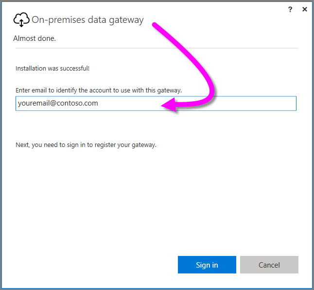

Verrà eseguito l'accesso, come illustrato nell'immagine seguente.

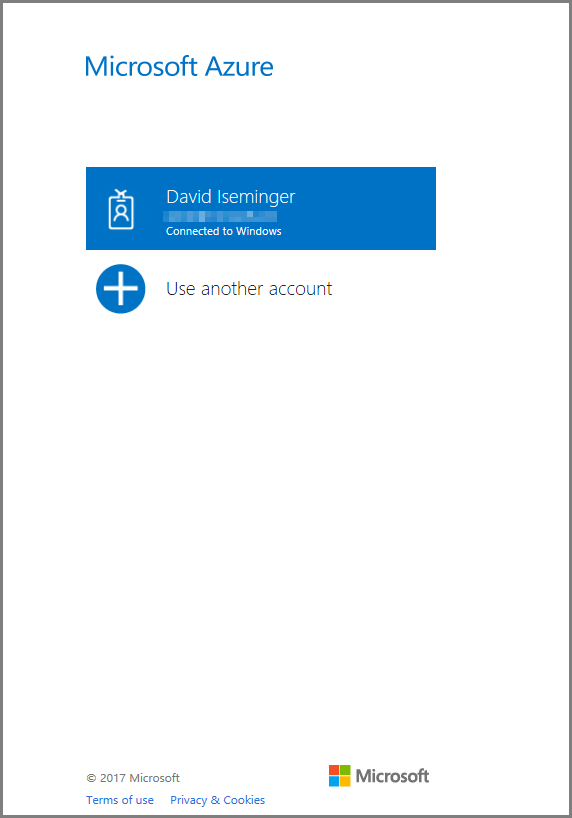

Dopo aver eseguito l'accesso, è necessario creare una **chiave di ripristino**. Tale chiave, necessaria per ripristinare o spostare il gateway, verrà illustrata in dettaglio più avanti in questo articolo.

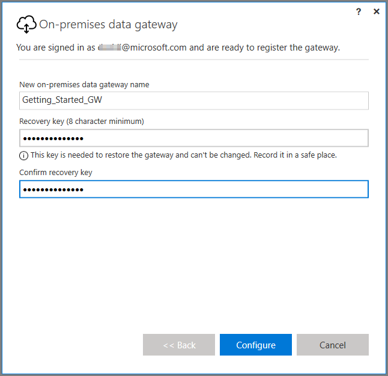

Se la procedura viene completata correttamente, verrà visualizzata una finestra in cui si informa che il gateway è pronto.

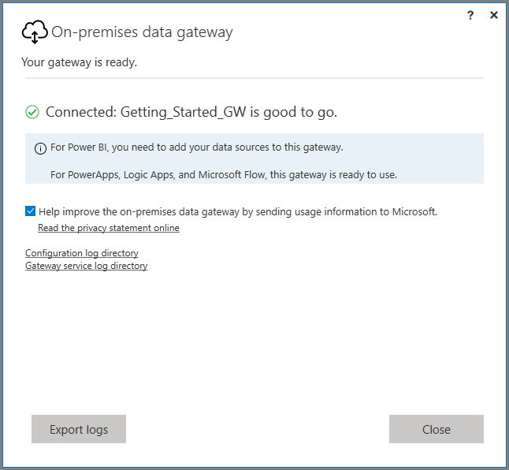

L'installazione del gateway locale è stata completata senza problemi. Il passaggio successivo consiste nell'**aggiungere utenti** o **aggiungere origini dati**. Tale operazione può essere eseguita prima o dopo la configurazione iniziale.

La sezione successiva spiega come aggiungere utenti al gateway. In seguito, verrà spiegato anche cosa fare per aggiungere le origini dati.

## Aggiungere utenti a un gateway
A questo punto, dopo aver installato il gateway, è possibile gestirlo dal **servizio Power BI**. Per accedere alla schermata di gestione per i gateway, nel servizio Power BI selezionare l'icona dell'ingranaggio nell'angolo in alto a destra e quindi scegliere **Gestisci gateway**.

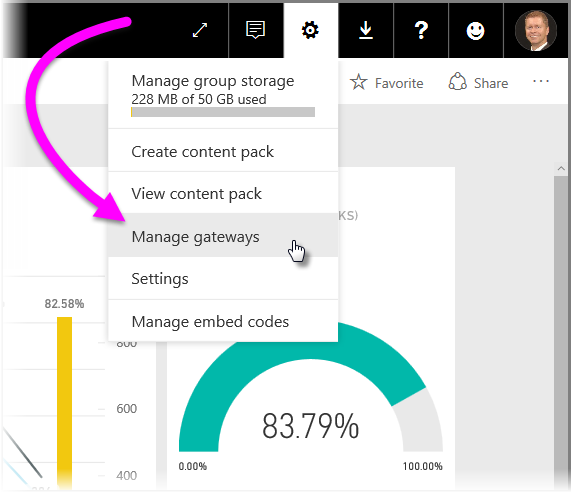

Nell'area di disegno del servizio Power BI verrà visualizzata una pagina in cui gestire i gateway. La pagina **Impostazioni gateway** è simile alla seguente.

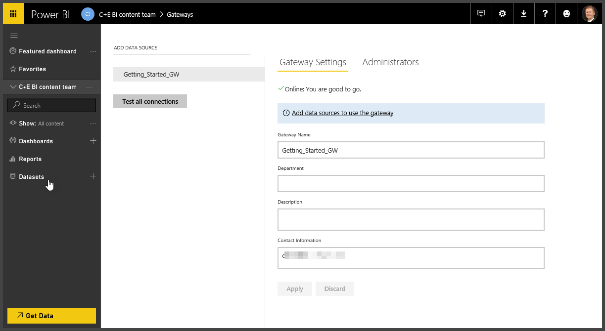

Se si tocca o si fa clic su **Amministratori**, verrà visualizzata la pagina di gestione degli amministratori illustrata di seguito. Si noti che questa è solo la pagina in cui utenti possono *amministrare* il gateway e che per aggiungere o rimuovere gli utenti del gateway da ogni singola origine dati viene usata una pagina diversa che verrà illustrata più avanti.

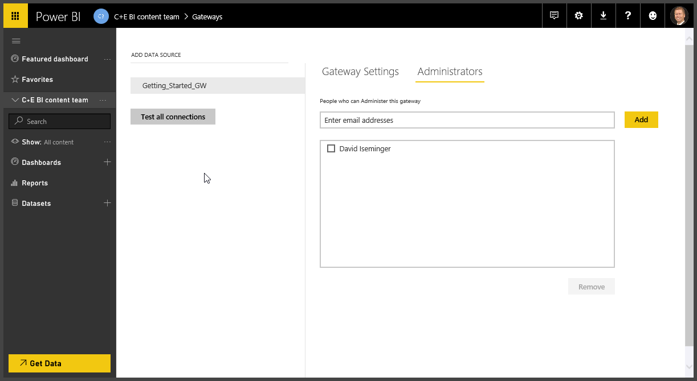

Dopo aver installato e convalidato (eseguito la connessione) un'origine dati, questa verrà visualizzata sotto il gateway associato nel lato sinistro della schermata **Gestisci gateway**, come illustrato nell'immagine seguente. Si noti che nel riquadro di destra sono presenti due sezioni selezionabili, ovvero **Impostazioni origini dati** e **Utenti**. La schermata seguente si riferisce alla sezione **Impostazioni origini dati**.

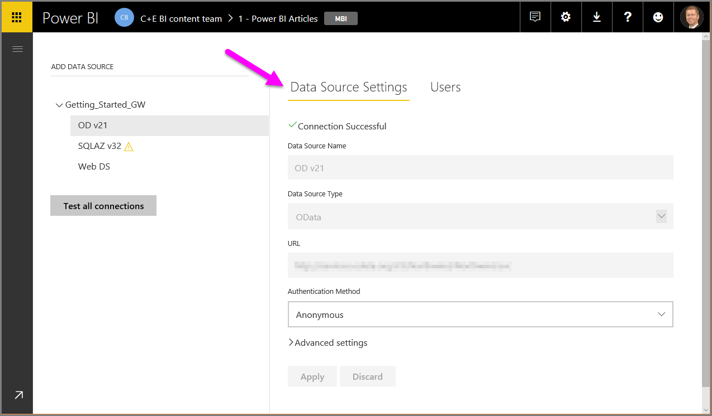

Quando si seleziona **Utenti**, viene visualizzata una casella di testo in cui è possibile digitare gli utenti dell'organizzazione ai quali si vuole concedere l'accesso all'origine dati selezionata. Nella schermata seguente è illustrata l'aggiunta di due utenti, Maggie e Adam.

Quando si inizia a digitare un indirizzo di posta elettronica nella casella di testo, Power BI visualizza un elenco di utenti il cui indirizzo corrisponde a quanto digitato, consentendo in tal modo di fare clic sul nome e aggiungerlo all'elenco.

È inoltre possibile aggiungere gruppi di posta elettronica (alias) per consentire l'accesso a gruppi di utenti, oltre che a singoli utenti.

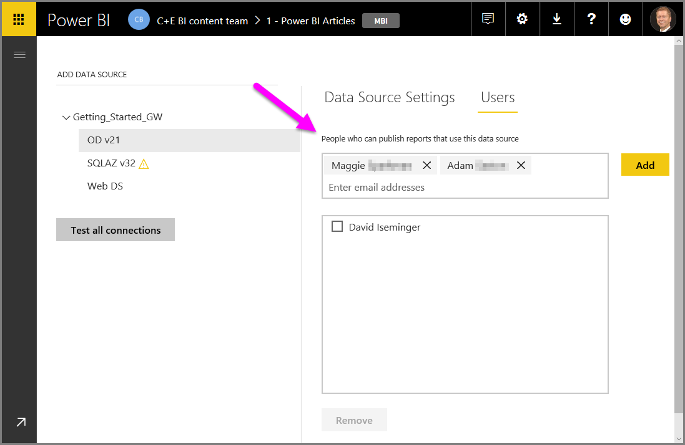

Dopo aver selezionato **Aggiungi**, i membri aggiunti vengono visualizzati nella casella ed è possibile aggiungerne altri. Rimuovere gli utenti è ugualmente semplice. Basta selezionare la casella di controllo accanto al nome dell'utente da rimuovere e quindi selezionare il pulsante **Rimuovi** sotto la casella.

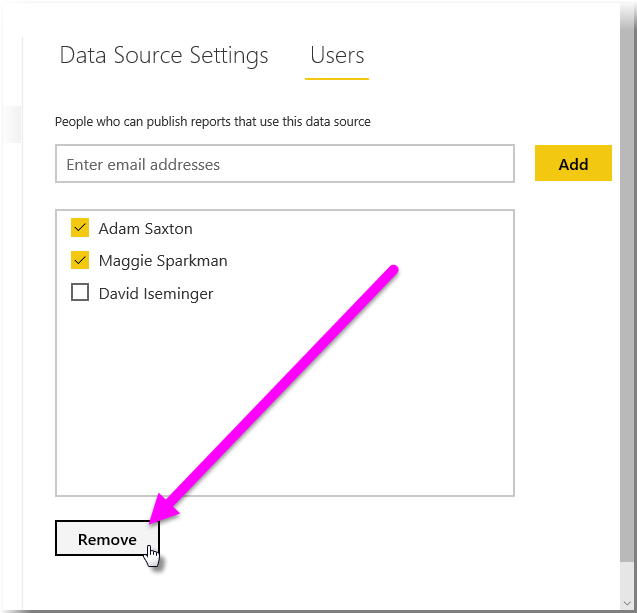

Non sono richieste altre operazioni. Non dimenticare che è necessario aggiungere utenti a ogni origine dati a cui si vuole concedere l'accesso. L'elenco di utenti è diverso per ogni origine dati, di conseguenza è necessario aggiungere gli utenti a ogni origine dati separatamente.

## Aggiunta di origini dati
Naturalmente, il gateway è utile se si aggiungono origini dati. È qui che risulta evidente la complessità dei gateway di Power BI: esistono infatti numerose origini dati diverse, ognuna con i propri requisiti e spesso con propri driver.

Ma prima di passare ad altri articoli, ecco come aggiungere un'origine dati. Nella pagina **Gestisci gateway** del **servizio Power BI** selezionare il gateway al quale aggiungere un'origine dati e scegliere **Aggiungi origine dati** nell'angolo in alto a sinistra della pagina, sopra l'elenco dei gateway.

Quando si esegue questa operazione, nel riquadro di destra viene visualizzato il pannello **Impostazioni origini dati**, come illustrato nell'immagine seguente. In tale pannello è possibile assegnare un nome all'origine dati, immettendolo nella casella di testo **Nome origine dati**, nonché selezionarne il tipo nell'elenco a discesa **Tipo di origine dati**.

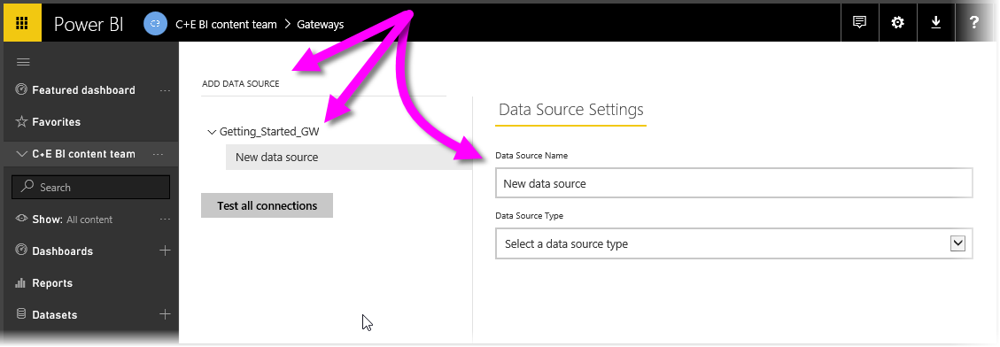

A questo punto, il gateway è stato installato ed è possibile procedere con l'aggiunta di origini dati. Ottimo! Per informazioni sulle origini dati, nonché per altri dettagli sull'uso di gateway e altre informazioni utili, vedere le risorse elencate nella sezione seguente.

## Passaggi successivi
[Uso del gateway dati locale](service-gateway-onprem.md)  
[Analisi approfondita del gateway dati locale](service-gateway-onprem-indepth.md)  
[Gateway dati locale (modalità personale)](service-gateway-personal-mode.md)
[Risoluzione dei problemi del gateway dati locale](service-gateway-onprem-tshoot.md)  

Altre domande? [Provare la community di Power BI](http://community.powerbi.com/)

