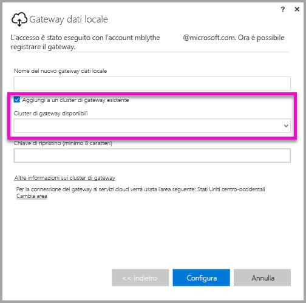
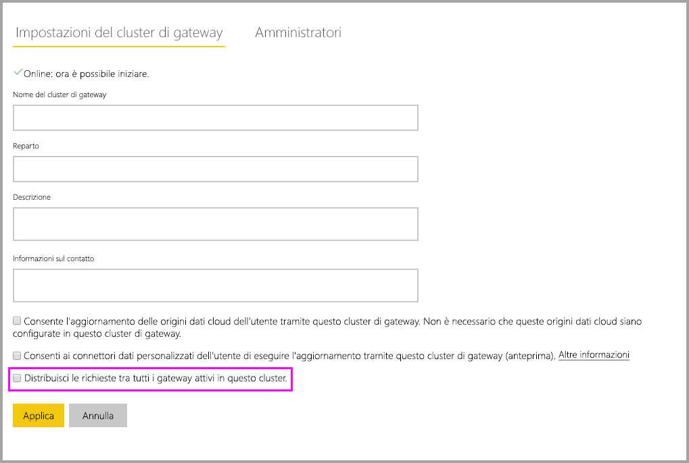

# <a name="high-availability-clusters-for-on-premises-data-gateway"></a>Cluster a disponibilità elevata per il gateway dati locale

È possibile creare **cluster a disponibilità elevata** di installazioni di **gateway dati locali** per garantire all'organizzazione l'accesso alle risorse dati locali usate nei report e nei dashboard di Power BI. Questi cluster permettono agli amministratori dei gateway di raggruppare i gateway per evitare singoli punti di guasto durante l'accesso alle risorse dati locali. Il servizio Power BI usa sempre il gateway primario nel cluster, a meno che questo non sia disponibile. In questo caso, il servizio passa al gateway successivo nel cluster e così via.

Questo articolo descrive le procedure necessarie per creare un cluster a disponibilità elevata di gateway dati locali, nonché le procedure consigliate per la configurazione. I cluster di gateway a disponibilità elevata richiedono che nel gateway dati locale sia stato installato l'aggiornamento di novembre 2017 o versione successiva.

## <a name="setting-up-high-availability-clusters-of-gateways"></a>Installazione di cluster di gateway a disponibilità elevata

Durante il processo di installazione del **gateway dati locale** è possibile specificare se il gateway deve essere aggiunto a un cluster di gateway esistente. 



Per aggiungere un gateway a un cluster esistente, è necessario specificare la *chiave di ripristino* per l'istanza del gateway primario per il cluster a cui si vuole aggiungere il nuovo gateway. Nel gateway primario del cluster deve essere in esecuzione l'aggiornamento del gateway di novembre 2017 o versione successiva. 

## <a name="managing-a-gateway-cluster"></a>Gestione di un cluster di gateway

Quando un cluster di gateway è costituito da due o più gateway, tutte le operazioni di gestione del gateway, ad esempio l'aggiunta di un'origine dati o la concessione di autorizzazioni di amministrazione a un gateway, si applicano a tutti i gateway inclusi nel cluster.

Quando gli amministratori usano la voce di menu **Gestisci gateway** disponibile facendo clic sull'icona a forma di ingranaggio nel **servizio Power BI**, visualizzano l'elenco dei cluster registrati o dei singoli gateway, ma non visualizzano le istanze dei singoli gateway membri del cluster.

Tutte le nuove richieste di **aggiornamento pianificato** e le operazioni DirectQuery vengono automaticamente instradate all'istanza primaria di un cluster di gateway specificato. Se l'istanza del gateway primario non è online, la richiesta viene indirizzata a un'altra istanza di gateway nel cluster.

## <a name="distribute-requests-traffic-across-all-gateways-in-a-cluster"></a>Distribuire il traffico delle richieste tra tutti i gateway in un cluster

È possibile scegliere di consentire la distribuzione del traffico tra tutti i gateway in un cluster. Nella pagina **Gestisci gateway** nel **servizio Power BI**, quando si fa clic su un cluster di gateway nell'elenco nell'albero di spostamento a sinistra, è possibile abilitare l'opzione "Distribuisci le richieste tra tutti i gateway attivi in questo cluster."



## <a name="powershell-support-for-gateway-clusters"></a>Supporto PowerShell per i cluster di gateway

Gli script di PowerShell sono disponibili nella cartella di installazione del gateway dati locale. Per impostazione predefinita, la cartella si trova in *C:\Programmi\Gateway dati locale*. Per il corretto funzionamento di questi script, è necessario usare PowerShell versione 5 o successiva. Gli script di PowerShell consentono agli utenti di eseguire le operazioni seguenti:

-   Recuperare l'elenco di cluster di gateway disponibili per un utente
-   Recuperare l'elenco di istanze di gateway registrate in un cluster e il relativo stato online o offline
-   Modificare lo stato di abilitazione/disabilitazione per un'istanza di gateway in un cluster e altre proprietà del gateway
-   Eliminare un gateway

Per eseguire i comandi di PowerShell nella tabella, seguire questa procedura:

1. Aprire una finestra dei comandi di PowerShell con privilegi di amministratore
2. Eseguire quindi una volta sola questo comando di PowerShell (si presuppone che non siano mai stati eseguiti comandi di PowerShell nel computer corrente):

    ```
    Set-ExecutionPolicy -ExecutionPolicy Unrestricted -Force
    ```

3. Passare quindi alla cartella di installazione del gateway dati locale nella finestra di PowerShell e importare il modulo necessario usando il comando seguente:

    ```
    Import-Module .\OnPremisesDataGatewayHAMgmt.psm1
    ```

Al termine della procedura, è possibile usare i comandi riportati nella tabella seguente per gestire i cluster di gateway.

| **Comando** | **Descrizione** | **Parametri** |
| --- | --- | --- |
| *Login-OnPremisesDataGateway* |Questo comando permette a un utente di eseguire l'accesso per gestire i cluster di gateway dati locali.  Affinché gli altri comandi per la disponibilità elevata funzionino correttamente, è *prima* necessario eseguire questo comando e accedere. Nota: il token di autenticazione di AAD acquisito come parte di una chiamata al metodo Login è valido solo un'ora, dopodiché scade. Sarà necessario eseguire di nuovo il comando Login per acquisire un nuovo token.| Nome utente e password di AAD (forniti come parte dell'esecuzione del comando e non come chiamata iniziale)|
| *Get-OnPremisesDataGatewayClusters* | Recupera l'elenco di cluster di gateway per l'utente che ha eseguito l'accesso. | Facoltativamente, è possibile passare a questo comando parametri di formattazione per una migliore leggibilità, ad esempio *Format-Table -AutoSize -Wrap* |
| *Get-OnPremisesDataClusterGateways* | Recupera l'elenco di gateway nel cluster specificato, nonché informazioni aggiuntive per ogni gateway, ad esempio stato online/offline, nome computer e così via. | *-ClusterObjectID xyz* (dove *xyz* verrà sostituito da un valore di ID oggetto cluster effettivo che può essere recuperato tramite il comando *Get-OnPremisesDataGatewayClusters*)|
| *Set-OnPremisesDataGateway* | Consente di impostare i valori delle proprietà per un gateway specifico in un cluster, inclusa la possibilità di abilitare/disabilitare un'istanza di gateway specifica  | *-ClusterObjectID xyz* (dove *xyz* deve essere sostituito con un valore di ID oggetto cluster effettivo, che può essere recuperato tramite il comando *Get-OnPremisesDataGatewayClusters*) *-GatewayObjectID abc* (dove *abc* deve essere sostituito con un valore di ID oggetto gateway effettivo, che può essere recuperato tramite il comando *Get-OnPremisesDataClusterGateways* specificando un ID oggetto cluster) |
| *Get-OnPremisesDataGatewayStatus* | Consente di recuperare lo stato per un'istanza di gateway specifica in un cluster  | *-ClusterObjectID xyz* (dove *xyz* deve essere sostituito con un valore di ID oggetto cluster effettivo, che può essere recuperato tramite il comando *Get-OnPremisesDataGatewayClusters*) *-GatewayObjectID abc* (dove *abc* deve essere sostituito con un valore di ID oggetto gateway effettivo, che può essere recuperato tramite il comando *Get-OnPremisesDataClusterGateways* specificando un ID oggetto cluster) |
| *Remove-OnPremisesDataGateway*  | Consente di rimuovere un'istanza di gateway da un cluster. Si noti che non è possibile rimuovere il gateway primario nel cluster fino a quando non vengono rimossi tutti gli altri gateway nel cluster.| *-ClusterObjectID xyz* (dove *xyz* deve essere sostituito con un valore di ID oggetto cluster effettivo, che può essere recuperato tramite il comando *Get-OnPremisesDataGatewayClusters*) *-GatewayObjectID abc* (dove *abc* deve essere sostituito con un valore di ID oggetto gateway effettivo, che può essere recuperato tramite il comando *Get-OnPremisesDataClusterGateways* specificando un ID oggetto cluster) |

## <a name="next-steps"></a>Passaggi successivi

-   [Gestire l'origine dati - Analysis Services](service-gateway-enterprise-manage-ssas.md)  
-   [Gestire l'origine dati - SAP HANA](service-gateway-enterprise-manage-sap.md)  
-   [Gestire l'origine dati - SQL Server](service-gateway-enterprise-manage-sql.md)  
-   [Gestire l'origine dati - Oracle](service-gateway-onprem-manage-oracle.md)  
-   [Gestire l'origine dati - Importazione/aggiornamento pianificato](service-gateway-enterprise-manage-scheduled-refresh.md)  
-   [Analisi approfondita del gateway dati locale](service-gateway-onprem-indepth.md)  
-   [Gateway dati locale (modalità personale)](service-gateway-personal-mode.md)
-   [Configurazione delle impostazioni del proxy per il gateway dati locale](service-gateway-proxy.md)  
-   [Usare Kerberos per l'accesso Single Sign-On (SSO) da Power BI alle origini dati locali](service-gateway-sso-kerberos.md)  

Altre domande? [Provare la community di Power BI](http://community.powerbi.com/)
