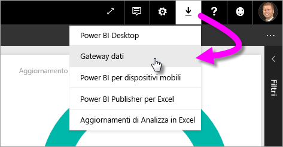
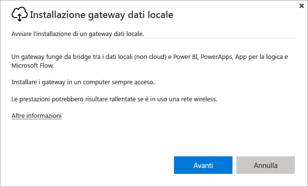
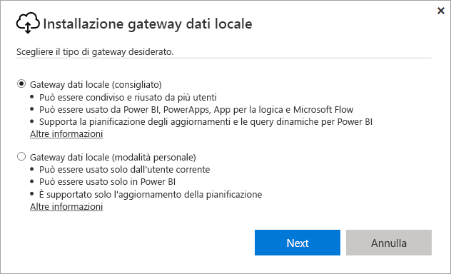
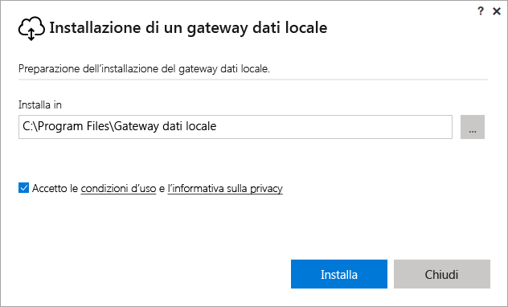
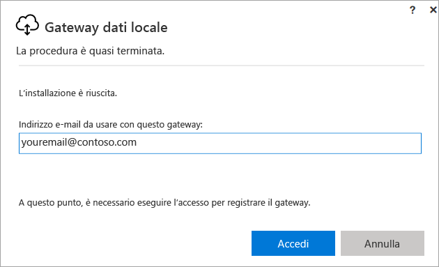
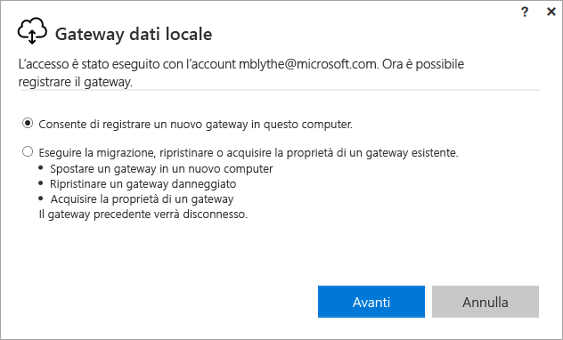
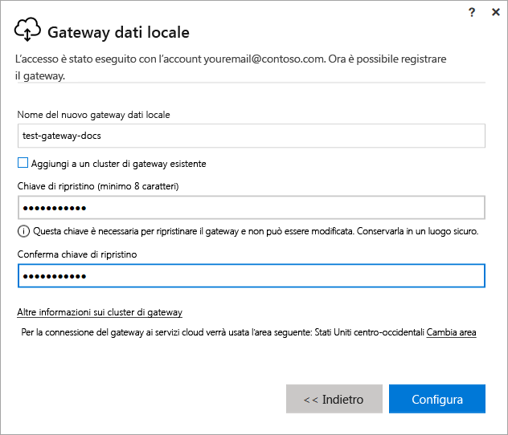
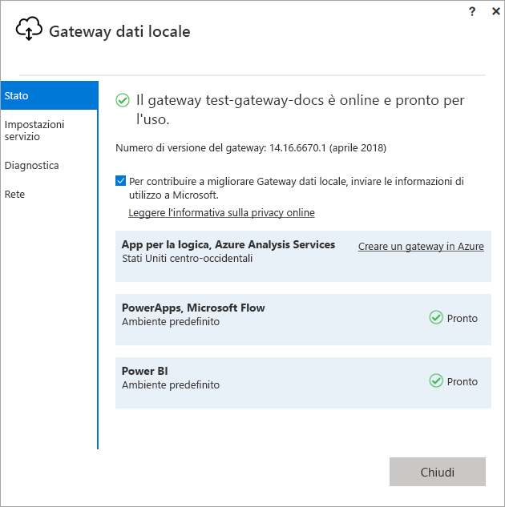
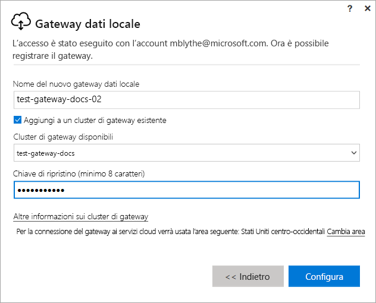

# Installare un gateway per Power BI

Un gateway di Power BI è un prodotto software che si installa all'interno di una rete locale e semplifica l'accesso ai dati nella rete. Come descritto nella [Panoramica](service-gateway-getting-started.md), è possibile installare un gateway in modalità personale o in modalità standard (scelta consigliata). In modalità standard è possibile installare un gateway autonomo o aggiungere un gateway a un *cluster*, la configurazione consigliata per la disponibilità elevata. Questo articolo illustra come installare un gateway standard e quindi come aggiungere un altro gateway per creare un cluster.

Se non si è ancora iscritti a Power BI, [iscriversi per ottenere una versione di prova gratuita](https://app.powerbi.com/signupredirect?pbi_source=web) prima di iniziare.

## Download e installazione di un gateway

Il gateway viene eseguito nel computer in cui è installato, dunque assicurarsi di installarlo in un computer sempre acceso. Per ottenere prestazioni e affidabilità superiori, è consigliabile che il computer si trovi in una rete cablata anziché in una rete wireless.

1. Nell'angolo superiore destro del servizio Power BI selezionare l'**icona di download**  > **Gateway dati**.

    

2. Nella pagina di download selezionare il pulsante **SCARICA IL GATEWAY**.

3. Fare clic su **Avanti**.     

    

4. Selezionare **Gateway dati locale (consigliato)** > **Avanti**.

    

5. Mantenere il percorso di installazione predefinito, accettare le condizioni > **Installa**.

    

6. Immettere l'account usato per accedere a Power BI > **Accedi**.

    

    Il gateway viene associato all'account Power BI e i gateway si gestiscono all'interno del servizio Power BI. Ora si è connessi al proprio account.

7. Selezionare **Consente di registrare un nuovo gateway in questo computer** > **Avanti**.

    

8. Immettere un nome per il gateway (deve essere univoco a livello di tenant) e una chiave di ripristino. Questa chiave è necessaria per ripristinare o spostare il gateway. Selezionare **Configura**.

    

    Notare l'opzione **Aggiungi a un cluster di gateway esistente**. Questa opzione verrà usata nella sezione successiva dell'articolo.

9. Esaminare le informazioni nella finestra finale. Si noti che il gateway è disponibile per Power BI e anche per PowerApps e Flow, perché nell'esempio viene usato lo stesso account per tutti e tre. Selezionare **Chiudi**.

    

Ora che si è installato correttamente un gateway, è possibile aggiungerne un altro per creare un cluster.

## Aggiungere un altro gateway per creare un cluster

Un cluster consente agli amministratori di gateway di evitare la presenza di un singolo punto di guasto per l'accesso ai dati locali. Se il gateway primario non è disponibile, le richieste di dati vengono instradate al secondo gateway aggiunto e così via. È possibile installare un solo gateway standard per computer, pertanto occorre installare il secondo gateway per il cluster in un computer diverso. Questo è utile per ottenere la ridondanza all'interno del cluster.

I cluster di gateway a disponibilità elevata richiedono che nel gateway dati locale sia stato installato l'aggiornamento di novembre 2017 o versione successiva.

1. Scaricare il gateway in un altro computer e installarlo.

2. Dopo aver eseguito l'accesso al proprio account di Power BI, registrare il gateway. Selezionare **Aggiungi a un cluster di gateway esistente**. In **Cluster di gateway disponibili** selezionare il primo gateway installato (il *gateway primario*) e immettere la relativa chiave di ripristino. Selezionare **Configura**.

    

## Passaggi successivi

[Gestire un gateway di Power BI](service-gateway-manage.md)

Altre domande? [Provare la community di Power BI](http://community.powerbi.com/)