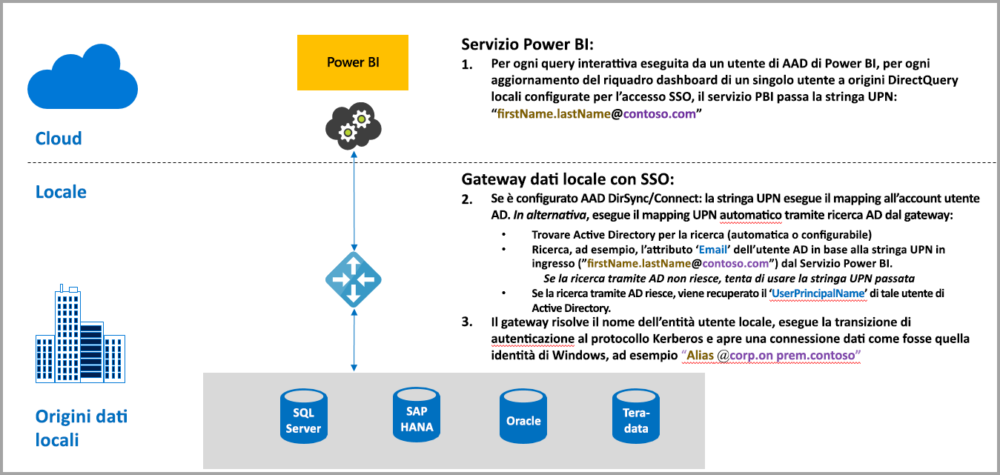
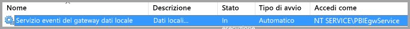
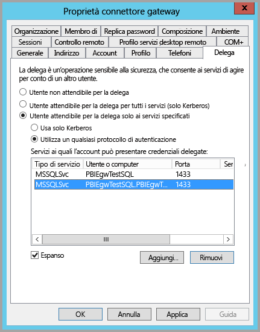
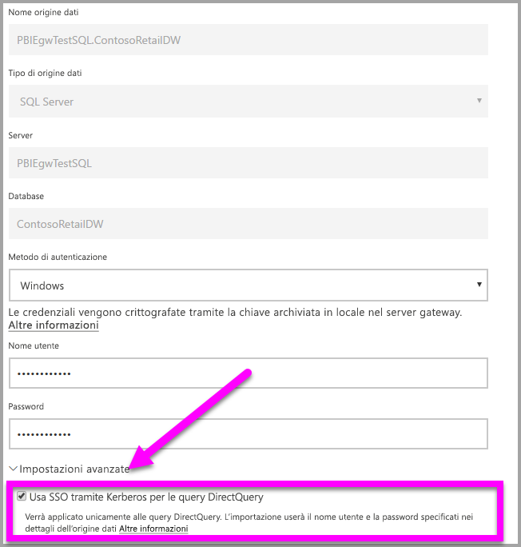
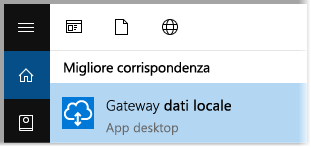
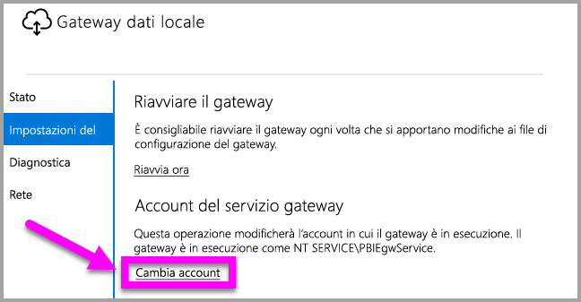

# Usare Kerberos per l'accesso Single Sign-On (SSO) da Power BI alle origini dati locali
Per usufruire di un'esperienza di connettività Single Sign-On ottimale che abilita l'aggiornamento di report e dashboard di Power BI dai dati locali, è possibile configurare il gateway dati locale con Kerberos. Il gateway dati locale semplifica l'accesso Single Sign-On grazie all'uso di DirectQuery per connettersi alle origini dati locali.

Sono attualmente supportate le origini dati seguenti: SQL Server, SAP HANA e Teradata, tutte basate sulla [delega vincolata Kerberos](https://technet.microsoft.com/library/jj553400.aspx).

* SQL Server
* SAP HANA
* Teradata

Quando un utente interagisce con un report DirectQuery nel servizio Power BI, ogni operazione di filtro incrociato, filtro dei dati, ordinamento e modifica del report può comportare l'esecuzione di query in tempo reale sull'origine dati locale sottostante.  Quando per l'origine dati è configurato l'accesso Single Sign-On, le query vengono eseguite in base all'identità dell'utente che interagisce con Power BI, ovvero tramite l'esperienza Web o le app Power BI per dispositivi mobili. Di conseguenza, ogni utente visualizza con precisione i dati a cui è autorizzato ad accedere nell'origine dati sottostante e, grazie all'accesso Single Sign-On, si evita la memorizzazione nella cache di dati condivisi tra diversi utenti.

## Esecuzione di una query con accesso Single Sign-On: passaggi
I passaggi per l'esecuzione di una query con accesso Single Sign-On sono tre, come illustrato nel diagramma seguente.

> [!NOTE]
> SSO per Oracle non è ancora abilitato, ma è in corso di sviluppo e sarà presto disponibile.
> 
> 

Dettagli aggiuntivi per questi tre passaggi:

1. Per ogni query, il **servizio Power BI** include il *nome dell'entità utente* quando invia una richiesta di query al gateway configurato.
2. Il gateway deve eseguire il mapping del nome dell'entità utente di Azure Active Directory a un'identità di Active Directory locale.
   
   a.  Se AAD DirSync (also known as *AAD Connect*) è configurato, il mapping funziona automaticamente nel gateway.
   
   b.  In caso contrario, il gateway può cercare ed eseguire il mapping del nome dell'entità utente (UPN) di Azure AD a un utente locale eseguendo una ricerca nel dominio di Active Directory locale.
3. Il processo del servizio gateway rappresenta l'utente locale mappato, apre la connessione con il database sottostante e invia la query. Il gateway non deve essere installato nello stesso computer del database.
   
   - La rappresentazione dell'utente e la connessione al database riescono solo se l'account del servizio gateway è un account di dominio (o SID del servizio) e se la delega vincolata di Kerberos è stata configurata in modo che il database accetti i ticket Kerberos dall'account del servizio gateway.  
   
   > [!NOTE]
   > Riguardo il SID del servizio, se è configurato AAD DirSync/Connect e gli account utente sono sincronizzati, il servizio gateway non dovrà eseguire ricerche di Active Directory locale in fase di esecuzione e sarà possibile usare il SID del servizio locale, anziché un account di dominio, per il servizio gateway.  Le procedure di configurazione della delega vincolata Kerberos descritte in questo documento sono identiche e sono semplicemente basate sul SID del servizio anziché sull'account di dominio.
   > 
   > 

> [!NOTE]
> Per abilitare l'accesso Single Sign-On per SAP HANA, verificare che le configurazioni specifiche di SAP HANA seguenti siano implementate per SAP:
> 1. Verificare che nel server SAP HANA sia in esecuzione la versione minima richiesta. Ciò dipende dal livello della piattaforma del server SAP Hana:
> * [HANA 2 SPS 01 Rev 012.03](https://launchpad.support.sap.com/#/notes/2557386)
> * [HANA 2 SPS 02 Rev 22](https://launchpad.support.sap.com/#/notes/2547324)
> * [HANA 1 SP 12 Rev 122.13](https://launchpad.support.sap.com/#/notes/2528439)
>
> 2. Nel computer gateway installare il driver ODBC per HANA più recente di SAP.  La versione minima è la versione ODBC per HANA 2.00.020.00 di agosto 2017.
>
> I seguenti collegamenti a patch e aggiornamenti di SAP possono essere utili. Si noti che è necessario accedere alle risorse seguenti con l'account di supporto SAP e che SAP potrebbe modificare o aggiornare questi collegamenti.
> 
> * [HANA 2 SPS 01 Rev 012.03](https://launchpad.support.sap.com/#/notes/2557386) 
> * [HANA 2 SPS 02 Rev 22](https://launchpad.support.sap.com/#/notes/2547324) 
> * [HANA 1 SP 12 Rev 122.13](https://launchpad.support.sap.com/#/notes/2528439)

## Errori derivanti da una configurazione Kerberos insufficiente
Se il gateway e il server di database sottostante non sono configurati correttamente per la **delega vincolata Kerberos**, potrebbe essere restituito il messaggio di errore seguente:

E i dettagli tecnici associati al messaggio di errore potrebbero avere un aspetto simile al seguente:

A causa della configurazione Kerberos insufficiente, il gateway non è riuscito a rappresentare correttamente l'utente di origine e il tentativo di connessione non è riuscito.

## Preparazione della delega vincolata Kerberos
Per il corretto funzionamento della delega vincolata Kerberos, è necessario configurare numerosi elementi, ad esempio i *nomi delle entità servizio* e le impostazioni di delega negli account del servizio.

### Prerequisito 1: installare e configurare il gateway dati locale
Questa versione del gateway dati locale supporta un aggiornamento sul posto, nonché l'acquisizione della proprietà delle impostazioni dei gateway esistenti.

### Prerequisito 2: eseguire il servizio di Windows gateway come account di dominio
In un'installazione standard, il gateway è in esecuzione come account del servizio locale del computer, ovvero *Servizio NT\PBIEgwService*, come illustrato nell'immagine seguente:

Per abilitare la **delega vincolata Kerberos**, il gateway deve essere eseguito come account di dominio, a meno che il servizio AAD non sia già sincronizzato con Active Directory locale tramite AAD DirSync/Connect. Affinché la modifica dell'account funzioni correttamente, sono disponibili due opzioni:

* Se si è iniziato con una versione precedente del gateway dati locale, seguire attentamente tutti e cinque i passaggi in sequenza, inclusa l'esecuzione dello strumento di configurazione del gateway nel passaggio 3, come descritto nell'articolo seguente:
  
  * [Modifica dell'account del servizio gateway in un account utente di dominio](https://powerbi.microsoft.com/documentation/powerbi-gateway-proxy/#changing-the-gateway-service-account-to-a-domain-user)
  * Se è già stata installata la versione in anteprima del gateway dati locale, è disponibile un nuovo approccio guidato tramite interfaccia utente per cambiare gli account del servizio direttamente dallo strumento di configurazione del gateway. Vedere la sezione **Modifica dell'account del servizio gateway in un account di dominio** verso la fine di questo articolo.

> [!NOTE]
> Se è configurato AAD DirSync/Connect e gli account utente sono sincronizzati, il servizio gateway non dovrà eseguire ricerche di Active Directory locale in fase di esecuzione e sarà possibile usare il SID del servizio locale, anziché un account di dominio, per il servizio gateway. La procedura di configurazione della delega vincolata Kerberos descritta in questo articolo corrisponde a questa configurazione ed è semplicemente basata sul SID del servizio anziché sull'account di dominio.
> 
> 

### Prerequisito 3: ottenere i diritti di amministratore di dominio per configurare i nomi delle entità servizio (SetSPN) e le impostazioni di delega vincolata Kerberos
Anche se è tecnicamente possibile per un amministratore di dominio concedere temporaneamente o definitivamente a un altro utente i diritti per configurare i nomi delle entità servizio e la delega vincolata senza richiedere diritti di amministratore di dominio, questo non è l'approccio consigliato. La sezione seguente descrive in modo dettagliato la procedura di configurazione necessaria per il **prerequisito 3**.

## Configurazione della delega vincolata Kerberos per il gateway e l'origine dati
Per la corretta configurazione del sistema, è necessario impostare o convalidare due elementi:

1. Se necessario, configurare un nome dell'entità servizio per l'account di dominio del servizio gateway, se non è già stato creato.
2. Configurare le impostazioni di delega nell'account di dominio del servizio gateway.

Si noti che per eseguire questi due passaggi di configurazione, è necessario essere un amministratore di dominio.

Le sezioni seguenti descrivono questi due passaggi.

### Configurare un nome dell'entità servizio per l'account del servizio gateway
Determinare innanzitutto se è già stato creato un nome dell'entità servizio per l'account di dominio usato come account del servizio gateway, seguendo questa procedura:

1. Come amministratore di dominio, avviare **Utenti e computer di Active Directory**
2. Fare clic con il pulsante destro del mouse sul dominio, scegliere **Trova** e digitare il nome dell'account dell'account del servizio gateway
3. Nei risultati della ricerca fare clic con il pulsante destro del mouse sull'account del servizio gateway e scegliere **Proprietà**.
   
   * Se la scheda **Delega** è visualizzata nella finestra di dialogo **Proprietà**, significa che un nome dell'entità servizio è già stato creato ed è possibile passare alla sottosezione sulla configurazione della delega.

Se la scheda **Delega** non è visualizzata nella finestra di dialogo **Proprietà**, è possibile creare manualmente un nome dell'entità servizio per l'account e la scheda **Delega** verrà aggiunta. Questo è il modo più facile per configurare le impostazioni di delega. Per creare un nome dell'entità servizio è possibile usare lo [strumento setspn](https://technet.microsoft.com/library/cc731241.aspx) incluso in Windows. Per creare il nome dell'entità servizio sono necessari diritti di amministratore.

Ad esempio, si supponga che l'account del servizio gateway sia "PBIEgwTest\GatewaySvc" e il nome computer in cui è in esecuzione il servizio gateway sia **Computer1**. Per impostare il nome dell'entità servizio per l'account del servizio gateway per il computer in questo esempio, sarà necessario eseguire il comando seguente:

Dopo aver completato questo passaggio, sarà possibile procedere alla configurazione delle impostazioni di delega.

### Configurare le impostazioni di delega nell'account del servizio gateway
Il secondo requisito di configurazione riguarda le impostazioni di delega nell'account del servizio gateway. Per eseguire questi passaggi sono disponibili vari strumenti. Questo articolo mostra l'uso di **Utenti e computer di Active Directory**, che è uno snap-in di MMC (Microsoft Management Console) che permette di gestire e pubblicare informazioni nella directory e disponibile nei controller di dominio per impostazione predefinita. È anche possibile abilitarlo tramite la configurazione di **Funzionalità di Windows** in altri computer.

È necessario configurare la **delega vincolata Kerberos** con protocollo in transito. Con la delega vincolata, è necessario indicare in modo esplicito i servizi da delegare, ad esempio solo il server SQL o il server SAP HANA accetteranno le chiamate di delega dall'account del servizio gateway.

Questa sezione presuppone che i nomi delle entità servizio per le origini dati sottostanti, ad esempio SQL Server, SAP HANA, Teradata e così via, siano già stati configurati. Per informazioni su come configurare tali nomi di entità servizio dei server delle origini dati, vedere la documentazione tecnica per i rispettivi server di database. È anche possibile vedere questo post di blog alla sezione [*What SPN does your app require?*](https://blogs.msdn.microsoft.com/psssql/2010/06/23/my-kerberos-checklist/), in cui viene descritto il tipo di nome dell'entità servizio richiesto dall'app.

I passaggi successivi si basano su un ambiente locale con due computer: un computer gateway e un server di database (database SQL Server) e ai fini di questo esempio verranno usati i nomi e le impostazioni seguenti:

* Nome computer gateway: **PBIEgwTestGW**
* Account del servizio gateway: **PBIEgwTest\GatewaySvc** (nome visualizzato dell'account: Gateway Connector)
* Nome computer dell'origine dati SQL Server: **PBIEgwTestSQL**
* Account del servizio dell'origine dati SQL Server: **PBIEgwTest\SQLService**

In base a questi nomi e impostazioni, la procedura di configurazione è la seguente:

1. Con diritti di amministratore di dominio, avviare **Utenti e computer di Active Directory**.
2. Fare clic con il pulsante destro del mouse sull'account del servizio gateway (**PBIEgwTest\GatewaySvc**) e scegliere **Proprietà**.
3. Selezionare la scheda **Delega**.
4. Selezionare **Computer attendibile per la delega solo ai servizi specificati**.
5. Selezionare **Utilizza un qualsiasi protocollo di autenticazione**.
6. In **Servizi ai quali l'account può presentare credenziali delegate:** selezionare **Aggiungi**.
7. Nella nuova finestra di dialogo selezionare **Utenti o computer**.
8. Immettere l'account del servizio per il servizio Database di SQL Server (**PBIEgwTest\SQLService**) e scegliere **OK**.
9. Selezionare il nome dell'entità servizio creato per il server di database. In questo esempio il nome dell'entità servizio inizierà con **MSSQLSvc**. Se sono stati aggiunti sia il nome di dominio completo sia il nome dell'entità servizio NetBIOS, verranno selezionati entrambi, ma ne verrà visualizzato solo uno.
10. Selezionare **OK**. A questo punto verrà visualizzato il nome SPN nell'elenco.
11. Facoltativamente, è possibile selezionare **Espansa** per visualizzare sia il nome di dominio completo sia il nome SPN di NetBIOS nell'elenco.
12. Se la casella di controllo **Espansa** è selezionata, la finestra di dialogo sarà simile alla seguente.
    
    
13. Selezionare **OK**.
    
    Infine, nel computer in cui è in esecuzione il servizio gateway, **PBIEgwTestGW** in questo esempio, è necessario concedere all'account del servizio gateway i criteri locali "Rappresenta un client dopo l'autenticazione". Per eseguire questa operazione o per verificare, è possibile usare Editor Criteri di gruppo locali (**gpedit**).
14. Nel computer gateway eseguire *gpedit.msc*
15. Passare a **Criteri del computer locale > Configurazione computer > Impostazioni di Windows > Impostazioni di sicurezza > Criteri locali > Assegnazione diritti utente**, come mostrato nell'immagine seguente.
    
    
16. Nell'elenco di criteri in **Assegnazione diritti utente** selezionare **Rappresenta un client dopo l'autenticazione**.
    
    
    
    Fare clic con il pulsante destro del mouse su **Rappresenta un client dopo l'autenticazione**, scegliere **Proprietà** e quindi controllare l'elenco degli account e accertarsi che includa l'account del servizio gateway (**PBIEgwTest\GatewaySvc**).
17. Nell'elenco di criteri in **Diritti assegnazione utente** selezionare **Agire come parte del sistema operativo (SeTcbPrivilege)**. Anche in questo caso, accertarsi che l'account del servizio gateway sia incluso nell'elenco degli account.
18. Riavviare il processo del servizio **Gateway dati locale**.

## Esecuzione di un report di Power BI
Dopo aver eseguito tutti i passaggi di configurazioni indicati in precedenza in questo articolo, è possibile usare la pagina **Gestisci gateway** in Power BI per configurare l'origine dati, passare alle **Impostazioni avanzate** per abilitare l'accesso Single Sign-On e quindi pubblicare report e set di dati associati all'origine dati specificata.

Questa configurazione funzionerà nella maggior parte dei casi. Con Kerberos, tuttavia, potrebbero essere necessarie configurazioni diverse a seconda dell'ambiente in uso. Se il report non viene caricato, contattare l'amministratore di dominio per ulteriori indagini.

## Modifica dell'account del servizio gateway in un account di dominio
Precedentemente in questo articolo è stata illustrata la procedura per modificare l'esecuzione del gateway dall'account del servizio locale a un account di dominio tramite l'interfaccia utente **Gateway dati locale**. Di seguito sono riportati in dettaglio i passaggi necessari.

1. Avviare lo strumento di configurazione del **gateway dati locale**.
   
   
2. Selezionare il pulsante **Accedi** nella pagina principale ed eseguire l'accesso con l'account Power BI.
3. Dopo aver eseguito l'accesso, selezionare la scheda **Impostazioni servizio**.
4. Fare clic su **Cambia account** per avviare la procedura guidata, come illustrato nella figura seguente.
   
   

## Passaggi successivi
Per altre informazioni su **Gateway dati locale** e su **DirectQuery**, vedere le risorse seguenti:

* [Gateway dati locale](service-gateway-onprem.md)
* [DirectQuery in Power BI](desktop-directquery-about.md)
* [Data sources supported by DirectQuery](desktop-directquery-data-sources.md) (Origini dati supportate da DirectQuery)
* [DirectQuery e SAP BW](desktop-directquery-sap-bw.md)
* [DirectQuery and SAP HANA](desktop-directquery-sap-hana.md) (DirectQuery e SAP HANA)

