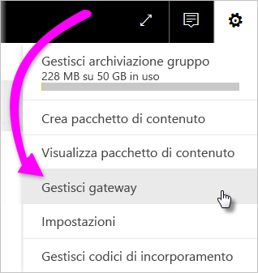
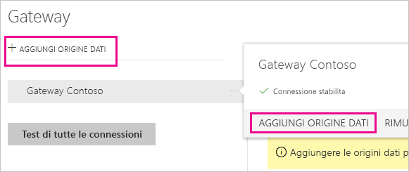
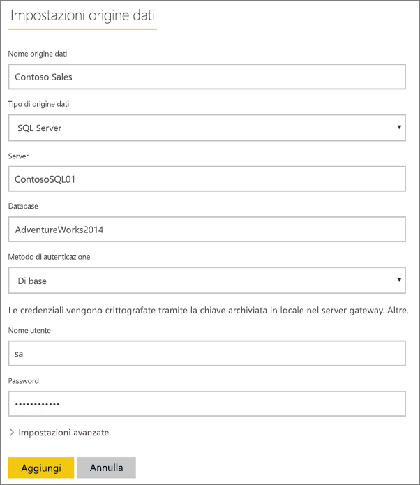
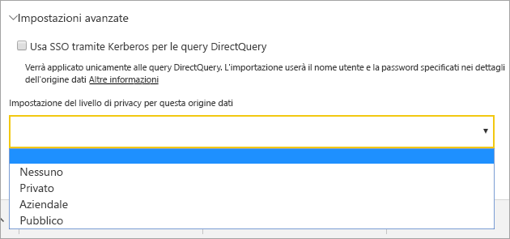
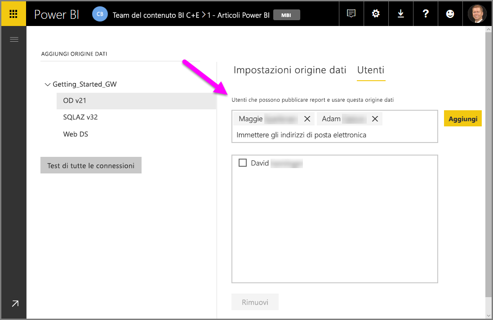
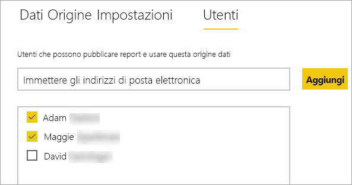
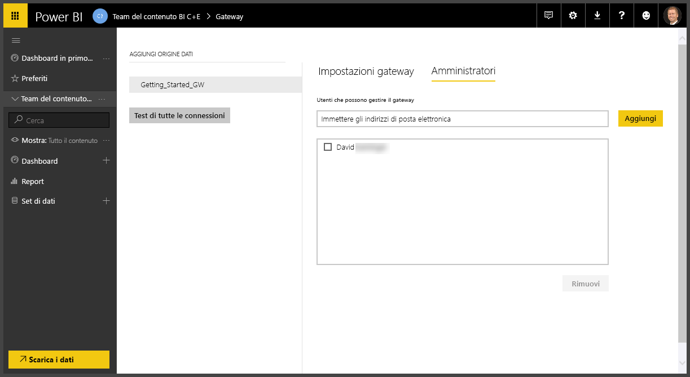
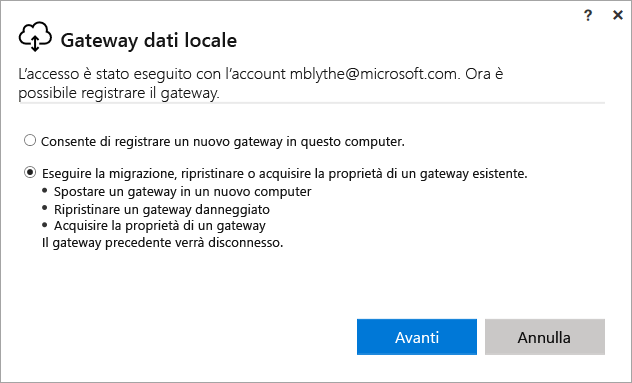
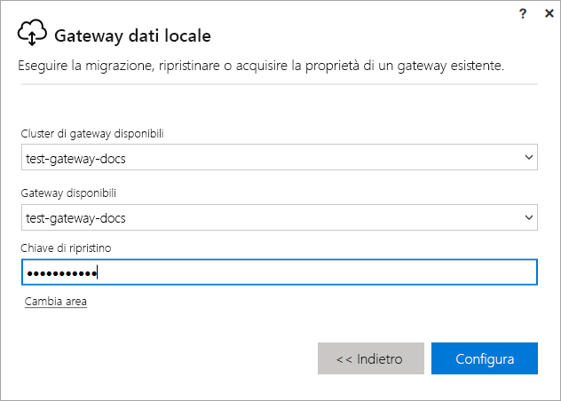

# Gestire un gateway di Power BI

Dopo aver [installato un gateway dati di Power BI](service-gateway-install.md) è possibile gestirlo tramite l'area **Gestisci gateway** del servizio Power BI, nell'app gateway nel computer locale e tramite script di PowerShell. Questo articolo è incentrato sul servizio Power BI. Se si è appena installato un gateway, è consigliabile per prima cosa [aggiungere un'origine dati](#add-a-data-source) e quindi [aggiungere gli utenti](#add-users-to-a-data-source) in modo che possano accedere all'origine dati.

## Gestire le origini dati

Power BI supporta molte origini dati locali, ognuna delle quali ha requisiti specifici. Questo esempio illustra l'aggiunta di un'origine dati SQL Server, ma i passaggi per altre origini dati sono simili.

### Aggiungere un'origine dati

1. Nell'angolo in alto a destra del servizio Power BI selezionare l'icona dell'ingranaggio  > **Gestisci gateway**.

    

2. Selezionare un gateway > **Aggiungi origine dati** oppure passare a Gateway > **Aggiungi origine dati**.

    

3. Selezionare il **Tipo di origine dati**.

    

4. Immettere le informazioni per l'origine dati. In questo esempio si tratta di **Server**, **Database** e altri dettagli.  

    

5. Per SQL Server, scegliere il **Metodo di autenticazione** **Windows** oppure **Di base** (autenticazione SQL).  Se si sceglie **Di base**, immettere le credenziali per l'origine dati.

6. Facoltativamente, in **Impostazioni avanzate** configurare il [Livello di privacy](https://support.office.com/article/Privacy-levels-Power-Query-CC3EDE4D-359E-4B28-BC72-9BEE7900B540) per l'origine dati (non si applica a [DirectQuery](desktop-directquery-about.md)).

    

7. Selezionare **Aggiungi**. Se il processo ha esito positivo viene visualizzato il messaggio *Connessione riuscita*.

    

Ora è possibile usare questa origine dati per includere dati da SQL Server nei dashboard e nei report di Power BI.

### Rimuovere un'origine dati

Se non si usa più un'origine dati, è possibile rimuoverla. Tenere presente che rimuovendo un'origine dati si interrompono tutti i dashboard o i report che si basano sull'origine dati specificata.

Per rimuovere un'origine dati, passare all'origine dati e selezionare **Rimuovi**.

## Gestire utenti e amministratori

Dopo avere aggiunto un'origine dati a un gateway, si concede l'accesso alla specifica origine dati (non all'intero gateway) a utenti e gruppi di sicurezza. L'elenco di utenti di un'origine dati controlla soltanto chi è autorizzato a pubblicare report che includono dati provenienti da tale origine. I proprietari di report possono creare dashboard, pacchetti di contenuto e app e condividerli con altri utenti.

È anche possibile concedere a utenti e gruppi di sicurezza l'accesso amministrativo al gateway.

### Aggiungere utenti a un'origine dati

1. Nell'angolo in alto a destra del servizio Power BI selezionare l'icona dell'ingranaggio  > **Gestisci gateway**.

2. Selezionare l'origine dati in cui si vogliono aggiungere utenti.

3. Selezionare **Utenti** e immettere un utente dell'organizzazione al quale si intende concedere accesso all'origine dati selezionata. Nella schermata seguente è illustrata l'aggiunta di due utenti, Maggie e Adam.

    

4. Selezionare **Aggiungi**. Il membro aggiunto compare nella casella.

    

Non sono richieste altre operazioni. Non dimenticare che è necessario aggiungere utenti a ogni origine dati a cui si vuole concedere l'accesso. L'elenco di utenti è diverso per ogni origine dati, di conseguenza è necessario aggiungere gli utenti a ogni origine dati separatamente.

### Rimuovere utenti da un'origine dati

Nella scheda **Utenti** dell'origine dati è possibile rimuovere gli utenti o i gruppi di sicurezza che possono usare l'origine dati.

### Aggiungere e rimuovere amministratori

Nella scheda **Amministratori** del gateway è possibile aggiungere e rimuovere gli utenti o i gruppi di sicurezza che possono gestire il gateway.

## Gestire un cluster di gateway

Quando si crea un cluster costituito da due o più gateway, tutte le operazioni di gestione del gateway, ad esempio l'aggiunta di un'origine dati o la concessione di autorizzazioni di amministrazione a un gateway, si applicano a tutti i gateway inclusi nel cluster. 

Quando gli amministratori usano la voce di menu **Gestisci gateway** disponibile facendo clic sull'icona a forma di ingranaggio nel **servizio Power BI**, visualizzano l'elenco dei cluster registrati o dei singoli gateway, ma non visualizzano le istanze dei singoli gateway membri del cluster.

Tutte le nuove richieste di **aggiornamento pianificato** e le operazioni DirectQuery vengono automaticamente instradate all'istanza primaria di un cluster di gateway specificato. Se l'istanza del gateway primario non è online, la richiesta viene indirizzata a un'altra istanza di gateway nel cluster.

## Eseguire la migrazione, ripristinare o acquisire la proprietà di un gateway

Eseguire il programma di installazione del gateway nel computer in cui si vuole eseguire la migrazione, ripristinare o acquisire la proprietà di un gateway.

1. Scaricare il gateway e installarlo.

2. Dopo aver eseguito l'accesso al proprio account di Power BI, registrare il gateway. Selezionare **Eseguire la migrazione, ripristinare o acquisire la proprietà di un gateway esistente** > **Avanti**.

    

3. Effettuare una selezione nell'elenco di cluster e gateway disponibili e immettere la chiave di ripristino per il gateway selezionato. Selezionare **Configura**.

    

## Riavviare un gateway

Il gateway viene eseguito come servizio di Windows. Come qualsiasi servizio di Windows, può essere avviato e arrestato in vari modi. Ecco come farlo dal prompt dei comandi.

1. Nel computer in cui è in esecuzione il gateway, avviare un prompt dei comandi con privilegi di amministratore

2. Immettere `net stop PBIEgwService` per arrestare il servizio.

3. Immettere `net start PBIEgwService` per riavviare il servizio.

## Rimuovere un gateway

Se non si usa più un gateway, è possibile rimuoverlo. Tenere presente, tuttavia, che la rimozione di un gateway comporta l'eliminazione di tutte le origini dati sottostanti. Questo causa l'interruzione di tutti i dashboard e i report che si basano su tali origini dati.

1. Nell'angolo in alto a destra del servizio Power BI selezionare l'icona dell'ingranaggio  > **Gestisci gateway**.

2. Selezionare il gateway > **Rimuovi**
   
   

## Passaggi successivi

[Indicazioni per la distribuzione di un gateway dati](service-gateway-deployment-guidance.md)

Altre domande? [Provare la community di Power BI](http://community.powerbi.com/)
