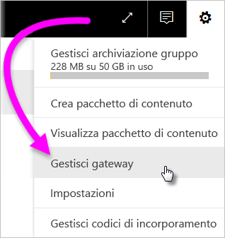
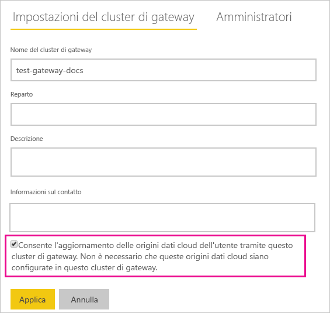

# Unire o aggiungere origini dati locali e cloud

[!INCLUDE [gateway-rewrite](includes/gateway-rewrite.md)]

È possibile usare il gateway dati locale per unire o aggiungere origini dati locali e cloud nella stessa query. Questa soluzione risulta utile quando si vuole combinare i dati di più origini senza usare query separate.

>[!NOTE]
>Questo articolo si applica solo ai set di dati con origini dati cloud e locali unite o accodate in una singola query. Per i set di dati che includono query separate, una con connessione a un'origine dati locale e l'altra a un'origine dati cloud, il gateway non esegue la query per l'origine dati cloud.

## Prerequisiti

- Un [gateway installato](/data-integration/gateway/service-gateway-install) in un computer locale.
- Un file di Power BI Desktop con query in cui sono combinate origini dati locali e cloud.

>[!NOTE]
>Per accedere a tutte le origini dati cloud, è necessario assicurarsi che il gateway abbia accesso a tali origini dati.

1. Nell'angolo in alto a destra del servizio Power BI selezionare l'icona dell'ingranaggio  > **Gestisci gateway**.

    

2. Selezionare il gateway da configurare.

3. In **Impostazioni del cluster di gateway** selezionare **Consente l'aggiornamento delle origini dati cloud dell'utente tramite questo cluster di gateway** > **Applica**.

    

4. Nel cluster di gateway aggiungere le [origini dati locali](service-gateway-enterprise-manage-scheduled-refresh.md#add-a-data-source) usate nelle query. Non è necessario aggiungere qui le origini dati cloud.

5. Caricare nel servizio Power BI il file di Power BI Desktop con le query in cui sono combinate origini dati locali e cloud.

6. Nella pagina **Impostazioni set di dati** per il nuovo set di dati:

   - Per l'origine locale, selezionare il gateway associato a questa origine dati.
   - In **Credenziali dell'origine dati** modificare le credenziali dell'origine dati cloud come necessario.

    Verificare che i livelli di privacy per le origini dati sia cloud che locali siano impostati in modo appropriato per assicurarsi che i join vengano gestiti in modo sicuro.

     

7. Dopo che le credenziali cloud sono state impostate, è possibile aggiornare il set di dati tramite l'opzione **Aggiorna adesso**. In alternativa, è possibile pianificare l'aggiornamento periodico.

## Passaggi successivi

Per altre informazioni sull'aggiornamento dei dati per i gateway, vedere [Uso dell'origine dati per l'aggiornamento pianificato](service-gateway-enterprise-manage-scheduled-refresh.md#use-the-data-source-for-scheduled-refresh).
