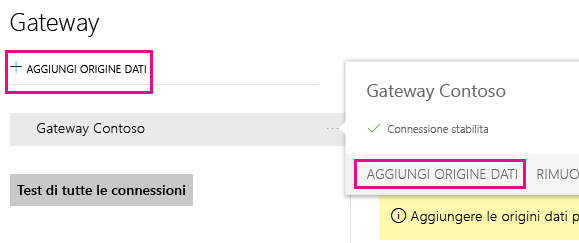
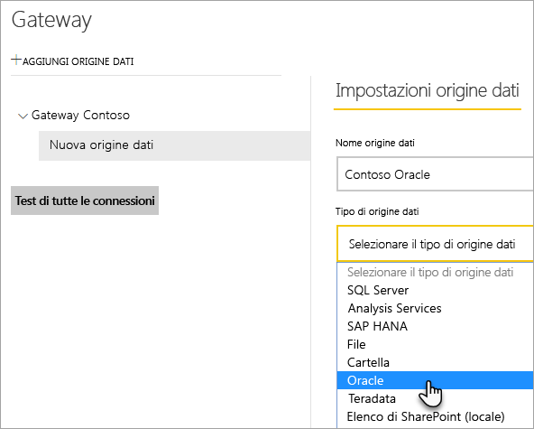
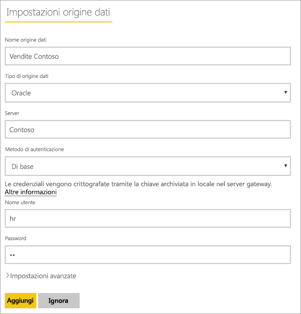
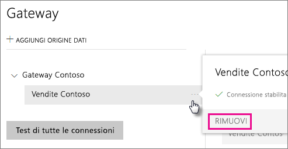
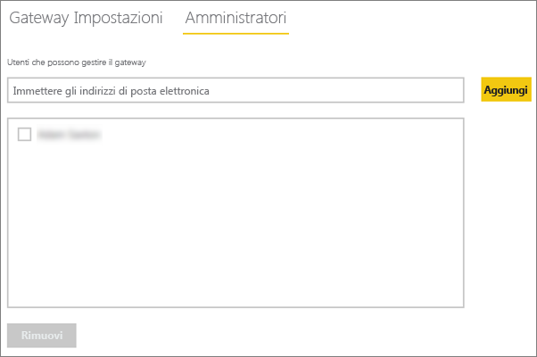
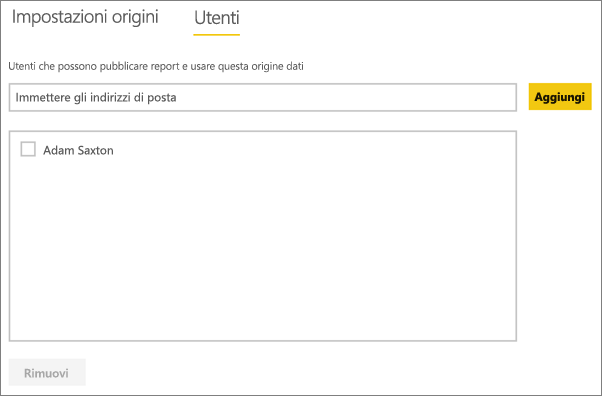
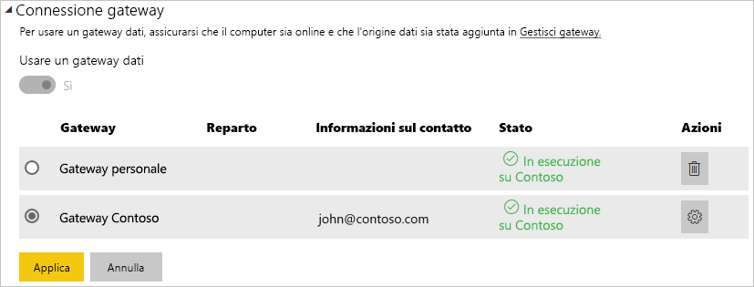

# <a name="manage-your-data-source---oracle"></a>Gestire l'origine dati - Oracle
Dopo aver installato il gateway dati locale, sarà necessario aggiungere le origini dati che possono essere usate con il gateway. In questo articolo viene descritto come lavorare con i gateway e le origini dati. È possibile usare l'origine dati Oracle per l'aggiornamento pianificato o per DirectQuery.

## <a name="download-and-install-the-gateway"></a>Download e installazione del gateway
È possibile scaricare il gateway dal servizio Power BI. Selezionare **Download** > **Gateway dati** oppure passare alla [pagina di download del gateway](https://go.microsoft.com/fwlink/?LinkId=698861).


> [!WARNING]
> Per far sì che il gateway possa connettersi al server Oracle, è necessario aver installato e configurato il Provider di dati Oracle per .NET (ODP.NET), che fa parte di Oracle Data Access Components (ODAC). Per altre informazioni su come scaricare il provider Oracle, vedere [Installazione del client Oracle](#installing-the-oracle-client) di seguito.
> 
> 

## <a name="installing-the-oracle-client"></a>Installazione del client Oracle
Per le versioni a **32 bit** di Power BI Desktop, usare il collegamento seguente per scaricare e installare il client Oracle a **32 bit**:

* [Oracle Data Access Components (ODAC) a 32 bit con strumenti di sviluppo Oracle per Visual Studio (12.1.0.2.4)](http://www.oracle.com/technetwork/topics/dotnet/utilsoft-086879.html)

Per le versioni a **64 bit** di Power BI Desktop o per il gateway dati locale, usare il collegamento seguente per scaricare e installare il client Oracle a **64 bit**:

* [ODAC 12.2c versione 1 (12.2.0.1.0) a 64 bit per Windows x64](http://www.oracle.com/technetwork/database/windows/downloads/index-090165.html)

Dopo averlo installato, sarà necessario configurare il file tnsnames.ora con le informazioni corrette per il proprio database. Power BI Desktop e il gateway si baseranno sul nome del servizio di rete net_service_name definito nel file tnsnames.ora. Se non è configurato, non sarà possibile connettersi. Il percorso predefinito per il file tnsnames.ora è il seguente: `[Oracle Home Directory]\Network\Admin\tnsnames.ora`. Per altre informazioni su come configurare i file tnsnames.ora, vedere [Oracle: parametri di denominazione locale (tnsnames.ora)](https://docs.oracle.com/cd/B28359_01/network.111/b28317/tnsnames.htm).

### <a name="example-tnsnamesora-file-entry"></a>Esempio di immissione nel file tnsnames.ora
Il formato di base di un'immissione nel file tnsnames.ora è il seguente:

```
net_service_name=
 (DESCRIPTION=
   (ADDRESS=(protocol_address_information))
   (CONNECT_DATA=
     (SERVICE_NAME=service_name)))
```

Di seguito è riportato un esempio delle informazioni relative al server e alla porta già compilate.

```
CONTOSO =
  (DESCRIPTION =
    (ADDRESS = (PROTOCOL = TCP)(HOST = oracleserver.contoso.com)(PORT = 1521))
    (CONNECT_DATA =
      (SERVER = DEDICATED)
      (SERVICE_NAME = CONTOSO)
    )
  )
```

## <a name="add-a-gateway"></a>Aggiungere un gateway
Per aggiungere un gateway, [scaricare](https://go.microsoft.com/fwlink/?LinkId=698861) e installare semplicemente il gateway in un server nel proprio ambiente. Dopo aver installato il gateway, verrà visualizzato negli elenchi dei gateway in **Gestisci gateway**.

> [!NOTE]
> **Gestisci gateway** non compare fino a quando non si è l'amministratore di almeno un gateway. Questa situazione può verificarsi sia se si viene aggiunti come amministratore sia se si installa e configura un gateway.
> 
> 

## <a name="remove-a-gateway"></a>Rimuovere un gateway
Rimuovendo un gateway si eliminano anche tutte le origini dati in tale gateway.  Questo inoltre interrompe tutti i dashboard e i report che si basano su tali origini dati.

1. Selezionare l'icona dell'ingranaggio  nell'angolo in alto a destra e scegliere **Gestisci gateway**.
2. Gateway > **Rimuovi**.
   
   

## <a name="add-a-data-source"></a>Aggiungere un'origine dati
È possibile aggiungere un'origine dati, selezionando un gateway e facendo clic su **Aggiungi origine dati** o passando al Gateway > **Aggiungi origine dati**.



È quindi possibile selezionare il **tipo di origine dati** dall'elenco.



Inserire le informazioni per l'origine dati tra cui il **Server** e il **Database**.  

È inoltre necessario scegliere un **Metodo di autenticazione**,  **Windows** o **Basic**.  È preferibile scegliere **Basic** se si intende usare un account creato all'interno di Oracle anziché l'autenticazione di Windows. Immettere le credenziali che verranno utilizzate per questa origine dati.

> [!NOTE]
> Tutte le query all'origine dati verranno eseguite utilizzando queste credenziali. Per altre informazioni su come vengono archiviate le [credenziali](service-gateway-onprem.md#credentials) vedere l'articolo principale sul gateway dati locale.
> 
> 



È possibile fare clic su **Aggiungi** dopo aver compilato tutti i campi.  È ora possibile usare questa origine dati per l'aggiornamento pianificato o DirectQuery su un server Oracle locale. Verrà visualizzato *Connessione riuscita* se la connessione ha avuto esito positivo.


### <a name="advanced-settings"></a>Impostazioni avanzate
È possibile configurare il livello di privacy per l'origine dati. Questa impostazione controlla la modalità di mashup dei dati. L'impostazione viene usata solo per l'aggiornamento pianificato e non per DirectQuery. [Altre informazioni](https://support.office.com/article/Privacy-levels-Power-Query-CC3EDE4D-359E-4B28-BC72-9BEE7900B540)


## <a name="remove-a-data-source"></a>Rimuovere un'origine dati
Rimuovendo un'origine dati si interrompono tutti i dashboard o i report che si basano sull'origine dati specificata.  

Per rimuovere un'origine dati, passare all'Origine dati > **Rimuovi**.



## <a name="manage-administrators"></a>Gestire gli amministratori
Nella scheda Amministratori del gateway è possibile aggiungere e rimuovere gli utenti o i gruppi di sicurezza che possono gestire il gateway.



## <a name="manage-users"></a>Gestire gli utenti
Sulla scheda utenti, per l'origine dati, è possibile aggiungere e rimuovere gli utenti o i gruppi di sicurezza che possono utilizzare l’origine dati.

> [!NOTE]
> L'elenco degli utenti controlla solo gli utenti autorizzati a pubblicare report. I proprietari di report possono creare dashboard o pacchetti di contenuto e condividerli con altri utenti. Gli utenti che utilizzano il report o il dashboard non devono essere nell'elenco di utenti.
> 
> 



## <a name="using-the-data-source"></a>Uso dell'origine dati
Dopo aver creato l'origine dati, sarà possibile usarla con le connessioni DirectQuery o tramite l'aggiornamento pianificato.

> [!WARNING]
> I nomi del server e del database devono corrispondere tra Power BI Desktop e l'origine dati all'interno del gateway dati locale.
> 
> 

Il collegamento tra il set di dati e l'origine dati all'interno del gateway si basa sul nome del server e sul nome del database. Questi nomi devono corrispondere. Ad esempio, se si indica un indirizzo IP per il nome del server, all'interno di Power BI Desktop è necessario usare l'indirizzo IP per l'origine dati all'interno della configurazione del gateway. Anche questo nome deve corrispondere con un alias definito nel file tnsnames.ora. Per altre informazioni sul file tnsnames.ora, vedere [Installazione del client Oracle](#installing-the-oracle-client).

Questo vale sia per DirectQuery che per l'aggiornamento pianificato.

### <a name="using-the-data-source-with-directquery-connections"></a>Uso dell'origine dati con le connessioni DirectQuery
È necessario assicurarsi che i nomi del server e del database corrispondano tra Power BI Desktop e l'origine dati configurata per il gateway. È inoltre necessario assicurarsi che l'utente sia elencato nella scheda **Utenti** dell'origine dati per pubblicare i set di dati DirectQuery. Per DirectQuery, la selezione avviene all'interno di Power BI Desktop alla prima importazione dei dati. [Altre informazioni](desktop-use-directquery.md)

Dopo la pubblicazione, da Power BI Desktop o **Recupera dati**, i report dovrebbero iniziare a funzionare. Dopo la creazione dell'origine dati all'interno del gateway potrebbero essere necessari alcuni minuti prima di poter usare la connessione.

### <a name="using-the-data-source-with-scheduled-refresh"></a>Uso dell’origine dati con l'aggiornamento pianificato
Se si è presenti nella scheda **Utenti** dell'origine dati configurata all'interno del gateway e i nomi del server e del database corrispondono, il gateway verrà visualizzato come un'opzione per l’uso con l'aggiornamento pianificato.



## <a name="troubleshooting"></a>Risoluzione dei problemi
Quando la sintassi di denominazione non è corretta o non è configurata correttamente, potrebbero verificarsi vari errori di Oracle.

* ORA-12154: TNS: impossibile risolvere l'identificativo di connessione specificato  
* ORA-12514: TNS: il listener non è attualmente a conoscenza del servizio richiesto nel descrittore di connessione  
* ORA-12541: TNS: nessun listener  
* ORA-12170: TNS: si è verificato il timeout della connessione  
* ORA-12504: TNS: il listener non ha ricevuto SERVICE_NAME in CONNECT_DATA  

Questi errori potrebbero verificarsi se il client Oracle non è installato o se non è configurato correttamente. Se è installato, è consigliabile verificare che il file tnsnames.ora sia configurato correttamente e che si usi il valore net_service_name corretto. È anche necessario assicurarsi che il valore net_service_name sia lo stesso tra la macchina che usa Power BI Desktop e il computer che esegue il gateway. Per altre informazioni, vedere [Installazione del client Oracle](#installing-the-oracle-client).

> [!NOTE]
> Potrebbe anche verificarsi un problema a causa dell'incompatibilità tra la versione del server Oracle e la versione del client Oracle, che in genere devono corrispondere.
> 
> 

Per altre informazioni sulla risoluzione dei problemi relativi al gateway, vedere [Risoluzione dei problemi del gateway dati locale](service-gateway-onprem-tshoot.md).

## <a name="next-steps"></a>Passaggi successivi
[Gateway dati locale](service-gateway-onprem.md)  
[Analisi approfondita del gateway dati locale](service-gateway-onprem-indepth.md)  
[Risoluzione dei problemi del gateway dati locale](service-gateway-onprem-tshoot.md)  
[Power BI Premium](service-premium.md)

Altre domande? [Provare a rivolgersi alla community di Power BI](http://community.powerbi.com/)

