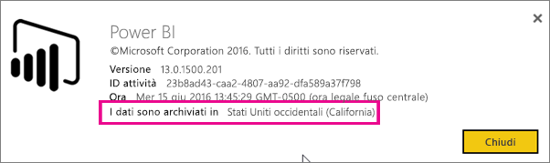
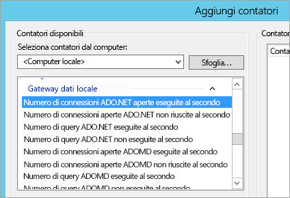
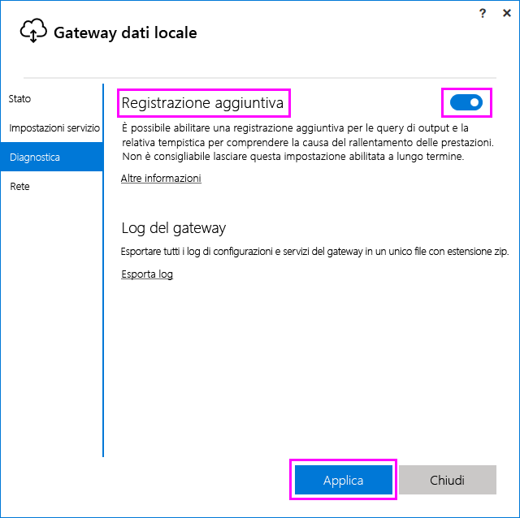
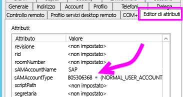
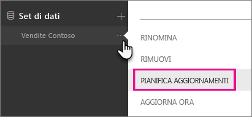
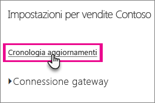

# <a name="troubleshooting-the-on-premises-data-gateway"></a>Risoluzione dei problemi del gateway dati locale
Questo articolo illustra alcuni problemi comuni che possono verificarsi quando si usa il **gateway dati locale**.

<!-- Shared Community & support links Include -->
[!INCLUDE [gateway-onprem-tshoot-support-links-include](./includes/gateway-onprem-tshoot-support-links-include.md)]

<!-- Shared Troubleshooting Install Include -->
[!INCLUDE [gateway-onprem-tshoot-install-include](./includes/gateway-onprem-tshoot-install-include.md)]

## <a name="configuration"></a>Configurazione
### <a name="how-to-restart-the-gateway"></a>Come riavviare il gateway
Il gateway viene eseguito come servizio di Windows, quindi è possibile avviarlo e arrestarlo in diversi modi. Ad esempio, è possibile aprire un prompt dei comandi con autorizzazioni elevate nel computer in cui il gateway è in esecuzione e quindi eseguire uno di questi comandi:

* Per arrestare il servizio, eseguire questo comando:
  
    '''   net stop PBIEgwService   '''
* Per avviare il servizio, eseguire questo comando:
  
    '''   net start PBIEgwService   '''

### <a name="error-failed-to-create-gateway-please-try-again"></a>Errore: Non è stato possibile creare il gateway. Riprovare.
Tutti i dettagli sono disponibili, ma la chiamata al servizio Power BI ha restituito un errore. Verranno visualizzati l'errore e un id attività. Questo potrebbe verificarsi per diverse ragioni. È possibile raccogliere e rivedere i registri, come indicato di seguito, per ottenere maggiori dettagli.

Questo potrebbe essere dovuto a problemi di configurazione del proxy. L'interfaccia utente consente ora la configurazione del proxy. Sono disponibili altre informazioni sulle [modifiche alla configurazione del proxy](service-gateway-proxy.md).

### <a name="error-failed-to-update-gateway-details--please-try-again"></a>Errore: Non è stato possibile aggiornare i dettagli del gateway.  Riprovare.
Le informazioni sono state ricevute dal servizio Power BI, al gateway. Le informazioni state passate al servizio di windows locale, ma quest’ultimo non è riuscito a restituirle. In alternativa, una generazione della chiave simmetrica ha avuto esito negativo. In **Mostra dettagli**verrà visualizzata l'eccezione interna. È possibile raccogliere e rivedere i registri, come indicato di seguito, per ottenere maggiori dettagli.

### <a name="error-power-bi-service-reported-local-gateway-as-unreachable-please-restart-the-gateway-and-try-again"></a>Errore: Il servizio Power BI ha segnalato che il gateway locale non è raggiungibile. Riavviare il gateway e riprovare.
Al termine della configurazione, il servizio Power BI verrà chiamato nuovamente a convalidare il gateway. Il servizio Power BI non dichiara il gateway come *live*. Il riavvio del servizio windows potrebbe consentire la riuscita della comunicazione. È possibile raccogliere e rivedere i registri, come indicato di seguito, per ottenere maggiori dettagli.

### <a name="script-error-during-sign-into-power-bi"></a>Errore di script durante l'accesso a Power BI
Potrebbe verificarsi un errore di script quando si accede a Power BI nell'ambito della configurazione del gateway dati locale. L'installazione dell'aggiornamento di sicurezza seguente dovrebbe risolvere il problema. Può essere installato tramite Windows Update.

[MS16-051: Aggiornamento della sicurezza per Internet Explorer: 10 maggio 2016 (KB 3154070)](https://support.microsoft.com/kb/3154070)

### <a name="gateway-configuration-failed-with-a-null-reference-exception"></a>Configurazione del gateway non riuscita con eccezione di riferimento Null
Potrebbe essere visualizzato un errore simile al seguente.

        Failed to update gateway details.  Please try again.
        Error updating gateway configuration.

Verrà inclusa un'analisi dello stack e tale analisi dello stack potrebbe includere gli elementi seguenti.

        Microsoft.PowerBI.DataMovement.Pipeline.Diagnostics.CouldNotUpdateGatewayConfigurationException: Error updating gateway configuration. ----> System.ArgumentNullException: Value cannot be null.
        Parameter name: serviceSection

Se si esegue l'aggiornamento da un gateway precedente, viene conservato il file di configurazione. Potrebbe mancare una sezione. Quando il gateway prova a leggerla, viene visualizzata l'eccezione di riferimento Null precedente.

Per correggere questo errore, seguire questa procedura.

1. Disinstallare il gateway.
2. Eliminare la cartella seguente.
   
        c:\Program Files\On-premises data gateway
3. Reinstallare il gateway.
4. Applicare facoltativamente la chiave di ripristino per ripristinare un gateway esistente.

### <a name="support-for-tls-1112"></a>Supporto per TLS 1.1/1.2
A partire dall'aggiornamento di agosto 2017 e versioni successive, per impostazione predefinita il gateway dati locale usa il protocollo TLS (Transport Layer Security) 1.1 o 1.2 per comunicare con il **servizio Power BI**. Le versioni precedenti del gateway dati locale usano TLS 1.0 per impostazione predefinita. A partire dall'1 novembre 2017 il supporto per TLS 1.0 terminerà, quindi entro tale data è necessario aggiornare le installazioni del gateway dati locale alla versione di agosto 2017 o a una versione più recente, in modo da assicurare che i gateway continuino a funzionare.

È importante notare che TLS 1.0 è ancora supportato dal gateway dati locale prima dell'1 novembre e viene usato dal gateway come meccanismo di fallback. Per assicurare che tutto il traffico del gateway usi TLS 1.1 o 1.2 e per evitare l'uso di TLS 1.0 nel gateway, è necessario aggiungere o modificare le chiavi del Registro di sistema seguenti nel computer che esegue il servizio gateway:

        [HKEY_LOCAL_MACHINE\SOFTWARE\Microsoft\.NETFramework\v4.0.30319]"SchUseStrongCrypto"=dword:00000001
        [HKEY_LOCAL_MACHINE\SOFTWARE\Wow6432Node\Microsoft\.NETFramework\v4.0.30319]"SchUseStrongCrypto"=dword:00000001

> [!NOTE]
> L'aggiunta o la modifica di queste chiavi del Registro di sistema viene applicata a tutte le applicazioni .NET. Per informazioni sulle modifiche del Registro di sistema che influiscono su TLS per altre applicazioni, vedere [Impostazioni del Registro di sistema per TLS (Transport Layer Security)](https://docs.microsoft.com/windows-server/security/tls/tls-registry-settings).
> 
> 

## <a name="data-sources"></a>Origini dati
### <a name="error-unable-to-connect-details-invalid-connection-credentials"></a>Errore: La connessione non è riuscita. Dettagli: "Le credenziali di connessione non sono valide"
In **Mostra dettagli**, viene visualizzato il messaggio di errore ricevuto dall'origine dati. Per SQL Server, dovrebbe avere un aspetto simile al seguente.

    Login failed for user 'username'.

Verificare la correttezza del nome utente e della password. Verificare inoltre che tali credenziali possono connettersi all'origine dati. Assicurarsi che l'account utilizzato corrisponda al **Metodo di autenticazione**.

### <a name="error-unable-to-connect-details-cannot-connect-to-the-database"></a>Errore: La connessione non è riuscita. Dettagli: "Non è possibile stabilire la connessione al database"
Siamo in grado di effettuare la connessione al server, ma non per il database specificato. Verificare il nome del database, e che la credenziale dell'utente disponga dell'autorizzazione per accedere al database.

In **Mostra dettagli**, viene visualizzato il messaggio di errore ricevuto dall'origine dati. Per SQL Server, dovrebbe avere un aspetto simile al seguente.

    Cannot open database "AdventureWorks" requested by the login. The login failed. Login failed for user 'username'.

### <a name="error-unable-to-connect-details-unknown-error-in-data-gateway"></a>Errore: La connessione non è riuscita. Dettagli: "Si è verificato un errore sconosciuto nel gateway dati"
Questo errore può verificarsi per diversi motivi. Assicurarsi che sia possibile connettersi all'origine dati dal computer che ospita il gateway. Questo può essere il risultato dell’inaccessibilità al server.

In **Mostra dettagli**, verrà visualizzato il codice di errore **DM_GWPipeline_UnknownError**.

Per altri dettagli, è anche possibile cercare in Registri eventi > **Registri applicazioni e servizi** > **Servizio Gateway dati locale**.

### <a name="error-we-encountered-an-error-while-trying-to-connect-to-server-details-we-reached-the-data-gateway-but-the-gateway-cant-access-the-on-premises-data-source"></a>Errore: Si è verificato un errore durante il tentativo di connessione a<server>. Dettagli: "Il data gateway è raggiungibile ma non può accedere all'origine dati locale".
Non è stato possibile connettersi all'origine dati specificata. Controllare le informazioni fornite per l'origine dati.

In **Mostra dettagli**verrà visualizzato il codice di errore **DM_GWPipeline_Gateway_DataSourceAccessError**.

Se il messaggio di errore sottostante è simile al seguente, significa che l'account in uso per l'origine dati non è un amministratore del server per l'istanza di Analysis Services. [Altre informazioni](https://docs.microsoft.com/sql/analysis-services/instances/grant-server-admin-rights-to-an-analysis-services-instance)

    The 'CONTOSO\account' value of the 'EffectiveUserName' XML for Analysis property is not valid.

Se il messaggio di errore sottostante è simile al seguente, l'account del servizio per Analysis Services potrebbe non includere l'attributo [token-groups-global-and-universal](https://msdn.microsoft.com/library/windows/desktop/ms680300.aspx) (TGGAU) della directory.

    The user name or password is incorrect.

L'attributo TGGAU sarà abilitato nei domini con accesso compatibile con le versioni precedenti a Windows 2000. La maggior parte dei domini creati di recente, tuttavia, non abiliterà questo attributo per impostazione predefinita. Per altre informazioni, vedere [qui](https://support.microsoft.com/kb/331951).

Per confermare, seguire questa procedura.

1. Connettersi al computer di Analysis Services in SQL Server Management Studio. All'interno delle proprietà avanzate di connessione includere il valore EffectiveUserName per l'utente specifico e verificare se l'errore viene riprodotto.
2. È possibile usare lo strumento dsacls di Active Directory per verificare che l'attributo sia incluso nell'elenco. Questo strumento è in genere disponibile in un controller di dominio. Sarà necessario conoscere il nome di dominio distinto per l'account e passarlo allo strumento.
   
        dsacls "CN=John Doe,CN=UserAccounts,DC=contoso,DC=com"
   
    I risultati dovrebbero avere un aspetto simile al seguente.
   
            Allow BUILTIN\Windows Authorization Access Group
                                          SPECIAL ACCESS for tokenGroupsGlobalAndUniversal
                                          READ PROPERTY

Per risolvere il problema, sarà necessario abilitare TGGAU nell'account usato per il servizio di Windows Analysis Services.

**Password o nome non valido**

Questo errore può dipendere anche dal fatto che il server di Analysis Services si trova in un dominio diverso rispetto a quello dell'utente e che non è stato stabilito alcun trust bidirezionale.

Sarà necessario collaborare con gli amministratori del dominio per verificare la relazione di trust tra i domini.

**Non è possibile visualizzare le origini dati del gateway dati nell'esperienza "Recupera dati" per Analysis Services dal servizio Power BI**

Assicurarsi che il proprio account sia elencato nella scheda **Utenti** dell'origine dati all'interno della configurazione del gateway. Se non si ha accesso al gateway, rivolgersi all'amministratore del gateway e chiedere di verificare. Solo gli account presenti nell’elenco **Utenti** possono visualizzare l'origine dati riportata nell'elenco di Analysis Services.

## <a name="datasets"></a>Set di dati
### <a name="error-there-is-not-enough-space-for-this-row"></a>Errore: Non è disponibile spazio sufficiente per questa riga.
Questo accade in presenza di una riga singola le cui dimensioni superano 4 MB. È necessario determinare quale sia la riga dall'origine dati e tentare di filtrarla o di ridurne le dimensioni.

### <a name="error-the-server-name-provided-doesnt-match-the-server-name-on-the-sql-server-ssl-certificate"></a>Errore: Il nome del server specificato non corrisponde al nome del server nel certificato SSL di SQL Server.
Questo errore può verificarsi quando il certificato CN è relativo al nome di dominio completo del server (FQDN), ma si è fornito solo il nome netbios per il server. Ciò provocherà una mancata corrispondenza con il certificato. Per risolvere questo problema, è necessario far sì che per il nome del server all'interno dell'origine dati di gateway e il file PBIX venga usato il nome dominio completo del server.

### <a name="i-dont-see-the-on-premises-data-gateway-persent-when-configuring-scheduled-refresh"></a>La percentuale del gateway dati locale non è visibile durante la configurazione dell'aggiornamento pianificato.
Questo problema può essere dovuto ad alcuni scenari diversi.

1. I nomi del server e del database non corrispondono a quelli immessi in Power BI Desktop e all'origine dati configurata per il gateway. Deve trattarsi degli stessi valori, senza distinzione tra maiuscole e minuscole.
2. L'account non è elencato nella scheda **Utenti** dell'origine dati all'interno della configurazione del gateway. È necessario chiedere all'amministratore del gateway di essere aggiunti all'elenco.
3. All'interno del file di Power BI Desktop sono presenti più origini dati, ma non tutte configurate con il gateway. È necessario definire ogni origine dati con il gateway in modo da visualizzarlo in Aggiornamento pianificato.

### <a name="error-the-received-uncompressed-data-on-the-gateway-client-has-exceeded-limit"></a>Errore: La quantità di dati non compressi ricevuti nel client del gateway ha superato il limite.
La limitazione esatta è di 10 GB di dati non compressi per ogni tabella. Se si verifica questo problema, ci sono buone opzioni per ottimizzare ed evitare il problema. In particolare, aiuta ridurre l'uso di valori stringa lunghi e molto ripetitivi, usando invece una chiave normalizzata o rimuovendo la colonna (se non usata).

## <a name="reports"></a>Report
### <a name="report-could-not-access-the-data-source-because-you-do-not-have-access-to-our-data-source-via-an-on-premises-data-gateway"></a>Il report non è riuscito ad accedere all'origine dati perché non si ha accesso all’origine dati tramite un gateway dati locale.
Questo è in genere dovuto a uno dei motivi seguenti.

1. Le informazioni sull’origine dati non corrispondono al contenuto del set di dati sottostante. Il nome del server e del database devono corrispondere tra l'origine dati definita per il gateway dati locale e i dati forniti all'interno di Power BI Desktop. Se si usa un indirizzo IP in Power BI Desktop, anche l'origine dati per il gateway dati locale deve usare un indirizzo IP.
2. Non sono disponibili origini dati in alcun gateway dell'organizzazione. È possibile configurare l'origine dati in un gateway dati locale nuovo o esistente.

### <a name="error-data-source-access-error-please-contact-the-gateway-administrator"></a>Errore: Si è verificato un errore di accesso all'origine dati. Contattare l'amministratore del gateway.
Se questo report usa una connessione dinamica di Analysis Services, potrebbe verificarsi un problema con un valore passato a EffectiveUserName non valido o privo delle autorizzazioni per il computer di Analysis Services. Un problema di autenticazione dipende in genere dal fatto che il valore passato per EffectiveUserName non corrisponde al nome dell'entità utente locale.

Per risolvere il problema, seguire questa procedura.

1. Trovare il nome utente effettivo entro i [log del gateway](#logs).
2. Dopo avere passato il valore, verificarne la correttezza. Se corrisponde all'utente, è possibile usare il comando seguente da un prompt dei comandi per verificare il valore previsto per il nome dell'entità utente. Il nome dell'entità utente avrà un aspetto simile a un indirizzo di posta elettronica.
   
        whoami /upn

È facoltativamente possibile verificare i dati che Power BI riceve da Azure Active Directory.

1. Passare a [https://graphexplorer.cloudapp.net](https://graphexplorer.cloudapp.net).
2. Selezionare **Sign in** (Accedi) in alto a destra.
3. Eseguire la query seguente. Verrà visualizzata una risposta JSON di dimensioni abbastanza elevate.
   
        https://graph.windows.net/me?api-version=1.5
4. Cercare **userPrincipalName**.

Se il nome dell'entità utente di Azure Active Directory non corrisponde al nome dell'entità utente di Active Directory locale, è possibile usare la funzionalità [Mapping nomi utente](service-gateway-enterprise-manage-ssas.md#map-user-names) per sostituirlo con un valore valido. In alternativa, è possibile collaborare con l'amministratore del tenant o l'amministratore locale di Active Directory per ottenere una modifica del nome dell'entità utente.

<!-- Shared Troubleshooting Firewall/Proxy Include -->
[!INCLUDE [gateway-onprem-tshoot-firewall-include](./includes/gateway-onprem-tshoot-firewall-include.md)]

Per trovare l'area del data center in cui ci si trova, seguire questa procedura:

1. Selezionare **?** in alto a destra nel servizio Power BI.
2. Selezionare **Informazioni su Power BI**.
3. L'area del data center in cui ci si trova verrà elencata in **I dati sono archiviati in**.
   
    

Se non si ottengono comunque le informazioni necessarie, è possibile provare a ottenere una traccia di rete usando uno strumento come [fiddler](#fiddler) o netsh, anche se questi sono metodi di raccolta avanzati e potrebbe essere necessaria assistenza nell'analisi dei dati raccolti. Per ottenere assistenza, è possibile contattare il [supporto tecnico](https://support.microsoft.com).

## <a name="performance"></a>Prestazioni
<iframe width="560" height="315" src="https://www.youtube.com/embed/IJ_DJ30VNk4?showinfo=0" frameborder="0" allowfullscreen></iframe>

### <a name="performance-counters"></a>Contatori delle prestazioni
Esiste una serie di contatori delle prestazioni che possono essere usati per misurare le attività per il gateway. Possono essere utili per comprendere se è presente un carico elevato di attività e può essere necessario creare un nuovo gateway. Questi contatori non indicano il tempo necessario a effettuare questa operazione.

È possibile accedervi attraverso lo strumento Monitoraggio prestazioni di Windows.



I contatori sono raccolti in raggruppamenti generali.

| Tipo di contatore | Descrizione |
| --- | --- |
| ADO.NET |Usato per qualsiasi connessione di DirectQuery. |
| ADOMD |Usato per Analysis Services 2014 e versioni precedenti. |
| OLEDB |Usato da alcune origini dati. Include SAP HANA e Analysis Services 2016 o versioni successive. |
| Mashup |Include qualsiasi origine dati importata. Se si sta pianificando l'aggiornamento o si esegue un aggiornamento su richiesta, passerà attraverso il motore mashup. |

Di seguito è riportato un elenco di contatori delle prestazioni disponibili.

| Contatore | Descrizione |
| --- | --- |
| # of ADO.NET open connection executed / sec |Numero di azioni di connessione aperta ADO.NET eseguite al secondo (esito positivo o negativo). |
| # of ADO.NET open connection failed / sec |Numero di azioni di connessione aperta ADO.NET non riuscite al secondo. |
| # of ADO.NET queries executed / sec |Numero di query ADO.NET eseguite al secondo (esito positivo o negativo). |
| # of ADO.NET queries failed / sec |Numero di query ADO.NET non eseguite al secondo. |
| # of ADOMD open connection executed / sec |Numero di azioni di connessione aperta ADOMD eseguite al secondo (esito positivo o negativo). |
| # of ADOMD open connection failed / sec |Numero di azioni di connessione aperta ADOMD non eseguite al secondo. |
| # of ADOMD queries executed / sec |Numero di query ADOMD eseguite al secondo (esito positivo o negativo). |
| # of ADOMD queries failed / sec |Numero di query ADOMD non eseguite al secondo. |
| # of all open connection executed / sec |Numero di azioni di connessione aperta eseguite al secondo (esito positivo o negativo). |
| # of all open connection failed / sec |Numero di azioni di connessione aperta non riuscite eseguite al secondo. |
| # of all queries executed / sec |Numero di query eseguite al secondo (esito positivo o negativo). |
| # of items in the ADO.NET connection pool |Numero di elementi nel pool di connessioni ADO.NET. |
| # of items in the OLEDB connection pool |Numero di elementi nel pool di connessioni OLEDB. |
| # of items in the Service Bus pool |Numero di elementi nel pool del bus di servizio. |
| # of Mashup open connection executed / sec |Numero di azioni di connessione aperta Mashup eseguite al secondo (esito positivo o negativo). |
| # of Mashup open connection failed / sec |Numero di azioni di connessione aperta Mashup non riuscite al secondo. |
| # of Mashup queries executed / sec |Numero di query Mashup eseguite al secondo (esito positivo o negativo). |
| # of Mashup queries failed / sec |Numero di query Mashup non riuscite al secondo. |
| # of multiple result set OLEDB queries failed / sec |Numero di query OLEDB con set di risultati multipli eseguite al secondo. |
| # of OLEDB multiple resultset queries executed / sec |Numero di query con set di risultati multipli OLEDB eseguite al secondo (esito positivo o negativo). |
| # of OLEDB open connection executed / sec |Numero di azioni di connessione aperta OLEDB eseguite al secondo (esito positivo o negativo). |
| # of OLEDB open connection failed / sec |Numero di azioni di connessione aperta OLEDB non riuscite al secondo. |
| # of OLEDB queries executed / sec |Numero di query con set di risultati multipli OLEDB eseguite al secondo (esito positivo o negativo). |
| # of OLEDB queries failed / sec |Numero di query OLEDB non riuscite con set di risultati multipli OLEDB eseguite al secondo. |
| # of OLEDB single resultset queries executed / sec |Numero di query con set di risultati singolo OLEDB eseguite al secondo (esito positivo o negativo). |
| # of queries failed / sec |Numero di query non riuscite eseguite al secondo. |
| # of single result set OLEDB queries failed / sec |Numero di query OLEDB con set di risultati singolo eseguite al secondo. |

## <a name="reviewing-slow-performing-queries"></a>Analisi delle query con prestazioni ridotte
È possibile che la risposta tramite il gateway risulti lenta. Ciò può verificarsi per le query DirectQuery o durante l'aggiornamento del set di dati importato. È possibile abilitare una registrazione aggiuntiva per le query di output e la relativa tempistica per comprendere la causa del rallentamento delle prestazioni. Quando si rileva una query a lunga esecuzione, per ottimizzare le prestazioni delle query potrebbe essere necessaria una modifica aggiuntiva nell'origine dati. Ad esempio, la modifica degli indici per una query di SQL Server.

È necessario modificare due file di configurazione per determinare la durata di una query.

### <a name="microsoftpowerbidatamovementpipelinegatewaycoredllconfig"></a>Microsoft.PowerBI.DataMovement.Pipeline.GatewayCore.dll.config
Nel file *Microsoft.PowerBI.DataMovement.Pipeline.GatewayCore.dll.config* cambiare il valore `EmitQueryTraces` da `False` in `True`. Per impostazione predefinita, questo file si trova in *C:\Programmi\Gateway dati locale*. Se si abilita `EmitQueryTraces` verrà avviare la registrazione delle query inviate dal gateway a un'origine dati.

> [!IMPORTANT]
> A seconda dell'utilizzo di gateway, l'abilitazione di EmitQueryTraces può aumentare notevolmente le dimensioni del log. Dopo aver esaminato i log, è opportuno impostare EmitQueryTraces su False. Non è consigliabile lasciare questa impostazione abilitata a lungo termine.
> 
> 

```
<setting name="EmitQueryTraces" serializeAs="String">
    <value>True</value>
</setting>
```

**Esempio di immissione query**

```
DM.EnterpriseGateway Information: 0 : 2016-09-15T16:09:27.2664967Z DM.EnterpriseGateway    4af2c279-1f91-4c33-ae5e-b3c863946c41    d1c77e9e-3858-4b21-3e62-1b6eaf28b176    MGEQ    c32f15e3-699c-4360-9e61-2cc03e8c8f4c    FF59BC20 [DM.GatewayCore] Executing query (timeout=224) "<pi>
SELECT
TOP (1000001) [t0].[ProductCategoryName],[t0].[FiscalYear],SUM([t0].[Amount])
 AS [a0]
FROM
(
(select [$Table].[ProductCategoryName] as [ProductCategoryName],
    [$Table].[ProductSubcategory] as [ProductSubcategory],
    [$Table].[Product] as [Product],
    [$Table].[CustomerKey] as [CustomerKey],
    [$Table].[Region] as [Region],
    [$Table].[Age] as [Age],
    [$Table].[IncomeGroup] as [IncomeGroup],
    [$Table].[CalendarYear] as [CalendarYear],
    [$Table].[FiscalYear] as [FiscalYear],
    [$Table].[Month] as [Month],
    [$Table].[OrderNumber] as [OrderNumber],
    [$Table].[LineNumber] as [LineNumber],
    [$Table].[Quantity] as [Quantity],
    [$Table].[Amount] as [Amount]
from [dbo].[V_CustomerOrders] as [$Table])
)
 AS [t0]
GROUP BY [t0].[ProductCategoryName],[t0].[FiscalYear] </pi>"
```

### <a name="microsoftpowerbidatamovementpipelinediagnosticsdllconfig"></a>Microsoft.PowerBI.DataMovement.Pipeline.Diagnostics.dll.config
Nel file *Microsoft.PowerBI.DataMovement.Pipeline.Diagnostics.dll.config* cambiare il valore `TracingVerbosity` da `4` in `5`. Per impostazione predefinita, questo file si trova in *C:\Programmi\Gateway dati locale*. La modifica questa impostazione inizierà a registrare voci dettagliate nel log del gateway. Sono incluse le voci che mostrano la durata. È anche possibile abilitare le voci dettagliate abilitando il pulsante "Registrazione aggiuntiva" nell'applicazione Gateway dati locale.

   

> [!IMPORTANT]
> A seconda dell'utilizzo del gateway, l'abilitazione di TracingVerbosity su `5` può aumentare notevolmente le dimensioni del log. Dopo aver esaminato i log, è opportuno impostare TraceVerbosity su `4`. Non è consigliabile lasciare questa impostazione abilitata a lungo termine.
> 
> 

```
<setting name="TracingVerbosity" serializeAs="String">
    <value>5</value>
</setting>
```

<a name="activities"></a>

### <a name="activity-types"></a>Tipi di attività
| Tipo di attività | Descrizione |
| --- | --- |
| MGEQ |Query eseguite su ADO.NET. Sono incluse le origini dati DirectQuery. |
| MGEO |Query eseguite su OLEDB. Include SAP HANA e Analysis Services 2016. |
| MGEM |Query eseguite dal motore Mashup. Usate con set di dati importati che usano l'aggiornamento pianificato o su richiesta. |

### <a name="determine-the-duration-of-a-query"></a>Determinare la durata di una query
Per determinare il tempo impiegato per eseguire una query sull'origine dati, è possibile eseguire le operazioni seguenti.

1. Aprire il log di gateway.
2. Cercare un [tipo di attività](#activities) per trovare la query. Un esempio sarebbe MGEQ.
3. Prendere nota del secondo GUID perché è l'ID della richiesta.
4. Continuare a cercare MGEQ finché si trova la voce FireActivityCompletedSuccessfullyEvent con la durata. È possibile verificare che la voce abbia lo stesso ID richiesta. La durata sarà espressa in millisecondi.
   
        DM.EnterpriseGateway Verbose: 0 : 2016-09-26T23:08:56.7940067Z DM.EnterpriseGateway    baf40f21-2eb4-4af1-9c59-0950ef11ec4a    5f99f566-106d-c8ac-c864-c0808c41a606    MGEQ    21f96cc4-7496-bfdd-748c-b4915cb4b70c    B8DFCF12 [DM.Pipeline.Common.TracingTelemetryService] Event: FireActivityCompletedSuccessfullyEvent (duration=5004)
   
   > [!NOTE]
   > FireActivityCompletedSuccessfullyEvent è una voce dettagliata. Questa voce non verrà registrata a meno che TraceVerbosity sia al livello 5.
   > 
   > 

## <a name="kerberos"></a>Kerberos

Se il server di database sottostante e il gateway dati locale non sono configurati correttamente per la [delega vincolata Kerberos](service-gateway-kerberos-for-sso-pbi-to-on-premises-data.md), abilitare la [registrazione dettagliata](#microsoftpowerbidatamovementpipelinediagnosticsdllconfig) nel gateway ed esaminare i dati in base agli errori e alle tracce nei file di log del gateway, come punto di partenza per la risoluzione dei problemi.

### <a name="impersonationlevel"></a>ImpersonationLevel

Il valore di ImpersonationLevel è correlato alla configurazione del nome dell'entità servizio oppure all'impostazione dei criteri locali.

```
[DataMovement.PipeLine.GatewayDataAccess] About to impersonate user DOMAIN\User (IsAuthenticated: True, ImpersonationLevel: Identification)
```

**Soluzione**

Seguire questi passaggi per risolvere il problema:
1. Configurare un nome dell'entità di servizio per il gateway locale
2. Configurare la delega vincolata in Active Directory (AD)

### <a name="failedtoimpersonateuserexception-failed-to-create-windows-identity-for-user-userid"></a>FailedToImpersonateUserException: Non è stato possibile creare l'identità di Windows per l'utente idutente

L'eccezione FailedToImpersonateUserException si verifica se non è possibile la rappresentazione per conto di un altro utente. Ciò può verificarsi anche se l'account che si tenta di rappresentare proviene da un altro dominio rispetto a quello del servizio gateway (questa è una limitazione).

**Soluzione**
* Verificare che la configurazione sia corretta in base ai passaggi indicati nella sezione ImpersonationLevel precedente
* Assicurarsi che l'ID utente che si tenta di rappresentare sia un account di Active Directory valido

### <a name="general-error-1033-error-while-parsing-protocol"></a>Errore generale. Errore 1033 durante l'analisi del protocollo

Verrà visualizzato l'errore 1033 quando l'ID esterno configurato in SAP HANA non corrisponde all'account di accesso se l'utente è rappresentato con l'UPN (alias@domain.com). Nei log comparirà il messaggio "Original UPN 'alias@domain.com' replaced with new UPN 'alias@domain.com'" (UPN originale sostituito con il nuovo UPN) all'inizio dei log degli errori come di seguito.

```
[DM.GatewayCore] SingleSignOn Required. Original UPN 'alias@domain.com' replaced with new UPN 'alias@domain.com'.
```

**Soluzione**
* SAP HANA richiede che l'utente rappresentato usi l'attributo sAMAccountName in Active Directory (alias utente). Se non è corretto, verrà visualizzato l'errore 1033.

    

* Nei log dovrebbe essere visualizzato il nome sAMAccountName (alias) e non il nome UPN, ovvero l'alias seguito dal dominio (alias@doimain.com)

    

```
      <setting name="ADUserNameReplacementProperty" serializeAs="String">
        <value>sAMAccount</value>
      </setting>
      <setting name="ADServerPath" serializeAs="String">
        <value />
      </setting>
      <setting name="CustomASDataSource" serializeAs="String">
        <value />
      </setting>
      <setting name="ADUserNameLookupProperty" serializeAs="String">
        <value>AADEmail</value>
```

### <a name="sap-aglibodbchdb-dllhdbodbc-communication-link-failure-10709-connection-failed-rte-1-kerberos-error-major-miscellaneous-failure-851968-minor-no-credentials-are-available-in-the-security-package"></a>[SAP AG][LIBODBCHDB DLL][HDBODBC] Communication link failure;-10709 Connection failed (RTE:[-1] Kerberos error. Major: "Miscellaneous failure [851968]", minor: "No credentials are available in the security package"

Il messaggio di errore di connessione non riuscita -10709 verrà visualizzato se la delega non è configurata correttamente in Active Directory.

**Soluzione**
* Assicurarsi che il server SAP Hana sia incluso nella scheda della delega in Active Directory per l'account del servizio gateway

   

<!-- Shared Troubleshooting tools Include -->
[!INCLUDE [gateway-onprem-tshoot-tools-include](./includes/gateway-onprem-tshoot-tools-include.md)]

### <a name="refresh-history"></a>Cronologia aggiornamenti
Quando si usa il gateway per l'aggiornamento pianificato, **Cronologia aggiornamenti** consente di visualizzare gli errori che si sono verificati, nonché di fornire dati utili nel caso in cui sia necessario creare una richiesta di supporto. È possibile visualizzare sia gli aggiornamenti pianificati che quelli su richiesta. Per accedere alla **Cronologia aggiornamenti**, eseguire le operazioni seguenti.

1. In **Set di dati** nel riquadro di spostamento di Power BI selezionare un set di dati &gt; Apri menu &gt;**Pianifica aggiornamento**.
   
    
2. In **Impostazioni per...** &gt; **Pianifica aggiornamento** selezionare **Cronologia aggiornamenti**.
   
    
   
    

Per altre informazioni sulla risoluzione degli scenari per la risoluzione dei problemi di aggiornamento, vedere l'articolo [Scenari per la risoluzione dei problemi di aggiornamento](refresh-troubleshooting-refresh-scenarios.md).

## <a name="next-steps"></a>Passaggi successivi
[Configurazione delle impostazioni del proxy per Power BI Gateway](service-gateway-proxy.md)  
[Gateway dati locale](service-gateway-onprem.md)  
[Analisi approfondita del gateway dati locale](service-gateway-onprem-indepth.md)  
[Gestire l'origine dati - Analysis Services](service-gateway-enterprise-manage-ssas.md)  
[Gestire l'origine dati - SAP HANA](service-gateway-enterprise-manage-sap.md)  
[Gestire l'origine dati - SQL Server](service-gateway-enterprise-manage-sql.md)  
[Gestire l'origine dati - Importazione/aggiornamento pianificato](service-gateway-enterprise-manage-scheduled-refresh.md)  
Altre domande? [Provare la community di Power BI](http://community.powerbi.com/)
