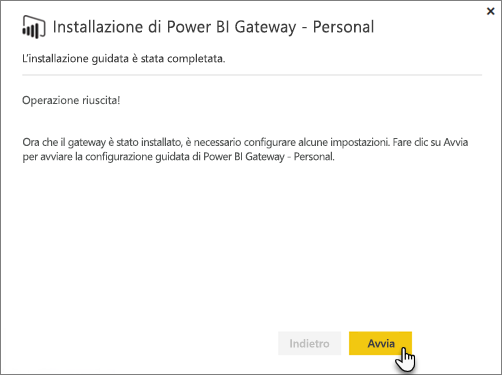
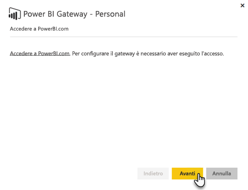
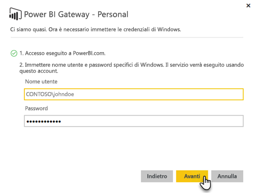

# Gateway dati locale
Il gateway dati locale viene usato come collegamento, fornendo un trasferimento di dati rapido e sicuro tra i dati locali, ovvero dati non sul cloud, e i servizi Power BI, Microsoft Flow, app per la logica e PowerApps.

È possibile usare un singolo gateway con diversi servizi contemporaneamente. Se si usa Power BI, oltre a PowerApps, è possibile usare per entrambi un singolo gateway. Il gateway dipende dall'account con cui si accede.

> [!NOTE]
> Il gateway dati locale implementa la compressione dei dati e la crittografia del trasporto in tutte le modalità.
> 
> 

<!-- Shared Requirements Include -->
[!INCLUDE [gateway-onprem-requirements-include](./includes/gateway-onprem-requirements-include.md)]

### Limitazioni di connessioni dinamiche ad Analysis Services
È possibile usare una connessione dinamica su istanze tabulari o multidimensionali.

| **Versione del server** | **SKU necessario** |
| --- | --- |
| 2012 SP1 CU4 o versione successiva |Business Intelligence e SKU Enterprise |
| 2014 |Business Intelligence e SKU Enterprise |
| 2016 |SKU standard o versione successiva |

* La formattazione a livello di cella e le funzionalità di conversione non sono supportate.
* Azioni e set denominati non sono esposti in Power BI. È comunque possibile connettersi a cubi multidimensionali che contengono anche azioni o set denominati e creare oggetti visivi e report.

<!-- Shared Install steps Include -->
[!INCLUDE [gateway-onprem-datasources-include](./includes/gateway-onprem-datasources-include.md)]

## Scaricare e installare il gateway dati locale
Per scaricare il gateway, selezionare **Gateway dati** nel menu Download. Scaricare il [gateway dati locale](http://go.microsoft.com/fwlink/?LinkID=820925).

<!-- Shared Install steps Include -->
[!INCLUDE [gateway-onprem-install-include](./includes/gateway-onprem-install-include.md)]

## Installare il gateway in modalità personale
> [!NOTE]
> La modalità personale funziona solo con Power BI.
> 
> 

Dopo l'installazione del gateway personale, sarà necessario avviare la **configurazione guidata di Power BI Gateway - Personal**.

Sarà quindi necessario accedere a Power BI per registrare il gateway nel servizio cloud.

Sarà anche necessario fornire il nome utente e la password di Windows con cui verrà eseguito il servizio di Windows. È possibile specificare un account Windows diverso dal proprio. Il servizio del gateway verrà eseguito usando questo account.

Al termine dell'installazione, sarà necessario passare ai set di dati in Power BI e assicurarsi che vengano immesse credenziali per le origini dati locali.

## Archiviazione di credenziali crittografate nel cloud
Quando si aggiunge un'origine dati al gateway, è necessario fornire le credenziali per l'origine dati. Tutte le query all'origine dati verranno eseguite utilizzando queste credenziali. Le credenziali vengono crittografate in modo sicuro, utilizzando la crittografia asimmetrica, in modo che non possono essere decrittografate nel cloud, prima di essere archiviate nel cloud. Le credenziali vengono inviate al computer che esegue il gateway, in locale dove vengono decrittografate durante l'accesso alle origini dati.

<!-- Account and Port information -->
[!INCLUDE [gateway-onprem-accounts-ports-more](./includes/gateway-onprem-accounts-ports-more.md)]

<!-- How the gateway works -->
[!INCLUDE [gateway-onprem-how-it-works-include](./includes/gateway-onprem-how-it-works-include.md)]

## Risoluzione dei problemi
In caso di problemi durante l'installazione o la configurazione di un gateway, vedere [Risoluzione dei problemi del gateway dati locale](service-gateway-onprem-tshoot.md). Se si ritiene di avere un problema con il firewall, vedere la sezione [firewall o proxy](service-gateway-onprem-tshoot.md#firewall-or-proxy) dell'articolo sulla risoluzione dei problemi.

Se si ritiene che i problemi con il gateway riguardino il proxy, vedere [Configurazione delle impostazioni del proxy per Power BI Gateway](service-gateway-proxy.md).

## Passaggi successivi
[Gestire l'origine dati - Analysis Services](service-gateway-enterprise-manage-ssas.md)  
[Gestire l'origine dati - SAP HANA](service-gateway-enterprise-manage-sap.md)  
[Gestire l'origine dati - SQL Server](service-gateway-enterprise-manage-sql.md)  
[Gestire l'origine dati - Oracle](service-gateway-onprem-manage-oracle.md)  
[Gestire l'origine dati - Importazione/aggiornamento pianificato](service-gateway-enterprise-manage-scheduled-refresh.md)  
[Analisi approfondita del gateway dati locale](service-gateway-onprem-indepth.md)  
[On-premises data gateway (personal mode) - the new version of the personal gateway](service-gateway-personal-mode.md)
[Configuring proxy settings for the On-Premises Data Gateway](service-gateway-proxy.md) (Gateway dati locale (modalità personale) - La nuova versione del gateway personale - Configurazione delle impostazioni proxy per il gateway dati locale)  
Altre domande? [Provare la community di Power BI](http://community.powerbi.com/)

