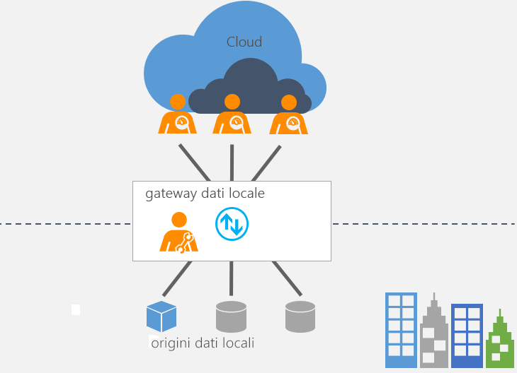

# Informazioni sul gateway dati locale

[!INCLUDE [gateway-rewrite](includes/gateway-rewrite.md)]

Il gateway dati locale funziona come un ponte, poiché offre un trasferimento di dati rapido e sicuro tra i dati locali, ovvero i dati non sul cloud, e diversi servizi cloud Microsoft, tra cui Power BI, PowerApps, Microsoft Flow, Azure Analysis Services e App per la logica. L'uso di un gateway consente alle organizzazioni di mantenere i database e altre origini dati all'interno delle reti locali e allo stesso tempo di usare in sicurezza i dati locali nei servizi cloud.

## Come funziona il gateway

Per informazioni dettagliate sul funzionamento del gateway, vedere [Architettura del gateway dati locale](/data-integration/gateway/service-gateway-onprem-indepth).

## Tipi di gateway

Esistono due tipi di gateway diversi, ognuno per uno scenario diverso:

* **Gateway dati locale** - Consente a più utenti di connettersi a più origini dati locali. È possibile usare un gateway dati locale con tutti i servizi supportati, con un'unica installazione del gateway. Questo gateway è ideale per scenari complessi, in cui più utenti accedono a più origini dati.

* **Gateway dati locale (modalità personale)** – Consente a un utente di connettersi alle origini e non può essere condiviso con altri utenti. Un gateway dati locale (modalità personale) può essere usato solo con Power BI. Questo gateway è ideale per gli scenari in cui si è l'unica persona che crea report e non è necessario condividere le origini dati con altri utenti.

## Uso di un gateway

I passaggi principali per usare un gateway sono quattro:

1. [Scaricare e installare il gateway](/data-integration/gateway/service-gateway-install) in un computer locale.
2. [Configurare](/data-integration/gateway/service-gateway-app) il gateway in base al firewall e ad altri requisiti di rete.
3. [Aggiungere gli amministratori del gateway](/data-integration/gateway/service-gateway-manage) che possono anche gestire e amministrare altri requisiti di rete.
4. [Risolvere i problemi](service-gateway-onprem-tshoot.md) del gateway in caso di errori.

## Passaggi successivi

* [Installare il gateway dati locale](/data-integration/gateway/service-gateway-install)

Altre domande? [Provare la community di Power BI](http://community.powerbi.com/)
