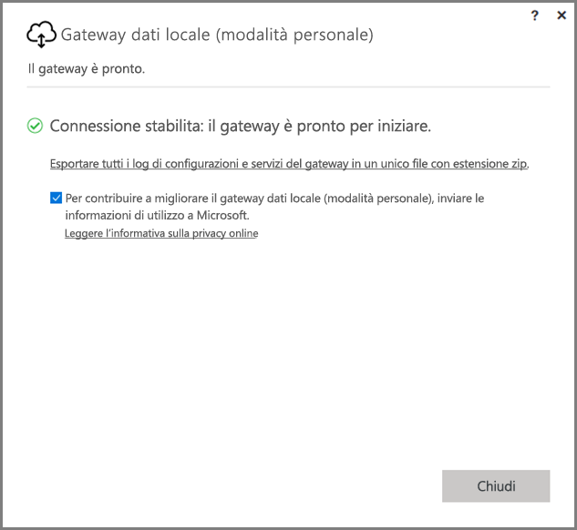
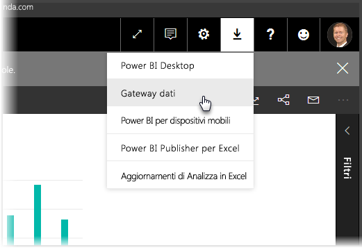
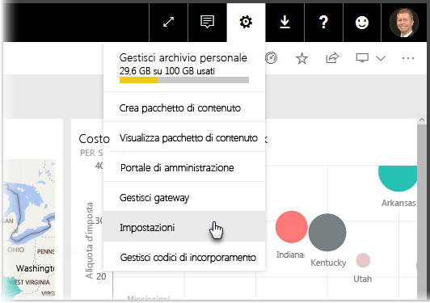
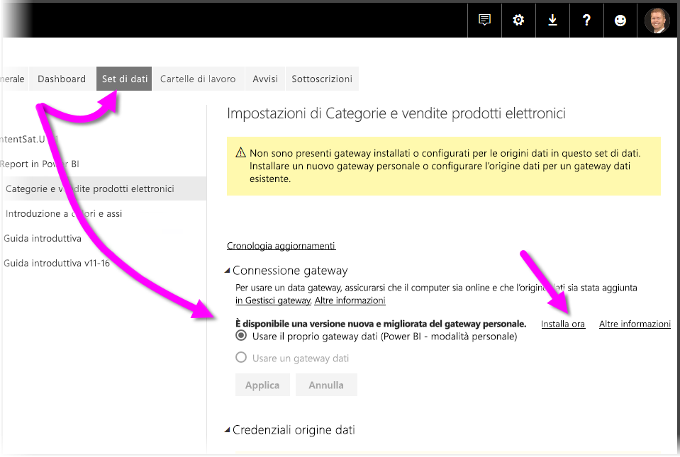
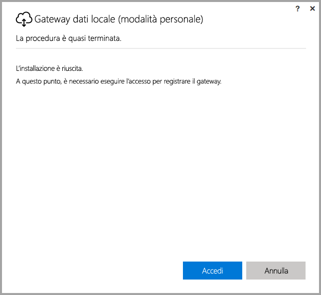
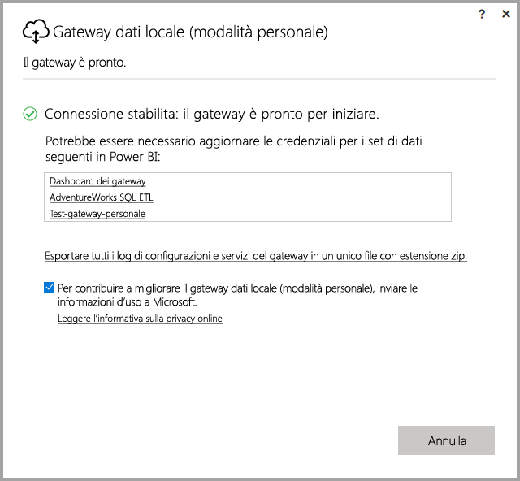

# <a name="on-premises-data-gateway-personal-mode"></a>Gateway dati locale (modalità personale)
È possibile usare origini dati locali e creare report e dashboard di Power BI usando un gateway. Il termine **gateway** indica il software usato per agevolare l'accesso a dati archiviati in una rete privata locale, che permette di usarli nei servizi online, come il **servizio Power BI**. Il **gateway dati locale (modalità personale)** è un aggiornamento recente di Power BI Gateway che consente agli utenti di installare un gateway nel proprio computer e accedere ai dati locali.



> [!NOTE]
> Il **gateway dati locale (modalità personale)** sostituisce la versione del gateway personale in precedenza supportata, chiamata **Power BI Gateway - Personal**. Il gateway personale precedente continuerà a funzionare solo fino al 31 luglio 2017. Per informazioni su come eseguire l'aggiornamento alla nuova versione, vedere le sezioni seguenti.
> 
> 

## <a name="features-of-the-on-premises-data-gateway-personal-mode"></a>Funzionalità del Gateway dati locale (modalità personale)
Con il rilascio del **gateway dati locale (modalità personale)**, è ora disponibile una raccolta di miglioramenti e nuove funzionalità. Nella versione precedente del gateway personale (chiamata **Power BI Gateway - Personal**), l'implementazione imponeva alcune limitazioni. Come con molti prodotti Power BI, abbiamo dato ascolto alle esigenze e alle richieste dei clienti e osservato come usavano il prodotto. Di conseguenza, il **gateway dati locale (modalità personale)** è stato riprogettato interamente e include i miglioramenti e le funzionalità seguenti:

* **Maggiore affidabilità**: nella nuova versione del gateway personale è migliorata l'affidabilità rispetto alla versione precedente, grazie ai miglioramenti del software strutturale e del codice.
* **Maggiore estendibilità**: come parte dei miglioramenti del software strutturale, è possibile aggiungere facilmente nuove funzionalità al gateway personale appena diventano disponibili.
* **Eliminare il gateway personale dal servizio Power BI**: con la nuova versione, è ora possibile eliminare il gateway personale dall'interno del **servizio Power BI**.
* **Log di configurazione e servizio**: la nuova versione consente facilmente di esportare i log di configurazione servizio in un file con estensione zip, con un solo clic.

## <a name="installing-on-premises-data-gateway-personal-mode"></a>Installazione del gateway dati locale (modalità personale)
Per installare il **gateway dati locale (modalità personale)** senza aver installato la versione precedente del gateway, selezionare l'icona a forma di ingranaggio nel **servizio Power BI** e selezionare **Gateway dati**.



È anche possibile scaricare il gateway [qui](https://go.microsoft.com/fwlink/?LinkId=820925&clcid=0x409). È possibile seguire i passaggi di installazione e, dal momento che il processo consente di installare entrambe le versioni del gateway (il gateway standard, che può essere condiviso con altri utenti, o la modalità personale), assicurarsi di selezionare **gateway dati locale (modalità personale)** quando viene richiesto quale versione del gateway si vuole installare.

### <a name="updating-from-the-previous-personal-gateway"></a>Aggiornamento dal gateway personale precedente
Se si è già installato il gateway **Power BI Gateway - Personal**, verrà richiesto di installare la nuova versione migliorata del gateway personale quando si visualizza **Set di dati** in **Impostazioni** nel **Servizio Power BI**.



Quando si seleziona un set di dati e quindi si seleziona **Connessione gateway** si riceve una notifica della disponibilità della nuova versione migliorata del gateway personale. Per installarla, selezionare **Installa ora**.



> [!NOTE]
> Se si esegue la versione precedente di **Power BI Gateway - Personal** come processo con privilegi elevati, assicurarsi di avviare anche il processo di installazione del nuovo gateway con privilegi elevati, in modo che le credenziali del set di dati siano aggiornate automaticamente. In caso contrario, è necessario aggiornare manualmente le credenziali del set di dati.
> 
> 

Verrà avviato il processo di aggiornamento, al termine del quale si osserverà che l'installazione è riuscita. Non chiudere ancora le finestre perché è necessario un ultimo passaggio.



Ecco l'ultimo passaggio: dopo aver installato il nuovo gateway personale (con l'ultima schermata di installazione ancora visibile), accedere al **servizio Power BI** e attendere finché il gateway non apparirà online, come mostra l'immagine seguente.



Se il gateway personale è stato aggiornato nello stesso computer in cui è installato il gateway precedente, le credenziali saranno aggiornate automaticamente e tutte le attività di aggiornamento passeranno attraverso il nuovo gateway. Se il gateway precedente era stato installato in un computer diverso, verrà chiesto di aggiornare le credenziali in alcuni set di dati. Nell'immagine precedente, la finestra contiene un elenco dei set di dati che potrebbero richiedere l'aggiornamento delle credenziali. Ogni set di dati elencato è un collegamento diretto che è possibile selezionare per aggiornare facilmente le proprie credenziali.

Ma non è tutto: con il nuovo gateway installato, non è più necessaria la versione precedente installata nel computer, quindi è opportuno disinstallarla. A tale scopo, cercare **Power BI Gateway - Personal** nel computer e disinstallarlo.

### <a name="determining-which-version-of-the-personal-gateway-you-have-installed"></a>Determinare quale versione del gateway personale è installata
Per determinare quale versione del gateway personale è attualmente installata, è possibile eseguire le operazioni seguenti:

* La versione precedente del gateway personale è chiamata **Power BI Gateway - Personal** e usa l'icona di Power Bi nella finestra di installazione.
* La nuova versione del gateway personale è chiamata **gateway dati locale (modalità personale)** e usa l'icona gateway (una nuvola con una freccia a due punte lungo il bordo inferiore).

È possibile passare a **Aggiungi/Rimuovi programmi** e vedere se nell'elenco è visualizzato **Power BI Gateway - Personal**: in tal caso, è installata la versione precedente del gateway personale.

## <a name="using-fast-combine-with-the-personal-gateway"></a>Uso della Combinazione rapida con il gateway personale
Se con il gateway precedente si usava la **Combinazione rapida** sarà necessario eseguire la procedura seguente per abilitare nuovamente il funzionamento di **Combinazione rapida** con il **gateway dati locale (modalità personale)**:

1. Da Esplora File, aprire il file seguente:
   
   ```
   %localappdata%\Microsoft\on-premises data gateway (personal mode)\Microsoft.PowerBI.DataMovement.Pipeline.GatewayCore.dll.config
   ```
2. Nella parte inferiore del file, aggiungere il testo seguente:
   
       ```
       <setting name="EnableFastCombine" serializeAs="String">```
       <value>true</value>
       </setting>
       ```
3. Al termine dell'operazione, l'impostazione sarà effettiva entro circa un minuto. Per verificare che la **Combinazione rapida** funzioni correttamente, provare un aggiornamento su richiesta nel **servizio Power BI**.

## <a name="limitations-and-considerations"></a>Limitazioni e considerazioni
È necessario tenere conto di alcuni aspetti quando si usa il **gateway dati locale (modalità personale)**, come descritto nell'elenco seguente.

* Se si usa **Windows Hello** o un pin per accedere a Windows, si potrebbe riscontrare il seguente errore: 
  * *L'account utente selezionato non soddisfa i requisiti dell'applicazione. Usare un altro account.*
  * Per risolvere tale errore, selezionare *Usa un account diverso* e accedere di nuovo. 

Le origini dati seguenti non sono attualmente supportate per il **gateway dati locale (modalità personale)**:

* ADO.NET 
* CurrentWorkbook
* FTP
* HDFS
* SAP BusinessObjects         
* Spark

Il supporto per Spark è previsto per la seconda metà dell'anno di calendario 2017.

## <a name="frequently-asked-questions-faq"></a>Domande frequenti
* È possibile eseguire il **gateway dati locale (modalità personale)** side-by-side con il **gateway dati locale** (precedentemente noto come versione aziendale del gateway)?
  
  * **Risposta**: sì, con la nuova versione, è possibile eseguirli contemporaneamente.
* È possibile eseguire il **gateway dati locale (modalità personale)** come servizio?
  
  * **Risposta:** no. Il **gateway dati locale (modalità personale)** può essere eseguito solo come applicazione. Se è necessario eseguire il gateway come servizio e/o in modalità di amministrazione, è necessario prendere in considerazione il [**gateway dati locale**](service-gateway-onprem.md) (precedentemente noto come gateway aziendale).
* Con quale frequenza viene aggiornato il **gateway dati locale (modalità personale)**?
  
  * **Risposta**: l'obiettivo è aggiornare il gateway personale ogni mese.
* Per quale motivo viene chiesto di aggiornare le credenziali?
  
  * **Risposta**: molte situazioni possono attivare una richiesta di credenziali, la più comune delle quali è la reinstallazione del **gateway dati locale (modalità personale)** in un computer diverso rispetto al gateway **Power BI - Personal**. Potrebbe anche esserci un problema nell'origine dati e Power BI non è riuscito a eseguire una connessione di prova oppure si è verificato un timeout o un errore di sistema. Per aggiornare le credenziali nel **servizio Power BI**, selezionare l'**icona dell'ingranaggio**, quindi **Impostazioni** e infine **Set di dati**, cercare il set di dati in questione e fare clic su *Aggiorna credenziali*.
* Per quanto tempo il gateway personale precedente sarà offline durante l'aggiornamento?
  
  * **Risposta**: l'aggiornamento del gateway personale alla nuova versione richiederà solo alcuni minuti. 
* Cosa accade se non si esegue la migrazione al nuovo gateway personale entro il 31 luglio 2017?
  
  * **Risposta**: se si vogliono aggiornare i report con il gateway corrente, gli aggiornamenti verranno interrotti. L'unico modo per impostare una nuova pianificazione di aggiornamento consiste nell'installare e configurare il nuovo gateway.
* L'uso dello script R è supportato?
  
  * **Risposta**: il supporto per gli script R sarà presto disponibile.
* Perché viene non visualizzato il messaggio per aggiornare il gateway nel **servizio Power BI**?
  
  * **Risposta**: molto probabilmente perché uno o più set di dati includono un'origine dati ancora non supportata.

## <a name="next-steps"></a>Passaggi successivi
[Configurazione delle impostazioni del proxy per Power BI Gateway](service-gateway-proxy.md)  
Altre domande? [Provare la community di Power BI](http://community.powerbi.com/)

