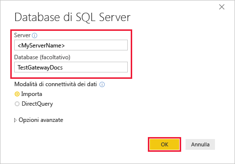
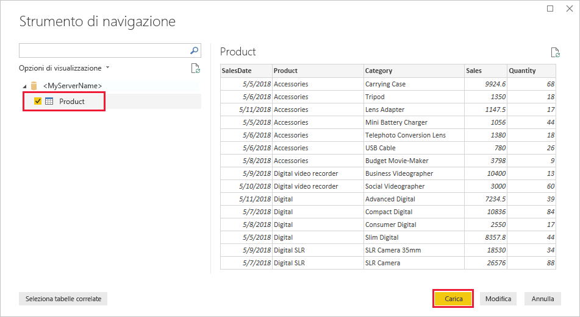
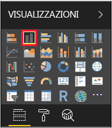
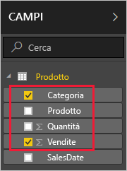
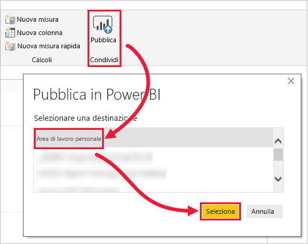
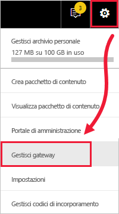
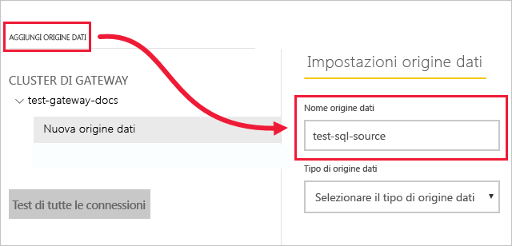
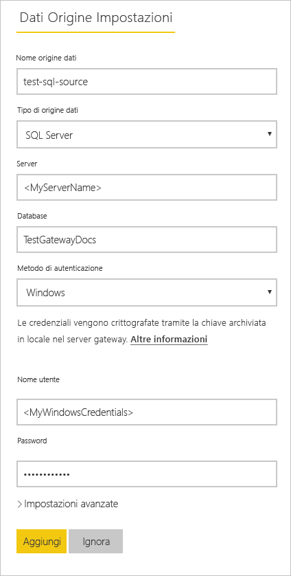
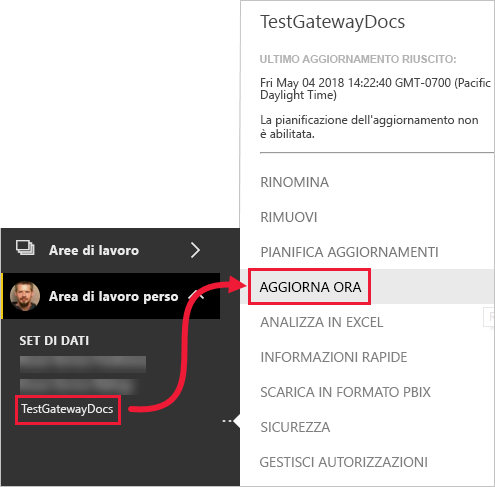
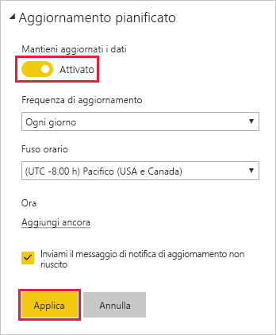

# <a name="tutorial-connect-to-on-premises-data-in-sql-server"></a>Esercitazione: Connettersi a dati locali in SQL Server

Un gateway dati locale è un prodotto software che si installa all'interno di una rete locale e semplifica l'accesso ai dati nella rete. In questa esercitazione si crea un report di Power BI Desktop basato su dati di esempio importati da SQL Server. Si pubblica quindi il report nel servizio Power BI e si configura un gateway in modo che il servizio possa accedere ai dati locali. Grazie a questo accesso, il servizio può aggiornare i dati per mantenere aggiornato il report.

In questa esercitazione viene illustrato come:
> [!div class="checklist"]
> * Creare un report da dati in SQL Server
> * Pubblicare il report nel servizio Power BI
> * Aggiungere SQL Server come origine dati di gateway
> * Aggiornare i dati nel report

Se non si è ancora iscritti a Power BI, [iscriversi per ottenere una versione di prova gratuita](https://app.powerbi.com/signupredirect?pbi_source=web) prima di iniziare.


## <a name="prerequisites"></a>Prerequisiti

* [Installare Power BI Desktop](https://powerbi.microsoft.com/desktop/)
* [Installare SQL Server](https://docs.microsoft.com/sql/database-engine/install-windows/install-sql-server) in un computer locale 
* [Installare un gateway dati locale](service-gateway-install.md) nello stesso computer locale (nell'ambiente di produzione in genere si usa un computer diverso)


## <a name="set-up-sample-data"></a>Configurare i dati di esempio

Il primo passo è aggiungere a SQL Server dati di esempio da usare nella parte restante dell'esercitazione.

1. In SQL Server Management Studio (SSMS) connettersi all'istanza di SQL Server e creare un database di test.

    ```sql
    CREATE DATABASE TestGatewayDocs
    ```

2. Nel database creato aggiungere una tabella e inserire i dati.

    ```sql
    USE TestGatewayDocs

    CREATE TABLE Product (
        SalesDate DATE,
        Category  VARCHAR(100),
        Product VARCHAR(100),
        Sales MONEY,
        Quantity INT
    )

    INSERT INTO Product VALUES('2018-05-05','Accessories','Carrying Case',9924.60,68)
    INSERT INTO Product VALUES('2018-05-06','Accessories','Tripod',1350.00,18)
    INSERT INTO Product VALUES('2018-05-11','Accessories','Lens Adapter',1147.50,17)
    INSERT INTO Product VALUES('2018-05-05','Accessories','Mini Battery Charger',1056.00,44)
    INSERT INTO Product VALUES('2018-05-06','Accessories','Telephoto Conversion Lens',1380.00,18)
    INSERT INTO Product VALUES('2018-05-06','Accessories','USB Cable',780.00,26)
    INSERT INTO Product VALUES('2018-05-08','Accessories','Budget Movie-Maker',3798.00,9)
    INSERT INTO Product VALUES('2018-05-09','Digital video recorder','Business Videographer',10400.00,13)
    INSERT INTO Product VALUES('2018-05-10','Digital video recorder','Social Videographer',3000.00,60)
    INSERT INTO Product VALUES('2018-05-11','Digital','Advanced Digital',7234.50,39)
    INSERT INTO Product VALUES('2018-05-07','Digital','Compact Digital',10836.00,84)
    INSERT INTO Product VALUES('2018-05-08','Digital','Consumer Digital',2550.00,17)
    INSERT INTO Product VALUES('2018-05-05','Digital','Slim Digital',8357.80,44)
    INSERT INTO Product VALUES('2018-05-09','Digital SLR','SLR Camera 35mm',18530.00,34)
    INSERT INTO Product VALUES('2018-05-07','Digital SLR','SLR Camera',26576.00,88)
    ```

3. Selezionare i dati dalla tabella per la verifica.

    ```sql
    SELECT * FROM Product
    ```

    


## <a name="build-and-publish-a-report"></a>Creare e pubblicare un report

Dopo aver creato i dati di esempio da usare, ci si connette a SQL Server in Power BI Desktop e si crea un report basato su tali dati. Fatto questo, si pubblica il report nel servizio Power BI.

1. Nella scheda **Home** di Power BI Desktop selezionare **Recupera dati** > **SQL Server**.

2. In **Server** immettere il nome del server e in **Database** immettere "TestGatewayDocs". Selezionare **OK**. 

    

3. Verificare le credenziali, quindi selezionare **Connetti**.

4. In **Strumento di navigazione** selezionare la tabella **Product**, quindi selezionare **Carica**.

    

5. Nella visualizzazione **Report** di Power BI Desktop selezionare **Istogramma a colonne in pila** nel riquadro **Visualizzazioni**.

        

6. Con l'istogramma selezionato nell'area di disegno report, nel riquadro **Campi** selezionare i campi **Category** e **Sales**.  

    

    Il grafico dovrebbe ora apparire come nell'immagine seguente.

    

    Si noti che attualmente il prodotto più venduto è **SLR Camera**. Quando si aggiorneranno i dati e poi il report, più avanti in questa esercitazione, il quadro cambierà.

7. Salvare il report con il nome "TestGatewayDocs.pbix".

8. Nella scheda **Home** selezionare **Pubblica** > **Area di lavoro personale** > **Seleziona**. Se viene chiesto di farlo, accedere al servizio Power BI. 

    

9. Nel **esito positivo** dello schermo, seleziona **Open 'TestGatewayDocs.pbix' in Power BI**.


## <a name="add-sql-server-as-a-gateway-data-source"></a>Aggiungere SQL Server come origine dati di gateway

In Power BI Desktop la connessione a SQL Server è diretta, ma il servizio Power BI richiede un gateway che funga da bridge. Ora si aggiunge l'istanza di SQL Server come origine dati per il gateway creato in un articolo precedente (indicato nei [Prerequisiti](#prerequisites)). 

1. Nell'angolo in alto a destra del servizio Power BI selezionare l'icona dell'ingranaggio  > **Gestisci gateway**.

    

2. Selezionare **Aggiungi origine dati**, quindi immettere "test-sql-source" come **Nome origine dati**.

    

3. In **Tipo di origine dati** selezionare **SQL Server**, quindi immettere gli altri valori come illustrato.

    


   |          Opzione           |                                               Valore                                                |
   |---------------------------|----------------------------------------------------------------------------------------------------|
   |   **Nome origine dati**    |                                          test-sql-source                                           |
   |   **Tipo di origine dati**    |                                             SQL Server                                             |
   |        **Server**         | Nome dell'istanza di SQL Server (deve essere identico a quanto specificato in Power BI Desktop) |
   |       **Database**        |                                          TestGatewayDocs                                           |
   | **Metodo di autenticazione** |                                              Windows                                               |
   |       **Nome utente**        |             Account, ad esempio michael@contoso.com, usato per connettersi a SQL Server             |
   |       **Password**        |                   Password dell'account usato per connettersi a SQL Server                    |


4. Selezionare **Aggiungi**. Quando il processo ha esito positivo viene visualizzato il messaggio *Connessione riuscita*.

    

    Ora è possibile usare questa origine dati per includere dati da SQL Server nei dashboard e nei report di Power BI.


## <a name="configure-and-use-data-refresh"></a>Configurare e usare l'aggiornamento dei dati

A questo punto si dispone di un report pubblicato nel servizio Power BI e di un'origine dati SQL Server configurata. Ora è possibile apportare una modifica nella tabella Product. La modifica, attraverso il gateway, viene propagata al report pubblicato. È anche possibile configurare aggiornamenti pianificati per gestire eventuali modifiche future.

1. In SSMS aggiornare i dati nella tabella Product.

    ```sql
    UPDATE Product
    SET Sales = 32508, Quantity = 252
    WHERE Product='Compact Digital'     

    ```

2. Nel riquadro di spostamento a sinistra del servizio Power BI selezionare **Area di lavoro personale**.

3. In **Set di dati**, per il set di dati **TestGatewayDocs** selezionare **altro** (**...** ) > **Aggiorna ora**.

    

4. Selezionare **Area di lavoro personale** > **Report** > **TestGatewayDocs**. Osservare che l'aggiornamento si è propagato e ora il prodotto più venduto è **Compact Digital**. 

    

5. Selezionare **Area di lavoro personale** > **Report** > **TestGatewayDocs**. Selezionare **altro** (**. . .**) > **Pianifica aggiornamenti**.

6. In **Aggiornamento pianificato** impostare **Sì**, quindi selezionare **Applica**. Il set di dati viene aggiornato ogni giorno per impostazione predefinita.

    

## <a name="clean-up-resources"></a>Pulire le risorse
Se non si vogliono più usare i dati di esempio, eseguire `DROP DATABASE TestGatewayDocs` in SSMS. Se non si vuole usare l'origine dati SQL Server, [rimuovere l'origine dati](service-gateway-manage.md#remove-a-data-source). 


## <a name="next-steps"></a>Passaggi successivi
In questa esercitazione, si è appreso come:
> [!div class="checklist"]
> * Creare un report da dati in SQL Server
> * Pubblicare il report nel servizio Power BI
> * Aggiungere SQL Server come origine dati di gateway
> * Aggiornare i dati nel report

Proseguire con l'articolo successivo per altre informazioni
> [!div class="nextstepaction"]
> [Gestire un gateway di Power BI](service-gateway-manage.md)

