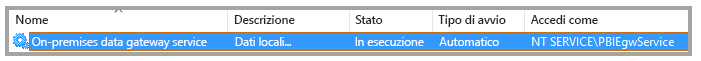
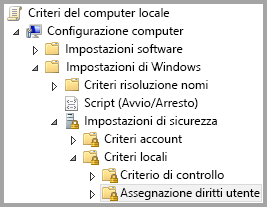
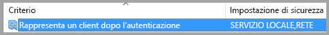
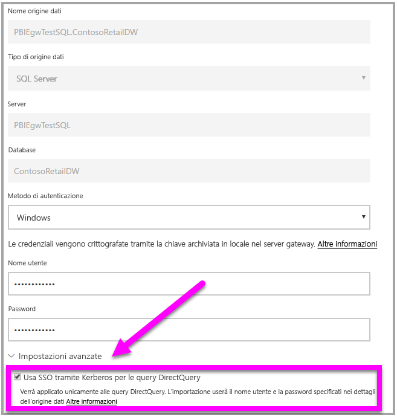

# <a name="use-resource-based-kerberos-for-single-sign-on-sso-from-power-bi-to-on-premises-data-sources"></a>Usare Kerberos basato sulle risorse per l'accesso Single Sign-On (SSO) da Power BI alle origini dati locali

Usare la [delega vincolata Kerberos basata sulle risorse](/windows-server/security/kerberos/kerberos-constrained-delegation-overview) per abilitare la connettività Single Sign-On per Windows Server 2012 e versioni successive, consentendo l'appartenenza a domini diversi per i servizi front-end e back-end. Per il corretto funzionamento, il dominio del servizio back-end deve considerare attendibile il dominio del servizio front-end.

## <a name="preparing-for-resource-based-kerberos-constrained-delegation"></a>Preparazione della delega vincolata Kerberos basata sulle risorse

Per il corretto funzionamento della delega vincolata Kerberos, è necessario configurare numerosi elementi, ad esempio i _nomi delle entità servizio_ e le impostazioni di delega negli account del servizio. 

### <a name="prerequisite-1-operating-system-requirements"></a>Prerequisito 1: requisiti del sistema operativo

La delega vincolata basata sulle risorse può essere configurata solo in un controller di dominio che esegue Windows Server 2012 R2 o Windows Server 2012 o versione successiva.

### <a name="prerequisite-2-install-and-configure-the-on-premises-data-gateway"></a>Prerequisito 2: installare e configurare il gateway dati locale

Questa versione del gateway dati locale supporta un aggiornamento sul posto, nonché l'_acquisizione della proprietà delle impostazioni_ dei gateway esistenti.

### <a name="prerequisite-3-run-the-gateway-windows-service-as-a-domain-account"></a>Prerequisito 3: eseguire il servizio di Windows gateway come account di dominio

In un'installazione standard, il gateway è in esecuzione come account del servizio locale del computer, ovvero _Servizio NT\PBIEgwService_, come illustrato nell'immagine seguente:



Per abilitare la **delega vincolata Kerberos, il gateway deve essere eseguito come account di dominio, a meno che il servizio Azure AD non sia già sincronizzato con Active Directory locale tramite Azure AD DirSync/Connect. Se è necessario passare a un account di dominio, vedere [Modifica dell'account del servizio gateway in un account di dominio](service-gateway-sso-kerberos.md).

Se Azure AD DirSync/Connect viene configurato e gli account utente vengono sincronizzati, il servizio gateway non dovrà eseguire ricerche in AD locali in fase di esecuzione. È possibile usare il SID del servizio locale, anziché un account di dominio, per il servizio gateway. La procedura di configurazione della delega vincolata Kerberos descritta in questo articolo corrisponde a questa configurazione e viene semplicemente applicata all'oggetto computer del gateway in Active Directory invece che all'account di dominio.

### <a name="prerequisite-4-have-domain-admin-rights-to-configure-spns-setspn-and-kerberos-constrained-delegation-settings"></a>Prerequisito 4: ottenere i diritti di amministratore di dominio per configurare i nomi delle entità servizio (SetSPN) e le impostazioni di delega vincolata Kerberos

Anche se è tecnicamente possibile per un amministratore di dominio concedere temporaneamente o definitivamente a un altro utente i diritti per configurare i nomi delle entità servizio e la delega vincolata senza richiedere diritti di amministratore di dominio, questo non è l'approccio consigliato. La sezione seguente descrive in modo dettagliato la procedura di configurazione necessaria per il **prerequisito 3**.

## <a name="configuring-kerberos-constrained-delegation-for-the-gateway-and-data-source"></a>Configurazione della delega vincolata Kerberos per il gateway e l'origine dati

Per la corretta configurazione del sistema, è necessario impostare o convalidare due elementi:

1. Se necessario, configurare un nome dell'entità servizio per l'account di dominio del servizio gateway.

1. Configurare le impostazioni di delega nell'account di dominio del servizio gateway.

Si noti che per eseguire questi due passaggi di configurazione, è necessario essere un amministratore di dominio.

Le sezioni seguenti descrivono questi due passaggi.

### <a name="configure-an-spn-for-the-gateway-service-account"></a>Configurare un nome dell'entità servizio per l'account del servizio gateway

Determinare innanzitutto se è già stato creato un nome dell'entità servizio per l'account di dominio usato come account del servizio gateway, seguendo questa procedura:

1. Come amministratore di dominio, avviare **Utenti e computer di Active Directory**.

1. Fare clic con il pulsante destro del mouse sul dominio, scegliere **Trova** e digitare il nome dell'account dell'account del servizio gateway

1. Nei risultati della ricerca fare clic con il pulsante destro del mouse sull'account del servizio gateway e scegliere **Proprietà**.

1. Se la scheda **Delega** è visualizzata nella finestra di dialogo **Proprietà**, significa che un nome dell'entità servizio è già stato creato ed è possibile passare alla sottosezione sulla configurazione della delega.

    Se la scheda **Delega** non è visualizzata nella finestra di dialogo **Proprietà**, è possibile creare manualmente un nome dell'entità servizio per l'account e la scheda **Delega** verrà aggiunta. Questo è il modo più facile per configurare le impostazioni di delega. Per creare un nome dell'entità servizio è possibile usare lo [strumento setspn](https://technet.microsoft.com/library/cc731241.aspx) incluso in Windows. Per creare il nome dell'entità servizio sono necessari diritti di amministratore.

    Ad esempio, si supponga che l'account del servizio gateway sia "PBIEgwTest\GatewaySvc" e il nome computer in cui è in esecuzione il servizio gateway sia **Computer1**. Per impostare il nome dell'entità servizio per l'account del servizio gateway per il computer in questo esempio, sarà necessario eseguire il comando seguente:

      

    Dopo aver completato questo passaggio, sarà possibile procedere alla configurazione delle impostazioni di delega.

### <a name="configure-delegation-settings"></a>Configurare le impostazioni di delega

Nella procedura seguente si presuppone un ambiente locale con due computer in domini diversi: un computer gateway e un server di database che eseguono SQL Server. Ai fini di questo esempio, si presuppongono anche le impostazioni e i nomi seguenti:

- Nome del computer del gateway: **PBIEgwTestGW**
- Account del servizio gateway: **PBIEgwTestFrontEnd\GatewaySvc** (nome visualizzato dell'account: Gateway Connector)
- Nome del computer dell'origine dati SQL Server: **PBIEgwTestSQL**
- Account del servizio dell'origine dati SQL Server: **PBIEgwTestBackEnd\SQLService**

In base a questi nomi e impostazioni, usare la procedura di configurazione seguente:

1. Usando **Utenti e computer di Active Directory**, ovvero uno snap-in MMC (Microsoft Management Console), nel controller di dominio per il dominio **PBIEgwTestFront-end**, assicurarsi che non venga applicata alcuna impostazione di delega per l'account del servizio gateway.

    

1. Usando **Utenti e computer di Active Directory** nel controller di dominio per il dominio **PBIEgwTestBack-end**, assicurarsi che non venga applicata alcuna impostazione di delega per l'account del servizio back-end. Assicurarsi anche che non sia impostato l'attributo "msDS-AllowedToActOnBehalfOfOtherIdentity" per questo account. È possibile trovare questo attributo nella scheda "Editor attributi", come illustrato nell'immagine seguente:

    

1. Creare un gruppo in **Utenti e computer di Active Directory** nel controller di dominio per il dominio **PBIEgwTestBack-end**. Aggiungere l'account del servizio gateway a questo gruppo come illustrato nell'immagine seguente. L'immagine mostra un nuovo gruppo denominato _ResourceDelGroup_ e l'account del servizio gateway **GatewaySvc** aggiunto a questo gruppo.

    

1. Aprire il prompt dei comandi ed eseguire i comandi seguenti nel controller di dominio per il dominio **PBIEgwTestBack-end** per aggiornare l'attributo msDS-AllowedToActOnBehalfOfOtherIdentity dell'account del servizio back-end:

    ```powershell
    $c = Get-ADGroup ResourceDelGroup
    Set-ADUser SQLService -PrincipalsAllowedToDelegateToAccount $c
    ```

1. È possibile verificare che l'aggiornamento viene rispecchiato nella scheda "Editor attributi" nelle proprietà per l'account del servizio back-end in **Utenti e computer di Active Directory**.

Infine, nel computer in cui è in esecuzione il servizio gateway, **PBIEgwTestGW** in questo esempio, è necessario concedere all'account del servizio gateway i criteri locali "Rappresenta un client dopo l'autenticazione". Per eseguire questa operazione o per verificare, è possibile usare Editor Criteri di gruppo locali (**gpedit**).

1. Nel computer gateway eseguire _gpedit.msc_.

1. Passare a **Criteri del computer locale > Configurazione computer > Impostazioni di Windows > Impostazioni di sicurezza > Criteri locali > Assegnazione diritti utente**, come mostrato nell'immagine seguente.

    

1. Nell'elenco di criteri in **Assegnazione diritti utente** selezionare **Rappresenta un client dopo l'autenticazione**.

    

1. Fare clic con il pulsante destro del mouse su **Rappresenta un client dopo l'autenticazione**, scegliere **Proprietà** e quindi controllare l'elenco degli account. Accertarsi che includa l'account del servizio gateway (**PBIEgwTestFront-end** **\GatewaySvc**).

1. Nell'elenco di criteri in **Diritti assegnazione utente** selezionare **Agire come parte del sistema operativo (SeTcbPrivilege)**. Anche in questo caso, accertarsi che l'account del servizio gateway sia incluso nell'elenco degli account.

1. Riavviare il processo del servizio **Gateway dati locale**.

## <a name="running-a-power-bi-report"></a>Esecuzione di un report di Power BI

Dopo aver eseguito tutti i passaggi di configurazione descritti in questo articolo, è possibile usare la pagina **Gestisci gateway** in Power BI per configurare l'origine dati. In **Impostazioni avanzate** abilitare SSO e pubblicare i report e i set di dati associati all'origine dati.



Questa configurazione funzionerà nella maggior parte dei casi. Con Kerberos, tuttavia, potrebbero essere necessarie configurazioni diverse a seconda dell'ambiente in uso. Se il report non viene caricato, contattare l'amministratore di dominio per ulteriori indagini.

## <a name="next-steps"></a>Passaggi successivi

Per altre informazioni su **Gateway dati locale** e su **DirectQuery**, vedere le risorse seguenti:

- [Gateway dati locale](service-gateway-onprem.md)
- [DirectQuery in Power BI](desktop-directquery-about.md)
- [Data sources supported by DirectQuery](desktop-directquery-data-sources.md) (Origini dati supportate da DirectQuery)
- [DirectQuery e SAP BW](desktop-directquery-sap-bw.md)
- [DirectQuery and SAP HANA](desktop-directquery-sap-hana.md) (DirectQuery e SAP HANA)