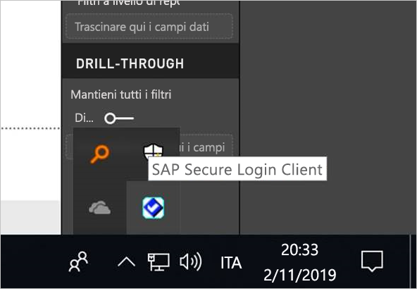
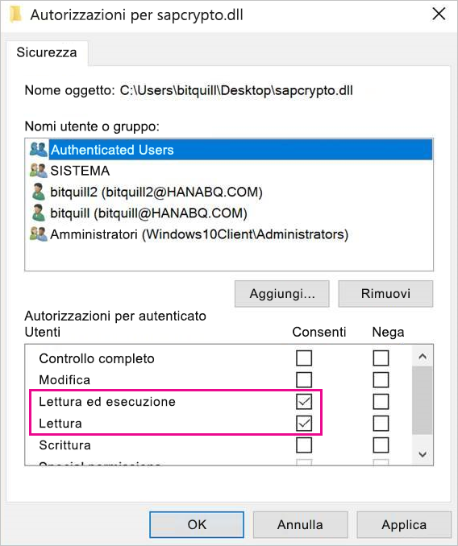
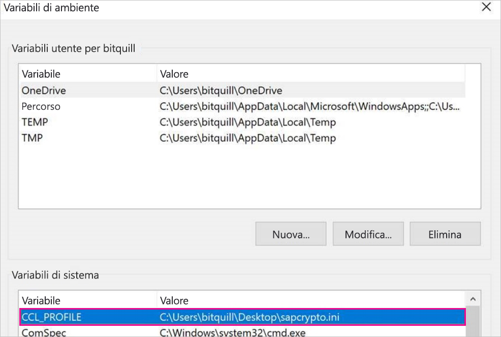
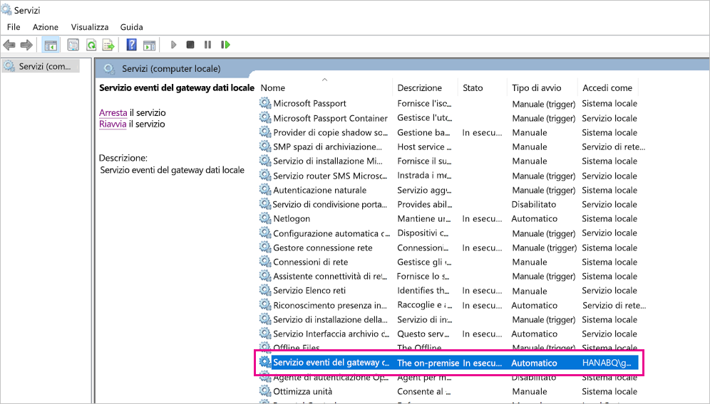
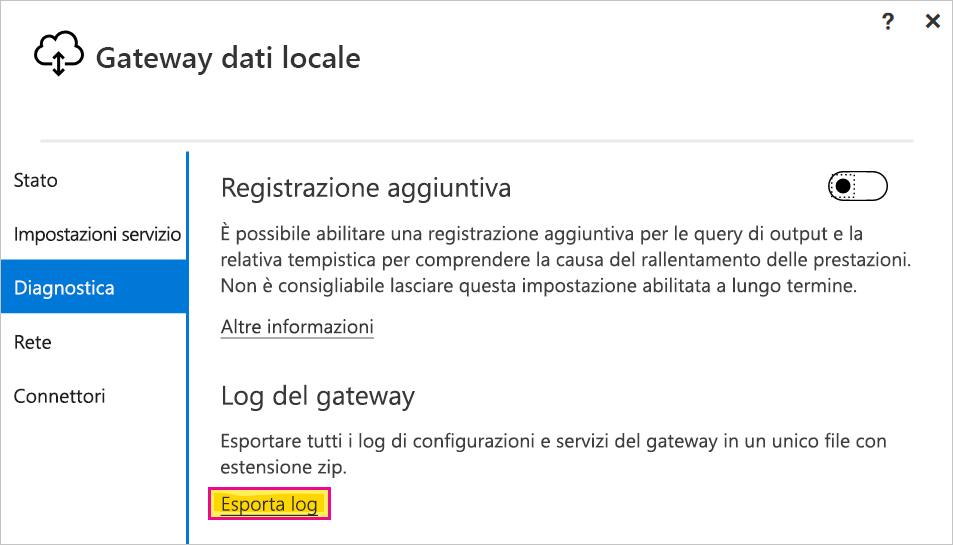

# <a name="use-kerberos-single-sign-on-for-sso-to-sap-bw-using-commoncryptolib-sapcryptodll"></a>Usare il Single Sign-On Kerberos per l'accesso SSO a SAP BW tramite CommonCryptoLib (sapcrypto.dll)

Questo articolo descrive come configurare l'origine dati SAP BW per abilitare l'accesso Single Sign-On dal servizio Power BI usando CommonCryptoLib (sapcrypto.dll).

> [!NOTE]
> Prima di provare ad aggiornare un report basato su SAP BW che usa l'accesso Single Sign-On Kerberos, completare sia i passaggi descritti in questo articolo che quelli descritti in [Configurare l'accesso SSO basato su Kerberos](service-gateway-sso-kerberos.md). L'uso di CommonCryptoLib come libreria SNC abilita le connessioni SSO ai server applicazioni SAP BW e ai server messaggi SAP BW.

## <a name="configure-sap-bw-to-enable-sso-using-commoncryptolib"></a>Configurare SAP BW per abilitare SSO usando CommonCryptoLib

> [!NOTE]
> Il gateway dati locale è un software a 64 bit e richiede quindi la versione a 64 bit di CommonCryptoLib (sapcrypto.dll) per eseguire l'accesso SSO per BW. Se si prevede di testare la connessione SSO al server SAP BW nell'interfaccia utente grafica SAP prima di provare una connessione SSO tramite il gateway (scelta consigliata), sarà necessaria anche la versione a 32 bit di CommonCryptoLib, dal momento che l'interfaccia utente grafica SAP è un software a 32 bit.

1. Verificare che il server BW sia configurato correttamente per il Single Sign-On Kerberos usando CommonCryptoLib. In caso affermativo, è possibile usare SSO per accedere al server BW, direttamente o tramite un server messaggi SAP BW, con uno strumento SAP quale l'interfaccia utente grafica SAP configurata per l'uso di CommonCryptoLib. 

   Per altre informazioni sui passaggi di configurazione, vedere [Single Sign-On SAP: Eseguire l'autenticazione con Kerberos/SPNEGO](https://blogs.sap.com/2017/07/27/sap-single-sign-on-authenticate-with-kerberosspnego/). Il server BW deve usare CommonCryptoLib come libreria SNC e avere un nome SNC che inizia con *CN =* , ad esempio *CN = BW1*. Per altre informazioni sui requisiti dei nomi SNC, in particolare il parametro snc/identity/as, vedere [Parametri SNC per la configurazione Kerberos](https://help.sap.com/viewer/df185fd53bb645b1bd99284ee4e4a750/3.0/en-US/360534094511490d91b9589d20abb49a.html).

1. Se non è già stato fatto, installare la versione x64 del [connettore SAP .NET](https://support.sap.com/en/product/connectors/msnet.html) nel computer in cui è stato installato il gateway. 
   
   È possibile verificare se il componente è stato installato provando a connettersi al server BW in Power BI Desktop dal computer gateway. Se non è possibile connettersi usando l'implementazione 2.0, il connettore .NET non è installato oppure non è stato installato nella Global Assembly Cache.

1. Verificare che SAP Secure Login Client (SLC) non sia in esecuzione nel computer in cui è installato il gateway. 

   SLC memorizza nella cache i ticket Kerberos in un modo che può interferire con la capacità del gateway di usare Kerberos per l'accesso SSO. 

1. Se SLC è installato, disinstallarlo o assicurarsi di chiudere SAP Secure Login Client. Fare clic con il pulsante destro del mouse sull'icona nell'area di notifica e selezionare **Log Out** (Disconnetti) ed **Exit** (Esci) prima di provare a stabilire una connessione SSO tramite il gateway. 

   SLC non è supportato per l'uso nei computer Windows Server. Per altre informazioni, vedere la [nota SAP 2780475](https://launchpad.support.sap.com/#/notes/2780475) (è necessario un account utente SAP).

   

1. Se si disinstalla SLC o si seleziona **Log Out** (Disconnetti) ed **Exit** (Esci), aprire una finestra di comando e immettere `klist purge` per cancellare eventuali ticket Kerberos memorizzati nella cache prima di provare a stabilire una connessione SSO tramite il gateway.

1. Scaricare la versione a 64 bit di CommonCryptoLib (sapcrypto.dll) *8.5.25 o successiva* da SAP Launchpad e copiarla in una cartella del computer gateway. Nella stessa directory in cui è stato copiato il file sapcrypto.dll, creare un file denominato sapcrypto.ini con il contenuto seguente:

    ```
    ccl/snc/enable_kerberos_in_client_role = 1
    ```

    Il file INI contiene le informazioni di configurazione richieste da CommonCryptoLib per abilitare l'accesso SSO nello scenario del gateway.

    > [!NOTE]
    > Questi file devono essere archiviati nello stesso percorso. In altre parole, _/path/to/sapcrypto/_ deve contenere sia sapcrypto.ini che sapcrypto.dll.

    Sia l'utente del servizio gateway che l'utente Active Directory (AD) rappresentato dall'utente del servizio necessitano delle autorizzazioni di lettura ed esecuzione per entrambi i file. È consigliabile concedere al gruppo Authenticated Users le autorizzazioni per entrambi i file con estensione ini e dll. A scopo di test, è anche possibile concedere queste autorizzazioni in modo esplicito all'utente del servizio gateway e all'utente Active Directory usati per il test. Nello screenshot seguente sono state concesse al gruppo Authenticated Users le autorizzazioni **Lettura ed esecuzione&amp; per sapcrypto.dll:

    

1. Se non si ha già un'origine dati SAP BW associata al gateway che la connessione SSO deve attraversare, aggiungerne una nella pagina **Gestisci gateway** nel servizio Power BI. Se si dispone già di un'origine dati di questo tipo, modificarla: 
    - Scegliere **SAP Business Warehouse** come **Tipo di origine dati** se si vuole creare una connessione SSO a un server applicazioni BW. 
    - Selezionare **Server messaggi SAP Business Warehouse** se si vuole creare una connessione SSO a un server messaggi BW.

1. Per **Libreria SNC**, selezionare la variabile di ambiente **SNC\_LIB** o **SNC\_LIB\_64** oppure **Personalizzata**. 

   - Se si seleziona **SNC\_LIB**, è necessario impostare il valore della variabile di ambiente **SNC\_LIB\_64** nel computer gateway sul percorso assoluto della copia a 64 bit di sapcrypto.dll presente nel computer gateway, ad esempio *C:\Utenti\Test\Desktop\sapcrypto.dll*.

   - Se si sceglie **Personalizzata**, incollare il percorso assoluto di *sapcrypto.dll* nel campo Percorso libreria SNC personalizzato visualizzato nella pagina **Gestisci gateway**. 

1. Per **Nome del partner SNC**, immettere il nome SNC del server BW. In **Impostazioni avanzate** verificare che l'opzione **Usa SSO tramite Kerberos per le query DirectQuery** sia selezionata. Compilare gli altri campi come se si stesse stabilendo una connessione con autenticazione di Windows da PBI Desktop.

1. Creare una variabile di ambiente di sistema **CCL\_PROFILE** e impostarne il valore sul percorso di sapcrypto.ini.

    

    I file sapcrypto.dll e sapcrypto.ini devono trovarsi nello stesso percorso. Nell'esempio precedente sapcrypto.ini e sapcrypto.dll si trovano entrambi sul desktop.

1. Riavviare il servizio gateway.

    

1. [Eseguire un report di Power BI](service-gateway-sso-kerberos.md#run-a-power-bi-report)

## <a name="troubleshooting"></a>Risoluzione dei problemi

Se non è possibile aggiornare il report nel servizio Power BI, è possibile usare le funzionalità di traccia di gateway, CPIC e CommonCryptoLib per diagnosticare il problema. Poiché le soluzioni di traccia di CPIC e CommonCryptoLib sono prodotti SAP, Microsoft non può fornire supporto. Per gli utenti Active Directory a cui è concesso l'accesso SSO a BW, alcune configurazioni di Active Directory potrebbero richiedere che gli utenti siano membri del gruppo Administrators nel computer in cui è installato il gateway.

### <a name="gateway-logs"></a>Log del gateway

1. Riprodurre il problema.

2. Aprire l'[app gateway](https://docs.microsoft.com/data-integration/gateway/service-gateway-app) e selezionare **Esporta log** nella scheda **Diagnostica**.

      

### <a name="cpic-tracing"></a>Traccia di CPIC

1. per abilitare la traccia di CPIC, impostare due variabili di ambiente: **CPIC**TRACE\_ e \_CPIC**TRACE\_DIR**. 

   La prima variabile imposta il livello di traccia e la seconda variabile imposta la directory dei file di traccia. La directory deve essere un percorso in cui i membri del gruppo Authenticated Users possono scrivere. 
 
2. Impostare **CPIC\_TRACE** su *3* e **CPIC\_TRACE\_DIR** sulla directory in cui si vuole che vengano scritti i file di traccia. ad esempio:

   

 3. Riprodurre il problema e assicurarsi che **CPIC\_TRACE\_DIR** contenga i file di traccia.

### <a name="commoncryptolib-tracing"></a>Traccia di CommonCryptoLib 

1. Attivare la traccia di CommonCryptoLib aggiungendo queste righe al file sapcrypto.ini creato in precedenza:

    ```
    ccl/trace/level=5
    ccl/trace/directory=<drive>:\logs\sectrace
    ```

2. Modificare l'opzione `ccl/trace/directory` scegliendo un percorso in cui i membri del gruppo Authenticated Users possono scrivere. 

3. In alternativa, creare un nuovo file INI per modificare questo comportamento. Nella stessa directory di sapcrypto.ini e sapcrypto.dll creare un file denominato sectrace.ini con il contenuto seguente. Sostituire l'opzione `DIRECTORY` con un percorso nel computer in cui i membri del gruppo Authenticated Users possono scrivere:

    ```
    LEVEL = 5
    DIRECTORY = <drive>:\logs\sectrace
    ```

4. Riprodurre il problema e verificare che il percorso a cui punta **DIRECTORY** contenga i file di traccia. 

5. Al termine, disattivare la traccia di CPIC e CCL.

    Per altre informazioni sulla traccia di CommonCryptoLib, vedere la [nota SAP 2491573](https://launchpad.support.sap.com/#/notes/2491573) (è necessario il nome utente SAP).

## <a name="next-steps"></a>Passaggi successivi

Per altre informazioni sul gateway dati locale e su DirectQuery, vedere le risorse seguenti:

* [Informazioni sul gateway dati locale](/data-integration/gateway/service-gateway-onprem)
* [DirectQuery in Power BI](desktop-directquery-about.md)
* [Data sources supported by DirectQuery](desktop-directquery-data-sources.md) (Origini dati supportate da DirectQuery)
* [DirectQuery e SAP BW](desktop-directquery-sap-bw.md)
* [DirectQuery and SAP HANA](desktop-directquery-sap-hana.md) (DirectQuery e SAP HANA)
