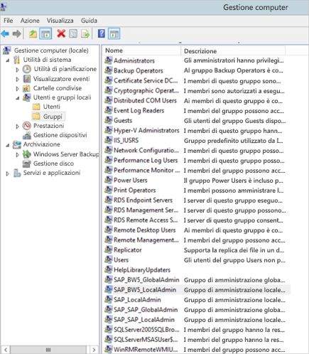
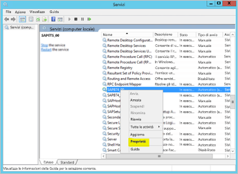
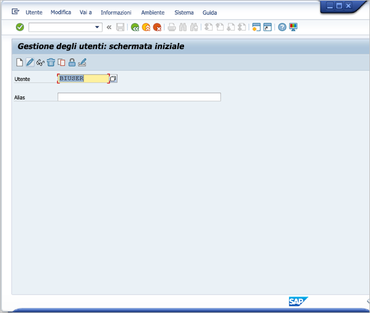
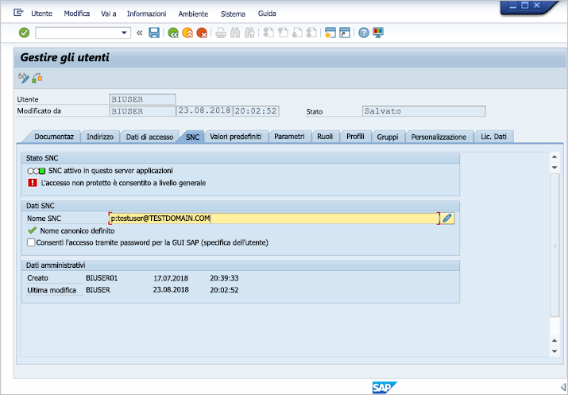
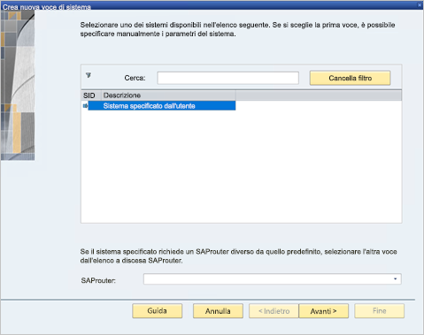
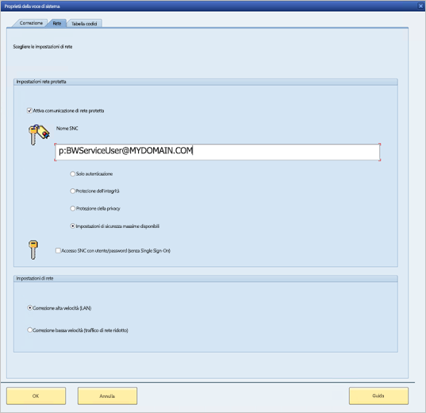
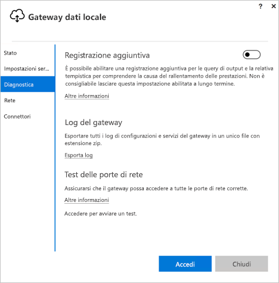

# <a name="use-kerberos-for-single-sign-on-sso-to-sap-bw-using-gx64krb5"></a>Usare Kerberos per il Single Sign-On (SSO) a SAP BW tramite gx64krb5

Questo articolo descrive come configurare l'origine dati SAP BW per abilitare SSO dal servizio Power BI usando gx64krb5.

> [!NOTE]
> È possibile completare i passaggi descritti in questo articolo oltre a quelli descritti in [Configurare SSO - Kerberos](service-gateway-sso-kerberos.md) per abilitare l'aggiornamento basato su SSO per i report basati sul server applicazioni SAP BW nel servizio Power BI. Microsoft consiglia tuttavia di usare CommonCryptoLib, non gx64krb5, come libreria SNC. SAP non supporta più gx64krb5 e i passaggi necessari per configurarlo per il gateway sono molto più complessi rispetto a CommonCryptoLib. Per informazioni sulla configurazione di SSO tramite CommonCryptoLib, vedere [Configurare SAP BW per abilitare SSO usando CommonCryptoLib](service-gateway-sso-kerberos-sap-bw-commoncryptolib.md). Come libreria SNC, è consigliabile usare CommonCryptoLib _oppure_ gx64krb5. Non completare i passaggi di configurazione per entrambe le librerie.

Questa guida è completa. Se alcuni dei passaggi descritti sono già stati eseguiti, è possibile ignorarli. È ad esempio possibile che sia già stato configurato il server SAP BW per SSO usando gx64krb5.

## <a name="set-up-gx64krb5-on-the-gateway-machine-and-the-sap-bw-server"></a>Configurare gx64krb5 nel computer gateway e nel server SAP BW

> [!NOTE]
> La libreria gx64krb5 non è più supportata da SAP. Per altre informazioni, vedere [Nota SAP 352295](https://launchpad.support.sap.com/#/notes/352295). Si noti che gx64krb5 non consente connessioni SSO tra il gateway dati e i server messaggi SAP BW. Sono possibili solo connessioni ai server applicazioni SAP BW. Questa restrizione non esiste se si usa [CommonCryptoLib](service-gateway-sso-kerberos-sap-bw-commoncryptolib.md) come libreria SNC. Sebbene per l'accesso SSO a BW possano essere usate anche altre librerie SNC, non sono ufficialmente supportate da Microsoft.

Per completare una connessione SSO tramite il gateway, la libreria gx64krb5 deve essere in uso sia nel client che nel server, ovvero sia il client che il server devono usare la stessa libreria SNC.

1. Scaricare gx64krb5.dll dalla [nota SAP 2115486](https://launchpad.support.sap.com/) (è necessario il nome utente SAP). Assicurarsi di aver installato la versione 1.0.11. x o successive. Scaricare anche gsskrb5.dll (la versione a 32 bit della libreria) se si vuole testare la connessione SSO nell'interfaccia utente grafica SAP prima di tentare la connessione SSO tramite il gateway (scelta consigliata). La versione a 32 bit è necessaria per il test con l'interfaccia utente grafica SAP poiché quest'ultima è solo a 32 bit.

1. Inserire gx64krb5.dll in una posizione sul computer del gateway accessibile all'utente del servizio gateway. Per testare la connessione SSO con l'interfaccia utente grafica SAP, inserire anche una copia di gsskrb5.dll nel computer e impostare la variabile di ambiente **SNC_LIB** in modo che vi faccia riferimento. Sia l'utente del servizio gateway che gli utenti Active Directory (AD) che l'utente del servizio rappresenterà necessitano delle autorizzazioni di lettura ed esecuzione per la copia di gx64krb5.dll. È consigliabile concedere al gruppo Authenticated Users le autorizzazioni per il file con estensione dll. A scopo di test, è anche possibile concedere queste autorizzazioni in modo esplicito all'utente del servizio gateway e all'utente Active Directory che vengono usati per il test.

1. Se il server BW non è ancora stato configurato per SSO usando gx64krb5.dll, inserire un'altra copia del file con estensione dll nel computer server SAP BW in un percorso accessibile al server SAP BW. 

    Per altre informazioni sulla configurazione di gx64krb5.dll per l'uso con un server SAP BW, vedere la [documentazione di SAP](https://launchpad.support.sap.com/#/notes/2115486) (è necessario il nome utente SAP).

1. Nei computer client e server impostare le variabili di ambiente **SNC_LIB** e **SNC_LIB_64**: 
    - Se si usa gsskrb5.dll, impostare la variabile **SNC_LIB** sul relativo percorso assoluto. 
    - Se si usa gx64krb5.dll, impostare la variabile **SNC_LIB_64** sul relativo percorso assoluto.

## <a name="configure-an-sap-bw-service-user-and-enable-snc-communication-on-the-bw-server"></a>Configurare un utente del servizio SAP BW e abilitare la comunicazione SNC nel server BW

Completare questa sezione se il server SAP BW non è ancora stato configurato per la comunicazione SNC, ad esempio l'accesso SSO, usando gx64krb5.

> [!NOTE]
> Questa sezione presuppone che sia già stato creato un utente del servizio per BW e che a questo sia stato associato un nome dell'entità servizio appropriato (ovvero, un nome che inizia con *SAP/* ).

1. Assegnare all'utente del servizio l'accesso al server applicazioni SAP BW:

    1. Nel computer server SAP BW aggiungere l'utente del servizio al gruppo degli amministratori locali. Aprire il programma **Gestione computer** e identificare il gruppo degli amministratori locali per il server. 

        

    1. Fare doppio clic sul gruppo degli amministratori locali e selezionare **Aggiungi** per aggiungere l'utente del servizio al gruppo. 

    1. Selezionare **Controlla nomi** per assicurarsi di aver immesso il nome correttamente e quindi fare clic su **OK**.

1. Impostare l'utente del servizio del server SAP BW come l'utente che avvia il servizio del server SAP BW nel computer server SAP BW:

    1. Aprire **Esegui** e quindi immettere **Services.msc**. 

    1. Cercare il servizio corrispondente all'istanza del server applicazioni SAP BW, fare clic su di esso con il pulsante destro del mouse e quindi selezionare **Proprietà**.

        

    1. Passare alla scheda **Accedi** e sostituire l'utente con l'utente del servizio SAP BW. 

    1. Immettere la password dell'utente e quindi selezionare **OK**.

1. In SAP Logon accedere al server e impostare i parametri di profilo seguenti usando la transazione RZ10:

    1. Impostare il parametro di profilo **snc/identity/as** su *p:&lt;utente servizio SAP BW creato&gt;* , ad esempio *p:BWServiceUser\@MYDOMAIN.COM*. Si noti che *p:* precede l'UPN dell'utente del servizio, a differenza di *p:CN=* , che precede l'UPN quando si usa CommonCryptoLib come libreria SNC.

    1. Impostare il parametro di profilo **snc/gssapi\_lib** su *&lt;percorso di gx64krb5.dll nel server BW&gt;* . Inserire la libreria in un percorso accessibile al server applicazioni SAP BW.

    1. Impostare gli ulteriori parametri di profilo seguenti, modificando i valori in base alle esigenze. Le ultime cinque opzioni consentono ai client di connettersi al server SAP BW usando SAP Logon senza aver configurato il nome SNC.

        | **Impostazione** | **Valore** |
        | --- | --- |
        | snc/data\_protection/max | 3 |
        | snc/data\_protection/min | 1 |
        | snc/data\_protection/use | 9 |
        | snc/accept\_insecure\_cpic | 1 |
        | snc/accept\_insecure\_gui | 1 |
        | snc/accept\_insecure\_r3int\_rfc | 1 |
        | snc/accept\_insecure\_rfc | 1 |
        | snc/permit\_insecure\_start | 1 |

    1. Impostare la proprietà **snc/enable** su 1.

1. Dopo aver impostato i parametri di profilo, aprire la console di gestione SAP nel computer server e riavviare l'istanza di SAP BW. 

   Se il server non si avvia, verificare di aver impostato i parametri di profilo in modo corretto. Per altre informazioni sulle impostazioni dei parametri di profilo, vedere la [documentazione di SAP](https://help.sap.com/saphelp_nw70ehp1/helpdata/en/e6/56f466e99a11d1a5b00000e835363f/frameset.htm). È anche possibile consultare la sezione [Risoluzione dei problemi](#troubleshooting) in questo articolo.

## <a name="map-an-sap-bw-user-to-an-active-directory-user"></a>Eseguire il mapping di un utente SAP BW a un utente di Active Directory

Se non è ancora stato fatto, mappare un utente di Active Directory a un utente del server applicazioni SAP BW e testare la connessione SSO in SAP Logon.

1. Accedere al server SAP BW con SAP Logon. Eseguire la transazione SU01.

1. Per **Utente** immettere l'utente SAP BW per cui si vuole abilitare la connessione SSO. Selezionare l'icona di **modifica** (icona a forma di penna) nella parte superiore sinistra della finestra di SAP Logon.

    

1. Selezionare la scheda **SNC**. Nella casella di input del nome SNC immettere *p:&lt;utente Active Directory&gt;@&lt;dominio&gt;* . Per il nome SNC, *p:* deve precedere l'UPN dell'utente di Active Directory. Si noti che l'UPN fa distinzione tra maiuscole e minuscole.

   L'utente di Active Directory specificato deve appartenere alla persona o all'organizzazione per cui si vuole abilitare l'accesso SSO per il server applicazioni SAP BW. Ad esempio, per abilitare l'accesso SSO per l'utente testuser\@TESTDOMAIN.COM, immettere *p:testuser\@TESTDOMAIN.COM*.

    

1. Selezionare l'icona di **salvataggio** (immagine di un disco floppy) nella parte superiore sinistra della schermata.

## <a name="test-sign-in-via-sso"></a>Testare l'accesso tramite SSO

Verificare che l'utente di Active Directory per cui è stato abilitato l'accesso SSO possa accedere al server usando SAP Logon tramite SSO:

1. Con l'account dell'utente di Active Directory per cui è stato appena abilitato l'accesso SSO, accedere a un computer del dominio in cui è installato SAP Logon. Avviare SAP Logon e creare una nuova connessione.

1. Copiare il file gsskrb5.dll scaricato in precedenza in una posizione sul computer a cui è stato eseguito l'accesso. Impostare la variabile di ambiente **SNC_LIB** sul percorso assoluto di questa posizione.

1. Avviare SAP Logon e creare una nuova connessione.

1. Nella schermata **Crea nuova voce di sistema** selezionare **Sistema specificato dall'utente** e quindi fare clic su **Avanti**.

    

1. Specificare i dettagli appropriati nella schermata successiva, inclusi il server applicazioni, il numero di istanza e l'ID sistema, quindi fare clic su **Fine**.

1. Fare clic con il pulsante destro del mouse sulla nuova connessione, scegliere **Proprietà** e quindi selezionare la scheda **Rete**. 

1. Nella casella **Nome SNC** immettere *p:&lt;UPN utente servizio SAP BW&gt;* , ad esempio *p:BWServiceUser\@MYDOMAIN.COM*. Selezionare **OK**.

    

1. Fare doppio clic sulla connessione creata per tentare una connessione SSO al server SAP BW. 

   Se la connessione viene stabilita, continuare con la sezione successiva. In caso contrario, rivedere i passaggi precedenti di questo documento per assicurarsi che siano stati eseguiti correttamente o rivedere la sezione [Risoluzione dei problemi](#troubleshooting). Se non è possibile connettersi al server SAP BW tramite SSO in questo contesto, non sarà possibile connettersi al server SAP BW usando SSO nel contesto del gateway.

## <a name="add-registry-entries-to-the-gateway-machine"></a>Aggiungere voci del Registro di sistema nel computer gateway

Aggiungere le voci del Registro di sistema necessarie al Registro di sistema del computer in cui è installato il gateway e nei computer a cui ci si intende connettere da Power BI Desktop. Per aggiungere queste voci del Registro di sistema, eseguire i comandi seguenti:

- ```REG ADD HKLM\SOFTWARE\Wow6432Node\SAP\gsskrb5 /v ForceIniCredOK /t REG_DWORD /d 1 /f```

- ```REG ADD HKLM\SOFTWARE\SAP\gsskrb5 /v ForceIniCredOK /t REG_DWORD /d 1 /f```

## <a name="add-a-new-sap-bw-application-server-data-source-to-the-power-bi-service-or-edit-an-existing-one"></a>Aggiungere una nuova origine dati del server applicazioni SAP BW al servizio Power BI oppure modificarne una esistente

1. Nella finestra di configurazione dell'origine dati immettere **Nome host**, **Numero sistema** e **ID client** del server applicazioni SAP BW per accedere al server SAP BW da Power BI Desktop.

1. Nel campo **Nome del partner SNC** immettere *p:&lt;nome SPN di cui è stato eseguito il mapping all'utente servizio SAP BW&gt;* . Se ad esempio il nome SPN è SAP/BWServiceUser\@MYDOMAIN.COM, immettere *p:SAP/BWServiceUser\@MYDOMAIN.COM* nel campo **Nome del partner SNC**.

1. Per la libreria SNC selezionare **SNC\_LIB** o **SNC\_LIB\_64**. Verificare che **SNC\_LIB\_64** nel computer gateway punti a gx64krb5.dll. In alternativa, è possibile selezionare l'opzione **Personalizzata** e specificare il percorso assoluto per gx64krb5.dll nel computer gateway.

1. Selezionare **Usa SSO tramite Kerberos per le query DirectQuery** e quindi selezionare **Applica**. Se la connessione di test ha esito negativo, verificare di aver eseguito correttamente i passaggi di installazione e configurazione descritti in precedenza.

1. [Eseguire un report di Power BI](service-gateway-sso-kerberos.md#run-a-power-bi-report)

## <a name="troubleshooting"></a>Risoluzione dei problemi

### <a name="troubleshoot-gx64krb5-configuration"></a>Risolvere i problemi di configurazione di gx64krb5

Nel caso in cui si verifichi uno dei problemi riportati di seguito relativo all'installazione di gx64krb5 e alle connessioni SSO, seguire questa procedura per risolverlo:

* Si verificano errori durante l'esecuzione dei passaggi di configurazione di gx64krb5. Ad esempio, il server SAP BW non si avvia dopo che i parametri di profilo sono stati modificati. Visualizzare i log del server (...work\dev\_w0 nel computer server) per risolvere questi errori. 

* Non è possibile avviare il servizio SAP BW a causa di un errore di accesso. È possibile che sia stata specificata una password errata durante l'impostazione dell'utente di *avvio* SAP BW. Verificare la password accedendo come utente del servizio SAP BW a un computer nell'ambiente Active Directory.

* Si verificano errori relativi alle credenziali dell'origine dati sottostante (ad esempio, SQL Server) che impediscono l'avvio del server. Verificare di aver assegnato all'utente del servizio l'accesso al database SAP BW.

* Viene visualizzato il messaggio seguente: *(GSS-API) specified target is unknown or unreachable* (GSS-API - La destinazione specificata è sconosciuta o non è raggiungibile). Questo errore in genere significa che è stato specificato un nome SNC errato. Assicurarsi di usare solo *p:* , non *p:CN=* , prima dell'UPN dell'utente del servizio nell'applicazione client.

* Viene visualizzato il messaggio seguente: *(GSS-API) An invalid name was supplied* (GSS-API - È stato specificato un nome non valido). Assicurarsi di aver incluso *p:* nel valore del parametro di profilo dell'identità SNC del server.

* Viene visualizzato il messaggio seguente: *(SNC error) the specified module could not be found* (Errore SNC - Non è stato possibile trovare il modulo specificato). Questo errore è spesso causato dall'inserimento di gx64krb5.dll in una posizione il cui accesso richiede privilegi elevati (diritti di amministratore).

### <a name="troubleshoot-gateway-connectivity-issues"></a>Risolvere i problemi di connettività del gateway

1. Controllare i registri del gateway. Aprire l'applicazione di configurazione del gateway e selezionare **Diagnostica**, quindi **Esporta log**. Gli errori più recenti sono indicati alla fine dei file di log.

    

1. Attivare la traccia SAP BW e rivedere i file di log generati. Sono disponibili diversi tipi di traccia SAP BW (ad esempio, la traccia di CPIC):

   a. per abilitare la traccia di CPIC, impostare due variabili di ambiente: **CPIC\_TRACE** e **CPIC\_TRACE\_DIR**.

      La prima variabile imposta il livello di traccia e la seconda variabile imposta la directory dei file di traccia. La directory deve essere un percorso in cui i membri del gruppo Authenticated Users possono scrivere. 
 
    b. Impostare **CPIC\_TRACE** su *3* e **CPIC\_TRACE\_DIR** sulla directory in cui si vuole che vengano scritti i file di traccia. ad esempio:

      

    c. Riprodurre il problema e assicurarsi che **CPIC\_TRACE\_DIR** contenga i file di traccia. 

## <a name="next-steps"></a>Passaggi successivi

Per altre informazioni sul gateway dati locale e su DirectQuery, vedere le risorse seguenti:

* [Informazioni sul gateway dati locale](/data-integration/gateway/service-gateway-onprem)
* [DirectQuery in Power BI](desktop-directquery-about.md)
* [Data sources supported by DirectQuery](desktop-directquery-data-sources.md) (Origini dati supportate da DirectQuery)
* [DirectQuery e SAP BW](desktop-directquery-sap-bw.md)
* [DirectQuery and SAP HANA](desktop-directquery-sap-hana.md) (DirectQuery e SAP HANA)
