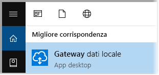
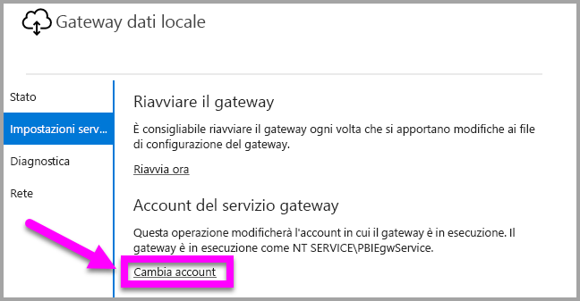
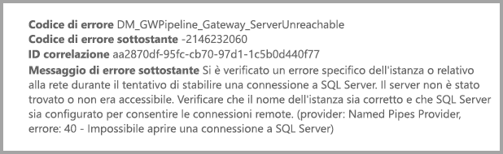

# <a name="use-kerberos-for-single-sign-on-sso-from-power-bi-to-on-premises-data-sources"></a>Usare Kerberos per l'accesso Single Sign-On (SSO) da Power BI alle origini dati locali

Usare la [delega vincolata Kerberos](https://technet.microsoft.com/library/jj553400.aspx) per abilitare la connettività Single Sign-On. L'abilitazione di SSO rende più semplice per i report e i dashboard di Power BI aggiornare i dati delle origini locali.

## <a name="supported-data-sources"></a>Origini dati supportate

Sono attualmente supportate le origini dati seguenti:

* SQL Server
* SAP HANA
* SAP BW
* Teradata
* Spark
* Impala

È supportato anche SAP HANA con [Security Assertion Markup Language (SAML)](service-gateway-sso-saml.md).

### <a name="sap-hana"></a>SAP HANA

Per abilitare SSO per SAP HANA, seguire innanzitutto questa procedura:

* Verificare che nel server SAP HANA sia in esecuzione la versione minima richiesta. Ciò dipende dal livello della piattaforma del server SAP Hana:
  * [HANA 2 SPS 01 Rev 012.03](https://launchpad.support.sap.com/#/notes/2557386)
  * [HANA 2 SPS 02 Rev 22](https://launchpad.support.sap.com/#/notes/2547324)
  * [HANA 1 SP 12 Rev 122.13](https://launchpad.support.sap.com/#/notes/2528439)
* Nel computer gateway installare il driver ODBC per HANA più recente di SAP.  La versione minima è la versione ODBC per HANA 2.00.020.00 di agosto 2017.

Per altre informazioni sull'impostazione e configurazione di Single Sign-On per SAP HANA con Kerberos, vedere l'argomento [Single Sign-on Using Kerberos](https://help.sap.com/viewer/b3ee5778bc2e4a089d3299b82ec762a7/2.0.03/en-US/1885fad82df943c2a1974f5da0eed66d.html) (Single Sign-on con Kerberos) nella guida alla sicurezza di SAP HANA e i collegamenti da tale pagina, in particolare la nota SAP 1837331 - HOWTO HANA DBSSO Kerberos/Active Directory.

## <a name="preparing-for-kerberos-constrained-delegation"></a>Preparazione della delega vincolata Kerberos

Per il corretto funzionamento della delega vincolata Kerberos, è necessario configurare numerosi elementi, ad esempio i *nomi delle entità servizio* e le impostazioni di delega negli account del servizio.

### <a name="prerequisite-1-install--configure-the-on-premises-data-gateway"></a>Prerequisito 1: installare e configurare il gateway dati locale

Questa versione del gateway dati locale supporta un aggiornamento sul posto, nonché l'acquisizione della proprietà delle impostazioni dei gateway esistenti.

### <a name="prerequisite-2-run-the-gateway-windows-service-as-a-domain-account"></a>Prerequisito 2: eseguire il servizio di Windows gateway come account di dominio

In un'installazione standard, il gateway è in esecuzione come account del servizio locale del computer, ovvero *Servizio NT\PBIEgwService*, come illustrato nell'immagine seguente:


Per abilitare la **delega vincolata Kerberos**, il gateway deve essere eseguito come account di dominio, a meno che il servizio Azure AD non sia già sincronizzato con Active Directory locale tramite Azure AD DirSync/Connect. Se è necessario passare a un account di dominio, vedere [Modifica dell'account del servizio gateway in un account di dominio](#switching-the-gateway-to-a-domain-account) più avanti in questo articolo.

> [!NOTE]
> Se è configurato Azure AD DirSync/Connect e gli account utente sono sincronizzati, il servizio gateway non dovrà eseguire ricerche di Active Directory locale in fase di esecuzione e sarà possibile usare il SID del servizio locale, anziché un account di dominio, per il servizio gateway. La procedura di configurazione della delega vincolata Kerberos descritta in questo articolo corrisponde a questa configurazione e viene semplicemente applicata all'oggetto computer del gateway in Active Directory invece che all'account di dominio.

### <a name="prerequisite-3-have-domain-admin-rights-to-configure-spns-setspn-and-kerberos-constrained-delegation-settings"></a>Prerequisito 3: ottenere i diritti di amministratore di dominio per configurare i nomi delle entità servizio (SetSPN) e le impostazioni di delega vincolata Kerberos

Anche se è tecnicamente possibile per un amministratore di dominio concedere temporaneamente o definitivamente a un altro utente i diritti per configurare i nomi delle entità servizio e la delega vincolata senza richiedere diritti di amministratore di dominio, questo non è l'approccio consigliato. La sezione seguente descrive in modo dettagliato la procedura di configurazione necessaria per il **prerequisito 3**.

## <a name="configuring-kerberos-constrained-delegation-for-the-gateway-and-data-source"></a>Configurazione della delega vincolata Kerberos per il gateway e l'origine dati

Per la corretta configurazione del sistema, è necessario impostare o convalidare due elementi:

1. Se necessario, configurare un nome dell'entità servizio per l'account di dominio del servizio gateway.

2. Configurare le impostazioni di delega nell'account di dominio del servizio gateway.

Si noti che per eseguire questi due passaggi di configurazione, è necessario essere un amministratore di dominio.

Le sezioni seguenti descrivono questi due passaggi.

### <a name="configure-an-spn-for-the-gateway-service-account"></a>Configurare un nome dell'entità servizio per l'account del servizio gateway

Determinare innanzitutto se è già stato creato un nome dell'entità servizio per l'account di dominio usato come account del servizio gateway, seguendo questa procedura:

1. Come amministratore di dominio, avviare **Utenti e computer di Active Directory**.

2. Fare clic con il pulsante destro del mouse sul dominio, scegliere **Trova** e digitare il nome dell'account dell'account del servizio gateway

3. Nei risultati della ricerca fare clic con il pulsante destro del mouse sull'account del servizio gateway e scegliere **Proprietà**.

4. Se la scheda **Delega** è visualizzata nella finestra di dialogo **Proprietà**, significa che un nome dell'entità servizio è già stato creato ed è possibile passare alla sottosezione sulla configurazione della delega.

    Se la scheda **Delega** non è visualizzata nella finestra di dialogo **Proprietà**, è possibile creare manualmente un nome dell'entità servizio per l'account e la scheda **Delega** verrà aggiunta. Questo è il modo più facile per configurare le impostazioni di delega. Per creare un nome dell'entità servizio è possibile usare lo [strumento setspn](https://technet.microsoft.com/library/cc731241.aspx) incluso in Windows. Per creare il nome dell'entità servizio sono necessari diritti di amministratore.

    Ad esempio, si supponga che l'account del servizio gateway sia "PBIEgwTest\GatewaySvc" e il nome computer in cui è in esecuzione il servizio gateway sia **Computer1**. Per impostare il nome dell'entità servizio per l'account del servizio gateway per il computer in questo esempio, sarà necessario eseguire il comando seguente:

    

    Dopo aver completato questo passaggio, sarà possibile procedere alla configurazione delle impostazioni di delega.

### <a name="configure-delegation-settings-on-the-gateway-service-account"></a>Configurare le impostazioni di delega nell'account del servizio gateway

Il secondo requisito di configurazione riguarda le impostazioni di delega nell'account del servizio gateway. Per eseguire questi passaggi sono disponibili vari strumenti. Questo articolo descrive l'uso di **Utenti e computer di Active Directory** che è uno snap-in di MMC (Microsoft Management Console) che permette di gestire e pubblicare informazioni nella directory. È disponibile nei controller di dominio per impostazione predefinita. È anche possibile abilitarlo tramite la configurazione di **Funzionalità di Windows** in altri computer.

È necessario configurare la **delega vincolata Kerberos** con protocollo in transito. Con la delega vincolata, è necessario dichiarare esplicitamente a quali servizi si vuole delegare. Ad esempio, solo SQL Server o il server SAP HANA accetteranno le chiamate di delega dall'account del servizio gateway.

Questa sezione presuppone che i nomi delle entità servizio per le origini dati sottostanti, ad esempio SQL Server, SAP HANA, Teradata, Spark e così via, siano già stati configurati. Per informazioni su come configurare i nomi dell'entità servizio dei server delle origini dati, vedere la documentazione tecnica per i rispettivi server di database. È anche possibile vedere questo post di blog alla sezione [*What SPN does your app require?*](https://blogs.msdn.microsoft.com/psssql/2010/06/23/my-kerberos-checklist/), in cui viene descritto il tipo di nome dell'entità servizio richiesto dall'app.

Nella procedura seguente si presuppone un ambiente locale con due computer: un computer gateway e un server di database che eseguono SQL Server. Ai fini di questo esempio, si presuppongono anche le impostazioni e i nomi seguenti:

* Nome computer gateway: **PBIEgwTestGW**
* Account del servizio gateway: **PBIEgwTest\GatewaySvc** (nome visualizzato dell'account: Gateway Connector)
* Nome computer dell'origine dati SQL Server: **PBIEgwTestSQL**
* Account del servizio dell'origine dati SQL Server: **PBIEgwTest\SQLService**

In base a questi nomi e impostazioni, la procedura di configurazione è la seguente:

1. Con diritti di amministratore di dominio, avviare **Utenti e computer di Active Directory**.

2. Fare clic con il pulsante destro del mouse sull'account del servizio gateway (**PBIEgwTest\GatewaySvc**) e scegliere **Proprietà**.

3. Selezionare la scheda **Delega**.

4. Selezionare **Computer attendibile per la delega solo ai servizi specificati**.

5. Selezionare **Utilizza un qualsiasi protocollo di autenticazione**.

6. In **Servizi ai quali l'account può presentare credenziali delegate:** selezionare **Aggiungi**.

7. Nella nuova finestra di dialogo selezionare **Utenti o computer**.

8. Immettere l'account del servizio per il servizio Database di SQL Server (**PBIEgwTest\SQLService**) e scegliere **OK**.

9. Selezionare il nome dell'entità servizio creato per il server di database. In questo esempio il nome dell'entità servizio inizierà con **MSSQLSvc**. Se sono stati aggiunti sia il nome di dominio completo sia il nome dell'entità servizio NetBIOS, verranno selezionati entrambi, ma ne verrà visualizzato solo uno.

10. Selezionare **OK**. A questo punto verrà visualizzato il nome SPN nell'elenco.

11. Facoltativamente, è possibile selezionare **Espansa** per visualizzare sia il nome di dominio completo sia il nome dell'entità servizio di NetBIOS.

12. Se la casella di controllo **Espansa** è selezionata, la finestra di dialogo sarà simile alla seguente. Selezionare **OK**.

    

Infine, nel computer in cui è in esecuzione il servizio gateway, **PBIEgwTestGW** in questo esempio, è necessario concedere all'account del servizio gateway i criteri locali "Rappresenta un client dopo l'autenticazione". Per eseguire questa operazione o per verificare, è possibile usare Editor Criteri di gruppo locali (**gpedit**).

1. Nel computer gateway eseguire *gpedit.msc*.

1. Passare a **Criteri del computer locale > Configurazione computer > Impostazioni di Windows > Impostazioni di sicurezza > Criteri locali > Assegnazione diritti utente**, come mostrato nell'immagine seguente.

    

1. Nell'elenco di criteri in **Assegnazione diritti utente** selezionare **Rappresenta un client dopo l'autenticazione**.

    

    Fare clic con il pulsante destro del mouse su **Rappresenta un client dopo l'autenticazione**, scegliere **Proprietà** e quindi controllare l'elenco degli account. e accertarsi che includa l'account del servizio gateway (**PBIEgwTest\GatewaySvc**).

1. Nell'elenco di criteri in **Diritti assegnazione utente** selezionare **Agire come parte del sistema operativo (SeTcbPrivilege)**. Anche in questo caso, accertarsi che l'account del servizio gateway sia incluso nell'elenco degli account.

1. Riavviare il processo del servizio **Gateway dati locale**.

Se si usa SAP HANA, è consigliabile eseguire anche i passaggi aggiuntivi seguenti per migliorare le prestazioni.

1. Nella directory di installazione del gateway trovare e aprire il file di configurazione: *Microsoft.PowerBI.DataMovement.Pipeline.GatewayCore.dll.config*.

1. Trovare la proprietà *FullDomainResolutionEnabled* e impostarla su *True*.

    ```xml
    <setting name=" FullDomainResolutionEnabled " serializeAs="String">
          <value>True</value>
    </setting>
    ```

## <a name="running-a-power-bi-report"></a>Esecuzione di un report di Power BI

Dopo aver eseguito tutti i passaggi di configurazione descritti in questo articolo, è possibile usare la pagina **Gestisci gateway** in Power BI per configurare l'origine dati. In **Impostazioni avanzate** abilitare SSO e pubblicare i report e i set di dati associati all'origine dati.


Questa configurazione funzionerà nella maggior parte dei casi. Con Kerberos, tuttavia, potrebbero essere necessarie configurazioni diverse a seconda dell'ambiente in uso. Se il report non viene caricato, contattare l'amministratore di dominio per ulteriori indagini.

## <a name="switching-the-gateway-to-a-domain-account"></a>Modifica dell'account del servizio gateway in un account di dominio

Precedentemente in questo articolo è stata illustrata la procedura per modificare l'esecuzione del gateway dall'account del servizio locale a un account di dominio tramite l'interfaccia utente **Gateway dati locale**. Di seguito sono riportati in dettaglio i passaggi necessari.

1. Avviare lo strumento di configurazione del **gateway dati locale**.

   

2. Selezionare il pulsante **Accedi** nella pagina principale ed eseguire l'accesso con l'account Power BI.

3. Dopo aver eseguito l'accesso, selezionare la scheda **Impostazioni servizio**.

4. Selezionare **Cambia account** per avviare la procedura guidata, come illustrato nella figura seguente.

   

## <a name="configuring-sap-bw-for-sso"></a>Configurazione di SAP BW per l'accesso SSO

Dopo aver compreso il funzionamento di Kerberos con un gateway, è possibile configurare l'accesso SSO per SAP Business Warehouse (SAP BW). La procedura seguente presuppone che sia già stata eseguita la [preparazione per la delega vincolata Kerberos](#preparing-for-kerberos-constrained-delegation), come descritto in precedenza in questo articolo.

Questa guida cerca di offrire informazioni più dettagliate possibili. Se alcuni di questi passaggi sono già stati completati, è possibile ignorarli (ad esempio, è già stato creato un utente servizio per il server BW ed è stato mappato un SPN, oppure è già stata installata la libreria gsskrb5).

### <a name="setup-gsskrb5-on-client-machines-and-the-bw-server"></a>Configurare gsskrb5 nei computer client e nei server BW

Per completare una connessione SSO tramite il gateway, gsskrb5 deve essere in uso sia nel client che nel server. La libreria di crittografia comune (sapcrypto) non è attualmente supportata.

1. Scaricare gsskrb5/gx64krb5 da [SAP Note 2115486](https://launchpad.support.sap.com/) (è necessario il nome utente SAP). Assicurarsi di aver installato almeno la versione 1.0.11.x di gsskrb5.dll e gx64krb5.dll.

1. Inserire la libreria in un percorso nel computer gateway accessibile dall'istanza gateway (e dalla GUI SAP se si vuole testare la connessione SSO usando la GUI o l'accesso SAP).

1. Inserire un'altra copia nel computer server BW in un percorso accessibile dal server BW.

1. Nei computer client e server impostare le variabili di ambiente SNC\_LIB e SNC\_LIB\_64 in modo che puntino rispettivamente agsskrb5.dll e gx64krb5.dll.

### <a name="create-a-bw-service-user-and-enable-snc-communication-using-gsskrb5-on-the-bw-server"></a>Creare un utente del servizio BW e abilitare la comunicazione SNC usando gsskrb5 nel server BW

Oltre alla configurazione del gateway che è già stata eseguita, è necessario eseguire anche alcuni passaggi specifici di SAP BW. La sezione [**Configurare le impostazioni di delega nell'account del servizio gateway**](#configure-delegation-settings-on-the-gateway-service-account) della documentazione presuppone che siano già stati configurati gli SPN per le origini dati sottostanti. Per completare la configurazione per SAP BW:

1. In un server controller di dominio Active Directory creare un utente del servizio (inizialmente un utente Active Directory semplice) per il server applicazioni BW nell'ambiente Active Directory. Quindi assegnare un SPN all'utente.

    SAP consiglia di aggiungere sempre il prefisso SAP/ al nome SPN, ma dovrebbe essere possibile usare anche altri prefissi, ad esempio HTTP/. Il testo che segue SAP/ può essere scelto liberamente: è possibile usare il nome utente dell'utente del servizio del server BW. Ad esempio, se si crea BWServiceUser@\<DOMAIN\> come utente del servizio, è possibile specificare SPN SAP/BWServiceUser. Per impostare il mapping di SPN è possibile usare il comando setspn. Ad esempio, per impostare l'SPN dell'utente del servizio creato, è possibile eseguire il comando seguente da una finestra di comando in un computer del controller di dominio: `setspn -s SAP/ BWServiceUser DOMAIN\ BWServiceUser`. Per altre informazioni, vedere la documentazione di SAP BW.

1. Assegnare all'utente del servizio l'accesso al server applicazioni BW:

    1. Nel computer server BW aggiungere l'utente del servizio al gruppo Amministratore locale per il server BW: aprire il programma Gestione computer e fare doppio clic sul gruppo Amministratore locale per il server.

        

    1. Fare doppio clic sul gruppo Amministratore locale, quindi selezionare **Aggiungi** per aggiungere l'utente del servizio BW al gruppo. Usare il pulsante **Controlla nomi** per assicurarsi di aver digitato il nome correttamente. Selezionare **OK**.

1. Impostare l'utente del servizio del server BW in modo che corrisponda all'utente che avvia il servizio del server BW nel computer server BW.

    1. Aprire il programma "Esegui" e digitare "Services.msc". Cercare il servizio corrispondente all'istanza del server applicazioni BW. Fare clic con il pulsante destro del mouse sul servizio e selezionare **Proprietà**.

        

    1. Passare alla scheda **Accedi** e sostituire l'utente con l'utente del servizio BW, come specificato sopra. Immettere la password dell'utente e selezionare **OK**.

1. Accedere al server nella GUI o nell'accesso SAP e impostare i parametri di profilo seguenti usando la transazione RZ10:

    1. Impostare il parametro di profilo snc/identity/as su p:\<utente di servizio BW creato\>, ad esempio p:BWServiceUser@MYDOMAIN.COM. Si noti che il parametro p: che precede l'UPN dell'utente del servizio non è p:CN= come quando la libreria di crittografia comune viene usata come libreria SNC.

    1. Impostare il parametro di profilo snc/gssapi\_lib su \<percorso di gsskrb5.dll/gx64krb5.dll nel computer server (la libreria usata varia a seconda del numero di bit del sistema operativo)\>. Ricordare di inserire la libreria in un percorso accessibile al server applicazioni BW.

    1. Impostare anche i parametri di profilo seguenti, modificando i valori in base alle proprie esigenze. Si noti che le ultime cinque opzioni consentono ai client di connettersi al server BW usando l'accesso o la GUI SAP senza aver configurato il nome SNC.

        | **Impostazione** | **Valore** |
        | --- | --- |
        | snc/data\_protection/max | 3 |
        | snc/data\_protection/min | 1 |
        | snc/data\_protection/use | 9 |
        | snc/accept\_insecure\_cpic | 1 |
        | snc/accept\_insecure\_gui | 1 |
        | snc/accept\_insecure\_r3int\_rfc | 1 |
        | snc/accept\_insecure\_rfc | 1 |
        | snc/permit\_insecure\_start | 1 |

    1. Impostare la proprietà snc/enable su 1.

1. Dopo aver impostato i parametri di profilo, aprire la console di gestione SAP nel computer server e riavviare l'istanza BW. Se il server non viene avviato, verificare di aver impostato i parametri di profilo in modo corretto. Per altre informazioni sulle impostazioni dei parametri di profilo, vedere la [documentazione di SAP](https://help.sap.com/saphelp_nw70ehp1/helpdata/en/e6/56f466e99a11d1a5b00000e835363f/frameset.htm). Se si verificano problemi, è anche possibile fare riferimento alle informazioni sulla risoluzione dei problemi più avanti in questa sezione.

### <a name="map-a-bw-user-to-an-active-directory-user"></a>Eseguire il mapping di un utente BW a un utente di Active Directory

Eseguire il mapping di un utente di Active Directory a un utente del server applicazioni SAP BW e testare la connessione SSO nella GUI o nell'accesso SAP.

1. Accedere al server BW tramite la GUI o l'accesso SAP. Eseguire la transazione SU01.

1. Per **User** (Utente) immettere l'utente BW per cui si vuole abilitare le connessioni SSO (nello screenshot precedente vengono impostate le autorizzazioni per BIUSER). Selezionare l'icona **Edit** (Modifica) nella parte superiore sinistra della finestra di accesso SAP (immagine di una penna).

    

1. Selezionare la scheda **SNC**. Nella casella di immissione del nome SNC immettere p:\<utente active directory\>@\<dominio\>. Si noti che è obbligatorio specificare p: all'inizio dell'UPN dell'utente di Active Directory. L'utente di Active Directory specificato deve appartenere alla persona o all'organizzazione per cui si vuole abilitare l'accesso SSO per il server applicazioni BW. Ad esempio, se si vuole abilitare l'accesso SSO per l'utente [testuser@TESTDOMAIN.COM](mailto:testuser@TESTDOMAIN.COM), immettere p:testuser@TESTDOMAIN.COM.

    

1. Selezionare l'icona di salvataggio (disco floppy nell'angolo superiore sinistro della schermata).

### <a name="test-sign-in-using-sso"></a>Testare l'accesso con SSO

Verificare che sia possibile accedere al server usando l'accesso o la GUI SAP tramite SSO come utente di Active Directory per cui è stato abilitato l'accesso SSO.

1. Accedere a un computer in cui è installato l'accesso SAP *come utente di Active Directory per cui è stato abilitato l'accesso SSO* e avviare la GUI o l'accesso SAP. Creare una nuova connessione.

1. Nella finestra **Create New System Entry** (Crea nuova voce di sistema) selezionare **User Specified System** (Sistema specificato dall'utente) e selezionare **Next** (Avanti).

    

1. Specificare i dettagli appropriati nella pagina successiva, inclusi il server applicazioni, il numero di istanza e l'ID sistema, quindi selezionare **Finish** (Fine).

1. Fare clic con il pulsante destro del mouse sulla nuova connessione e selezionare **Properties** (Proprietà). Selezionare la scheda **Network** (Rete). Nella finestra **SNC Name** (Nome SNC) immettere p:\<UPN utente del servizio BW\>, ad esempio p:BWServiceUser@MYDOMAIN.COM, quindi selezionare **OK**.

    

1. Fare doppio clic sulla connessione creata per tentare una connessione SSO al server BW. Se la connessione viene stabilita, procedere al passaggio successivo. In caso contrario, rivedere i passaggi precedenti di questo documento per assicurarsi che siano stati eseguiti correttamente o rivedere la sezione sulla risoluzione dei problemi che segue. Si noti che se non è possibile connettersi al server BW tramite SSO in questo contesto non sarà possibile connettersi al server BW mediante SSO nel contesto del gateway.

### <a name="troubleshoot-installation-and-connections"></a>Risolvere i problemi dell'installazione e delle connessioni

Se si verificano problemi, eseguire i passaggi seguenti per risolvere i problemi dell'installazione di gsskrb5 e delle connessioni SSO dalla GUI o dall'accesso SAP.

1. La visualizzazione dei log del server (…work\dev\_w0 nel computer server) può essere utile per risolvere eventuali errori che si verificano durante l'esecuzione dei passaggi di configurazione di gsskrb5, in particolare se il server BW non viene avviato dopo la modifica di parametri di profilo.

1. Se non è possibile avviare il servizio BW a causa di un "errore di accesso" è possibile che sia stata specificata una password errata durante l'impostazione dell'utente "di avvio" BW. Verificare la password accedendo a un computer nell'ambiente Active Directory come utente di servizio BW.

1. Se si verificano errori relativi alle credenziali SQL che impediscono l'avvio del server, verificare di aver assegnato all'utente del servizio l'accesso al database BW.

1. "(GSS-API) specified target is unknown or unreachable" ((GSS-API) destinazione specificata sconosciuta o irraggiungibile): in genere indica che è stato specificato il nome SNC errato. Assicurarsi di immettere solo "p:", non "p:CN=" o altri parametri nell'applicazione client diverso dall'UPN dell'utente del servizio.

1. "(GSS-API) An invalid name was supplied" ((GSS-API) È stato specificato un nome non valido): assicurarsi di aver incluso "p:" nel valore del parametro di profilo dell'identità SNC del server.

1. "(SNC error) the specified module could not be found" ((Errore SNC) modulo specificato non trovato): questo errore è in genere causato dall'inserimento di gsskrb5.dll/gx64krb5.dll in un percorso che richiede privilegi elevati (diritti di amministratore) per l'accesso.

### <a name="add-registry-entries-to-the-gateway-machine"></a>Aggiungere voci del Registro di sistema nel computer gateway

Aggiungere le voci del registro necessarie nel registro del computer in cui è installato il gateway.

1. Eseguire i comandi seguenti in una finestra di comando:

    1. REG ADD HKLM\SOFTWARE\Wow6432Node\SAP\gsskrb5 /v ForceIniCredOK /t REG\_DWORD /d 1 /f

    1. REG ADD HKLM\SOFTWARE\SAP\gsskrb5 /v ForceIniCredOK /t REG\_DWORD /d 1 /f

### <a name="set-configuration-parameters-on-the-gateway-machine"></a>Impostare i parametri di configurazione nel computer gateway

Sono disponibili due opzioni per impostare i parametri di configurazione a seconda che Azure AD DirSync sia configurato in modo che gli utenti possano accedere al servizio Power BI come utenti di Azure AD.

Se Azure AD DirSync è configurato, seguire questa procedura.

1. Aprire il file di configurazione del gateway principale *Microsoft.PowerBI.DataMovement.Pipeline.GatewayCore.dll*. Per impostazione predefinita, il file si trova in *C:\Programmi\Gateway dati locale*.

1. Assicurarsi che la proprietà **FullDomainResolutionEnabled** sia impostata su True e che la proprietà **SapHanaSsoRemoveDomainEnabled** sia impostata su False.

1. Salvare il file di configurazione.

1. Riavviare il servizio gateway tramite la scheda Servizi di Gestione attività (fare clic con il pulsante destro del mouse su Riavvia)

    

Se Azure AD DirSync non è configurato, seguire questa procedura per **ogni utente del servizio Power BI da mappare a un utente di Azure AD**. Questi passaggi collegano manualmente un utente del servizio Power BI a un utente di Active Directory con l'autorizzazione per accedere a BW.

1. Aprire il file di configurazione del gateway principale Microsoft.PowerBI.DataMovement.Pipeline.GatewayCore.dll. Per impostazione predefinita, il file si trova in C:\Programmi\Gateway dati locale.

1. Impostare **ADUserNameLookupProperty** su msDS-cloudExtensionAttribute1 e **ADUserNameReplacementProperty** su SAMAccountName. Salvare il file di configurazione.

1. Riavviare il servizio gateway tramite la scheda **Servizi** di Gestione attività (fare clic con il pulsante destro del mouse su **Riavvia**).

    

1. Impostare la proprietà msDS-cloudExtensionAttribute1 dell'utente di Active Directory mappato a un utente BW sull'utente del servizio Power BI per cui si vuole abilitare l'accesso SSO Kerberos. Un metodo per impostare la proprietà msDS-cloudExtensionAttribute1 consiste nell'usare lo snap-in di MMC Utenti e computer di Active Directory (è tuttavia possibile usare altri metodi).

    1. Accedere a un computer del controller di dominio come utente amministratore.

    1. Aprire la cartella **Utenti** nella finestra dello snap-in e fare doppio clic sull'utente di Active Directory mappato a un utente BW.

    1. Selezionare la scheda **Editor attributi**.

        Se la scheda non è visualizzata, cercare le istruzioni su come abilitarla o usare un altro metodo per impostare la proprietà msDS-cloudExtensionAttribute1. Selezionare uno degli attributi e quindi il tasto 'm' per passare alle proprietà di Active Directory che iniziano con 'm'. Individuare la proprietà msDS-cloudExtensionAttribute1 e fare doppio clic su di essa. Impostare il valore sul nome utente usato per accedere al servizio Power BI nel formato YourUser@YourDomain.

    1. Selezionare **OK**.

        

    1. Selezionare **Applica**. Verificare che sia stato impostato il valore corretto nella colonna Valore.

### <a name="add-a-new-bw-application-server-data-source-to-the-power-bi-service"></a>Aggiungere una nuova origine dati del server applicazioni BW al servizio Power BI

Aggiungere l'origine dati BW al gateway: seguire le istruzioni fornite in precedenza in questo articolo sull'[esecuzione di un report](#running-a-power-bi-report).

1. Nella finestra di configurazione dell'origine dati immettere **Nome host**, **Numero sistema** e **ID client** del server applicazioni per accedere al server BW da Power BI Desktop. Per **Metodo di autenticazione** selezionare **Windows**.

1. Nel campo **Nome del partner SNC** immettere p: \<il nome SPN mappato all'utente del servizio BW\>. Ad esempio, se il nome SNC è SAP/BWServiceUser@MYDOMAIN.COM, immettere p:SAP/BWServiceUser@MYDOMAIN.COM nel campo **Nome del partner SNC**.

1. Per Libreria SNC, selezionare SNC\_LIB o SNC\_LIB\_64.

1. **Nome utente** e **Password** devono corrispondere al nome utente e alla password di un utente di Active Directory autorizzato ad accedere al server BW tramite SSO (un utente di Active Directory mappato a un utente BW tramite la transazione SU01). Queste credenziali verranno usate solo se la casella **Usa SSO tramite Kerberos per le query DirectQuery** *non* è selezionata.

1. Selezionare la casella **Usa SSO tramite Kerberos per le query DirectQuery** e selezionare **Applica**. Se la connessione di test ha esito negativo, verificare di aver eseguito correttamente i passaggi di installazione e configurazione descritti in precedenza.

    Il gateway usa sempre le credenziali digitate per stabilire una connessione di prova al server e per eseguire aggiornamenti pianificati di report basati sull'importazione. Il gateway tenta di stabilire una connessione SSO solo se l'opzione **Usa SSO tramite Kerberos per le query DirectQuery** è selezionata e l'utente sta accedendo a un report o a un set di dati basati su query DirectQuery.

### <a name="test-your-setup"></a>Testare l'installazione

Pubblicare un report DirectQuery da Power BI Desktop al servizio Power BI per testare l'installazione. Assicurarsi di aver eseguito l'accesso al servizio Power BI come utente di Azure AD o come utente mappato alla proprietà msDS-cloudExtensionAttribute1 di un utente di Azure AD. Se l'installazione è stata completata correttamente, è possibile creare un report basato sul set di dati pubblicato nel servizio Power BI ed effettuare il pull dei dati tramite oggetti visivi nel report.

### <a name="troubleshooting-gateway-connectivity-issues"></a>Risoluzione dei problemi di connettività del gateway

1. Controllare i registri del gateway. Aprire l'applicazione Configurazione gateway, selezionare **Diagnostica** e selezionare **Esporta log**. Gli errori più recenti sono indicati nella parte inferiore dei file di log.

    

1. Attivare la traccia BW e rivedere i file di log generati. Sono disponibili diversi tipi di traccia BW. Per altre informazioni, consultare la documentazione di SAP.

## <a name="errors-from-an-insufficient-kerberos-configuration"></a>Errori derivanti da una configurazione Kerberos insufficiente

Se il gateway e il server di database sottostante non sono configurati correttamente per la **delega vincolata Kerberos**, potrebbe essere restituito il messaggio di errore seguente:


E i dettagli tecnici associati al messaggio di errore (DM_GWPipeline_Gateway_ServerUnreachable) potrebbero avere un aspetto simile al seguente:



Il gateway non è riuscito a rappresentare correttamente l'utente di origine e il tentativo di connessione non è riuscito.

## <a name="next-steps"></a>Passaggi successivi

Per altre informazioni su **Gateway dati locale** e su **DirectQuery**, vedere le risorse seguenti:

* [Gateway dati locale](service-gateway-onprem.md)
* [DirectQuery in Power BI](desktop-directquery-about.md)
* [Data sources supported by DirectQuery](desktop-directquery-data-sources.md) (Origini dati supportate da DirectQuery)
* [DirectQuery e SAP BW](desktop-directquery-sap-bw.md)
* [DirectQuery and SAP HANA](desktop-directquery-sap-hana.md) (DirectQuery e SAP HANA)