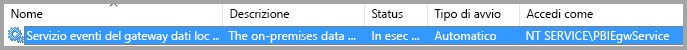
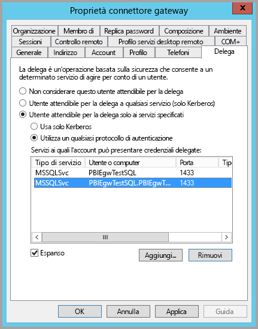
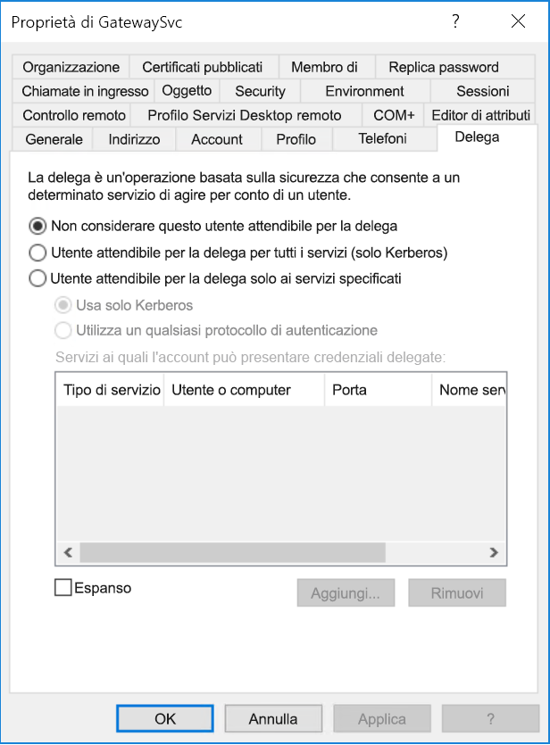
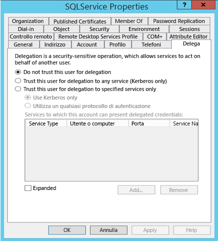
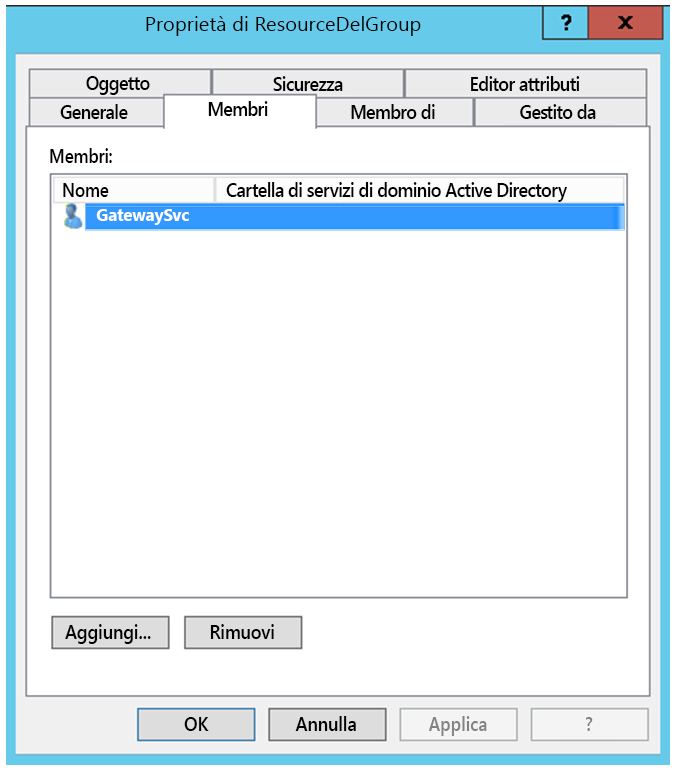
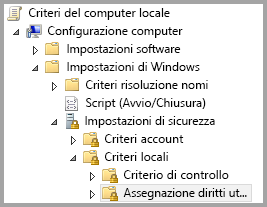
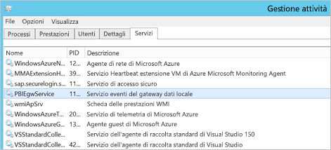
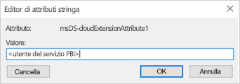
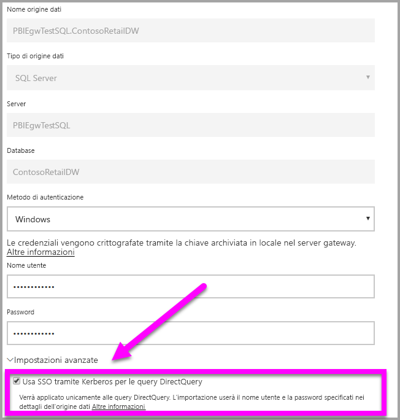

# <a name="configure-kerberos-based-sso-from-power-bi-service-to-on-premises-data-sources"></a>Configurare il Single Sign-On basato su Kerberos dal servizio Power BI alle origini dati locali

Usare la [delega vincolata Kerberos](/windows-server/security/kerberos/kerberos-constrained-delegation-overview) per abilitare una connettività SSO ottimale. L'abilitazione di SSO rende più semplice per i report e i dashboard di Power BI aggiornare i dati delle origini locali.

Per il corretto funzionamento della delega vincolata Kerberos è necessario configurare diversi elementi, ad esempio i _nomi delle entità servizio_ e le impostazioni di delega negli account del servizio.

### <a name="prerequisite-1-install-and-configure-the-microsoft-on-premises-data-gateway"></a>Prerequisito 1: installare e configurare il gateway dati locale

Il gateway dati locale supporta un aggiornamento sul posto nonché l'_acquisizione della proprietà delle impostazioni_ dei gateway esistenti.

### <a name="prerequisite-2-run-the-gateway-windows-service-as-a-domain-account"></a>Prerequisito 2: eseguire il servizio di Windows gateway come account di dominio

In un'installazione standard, il gateway viene eseguito come account del servizio locale del computer, ovvero _NT Service\PBIEgwService_, come illustrato nell'immagine seguente:



Per abilitare la delega vincolata Kerberos, il gateway deve essere eseguito come account di dominio, a meno che l'istanza di Azure Active Directory (Azure AD) non sia già sincronizzata con l'istanza di Active Directory locale tramite Azure AD DirSync/Connect. Per passare a un account di dominio, vedere [Modificare l'account del servizio gateway](/data-integration/gateway/service-gateway-service-account).

> [!NOTE]
> Se Azure AD Connect è configurato e gli account utente sono sincronizzati, il servizio gateway non dovrà eseguire ricerche locali in Azure AD in fase di esecuzione. Per completare la configurazione necessaria in Azure Active Directory è invece possibile usare semplicemente l'ID di sicurezza (SID) del servizio locale per il servizio gateway. La procedura di configurazione della delega vincolata Kerberos descritta in questo articolo è uguale a quella necessaria nel contesto di Azure Active Directory. Viene semplicemente applicata all'oggetto computer del gateway, identificato dall'ID di sicurezza (SID) del servizio locale, in Azure AD anziché all'account di dominio.

### <a name="prerequisite-3-have-domain-admin-rights-to-configure-spns-setspn-and-kerberos-constrained-delegation-settings"></a>Prerequisito 3: ottenere i diritti di amministratore di dominio per configurare i nomi delle entità servizio (SetSPN) e le impostazioni di delega vincolata Kerberos

Non è consigliabile che un amministratore di dominio conceda a un altro utente, in via temporanea o definitiva, i diritti per configurare i nomi delle entità servizio e le impostazioni della delega Kerberos senza richiedere che questa persona abbia diritti di amministratore di dominio. Nella sezione seguente viene illustrata in modo più dettagliato la procedura di configurazione consigliata.

## <a name="configure-kerberos-constrained-delegation-for-the-gateway-and-data-source"></a>Configurare la delega vincolata Kerberos per il gateway e l'origine dati

Con un account amministratore di dominio configurare un nome dell'entità servizio (SPN) per l'account di dominio del servizio gateway, se necessario, e configurare le impostazioni di delega nell'account di dominio del servizio gateway.

### <a name="configure-an-spn-for-the-gateway-service-account"></a>Configurare un nome dell'entità servizio per l'account del servizio gateway

Determinare prima se è già stato creato un nome dell'entità servizio per l'account di dominio usato come account del servizio gateway:

1. Come amministratore di dominio, avviare **Utenti e computer di Active Directory**.

2. Fare clic con il pulsante destro del mouse sul dominio, selezionare **Trova** e immettere il nome dell'account del servizio gateway.

3. Nei risultati della ricerca fare clic con il pulsante destro del mouse sull'account del servizio gateway e scegliere **Proprietà**.

4. Se la scheda **Delega** è visibile nella finestra di dialogo **Proprietà**, un nome dell'entità servizio è già stato creato ed è possibile passare a [Decidere se usare la delega vincolata Kerberos basata sulle risorse o quella standard](#decide-on-resource-based-or-standard-kerberos-constrained-delegation).

    Se la scheda **Delega** non è presente nella finestra di dialogo **Proprietà**, è possibile creare manualmente un nome dell'entità servizio nell'account per abilitarla. Usare lo [strumento setspn](https://technet.microsoft.com/library/cc731241.aspx) incluso in Windows. Per creare il nome SPN sono necessari diritti di amministratore di dominio.

    Si supponga, ad esempio, che l'account del servizio gateway sia **Contoso\GatewaySvc**) e che il nome del computer in cui il servizio gateway è in esecuzione sia **MyGatewayMachine**. Per impostare il nome dell'entità servizio per l'account del servizio gateway, eseguire il comando seguente:

    

    È possibile impostare il nome dell'entità servizio anche usando lo snap-in di MMC (Microsoft Management Console) Utenti e computer di Active Directory.

### <a name="decide-on-resource-based-or-standard-kerberos-constrained-delegation"></a>Decidere se usare la delega vincolata Kerberos basata sulle risorse o quella standard

È possibile configurare le impostazioni di delega per la delega vincolata Kerberos basata sulle risorse _oppure_ per la delega vincolata Kerberos standard. Usare la delega basata sulle risorse se l'origine dati appartiene a un dominio diverso da quello del gateway, ma tenere presente che questo approccio richiede Windows Server 2012 o versione successiva. Vedere la [pagina della panoramica della delega vincolata Kerberos](/windows-server/security/kerberos/kerberos-constrained-delegation-overview) per altre informazioni sulle differenze tra i due approcci alla delega.

 Dopo aver deciso quale approccio si vuole usare, passare a _una_ di queste due sezioni: [Configurare l'account del servizio gateway per la delega vincolata Kerberos standard](#configure-the-gateway-service-account-for-standard-kerberos-constrained-delegation) _oppure_ [Configurare l'account del servizio gateway per la delega vincolata Kerberos basata sulle risorse](#configure-the-gateway-service-account-for-resource-based-kerberos-constrained-delegation). Non completare entrambe le sottosezioni.

## <a name="configure-the-gateway-service-account-for-standard-kerberos-constrained-delegation"></a>Configurare l'account del servizio gateway per la delega vincolata Kerberos standard

> [!NOTE]
> Completare i passaggi descritti in questa sezione se si vuole abilitare la delega vincolata Kerberos standard. Se si vuole abilitare la delega vincolata Kerberos basata sulle risorse, completare i passaggi descritti nella sottosezione [ Configurare l'account del servizio gateway per la delega vincolata Kerberos basata sulle risorse](#configure-the-gateway-service-account-for-resource-based-kerberos-constrained-delegation).

Verranno ora configurate le impostazioni di delega per l'account del servizio gateway. Per eseguire questi passaggi sono disponibili vari strumenti. Qui si userà Utenti e computer di Active Directory, uno snap-in di MMC (Microsoft Management Console) che consente di gestire e pubblicare informazioni nella directory. Nei controller di dominio è disponibile per impostazione predefinita, ma è possibile abilitarlo anche in altri computer tramite la configurazione delle funzionalità di Windows.

È necessario configurare la delega vincolata Kerberos con protocollo in transito. Con la delega vincolata, è necessario dichiarare esplicitamente a quali servizi il gateway potrà presentare credenziali delegate. Ad esempio, solo SQL Server o il server SAP HANA accettano le chiamate di delega dall'account del servizio gateway.

Questa sezione presuppone che i nomi delle entità servizio per le origini dati sottostanti, ad esempio SQL Server, SAP HANA, SAP BW, Teradata o Spark, siano già stati configurati. Per informazioni su come configurare i nomi dell'entità servizio dei server delle origini dati, vedere la documentazione tecnica per i rispettivi server di database. È anche possibile visualizzare l'intestazione *What SPN does your app require?* (Quale SPN richiede l'app?) nel post di blog [My Kerberos Checklist](https://techcommunity.microsoft.com/t5/SQL-Server-Support/My-Kerberos-Checklist-8230/ba-p/316160) (Elenco di controllo Kerberos personale).

Nei passaggi seguenti si presuppone un ambiente locale con due computer: un computer gateway e un server di database con SQL Server che è già stato configurato per il Single Sign-On basato su Kerberos. È possibile adottare i passaggi per una delle altre origini dati supportate, a condizione che questa sia già stata configurata per il Single Sign-On basato su Kerberos. Ai fini di questo esempio, si presuppongono anche le impostazioni e i nomi seguenti:

* Dominio di Active Directory (Netbios): Contoso
* Nome del computer del gateway: **MyGatewayMachine**
* Account del servizio gateway: **Contoso\GatewaySvc**
* Nome del computer dell'origine dati SQL Server: **TestSQLServer**
* Account del servizio dell'origine dati SQL Server: **Contoso\SQLService**

Ecco come configurare le impostazioni di delega:

1. Con diritti di amministratore di dominio aprire **Utenti e computer di Active Directory**.

2. Fare clic con il pulsante destro del mouse sull'account del servizio gateway (**Contoso\GatewaySvc**) e selezionare **Proprietà**.

3. Selezionare la scheda **Delega**.

4. Selezionare **Computer attendibile per la delega solo ai servizi specificati** > **Usa un qualsiasi protocollo di autenticazione**.

5. In **Servizi ai quali l'account può presentare credenziali delegate** selezionare **Aggiungi**.

6. Nella nuova finestra di dialogo selezionare **Utenti o computer**.

7. Immettere l'account del servizio per l'origine dati. Quello di un'origine dati SQL Server può essere ad esempio **Contoso\SQLService**. Dopo aver aggiunto l'account, selezionare **OK**.

8. Selezionare il nome dell'entità servizio creato per il server di database. In questo esempio il nome SPN inizia con **MSSQLSvc**. Se sono stati aggiunti sia il nome di dominio completo sia il nome dell'entità servizio NetBIOS, verranno selezionati entrambi, ma potrebbe esserne visualizzato solo uno.

9. Selezionare **OK**. A questo punto verrà visualizzato il nome SPN nell'elenco.

    

Ora passare a [Concedere all'account del servizio gateway diritti di criteri locali nel computer gateway](#grant-the-gateway-service-account-local-policy-rights-on-the-gateway-machine) per continuare il processo di configurazione.

## <a name="configure-the-gateway-service-account-for-resource-based-kerberos-constrained-delegation"></a>Configurare l'account del servizio gateway per la delega vincolata Kerberos basata sulle risorse

> [!NOTE]
> Completare i passaggi descritti in questa sezione se si vuole abilitare la delega vincolata Kerberos basata sulle risorse. Se si vuole abilitare la delega vincolata Kerberos standard, completare i passaggi descritti nella sottosezione [ Configurare l'account del servizio gateway per la delega vincolata Kerberos standard](#configure-the-gateway-service-account-for-standard-kerberos-constrained-delegation).

Usare la [delega vincolata Kerberos basata sulle risorse](/windows-server/security/kerberos/kerberos-constrained-delegation-overview) per abilitare la connettività Single Sign-On per Windows Server 2012 e versioni successive, consentendo l'appartenenza a domini diversi per i servizi front-end e back-end. Per il corretto funzionamento, il dominio del servizio back-end deve considerare attendibile il dominio del servizio front-end.

Nei passaggi seguenti si presuppone un ambiente locale con due computer in domini diversi: un computer gateway e un server di database con SQL Server che è già stato configurato per il Single Sign-On basato su Kerberos. È possibile adottare i passaggi per una delle altre origini dati supportate, a condizione che questa sia già stata configurata per il Single Sign-On basato su Kerberos. Ai fini di questo esempio, si presuppongono anche le impostazioni e i nomi seguenti:

* Nome del computer del gateway: **MyGatewayMachine**
* Account del servizio gateway: **ContosoFrontEnd\GatewaySvc**
* Nome del computer dell'origine dati SQL Server: **TestSQLServer**
* Account del servizio dell'origine dati SQL Server: **ContosoBackEnd\SQLService**

Con questi nomi e impostazioni di esempio, completare i passaggi di configurazione seguenti:

1. Nel controller di dominio per il dominio **ContosoFrontEnd** verificare che per l'account del servizio gateway non siano applicate impostazioni di delega usando **Utenti e computer di Active Directory**, uno snap-in di Microsoft Management Console (MMC).

    

2. Usando **Utenti e computer di Active Directory** nel controller di dominio per il dominio **ContosoBackEnd**, verificare che per l'account del servizio back-end non siano applicate impostazioni di delega. Verificare inoltre che l'attributo **msDS-AllowedToActOnBehalfOfOtherIdentity** per questo account non sia impostato. È possibile trovare questo attributo in **Editor attributi**, come illustrato nell'immagine seguente:

    

3. Creare un gruppo in **Utenti e computer di Active Directory** nel controller di dominio per il dominio **ContosoBackEnd**. Aggiungere l'account del servizio gateway a questo gruppo come illustrato nell'immagine seguente. L'immagine illustra un nuovo gruppo denominato _ResourceDelGroup_ e l'account del servizio gateway, **GatewaySvc**, aggiunto a questo gruppo.

    

4. Aprire un prompt dei comandi ed eseguire i comandi seguenti nel controller di dominio per il dominio **ContosoBackEnd** per aggiornare l'attributo **msDS-AllowedToActOnBehalfOfOtherIdentity** dell'account del servizio back-end:

    ```powershell
    $c = Get-ADGroup ResourceDelGroup
    Set-ADUser SQLService -PrincipalsAllowedToDelegateToAccount $c
    ```

5. È possibile verificare che l'aggiornamento viene rispecchiato nella scheda "Editor attributi" nelle proprietà per l'account del servizio back-end in **Utenti e computer di Active Directory**.

## <a name="grant-the-gateway-service-account-local-policy-rights-on-the-gateway-machine"></a>Concedere all'account del servizio gateway diritti di criteri locali nel computer gateway

Infine, nel computer in cui è in esecuzione il servizio gateway, **MyGatewayMachine** in questo esempio, è necessario concedere all'account del servizio gateway i criteri locali **Rappresenta un client dopo l'autenticazione** e **Agire come parte del sistema operativo (SeTcbPrivilege)** . È possibile eseguire e verificare questa configurazione con l'Editor Criteri di gruppo locali (**gpedit**).

1. Nel computer gateway eseguire *gpedit.msc*.

2. Passare a **Criteri del computer locale** > **Configurazione computer** > **Impostazioni di Windows** > **Impostazioni di sicurezza** > **Criteri locali** > **Assegnazione diritti utente**.

    

3. Nell'elenco di criteri in **Assegnazione diritti utente** selezionare **Rappresenta un client dopo l'autenticazione**.

    

    Fare clic con il pulsante destro del mouse e aprire **Proprietà**. Controllare l'elenco degli account. Deve includere l'account del servizio gateway (**Contoso\GatewaySvc**).

4. Nell'elenco di criteri in **Assegnazione diritti utente** selezionare **Agire come parte del sistema operativo (SeTcbPrivilege)** . Anche in questo caso, accertarsi che l'account del servizio gateway sia incluso nell'elenco degli account.

5. Riavviare il processo del servizio **Gateway dati locale**.

### <a name="set-user-mapping-configuration-parameters-on-the-gateway-machine-if-required"></a>Impostare i parametri di configurazione del mapping utente nel computer gateway, se necessario

Se Azure AD Connect non è configurato, seguire questa procedura per mappare un utente del servizio Power BI a un utente Active Directory locale. Ogni utente Active Directory mappato in questo modo deve avere le autorizzazioni SSO necessarie per l'origine dati. Per altre informazioni, vedere questo [video Guy in a Cube](https://www.youtube.com/watch?v=NG05PG9aiRw).

1. Aprire il file di configurazione principale del gateway, `Microsoft.PowerBI.DataMovement.Pipeline.GatewayCore.dll`. Per impostazione predefinita, il file si trova in C:\Programmi\Gateway dati locale.

1. Impostare **ADUserNameLookupProperty** su un attributo Active Directory non usato. Nei passaggi seguenti si suppone l'uso di `msDS-cloudExtensionAttribute1`, anche se questo attributo è disponibile solo in Windows Server 2012 e versioni successive. Impostare **ADUserNameReplacementProperty** su `SAMAccountName`. Salvare il file di configurazione.

1. Nella scheda **Servizi** di Gestione attività fare clic con il pulsante destro del mouse sul servizio gateway e selezionare **Riavvia**.

    

1. Per ogni utente del servizio Power BI per il quale si vuole abilitare il Single Sign-On Kerberos, impostare la proprietà `msDS-cloudExtensionAttribute1` di un utente Active Directory locale (con autorizzazione SSO per l'origine dati) sul nome utente completo dell'utente del servizio Power BI. Ad esempio, se si accede al servizio Power BI come `test@contoso.com` e si vuole mappare questo utente a un utente Active Directory locale con autorizzazioni SSO, quale ad esempio `test@LOCALDOMAIN.COM`, impostare l'attributo `msDS-cloudExtensionAttribute1` di `test@LOCALDOMAIN.COM` su `test@contoso.com`.

È possibile impostare la proprietà `msDS-cloudExtensionAttribute1` tramite lo snap-in di Microsoft Management Console (MMC) Utenti e computer di Active Directory.

1. Come amministratore di dominio, avviare Utenti e computer di Active Directory, uno snap-in di MMC.

1. Fare clic con il pulsante destro del mouse sul dominio, selezionare Trova e digitare il nome account dell'utente Active Directory locale al quale si vuole eseguire il mapping.

1. Selezionare la scheda **Editor attributi**.

    Individuare la proprietà `msDS-cloudExtensionAttribute1` e fare doppio clic su di essa. Impostare il valore sul nome utente completo dell'utente usato per accedere al servizio Power BI.

1. Selezionare **OK**.

    

1. Selezionare **Applica**. Verificare che sia stato impostato il valore corretto nella colonna **Valore**.

## <a name="complete-data-source-specific-configuration-steps"></a>Completare i passaggi di configurazione specifici dell'origine dati

SAP HANA e SAP BW hanno requisiti di configurazione specifici dell'origine dati e prerequisiti che è necessario soddisfare prima che sia possibile stabilire una connessione SSO tramite il gateway alle origini dati. Vedere [la pagina di configurazione di SAP HANA](service-gateway-sso-kerberos-sap-hana.md) e [la pagina di configurazione di SAP BW - CommonCryptoLib (sapcrypto.dll)](service-gateway-sso-kerberos-sap-bw-commoncryptolib.md) per i dettagli. È anche possibile [configurare SAP BW per l'uso con la libreria SNC gx64krb5](service-gateway-sso-kerberos-sap-bw-gx64krb.md), ma Microsoft non consiglia questa libreria in quanto non più supportata da SAP. Come libreria SNC, è consigliabile usare CommonCryptoLib _oppure_ gx64krb5. Non completare i passaggi di configurazione per entrambe le librerie.

> [!NOTE]
> Per il Single Sign-On a BW potrebbero funzionare anche altre librerie SNC, ma queste non sono ufficialmente supportate da Microsoft.

## <a name="run-a-power-bi-report"></a>Eseguire un report di Power BI

Dopo aver completato tutti i passaggi di configurazione, è possibile usare la pagina **Gestisci gateway** in Power BI per configurare l'origine dati che verrà usata per il Single Sign-On. In presenza di più gateway, assicurarsi di selezionare il gateway configurato per il Single Sign-On Kerberos. In **Impostazioni avanzate** per l'origine dati verificare quindi che l'opzione "Usa SSO tramite Kerberos per le query DirectQuery" sia selezionata.



 Pubblicare un report **basato su DirectQuery** da Power BI Desktop. Questo report deve usare dati accessibili per l'utente mappato all'utente (Azure) Active Directory che accede al servizio Power BI. Dato il modo in cui funziona l'aggiornamento, è necessario usare DirectQuery invece dell'importazione. Quando si aggiornano report basati sull'importazione, il gateway usa le credenziali immesse nei campi **Nome utente** e **Password** al momento della creazione dell'origine dati. In altre parole, **non** viene usato l'accesso SSO Kerberos. Quando si esegue la pubblicazione, assicurarsi inoltre di selezionare il gateway configurato per il Single Sign-On se sono presenti più gateway. Nel servizio Power BI dovrebbe ora essere possibile aggiornare il report o creare un nuovo report basato sul set di dati pubblicato.

Questa configurazione funziona nella maggior parte dei casi. Con Kerberos, tuttavia, potrebbero essere necessarie configurazioni diverse a seconda dell'ambiente in uso. Se il report non viene caricato, contattare l'amministratore di dominio per indagini più approfondite. Se l'origine dati è SAP BW, si può fare riferimento anche alle sezioni relative alla risoluzione dei problemi delle pagine di configurazione specifiche dell'origine dati per [CommonCryptoLib](service-gateway-sso-kerberos-sap-bw-commoncryptolib.md#troubleshooting) e [gx64krb5/gsskrb5](service-gateway-sso-kerberos-sap-bw-gx64krb.md#troubleshooting).

## <a name="next-steps"></a>Passaggi successivi

Per altre informazioni sul **gateway dati locale** e su **DirectQuery**, vedere le risorse seguenti:

* [Informazioni sul gateway dati locale](/data-integration/gateway/service-gateway-getting-started)
* [DirectQuery in Power BI](desktop-directquery-about.md)
* [Data sources supported by DirectQuery](desktop-directquery-data-sources.md) (Origini dati supportate da DirectQuery)
* [DirectQuery e SAP BW](desktop-directquery-sap-bw.md)
* [DirectQuery and SAP HANA](desktop-directquery-sap-hana.md) (DirectQuery e SAP HANA)
