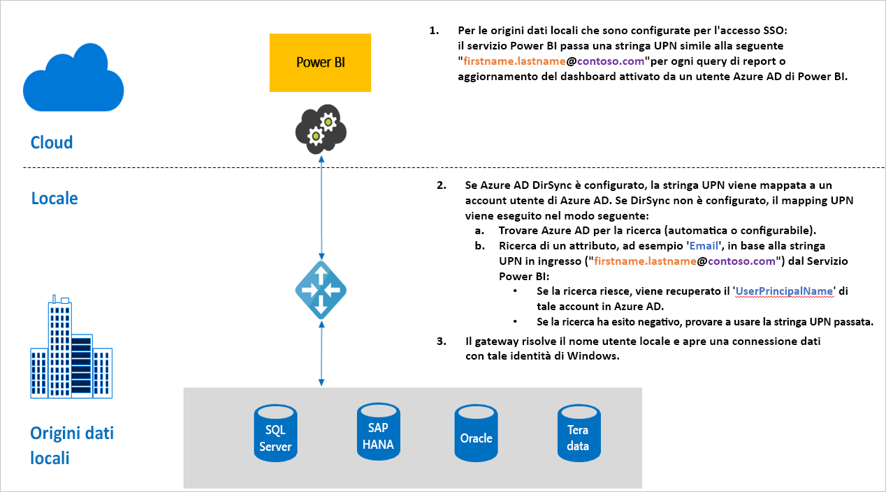

# Panoramica dell'accesso Single Sign-On (SSO) per i gateway in Power BI

Per usufruire di un'esperienza di connettività Single Sign-On ottimale che abilita l'aggiornamento di report e dashboard di Power BI dai dati locali, è possibile configurare il gateway dati locale con la delega vincolata Kerberos o Security Assertion Markup Language (SAML). Il gateway dati locale semplifica l'accesso Single Sign-On grazie all'uso di DirectQuery per connettersi alle origini dati locali.

Sono attualmente supportate le origini dati seguenti:

* SQL Server ([Kerberos](service-gateway-sso-kerberos.md))
* SAP HANA ([Kerberos](service-gateway-sso-kerberos.md) e [SAML](service-gateway-sso-saml.md)
* Teradata ([Kerberos](service-gateway-sso-kerberos.md))
* Spark ([Kerberos](service-gateway-sso-kerberos.md))

Quando un utente interagisce con un report DirectQuery nel servizio Power BI, ogni operazione di filtro incrociato, filtro dei dati, ordinamento e modifica del report può comportare l'esecuzione di query in tempo reale sull'origine dati locale sottostante.  Quando per l'origine dati è configurato l'accesso Single Sign-On, le query vengono eseguite in base all'identità dell'utente che interagisce con Power BI, ovvero tramite l'esperienza Web o le app Power BI per dispositivi mobili. Di conseguenza, ogni utente visualizza con precisione i dati a cui è autorizzato ad accedere nell'origine dati sottostante e, grazie all'accesso Single Sign-On, si evita la memorizzazione nella cache di dati condivisi tra diversi utenti.

## Passi di query durante l'esecuzione di SSO

I passaggi per l'esecuzione di una query con accesso Single Sign-On sono tre, come illustrato nel diagramma seguente.

> [!NOTE]
> SSO per Oracle non è ancora abilitato, ma è in corso di sviluppo e sarà presto disponibile.

Dettagli aggiuntivi per questi tre passaggi:

1. Per ogni query, il **servizio Power BI** include il *nome dell'entità utente* quando invia una richiesta di query al gateway configurato.

2. Il gateway deve eseguire il mapping del nome dell'entità utente di Azure Active Directory a un'identità di Active Directory locale.

   a.  Se Azure AD DirSync (chiamato anche *Azure AD Connect*) è configurato, il mapping funziona automaticamente nel gateway.

   b.  In caso contrario, il gateway può cercare ed eseguire il mapping del nome dell'entità utente (UPN) di Azure AD a un utente locale eseguendo una ricerca nel dominio di Active Directory locale.

3. Il processo del servizio gateway rappresenta l'utente locale mappato, apre la connessione con il database sottostante e invia la query. Il gateway non deve essere installato nello stesso computer del database.

## Passaggi successivi

Dopo la descrizione delle nozioni di base sull'accesso SSO, leggere informazioni più dettagliate su Kerberos e SAML:

* [Single Sign-On (SSO) - Kerberos](service-gateway-sso-kerberos.md)
* [Single Sign-On (SSO) - SAML](service-gateway-sso-saml.md)
